# OhMyStyle

[中文](README.md)

 

OhMyStyle is a visual-style preset library for image-generation users. Choose an independent package for an artist, photographer, movement, technique, game-art direction, or original preset, then apply it to your own subject.

To add a package, start with the [English contribution guide](CONTRIBUTING.en.md) or [中文贡献指南](CONTRIBUTING.md). The canonical template is in [`templates/style-package`](templates/style-package); the scaffold command creates the complete directory, bilingual documentation, source manifest, prompts, and evaluation scaffold.

## Style package gallery

The main gallery lists independent style packages only. Every card uses a horizontal 16:9 representative image; click the image or name to open the package README.

### Artists

<table>
<tr>
<td width="33%" valign="top" align="center"> <strong>Georges Seurat</strong> <a href="style-packages/artists/georges-seurat/README.en.md">Open README</a></td>
<td width="33%" valign="top" align="center"> <strong>Henri Matisse</strong> <a href="style-packages/artists/henri-matisse/README.en.md">Open README</a></td>
<td width="33%" valign="top" align="center"> <strong>Rembrandt van Rijn</strong> <a href="style-packages/artists/rembrandt/README.en.md">Open README</a></td>
</tr>
<tr>
<td width="33%" valign="top" align="center"> <strong>Paul Cézanne</strong> <a href="style-packages/artists/paul-cezanne/README.en.md">Open README</a></td>
<td width="33%" valign="top" align="center"> <strong>Paul Gauguin</strong> <a href="style-packages/artists/paul-gauguin/README.en.md">Open README</a></td>
<td width="33%" valign="top" align="center"> <strong>Claude Monet</strong> <a href="style-packages/artists/claude-monet/README.en.md">Open README</a></td>
</tr>
<tr>
<td width="33%" valign="top" align="center"> <strong>Caravaggio</strong> <a href="style-packages/artists/caravaggio/README.en.md">Open README</a></td>
<td width="33%" valign="top" align="center"> <strong>Gustave Courbet</strong> <a href="style-packages/artists/gustave-courbet/README.en.md">Open README</a></td>
<td width="33%" valign="top" align="center"> <strong>El Greco</strong> <a href="style-packages/artists/el-greco/README.en.md">Open README</a></td>
</tr>
<tr>
<td width="33%" valign="top" align="center"> <strong>Edgar Degas</strong> <a href="style-packages/artists/edgar-degas/README.en.md">Open README</a></td>
<td width="33%" valign="top" align="center"> <strong>Anna Ancher</strong> <a href="style-packages/artists/anna-ancher/README.en.md">Open README</a></td>
<td width="33%" valign="top" align="center"> <strong>Pablo Picasso</strong> <a href="style-packages/artists/pablo-picasso/README.en.md">Open README</a></td>
</tr>
<tr>
<td width="33%" valign="top" align="center"> <strong>Francisco Goya</strong> <a href="style-packages/artists/francisco-goya/README.en.md">Open README</a></td>
<td width="33%" valign="top" align="center"> <strong>Raphael</strong> <a href="style-packages/artists/raphael-sanzio/README.en.md">Open README</a></td>
<td width="33%" valign="top" align="center"> <strong>Vincent van Gogh</strong> <a href="style-packages/artists/vincent-van-gogh/README.en.md">Open README</a></td>
</tr>
<tr>
<td width="33%" valign="top" align="center"> <strong>Grant Wood</strong> <a href="style-packages/artists/grant-wood/README.en.md">Open README</a></td>
<td width="33%" valign="top" align="center"> <strong>Eugène Delacroix</strong> <a href="style-packages/artists/eugene-delacroix/README.en.md">Open README</a></td>
<td width="33%" valign="top" align="center"> <strong>Edvard Munch</strong> <a href="style-packages/artists/edvard-munch/README.en.md">Open README</a></td>
</tr>
<tr>
<td width="33%" valign="top" align="center"> <strong>Wassily Kandinsky</strong> <a href="style-packages/artists/wassily-kandinsky/README.en.md">Open README</a></td>
<td width="33%" valign="top" align="center"> <strong>Pierre-Auguste Renoir</strong> <a href="style-packages/artists/pierre-auguste-renoir/README.en.md">Open README</a></td>
<td width="33%" valign="top" align="center"> <strong>Michelangelo Buonarroti</strong> <a href="style-packages/artists/michelangelo-buonarroti/README.en.md">Open README</a></td>
</tr>
<tr>
<td width="33%" valign="top" align="center"> <strong>J. M. W. Turner</strong> <a href="style-packages/artists/jmw-turner/README.en.md">Open README</a></td>
<td width="33%" valign="top" align="center"> <strong>Johannes Vermeer</strong> <a href="style-packages/artists/johannes-vermeer/README.en.md">Open README</a></td>
<td width="33%" valign="top" align="center"> <strong>Pieter Bruegel the Elder</strong> <a href="style-packages/artists/pieter-bruegel-the-elder/README.en.md">Open README</a></td>
</tr>
<tr>
<td width="33%" valign="top" align="center"> <strong>Joan Miró</strong> <a href="style-packages/artists/joan-miro/README.en.md">Open README</a></td>
<td width="33%" valign="top" align="center"> <strong>Leonardo da Vinci</strong> <a href="style-packages/artists/leonardo-da-vinci/README.en.md">Open README</a></td>
<td width="33%" valign="top" align="center"> <strong>Diego Velázquez</strong> <a href="style-packages/artists/diego-velazquez/README.en.md">Open README</a></td>
</tr>
<tr>
<td width="33%" valign="top" align="center"> <strong>Hilma af Klint</strong> <a href="style-packages/artists/hilma-af-klint/README.en.md">Open README</a></td>
<td width="33%" valign="top" align="center"> <strong>Leonora Carrington</strong> <a href="style-packages/artists/leonora-carrington/README.en.md">Open README</a></td>
<td width="33%" valign="top" align="center"> <strong>Tamara de Lempicka</strong> <a href="style-packages/artists/tamara-de-lempicka/README.en.md">Open README</a></td>
</tr>
<tr>
<td width="33%" valign="top" align="center"> <strong>Giorgio de Chirico</strong> <a href="style-packages/artists/giorgio-de-chirico/README.en.md">Open README</a></td>
<td width="33%" valign="top" align="center"> <strong>Agnes Martin</strong> <a href="style-packages/artists/agnes-martin/README.en.md">Open README</a></td>
<td width="33%" valign="top" align="center"> <strong>Edward Hopper</strong> <a href="style-packages/artists/edward-hopper/README.en.md">Open README</a></td>
</tr>
<tr>
<td width="33%" valign="top" align="center"> <strong>Ivan Aivazovsky</strong> <a href="style-packages/artists/ivan-aivazovsky/README.en.md">Open README</a></td>
<td width="33%" valign="top" align="center"> <strong>Sandro Botticelli</strong> <a href="style-packages/artists/sandro-botticelli/README.en.md">Open README</a></td>
<td width="33%" valign="top" align="center"> <strong>Jan van Eyck</strong> <a href="style-packages/artists/jan-van-eyck/README.en.md">Open README</a></td>
</tr>
<tr>
<td width="33%" valign="top" align="center"> <strong>Artemisia Gentileschi</strong> <a href="style-packages/artists/artemisia-gentileschi/README.en.md">Open README</a></td>
<td width="33%" valign="top" align="center"> <strong>Francisco de Zurbarán</strong> <a href="style-packages/artists/francisco-de-zurbaran/README.en.md">Open README</a></td>
<td width="33%" valign="top" align="center"> <strong>Mary Cassatt</strong> <a href="style-packages/artists/mary-cassatt/README.en.md">Open README</a></td>
</tr>
<tr>
<td width="33%" valign="top" align="center"> <strong>Gustav Klimt</strong> <a href="style-packages/artists/gustav-klimt/README.en.md">Open README</a></td>
<td width="33%" valign="top" align="center"> <strong>Egon Schiele</strong> <a href="style-packages/artists/egon-schiele/README.en.md">Open README</a></td>
<td width="33%" valign="top" align="center"> <strong>Georgia O'Keeffe</strong> <a href="style-packages/artists/georgia-okeeffe/README.en.md">Open README</a></td>
</tr>
<tr>
<td width="33%" valign="top" align="center"> <strong>Norman Rockwell</strong> <a href="style-packages/artists/norman-rockwell/README.en.md">Open README</a></td>
<td width="33%" valign="top" align="center"> <strong>Romare Bearden</strong> <a href="style-packages/artists/romare-bearden/README.en.md">Open README</a></td>
</tr>
</table>

### Game art

<table>
<tr>
<td width="33%" valign="top" align="center"> <strong>Low-poly Adventure Game Art</strong> <a href="style-packages/game-art/low-poly-adventure-game-art/README.en.md">Open README</a></td>
<td width="33%" valign="top" align="center"> <strong>Top-down 16-bit Adventure Game Art</strong> <a href="style-packages/game-art/top-down-16-bit-adventure/README.en.md">Open README</a></td>
<td width="33%" valign="top" align="center"> <strong>ZX Spectrum Attribute Pixel Art</strong> <a href="style-packages/game-art/zx-spectrum-attribute-pixel/README.en.md">Open README</a></td>
</tr>
<tr>
<td width="33%" valign="top" align="center"> <strong>Side-scrolling Platformer Pixel Art</strong> <a href="style-packages/game-art/side-scrolling-platformer-pixel/README.en.md">Open README</a></td>
<td width="33%" valign="top" align="center"> <strong>Cinematic Pixel Adventure Art</strong> <a href="style-packages/game-art/cinematic-pixel-adventure/README.en.md">Open README</a></td>
<td width="33%" valign="top" align="center"> <strong>Isometric Pixel Tactics Art</strong> <a href="style-packages/game-art/isometric-pixel-tactics/README.en.md">Open README</a></td>
</tr>
<tr>
<td width="33%" valign="top" align="center"><a href="style-packages/game-art/cel-shaded-nature-game-art/README.en.md">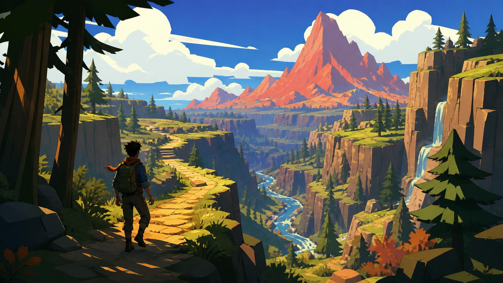</a> <strong>Cel-Shaded Nature Adventure Game Art</strong> <a href="style-packages/game-art/cel-shaded-nature-game-art/README.en.md">Open README</a></td>
<td width="33%" valign="top" align="center"><a href="style-packages/game-art/hand-inked-animation-game-art/README.en.md">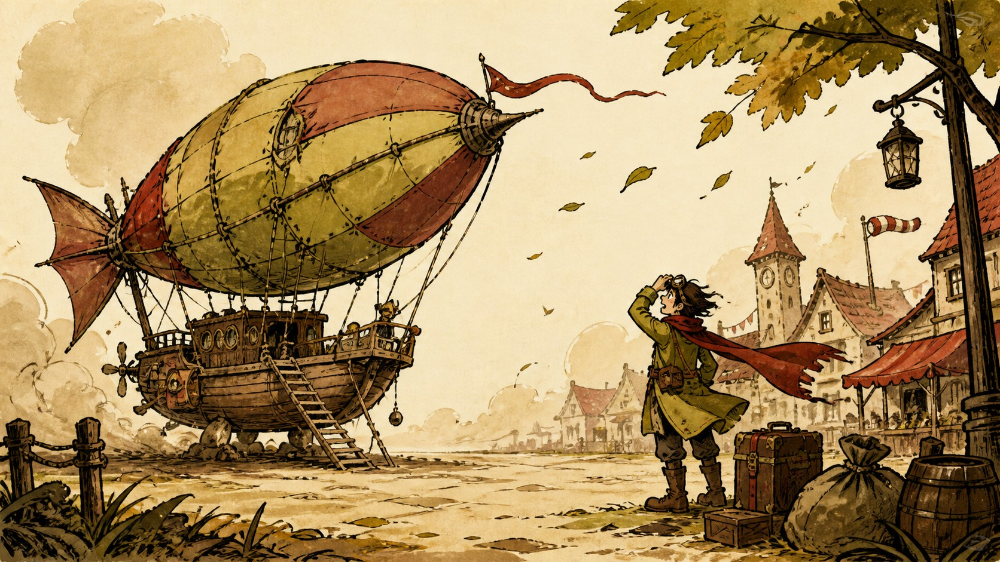</a> <strong>Hand-Inked Animation Game Art</strong> <a href="style-packages/game-art/hand-inked-animation-game-art/README.en.md">Open README</a></td>
<td width="33%" valign="top" align="center"><a href="style-packages/game-art/watercolor-storybook-game-art/README.en.md">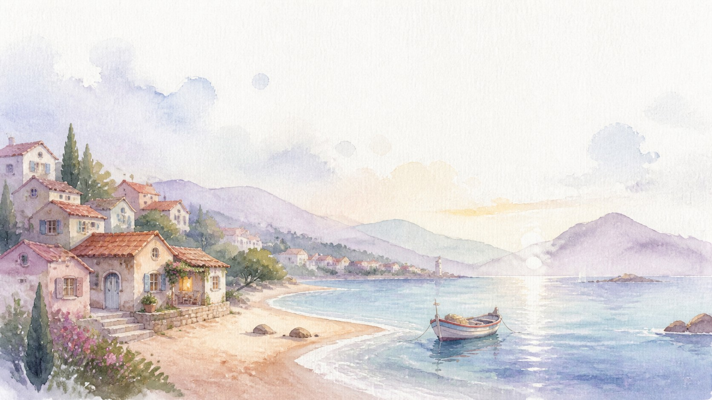</a> <strong>Watercolor Storybook Adventure Game Art</strong> <a href="style-packages/game-art/watercolor-storybook-game-art/README.en.md">Open README</a></td>
</tr>
<tr>
<td width="33%" valign="top" align="center"><a href="style-packages/game-art/papercraft-diorama-game-art/README.en.md">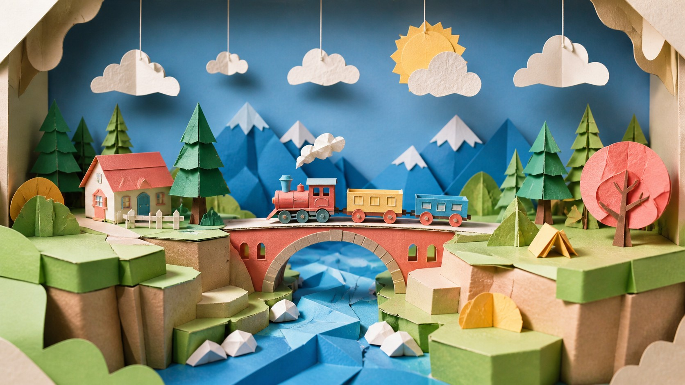</a> <strong>Papercraft Diorama Game Art</strong> <a href="style-packages/game-art/papercraft-diorama-game-art/README.en.md">Open README</a></td>
<td width="33%" valign="top" align="center"><a href="style-packages/game-art/voxel-world-game-art/README.en.md">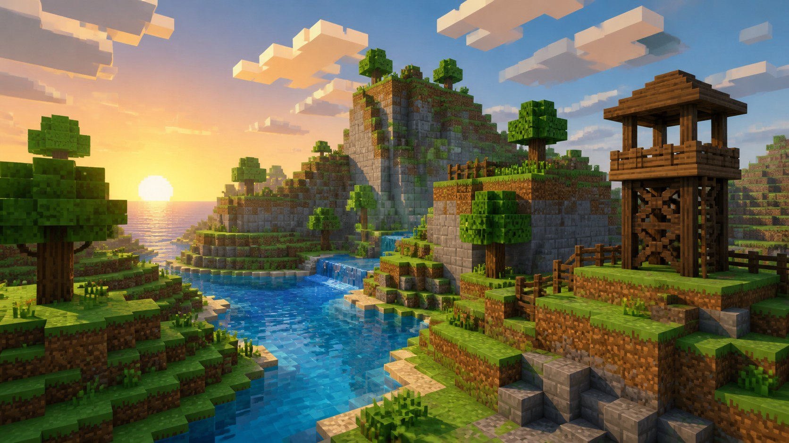</a> <strong>Voxel World Game Art</strong> <a href="style-packages/game-art/voxel-world-game-art/README.en.md">Open README</a></td>
<td width="33%" valign="top" align="center"><a href="style-packages/game-art/stylized-low-poly-world/README.en.md">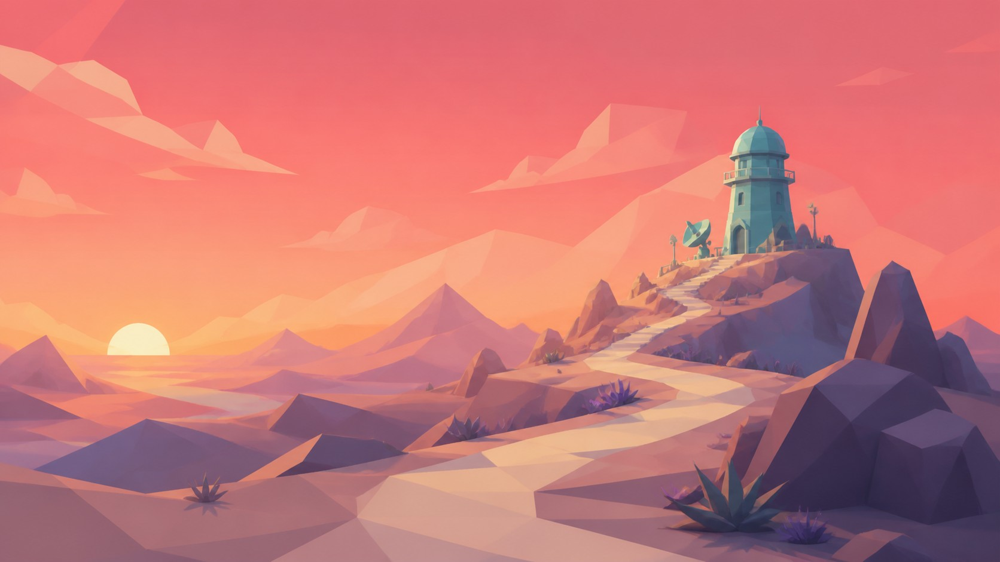</a> <strong>Stylized Low-Poly World Game Art</strong> <a href="style-packages/game-art/stylized-low-poly-world/README.en.md">Open README</a></td>
</tr>
<tr>
<td width="33%" valign="top" align="center"> <strong>Isometric Impossible-Architecture Game Art</strong> <a href="style-packages/game-art/impossible-architecture-game-art/README.en.md">Open README</a></td>
<td width="33%" valign="top" align="center"><a href="style-packages/game-art/comic-halftone-game-art/README.en.md">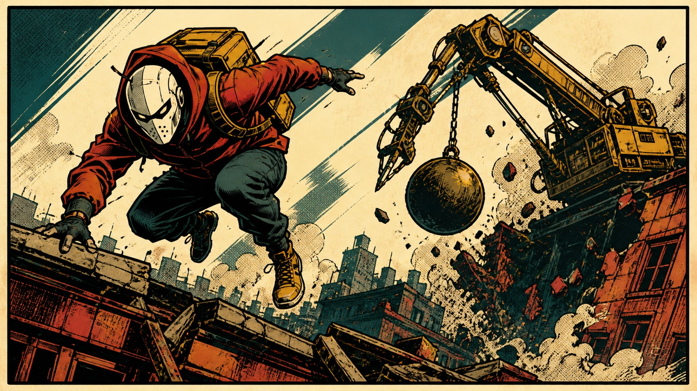</a> <strong>Comic Halftone Narrative Game Art</strong> <a href="style-packages/game-art/comic-halftone-game-art/README.en.md">Open README</a></td>
<td width="33%" valign="top" align="center"> <strong>Painterly 3D Fantasy Game Art</strong> <a href="style-packages/game-art/painterly-3d-fantasy-game-art/README.en.md">Open README</a></td>
</tr>
<tr>
<td width="33%" valign="top" align="center"><a href="style-packages/game-art/stylized-pbr-sci-fi-game-art/README.en.md">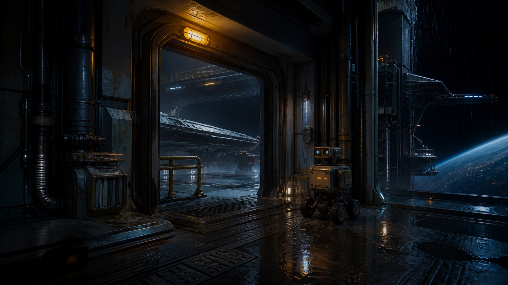</a> <strong>Stylized PBR Science-Fiction Game Art</strong> <a href="style-packages/game-art/stylized-pbr-sci-fi-game-art/README.en.md">Open README</a></td>
<td width="33%" valign="top" align="center"><a href="style-packages/game-art/flat-design-puzzle-game-art/README.en.md">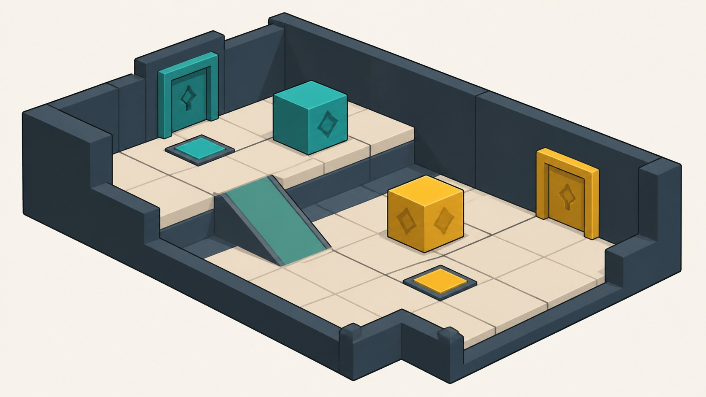</a> <strong>Flat Design Puzzle Game Art</strong> <a href="style-packages/game-art/flat-design-puzzle-game-art/README.en.md">Open README</a></td>
<td width="33%" valign="top" align="center"><a href="style-packages/game-art/miniature-diorama-game-art/README.en.md">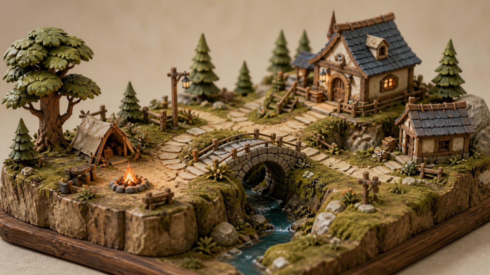</a> <strong>Miniature Diorama Game Art</strong> <a href="style-packages/game-art/miniature-diorama-game-art/README.en.md">Open README</a></td>
</tr>
<tr>
<td width="33%" valign="top" align="center"><a href="style-packages/game-art/silhouette-platformer-game-art/README.en.md">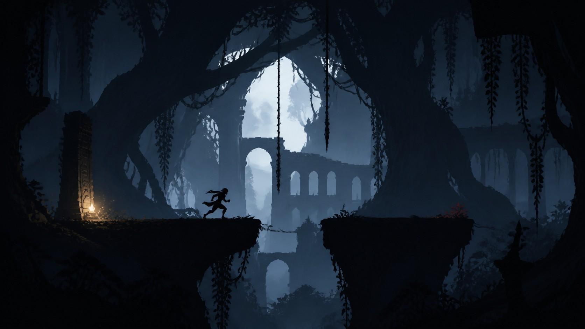</a> <strong>Silhouette Light-and-Shadow Platformer Game Art</strong> <a href="style-packages/game-art/silhouette-platformer-game-art/README.en.md">Open README</a></td>
<td width="33%" valign="top" align="center"><a href="style-packages/game-art/neon-noir-3d-game-art/README.en.md">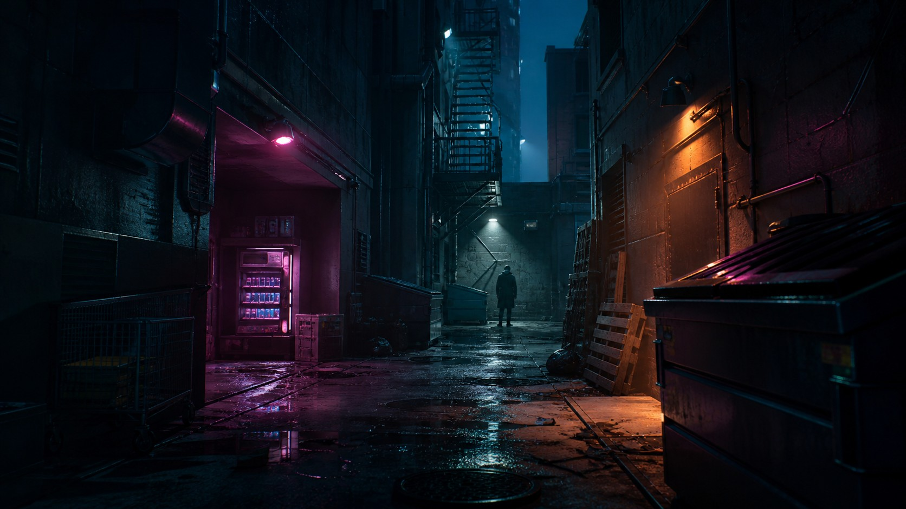</a> <strong>Neon Noir 3D Game Art</strong> <a href="style-packages/game-art/neon-noir-3d-game-art/README.en.md">Open README</a></td>
<td width="33%" valign="top" align="center"><a href="style-packages/game-art/stop-motion-clay-game-art/README.en.md">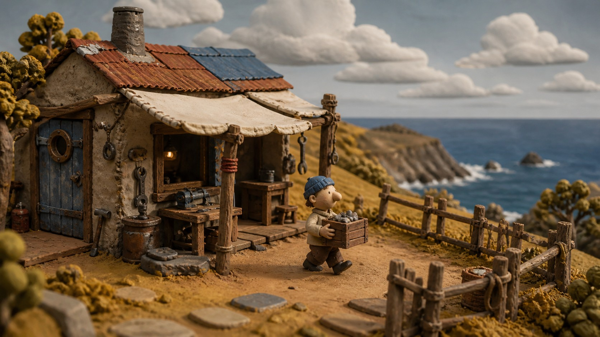</a> <strong>Stop-Motion Clay Game Art</strong> <a href="style-packages/game-art/stop-motion-clay-game-art/README.en.md">Open README</a></td>
</tr>
<tr>
<td width="33%" valign="top" align="center"><a href="style-packages/game-art/breath-of-the-wild-open-world/README.en.md">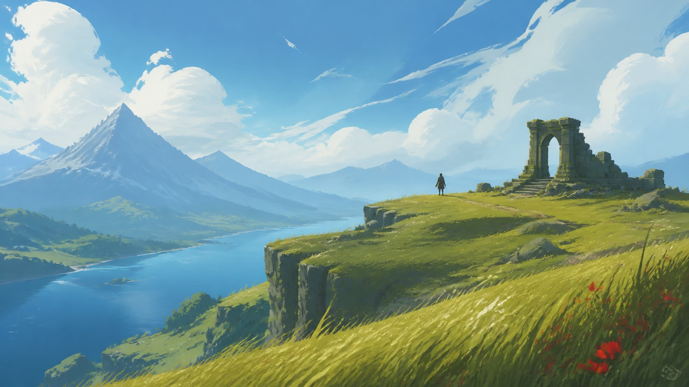</a> <strong>Open-World Painted Nature Game Art</strong> <a href="style-packages/game-art/breath-of-the-wild-open-world/README.en.md">Open README</a></td>
<td width="33%" valign="top" align="center"><a href="style-packages/game-art/cyberpunk-night-city/README.en.md">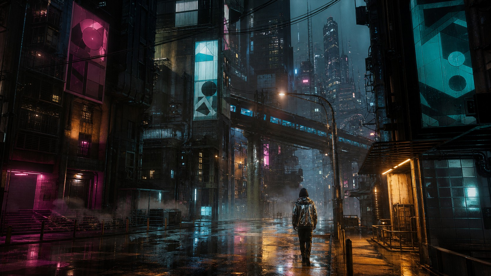</a> <strong>Grounded Neon Future City Game Art</strong> <a href="style-packages/game-art/cyberpunk-night-city/README.en.md">Open README</a></td>
<td width="33%" valign="top" align="center"><a href="style-packages/game-art/death-stranding-cinematic-wilderness/README.en.md">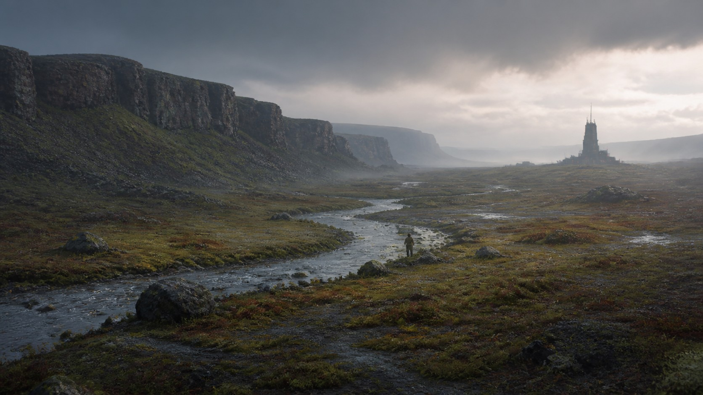</a> <strong>Cinematic Connected Wilderness Game Art</strong> <a href="style-packages/game-art/death-stranding-cinematic-wilderness/README.en.md">Open README</a></td>
</tr>
<tr>
<td width="33%" valign="top" align="center"><a href="style-packages/game-art/control-paranormal-architecture/README.en.md">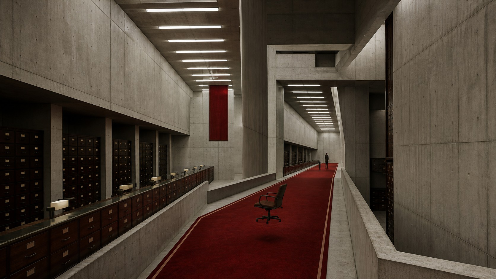</a> <strong>Paranormal Bureaucratic Architecture Game Art</strong> <a href="style-packages/game-art/control-paranormal-architecture/README.en.md">Open README</a></td>
<td width="33%" valign="top" align="center"><a href="style-packages/game-art/hades-mythic-illustration/README.en.md">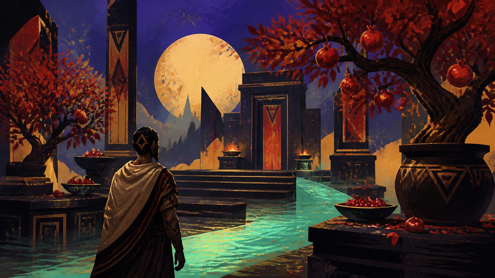</a> <strong>High-Contrast Mythic Illustration Game Art</strong> <a href="style-packages/game-art/hades-mythic-illustration/README.en.md">Open README</a></td>
<td width="33%" valign="top" align="center"> <strong>Rhythm Comic Cel-Shaded Game Art</strong> <a href="style-packages/game-art/hi-fi-rush-rhythm-comic/README.en.md">Open README</a></td>
</tr>
<tr>
<td width="33%" valign="top" align="center"><a href="style-packages/game-art/disco-elysium-painterly-noir/README.en.md">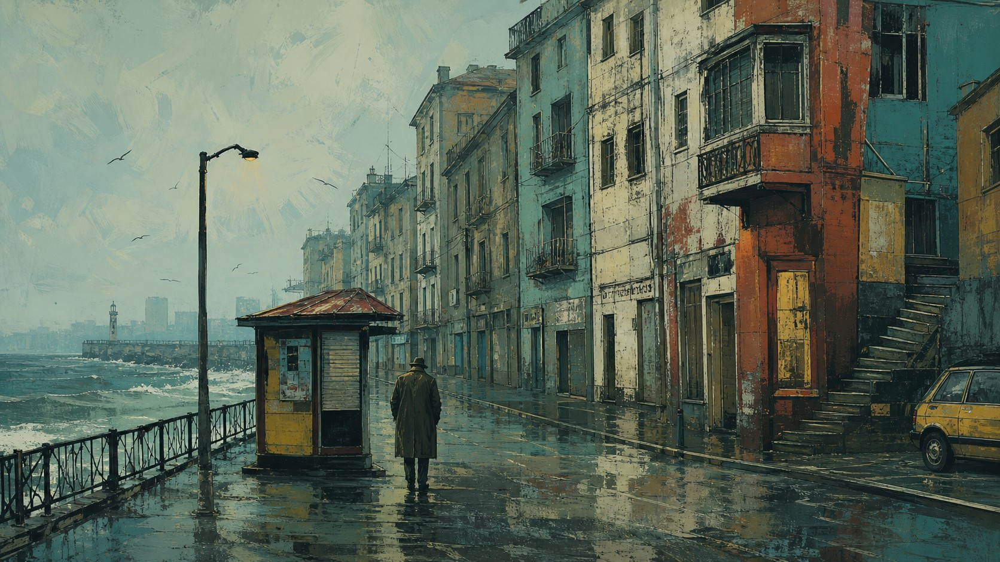</a> <strong>Painterly Noir Graphic-RPG Game Art</strong> <a href="style-packages/game-art/disco-elysium-painterly-noir/README.en.md">Open README</a></td>
<td width="33%" valign="top" align="center"><a href="style-packages/game-art/elden-ring-dark-fantasy/README.en.md">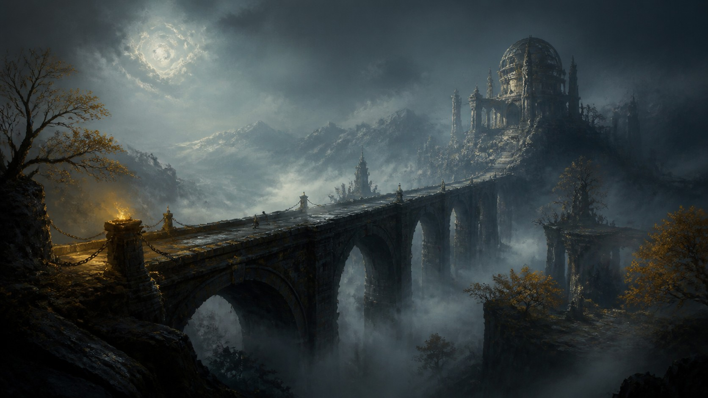</a> <strong>Dark Mythic Fantasy Game Art</strong> <a href="style-packages/game-art/elden-ring-dark-fantasy/README.en.md">Open README</a></td>
<td width="33%" valign="top" align="center"><a href="style-packages/game-art/stray-neon-cybercity/README.en.md">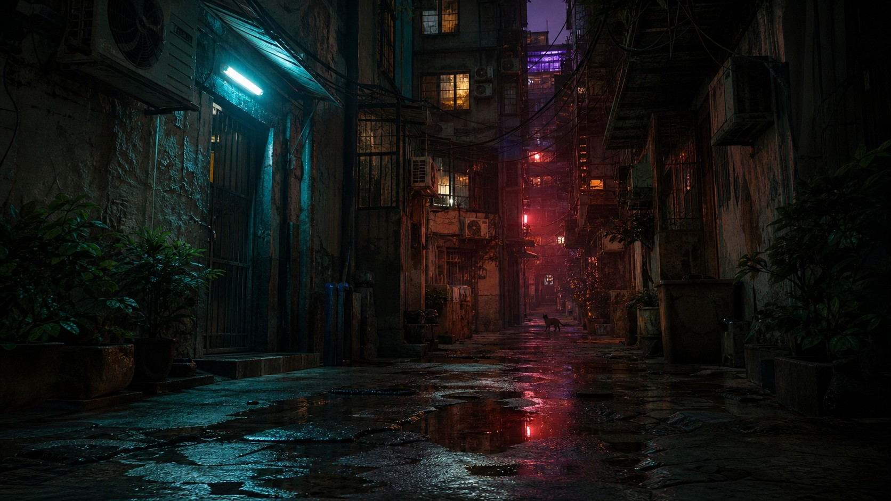</a> <strong>Neon Ruined-City Game Art</strong> <a href="style-packages/game-art/stray-neon-cybercity/README.en.md">Open README</a></td>
</tr>
<tr>
<td width="33%" valign="top" align="center"><a href="style-packages/game-art/ori-luminous-forest/README.en.md">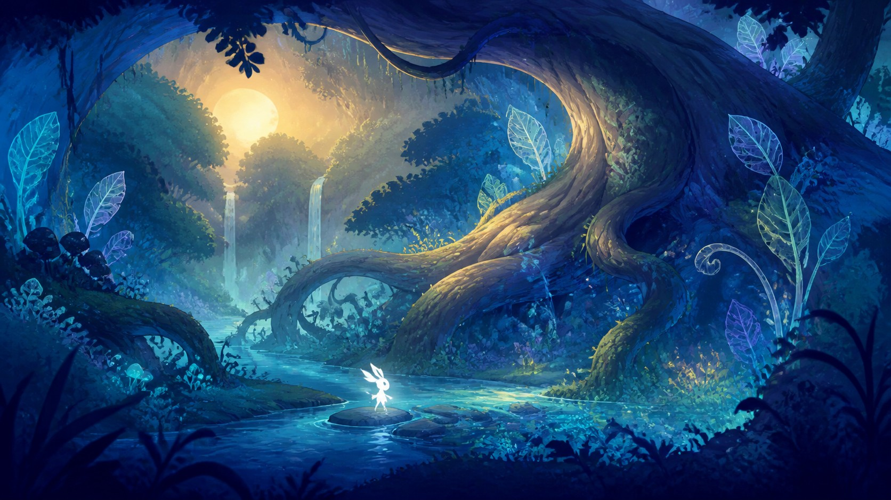</a> <strong>Luminous Hand-Painted Forest Game Art</strong> <a href="style-packages/game-art/ori-luminous-forest/README.en.md">Open README</a></td>
<td width="33%" valign="top" align="center"> <strong>RPG Maker Pixel Art</strong> <a href="style-packages/game-art/rpg-maker-pixel-art/README.en.md">Open README</a></td>
<td width="33%" valign="top" align="center"><a href="style-packages/game-art/hollow-knight-inked-gothic/README.en.md">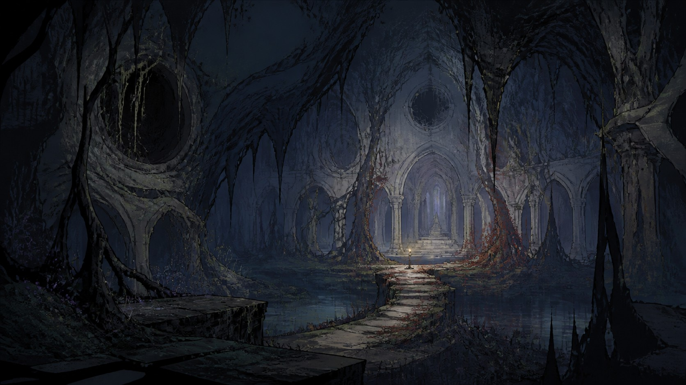</a> <strong>Inked Gothic Metroidvania Game Art</strong> <a href="style-packages/game-art/hollow-knight-inked-gothic/README.en.md">Open README</a></td>
</tr>
<tr>
<td width="33%" valign="top" align="center"><a href="style-packages/game-art/journey-minimalist-desert/README.en.md">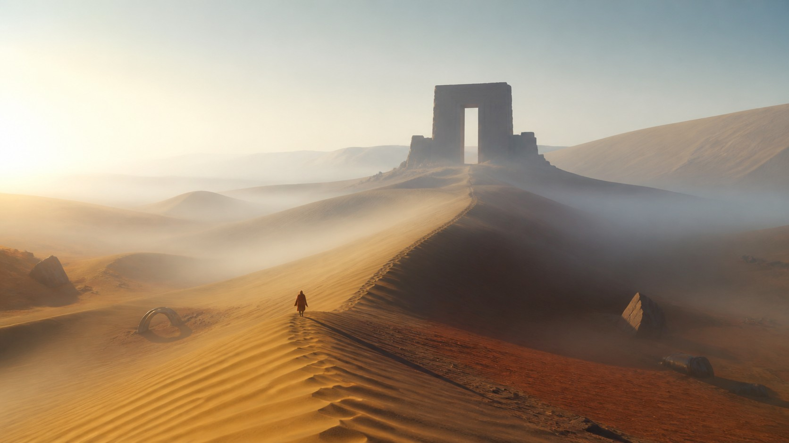</a> <strong>Minimalist Desert Journey Game Art</strong> <a href="style-packages/game-art/journey-minimalist-desert/README.en.md">Open README</a></td>
<td width="33%" valign="top" align="center"><a href="style-packages/game-art/final-fantasy-ix-painted-fantasy/README.en.md">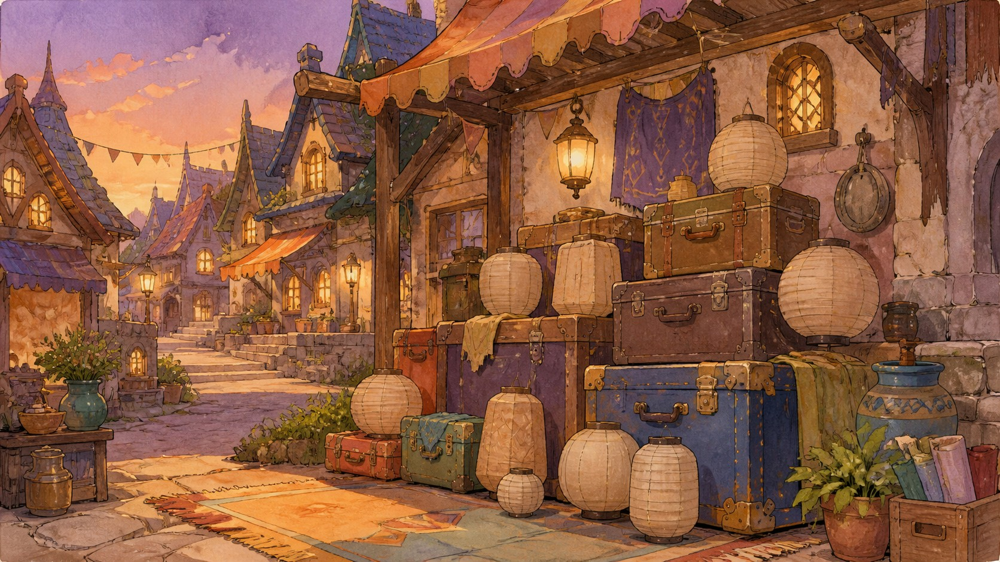</a> <strong>Storybook Fantasy RPG Game Art</strong> <a href="style-packages/game-art/final-fantasy-ix-painted-fantasy/README.en.md">Open README</a></td>
</tr>
</table>
### Movements and periods

<table>
<tr>
<td width="33%" valign="top" align="center"> <strong>Impressionism</strong> <a href="style-packages/movements/impressionism/README.en.md">Open README</a></td>
<td width="33%" valign="top" align="center"> <strong>Greek Geometric Period</strong> <a href="style-packages/movements/greek-geometric-period/README.en.md">Open README</a></td>
<td width="33%" valign="top" align="center"> <strong>Greek Hellenistic Period</strong> <a href="style-packages/movements/greek-hellenistic-period/README.en.md">Open README</a></td>
</tr>
<tr>
<td width="33%" valign="top" align="center"> <strong>Greek Classical Period</strong> <a href="style-packages/movements/greek-classical-period/README.en.md">Open README</a></td>
<td width="33%" valign="top" align="center"> <strong>Greek Archaic Period</strong> <a href="style-packages/movements/greek-archaic-period/README.en.md">Open README</a></td>
<td width="33%" valign="top" align="center"> <strong>Post-Impressionism</strong> <a href="style-packages/movements/post-impressionism/README.en.md">Open README</a></td>
</tr>
<tr>
<td width="33%" valign="top" align="center"> <strong>Baroque</strong> <a href="style-packages/movements/baroque/README.en.md">Open README</a></td>
<td width="33%" valign="top" align="center"> <strong>Italian High Renaissance</strong> <a href="style-packages/movements/italian-high-renaissance-raphaelesque/README.en.md">Open README</a></td>
<td width="33%" valign="top" align="center"> <strong>Neue Sachlichkeit / New Objectivity</strong> <a href="style-packages/movements/neue-sachlichkeit/README.en.md">Open README</a></td>
</tr>
<tr>
<td width="33%" valign="top" align="center"> <strong>Neoclassicism</strong> <a href="style-packages/movements/neoclassicism/README.en.md">Open README</a></td>
<td width="33%" valign="top" align="center"> <strong>Art Nouveau</strong> <a href="style-packages/movements/art-nouveau/README.en.md">Open README</a></td>
<td width="33%" valign="top" align="center"> <strong>Futurism</strong> <a href="style-packages/movements/futurism/README.en.md">Open README</a></td>
</tr>
<tr>
<td width="33%" valign="top" align="center"> <strong>Rococo</strong> <a href="style-packages/movements/rococo/README.en.md">Open README</a></td>
<td width="33%" valign="top" align="center"> <strong>Romanticism</strong> <a href="style-packages/movements/romanticism/README.en.md">Open README</a></td>
<td width="33%" valign="top" align="center"> <strong>Realism</strong> <a href="style-packages/movements/realism/README.en.md">Open README</a></td>
</tr>
<tr>
<td width="33%" valign="top" align="center"> <strong>Cubism</strong> <a href="style-packages/movements/cubism/README.en.md">Open README</a></td>
<td width="33%" valign="top" align="center"> <strong>Expressionism</strong> <a href="style-packages/movements/expressionism/README.en.md">Open README</a></td>
<td width="33%" valign="top" align="center"> <strong>Surrealism</strong> <a href="style-packages/movements/surrealism/README.en.md">Open README</a></td>
</tr>
<tr>
<td width="33%" valign="top" align="center"><a href="style-packages/movements/renaissance/README.en.md">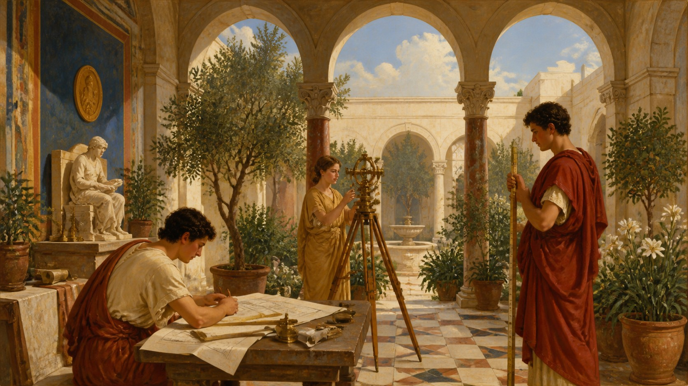</a> <strong>Renaissance</strong> <a href="style-packages/movements/renaissance/README.en.md">Open README</a></td>
<td width="33%" valign="top" align="center"> <strong>Northern Renaissance</strong> <a href="style-packages/movements/northern-renaissance/README.en.md">Open README</a></td>
<td width="33%" valign="top" align="center"><a href="style-packages/movements/mannerism/README.en.md">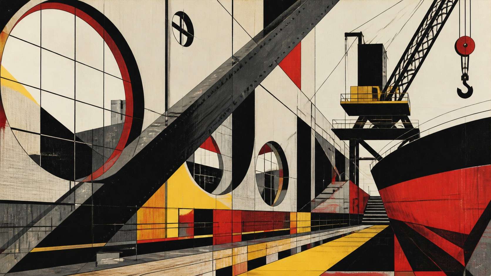</a> <strong>Mannerism</strong> <a href="style-packages/movements/mannerism/README.en.md">Open README</a></td>
</tr>
<tr>
<td width="33%" valign="top" align="center"><a href="style-packages/movements/symbolism/README.en.md">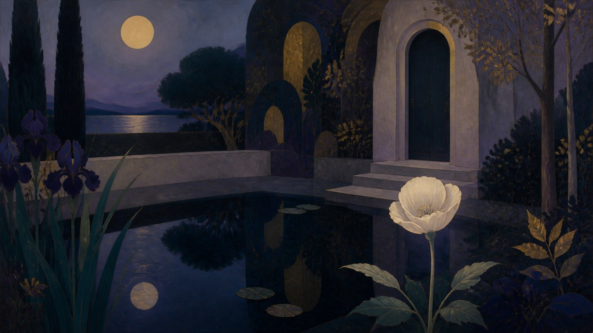</a> <strong>Symbolism</strong> <a href="style-packages/movements/symbolism/README.en.md">Open README</a></td>
<td width="33%" valign="top" align="center"><a href="style-packages/movements/dada/README.en.md">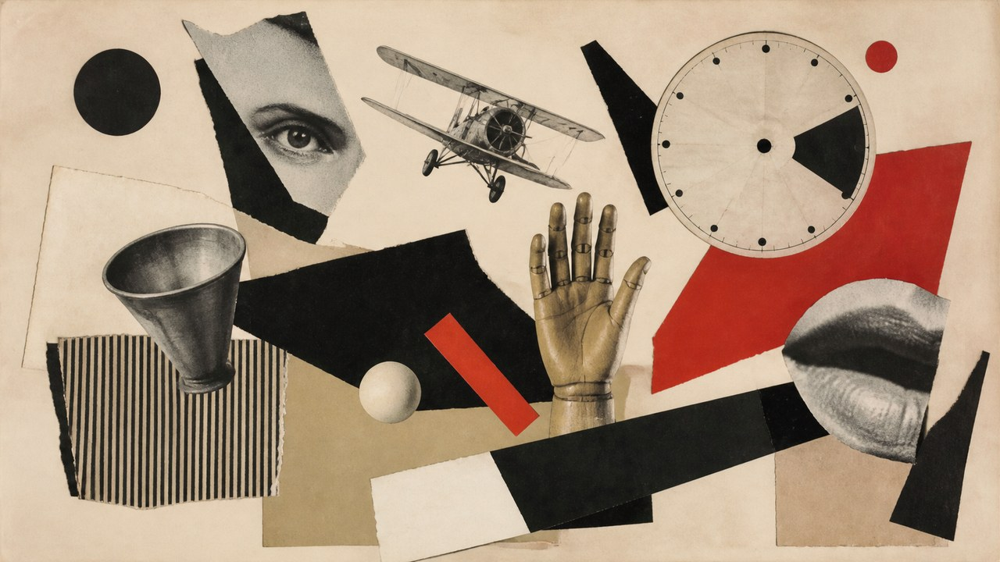</a> <strong>Dada</strong> <a href="style-packages/movements/dada/README.en.md">Open README</a></td>
<td width="33%" valign="top" align="center"><a href="style-packages/movements/constructivism/README.en.md">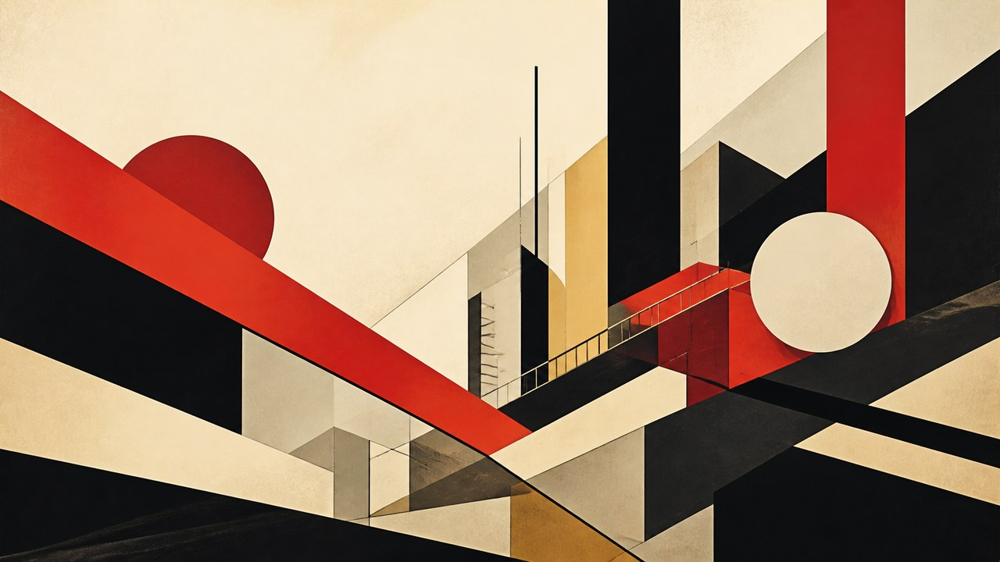</a> <strong>Constructivism</strong> <a href="style-packages/movements/constructivism/README.en.md">Open README</a></td>
</tr>
<tr>
<td width="33%" valign="top" align="center"><a href="style-packages/movements/suprematism/README.en.md">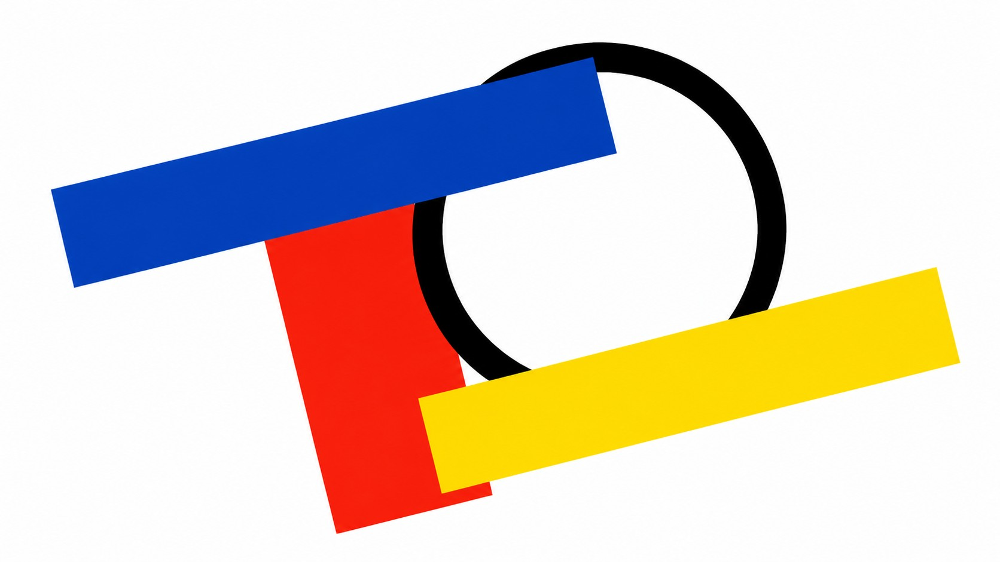</a> <strong>Suprematism</strong> <a href="style-packages/movements/suprematism/README.en.md">Open README</a></td>
<td width="33%" valign="top" align="center"> <strong>Socialist Realism</strong> <a href="style-packages/movements/socialist-realism/README.en.md">Open README</a></td>
<td width="33%" valign="top" align="center"><a href="style-packages/movements/abstract-expressionism/README.en.md">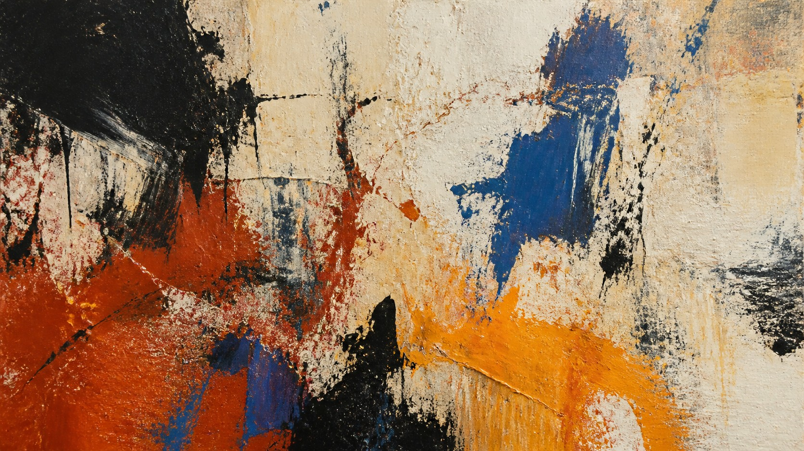</a> <strong>Abstract Expressionism</strong> <a href="style-packages/movements/abstract-expressionism/README.en.md">Open README</a></td>
</tr>
<tr>
<td width="33%" valign="top" align="center"><a href="style-packages/movements/pop-art/README.en.md">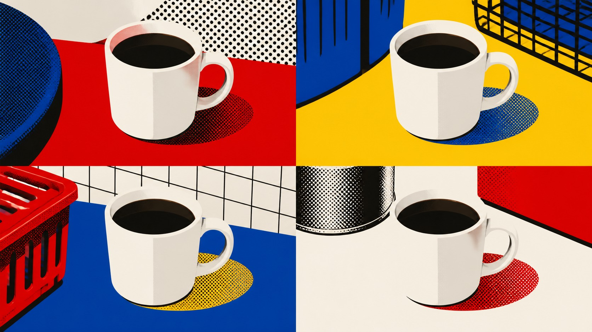</a> <strong>Pop Art</strong> <a href="style-packages/movements/pop-art/README.en.md">Open README</a></td>
<td width="33%" valign="top" align="center"><a href="style-packages/movements/minimalism/README.en.md">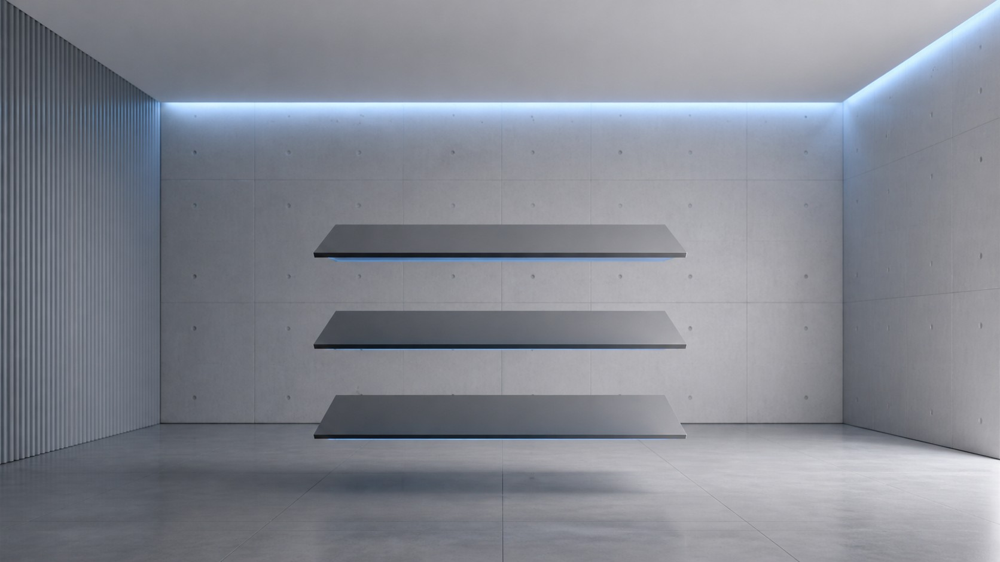</a> <strong>Minimalism</strong> <a href="style-packages/movements/minimalism/README.en.md">Open README</a></td>
<td width="33%" valign="top" align="center"><a href="style-packages/movements/conceptual-art/README.en.md">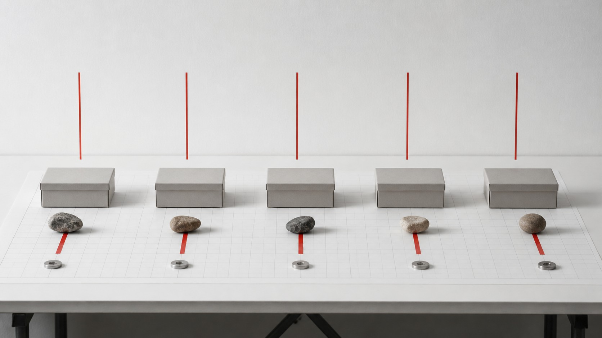</a> <strong>Conceptual Art</strong> <a href="style-packages/movements/conceptual-art/README.en.md">Open README</a></td>
</tr>
<tr>
<td width="33%" valign="top" align="center"><a href="style-packages/movements/land-art/README.en.md">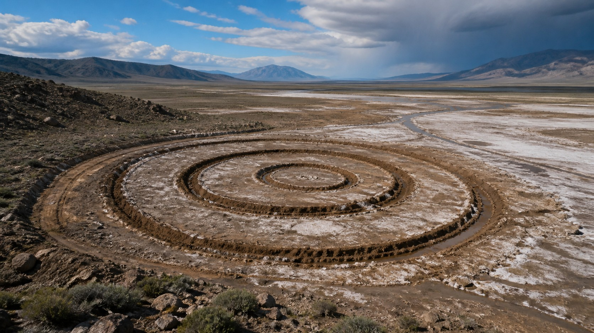</a> <strong>Land Art</strong> <a href="style-packages/movements/land-art/README.en.md">Open README</a></td>
<td width="33%" valign="top" align="center"><a href="style-packages/movements/op-art/README.en.md">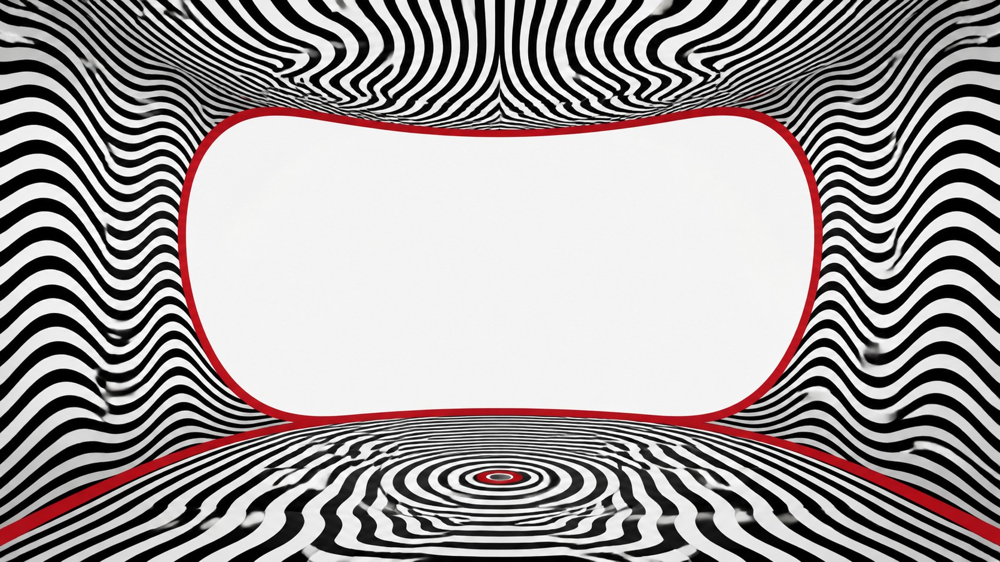</a> <strong>Op Art</strong> <a href="style-packages/movements/op-art/README.en.md">Open README</a></td>
<td width="33%" valign="top" align="center"><a href="style-packages/movements/photorealism/README.en.md">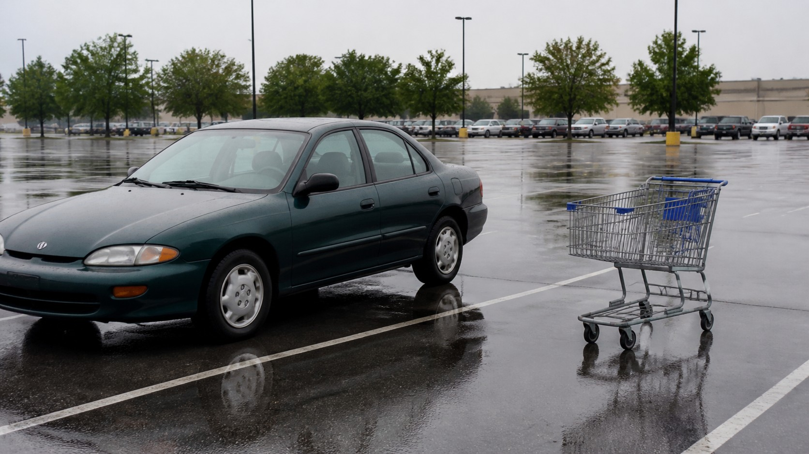</a> <strong>Photorealism</strong> <a href="style-packages/movements/photorealism/README.en.md">Open README</a></td>
</tr>
<tr>
<td width="33%" valign="top" align="center"><a href="style-packages/movements/pre-raphaelites/README.en.md">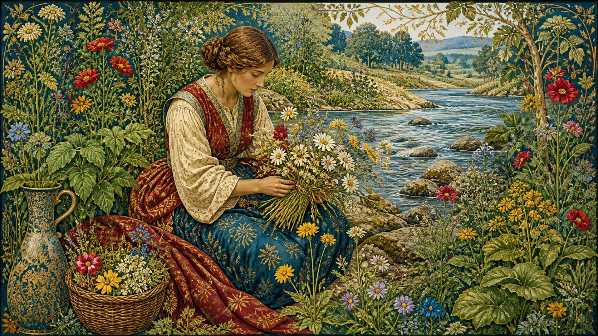</a> <strong>Pre-Raphaelite Brotherhood</strong> <a href="style-packages/movements/pre-raphaelites/README.en.md">Open README</a></td>
<td width="33%" valign="top" align="center"><a href="style-packages/movements/arts-and-crafts/README.en.md">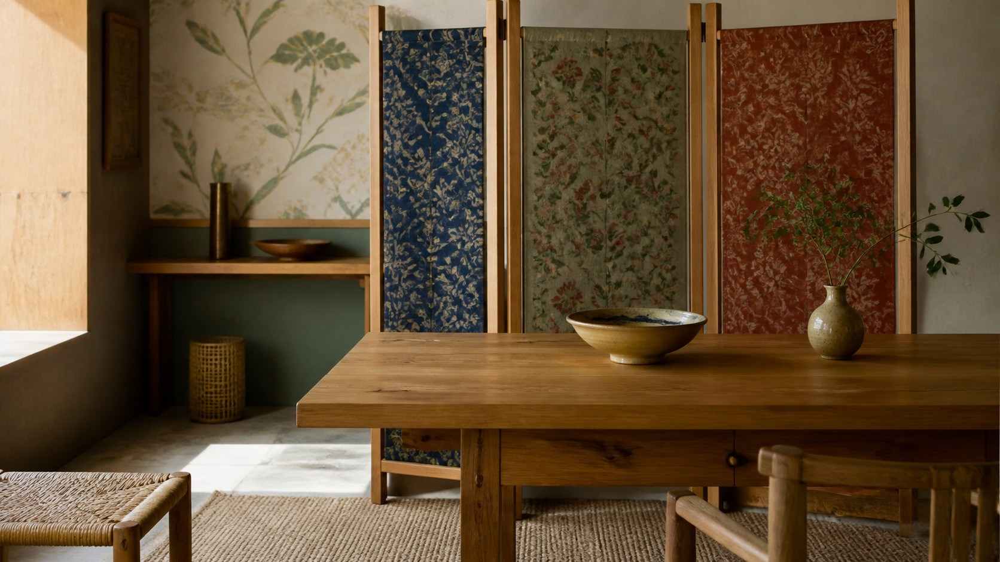</a> <strong>Arts and Crafts Movement</strong> <a href="style-packages/movements/arts-and-crafts/README.en.md">Open README</a></td>
<td width="33%" valign="top" align="center"><a href="style-packages/movements/harlem-renaissance/README.en.md">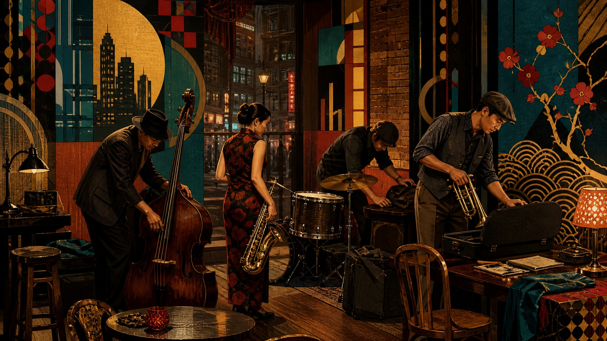</a> <strong>Harlem Renaissance</strong> <a href="style-packages/movements/harlem-renaissance/README.en.md">Open README</a></td>
</tr>
<tr>
<td width="33%" valign="top" align="center"><a href="style-packages/movements/magic-realism/README.en.md">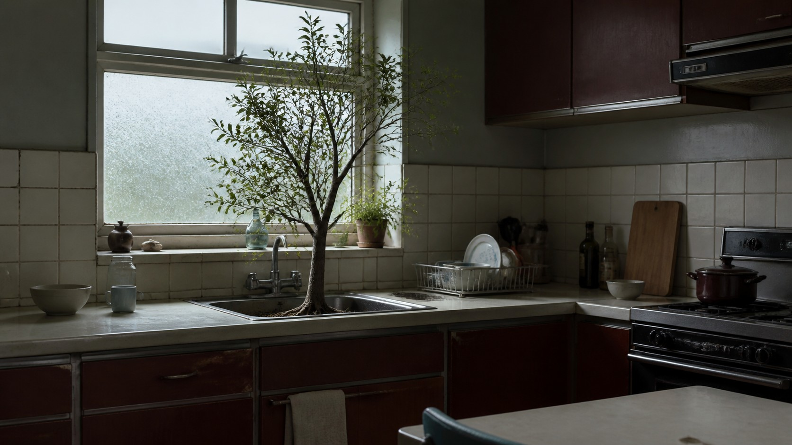</a> <strong>Magic Realism</strong> <a href="style-packages/movements/magic-realism/README.en.md">Open README</a></td>
<td width="33%" valign="top" align="center"> <strong>Precisionism</strong> <a href="style-packages/movements/precisionism/README.en.md">Open README</a></td>
</tr>
</table>

### Photographers

<table>
<tr>
<td width="33%" valign="top" align="center"> <strong>Henri Cartier-Bresson</strong> <a href="style-packages/photographers/henri-cartier-bresson/README.en.md">Open README</a></td>
<td width="33%" valign="top" align="center"> <strong>Lewis Hine</strong> <a href="style-packages/photographers/lewis-hine/README.en.md">Open README</a></td>
<td width="33%" valign="top" align="center"> <strong>Eadweard Muybridge</strong> <a href="style-packages/photographers/eadweard-muybridge/README.en.md">Open README</a></td>
</tr>
<tr>
<td width="33%" valign="top" align="center"> <strong>Dorothea Lange</strong> <a href="style-packages/photographers/dorothea-lange/README.en.md">Open README</a></td>
<td width="33%" valign="top" align="center"> <strong>William Eggleston</strong> <a href="style-packages/photographers/william-eggleston/README.en.md">Open README</a></td>
<td width="33%" valign="top" align="center"> <strong>Ansel Adams</strong> <a href="style-packages/photographers/ansel-adams/README.en.md">Open README</a></td>
</tr>
<tr>
<td width="33%" valign="top" align="center"> <strong>Julia Margaret Cameron</strong> <a href="style-packages/photographers/julia-margaret-cameron/README.en.md">Open README</a></td>
<td width="33%" valign="top" align="center"> <strong>Daido Moriyama</strong> <a href="style-packages/photographers/daido-moriyama/README.en.md">Open README</a></td>
<td width="33%" valign="top" align="center"> <strong>Eugène Atget</strong> <a href="style-packages/photographers/eugene-atget/README.en.md">Open README</a></td>
</tr>
<tr>
<td width="33%" valign="top" align="center"> <strong>Walker Evans</strong> <a href="style-packages/photographers/walker-evans/README.en.md">Open README</a></td>
<td width="33%" valign="top" align="center"> <strong>Masahisa Fukase</strong> <a href="style-packages/photographers/masahisa-fukase/README.en.md">Open README</a></td>
<td width="33%" valign="top" align="center"> <strong>Nadar</strong> <a href="style-packages/photographers/nadar/README.en.md">Open README</a></td>
</tr>
<tr>
<td width="33%" valign="top" align="center"> <strong>Robert Capa</strong> <a href="style-packages/photographers/robert-capa/README.en.md">Open README</a></td>
<td width="33%" valign="top" align="center"> <strong>Roger Fenton</strong> <a href="style-packages/photographers/roger-fenton/README.en.md">Open README</a></td>
<td width="33%" valign="top" align="center"> <strong>Étienne-Jules Marey</strong> <a href="style-packages/photographers/etienne-jules-marey/README.en.md">Open README</a></td>
</tr>
<tr>
<td width="33%" valign="top" align="center"> <strong>Alfred Stieglitz</strong> <a href="style-packages/photographers/alfred-stieglitz/README.en.md">Open README</a></td>
<td width="33%" valign="top" align="center"> <strong>Diane Arbus</strong> <a href="style-packages/photographers/diane-arbus/README.en.md">Open README</a></td>
<td width="33%" valign="top" align="center"><a href="style-packages/photographers/saul-leiter/README.en.md">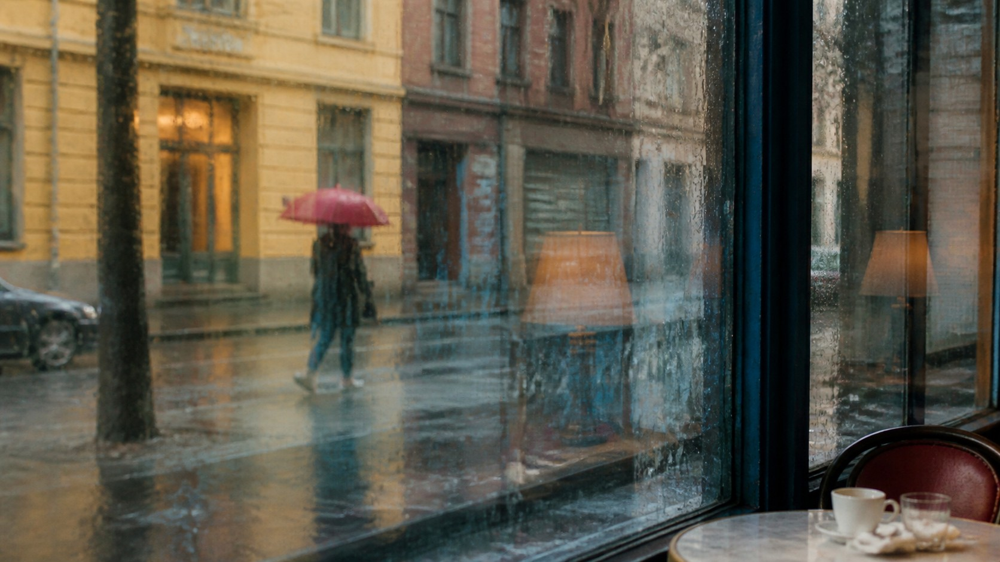</a> <strong>Saul Leiter</strong> <a href="style-packages/photographers/saul-leiter/README.en.md">Open README</a></td>
</tr>
<tr>
<td width="33%" valign="top" align="center"> <strong>Vivian Maier</strong> <a href="style-packages/photographers/vivian-maier/README.en.md">Open README</a></td>
<td width="33%" valign="top" align="center"> <strong>Rinko Kawauchi</strong> <a href="style-packages/photographers/rinko-kawauchi/README.en.md">Open README</a></td>
<td width="33%" valign="top" align="center"><a href="style-packages/photographers/man-ray/README.en.md">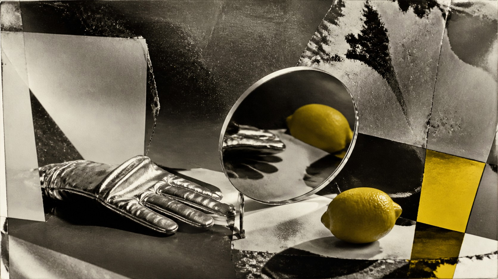</a> <strong>Man Ray</strong> <a href="style-packages/photographers/man-ray/README.en.md">Open README</a></td>
</tr>
<tr>
<td width="33%" valign="top" align="center"> <strong>Berenice Abbott</strong> <a href="style-packages/photographers/berenice-abbott/README.en.md">Open README</a></td>
<td width="33%" valign="top" align="center"><a href="style-packages/photographers/gordon-parks/README.en.md">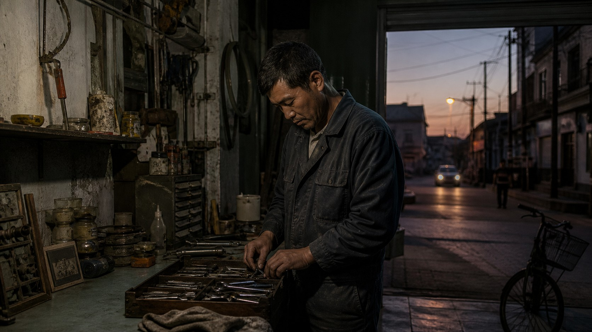</a> <strong>Gordon Parks</strong> <a href="style-packages/photographers/gordon-parks/README.en.md">Open README</a></td>
<td width="33%" valign="top" align="center"> <strong>William Klein</strong> <a href="style-packages/photographers/william-klein/README.en.md">Open README</a></td>
</tr>
<tr>
<td width="33%" valign="top" align="center"><a href="style-packages/photographers/mary-ellen-mark/README.en.md">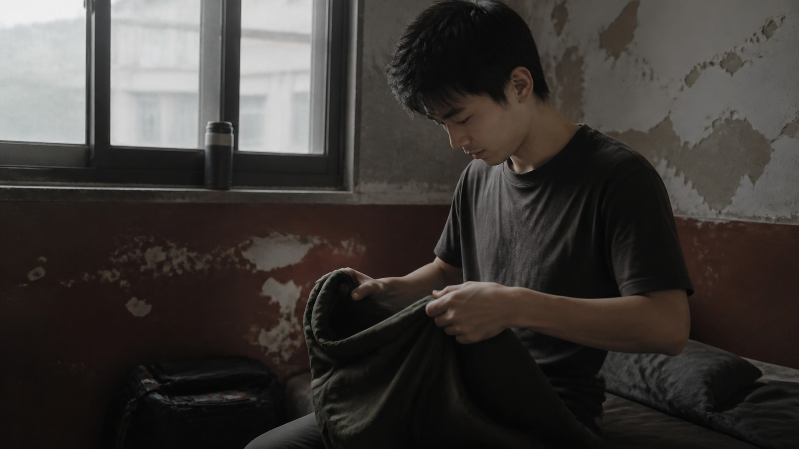</a> <strong>Mary Ellen Mark</strong> <a href="style-packages/photographers/mary-ellen-mark/README.en.md">Open README</a></td>
<td width="33%" valign="top" align="center"><a href="style-packages/photographers/nick-brandt/README.en.md">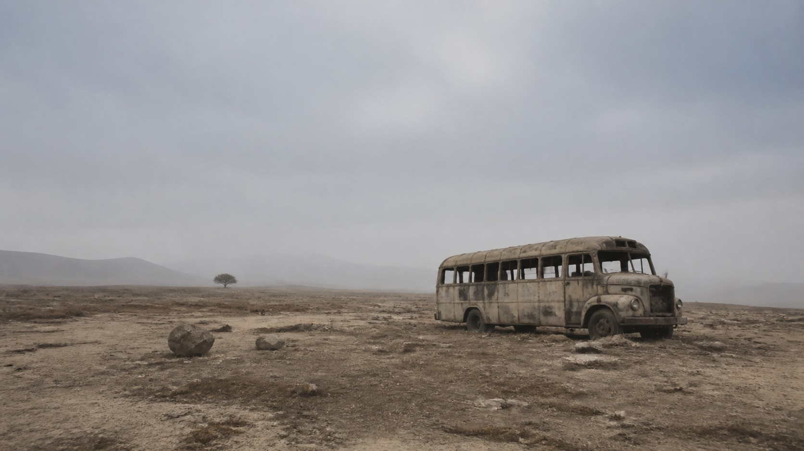</a> <strong>Nick Brandt</strong> <a href="style-packages/photographers/nick-brandt/README.en.md">Open README</a></td>
<td width="33%" valign="top" align="center"><a href="style-packages/photographers/gregory-crewdson/README.en.md">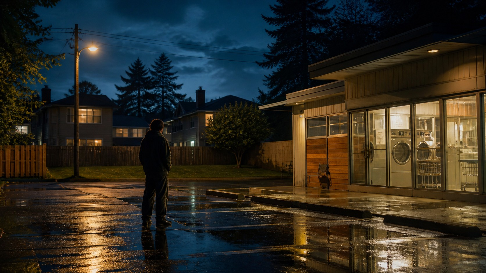</a> <strong>Gregory Crewdson</strong> <a href="style-packages/photographers/gregory-crewdson/README.en.md">Open README</a></td>
</tr>
<tr>
<td width="33%" valign="top" align="center"><a href="style-packages/photographers/cindy-sherman/README.en.md">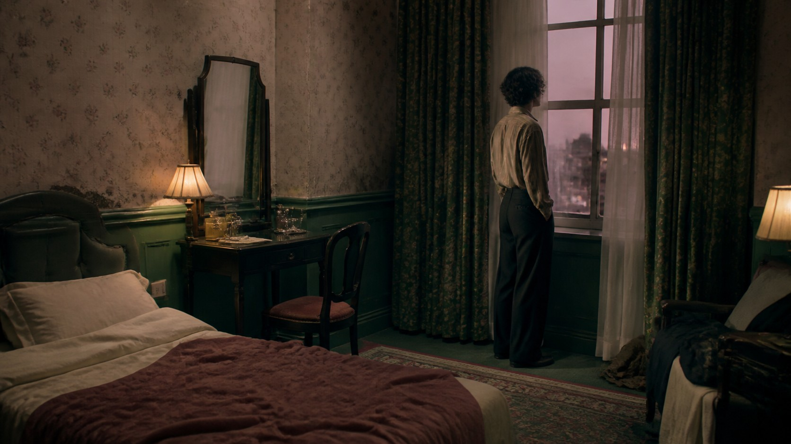</a> <strong>Cindy Sherman</strong> <a href="style-packages/photographers/cindy-sherman/README.en.md">Open README</a></td>
<td width="33%" valign="top" align="center"><a href="style-packages/photographers/sebastiao-salgado/README.en.md">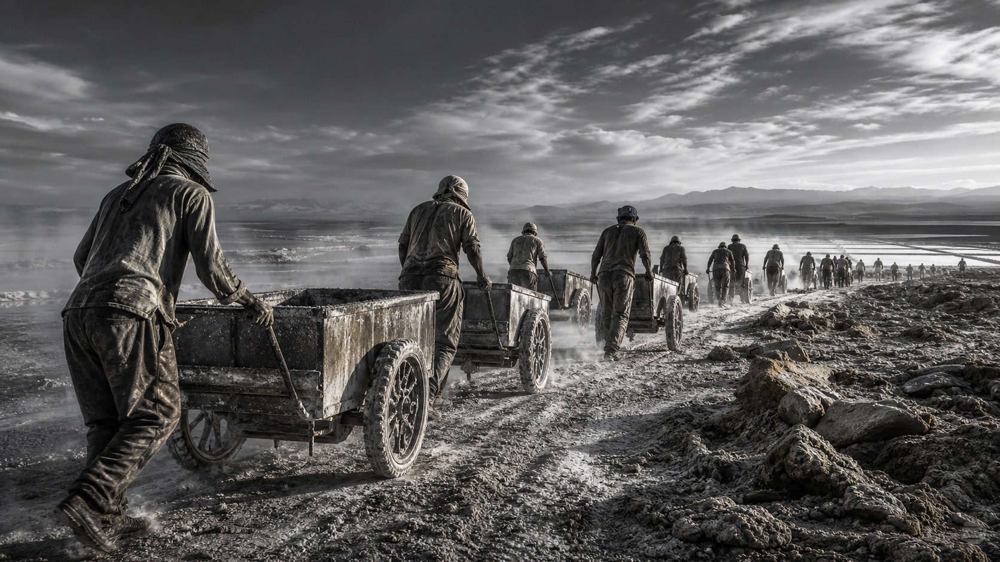</a> <strong>Sebastião Salgado</strong> <a href="style-packages/photographers/sebastiao-salgado/README.en.md">Open README</a></td>
<td width="33%" valign="top" align="center"> <strong>Peter Lindbergh</strong> <a href="style-packages/photographers/peter-lindbergh/README.en.md">Open README</a></td>
</tr>
</table>

### Original presets

<table>
<tr>
<td width="33%" valign="top" align="center"> <strong>Muted Documentary Color</strong> <a href="style-packages/presets/muted-documentary-color/README.en.md">Open README</a></td>
<td width="33%" valign="top" align="center"> <strong>Nocturnal Blue Hour</strong> <a href="style-packages/presets/nocturnal-blue-hour/README.en.md">Open README</a></td>
<td width="33%" valign="top" align="center"> <strong>Hard-Light Color Blocking</strong> <a href="style-packages/presets/hard-light-color-blocking/README.en.md">Open README</a></td>
</tr>
<tr>
<td width="33%" valign="top" align="center"> <strong>Pastel Film Portrait</strong> <a href="style-packages/presets/pastel-film-portrait/README.en.md">Open README</a></td>
<td width="33%" valign="top" align="center"> <strong>Natural Window Light</strong> <a href="style-packages/presets/natural-window-light/README.en.md">Open README</a></td>
<td width="33%" valign="top" align="center"> <strong>Monochrome Silver Gelatin</strong> <a href="style-packages/presets/monochrome-silver-gelatin/README.en.md">Open README</a></td>
</tr>
<tr>
<td width="33%" valign="top" align="center"> <strong>High-Chroma Color Pairing</strong> <a href="style-packages/presets/high-chroma-color-pairing/README.en.md">Open README</a></td>
<td width="33%"></td>
<td width="33%"></td>
</tr>
</table>

### Schools

<table>
<tr>
<td width="33%" valign="top" align="center"> <strong>Ulm School</strong> <a href="style-packages/schools/ulm-school/README.en.md">Open README</a></td>
<td width="33%" valign="top" align="center"> <strong>Bauhaus</strong> <a href="style-packages/schools/bauhaus/README.en.md">Open README</a></td>
<td width="33%" valign="top" align="center"> <strong>International Typographic Style</strong> <a href="style-packages/schools/international-typographic-style/README.en.md">Open README</a></td>
</tr>
<tr>
<td width="33%" valign="top" align="center"> <strong>New Bauhaus</strong> <a href="style-packages/schools/new-bauhaus/README.en.md">Open README</a></td>
<td width="33%" valign="top" align="center"> <strong>New Topographics</strong> <a href="style-packages/schools/new-topographics/README.en.md">Open README</a></td>
<td width="33%" valign="top" align="center"> <strong>De Stijl</strong> <a href="style-packages/schools/de-stijl/README.en.md">Open README</a></td>
</tr>
<tr>
<td width="33%" valign="top" align="center"> <strong>Art Deco</strong> <a href="style-packages/schools/art-deco/README.en.md">Open README</a></td>
<td width="33%"></td>
<td width="33%"></td>
</tr>
</table>

### Techniques and media

<table>
<tr>
<td width="33%" valign="top" align="center"> <strong>Screen Printing</strong> <a href="style-packages/techniques/screen-printing/README.en.md">Open README</a></td>
<td width="33%" valign="top" align="center"> <strong>Drypoint Etching</strong> <a href="style-packages/techniques/drypoint-etching/README.en.md">Open README</a></td>
<td width="33%" valign="top" align="center"> <strong>Woodcut</strong> <a href="style-packages/techniques/woodcut/README.en.md">Open README</a></td>
</tr>
<tr>
<td width="33%" valign="top" align="center"> <strong>Cyanotype</strong> <a href="style-packages/techniques/cyanotype/README.en.md">Open README</a></td>
<td width="33%" valign="top" align="center"> <strong>Watercolor</strong> <a href="style-packages/techniques/watercolor/README.en.md">Open README</a></td>
<td width="33%" valign="top" align="center"> <strong>Oil Painting</strong> <a href="style-packages/techniques/oil-painting/README.en.md">Open README</a></td>
</tr>
<tr>
<td width="33%" valign="top" align="center"> <strong>Gum Bichromate Printing</strong> <a href="style-packages/techniques/gum-bichromate/README.en.md">Open README</a></td>
<td width="33%" valign="top" align="center"><a href="style-packages/techniques/encaustic-painting/README.en.md">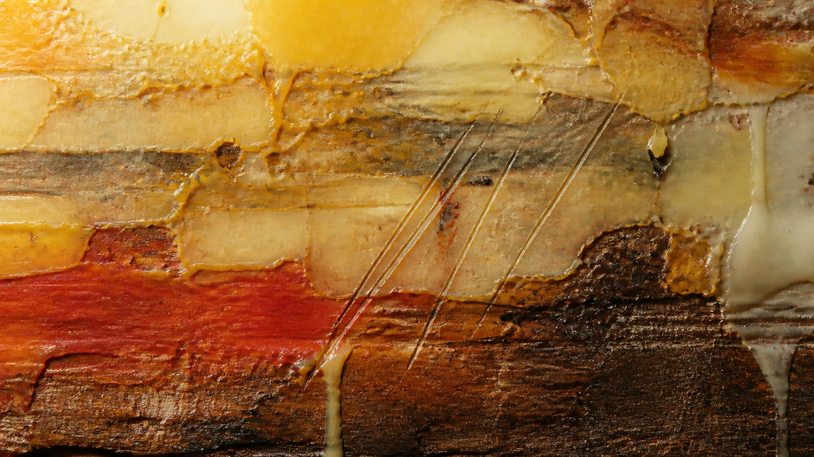</a> <strong>Encaustic Painting</strong> <a href="style-packages/techniques/encaustic-painting/README.en.md">Open README</a></td>
<td width="33%" valign="top" align="center"><a href="style-packages/techniques/fresco-painting/README.en.md">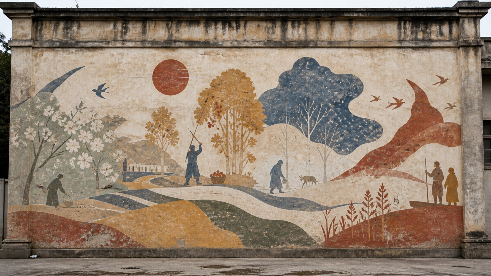</a> <strong>Fresco Painting</strong> <a href="style-packages/techniques/fresco-painting/README.en.md">Open README</a></td>
</tr>
<tr>
<td width="33%" valign="top" align="center"><a href="style-packages/techniques/linocut-printmaking/README.en.md">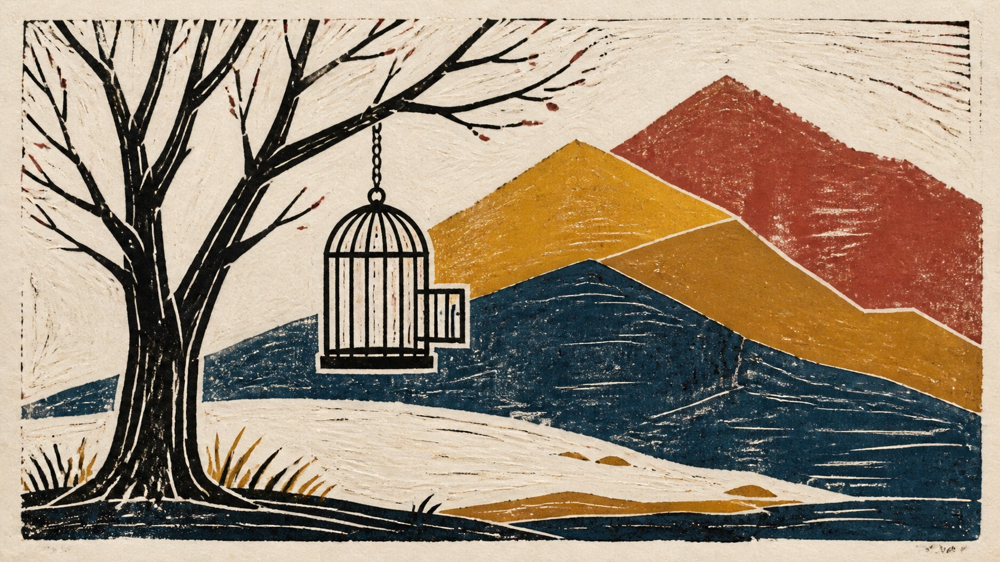</a> <strong>Linocut Printmaking</strong> <a href="style-packages/techniques/linocut-printmaking/README.en.md">Open README</a></td>
<td width="33%" valign="top" align="center"><a href="style-packages/techniques/mezzotint-printmaking/README.en.md">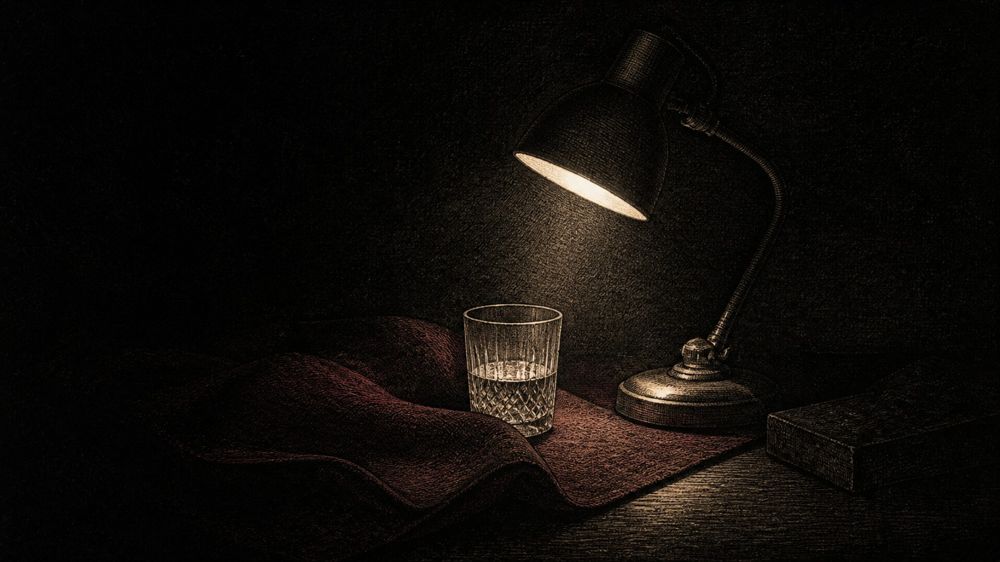</a> <strong>Mezzotint Printmaking</strong> <a href="style-packages/techniques/mezzotint-printmaking/README.en.md">Open README</a></td>
<td width="33%" valign="top" align="center"><a href="style-packages/techniques/collage-mixed-media/README.en.md">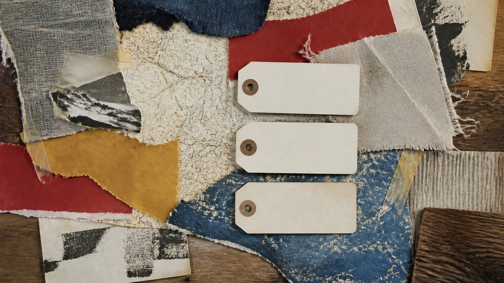</a> <strong>Collage Mixed Media</strong> <a href="style-packages/techniques/collage-mixed-media/README.en.md">Open README</a></td>
</tr>
</table>

### Inherited 110 lightweight presets

The original 110 `style.json` presets remain under [`styles/`](styles/), and the complete table is shown below.

<table>
<tr>
<td width="33%" valign="top" align="center">
 
<strong>Acid Lime 3D Streetwear Type Poster Style</strong> 
<a href="styles/acid-lime-3d-streetwear-type-poster-style/README.en.md">Open README</a>
</td>
<td width="33%" valign="top" align="center">
 
<strong>Analog Sticker Diary Portrait Poster Style</strong> 
<a href="styles/analog-sticker-diary-portrait-poster-style/README.en.md">Open README</a>
</td>
<td width="33%" valign="top" align="center">
 
<strong>Backseat Transit Doodle Letter Poster Style</strong> 
<a href="styles/backseat-transit-doodle-letter-poster-style/README.en.md">Open README</a>
</td>
</tr>
<tr>
<td width="33%" valign="top" align="center">
 
<strong>Black Cutout Food Card Ad</strong> 
<a href="styles/black-cutout-food-card-ad-style/README.en.md">Open README</a>
</td>
<td width="33%" valign="top" align="center">
 
<strong>Blue Bubble Fisheye Action Poster Style</strong> 
<a href="styles/blue-bubble-fisheye-action-poster-style/README.en.md">Open README</a>
</td>
<td width="33%" valign="top" align="center">
 
<strong>Blue Chinese Perspective Type Canyon Style</strong> 
<a href="styles/blue-chinese-perspective-type-canyon-style/README.en.md">Open README</a>
</td>
</tr>
<tr>
<td width="33%" valign="top" align="center">
 
<strong>Blue Halftone Ransom Zine Poster Style</strong> 
<a href="styles/blue-halftone-ransom-zine-poster-style/README.en.md">Open README</a>
</td>
<td width="33%" valign="top" align="center">
 
<strong>Blue HUD Macro Creator Tech Poster</strong> 
<a href="styles/blue-hud-macro-product-poster/README.en.md">Open README</a>
</td>
<td width="33%" valign="top" align="center">
 
<strong>Blue Lime Kinetic Comic Type Poster Style</strong> 
<a href="styles/blue-lime-kinetic-comic-type-poster-style/README.en.md">Open README</a>
</td>
</tr>
<tr>
<td width="33%" valign="top" align="center">
 
<strong>Bold Anime Reaction Thumbnail Style</strong> 
<a href="styles/bold-anime-reaction-thumbnail-style/README.en.md">Open README</a>
</td>
<td width="33%" valign="top" align="center">
 
<strong>Bold Block Mascot Poster Style</strong> 
<a href="styles/bold-block-mascot-poster-style/README.en.md">Open README</a>
</td>
<td width="33%" valign="top" align="center">
 
<strong>Chromatic Fisheye Orbit Pop Poster Style</strong> 
<a href="styles/chromatic-fisheye-orbit-pop-poster-style/README.en.md">Open README</a>
</td>
</tr>
<tr>
<td width="33%" valign="top" align="center">
 
<strong>Clean Triptych Travel Vlog Thumbnail Style</strong> 
<a href="styles/clean-triptych-travel-vlog-thumbnail-style/README.en.md">Open README</a>
</td>
<td width="33%" valign="top" align="center">
 
<strong>Cobalt Megatype Roadside Travel Editorial</strong> 
<a href="styles/cobalt-megatype-roadside-travel-editorial-style/README.en.md">Open README</a>
</td>
<td width="33%" valign="top" align="center">
 
<strong>Cobalt Torn Didone Portrait Editorial</strong> 
<a href="styles/cobalt-torn-didone-portrait-editorial-style/README.en.md">Open README</a>
</td>
</tr>
<tr>
<td width="33%" valign="top" align="center">
 
<strong>Cobalt Xerox Script Editorial Poster</strong> 
<a href="styles/cobalt-xerox-script-editorial-poster-style/README.en.md">Open README</a>
</td>
<td width="33%" valign="top" align="center">
 
<strong>Coral Window Megatype Motion Poster</strong> 
<a href="styles/coral-window-megatype-motion-poster-style/README.en.md">Open README</a>
</td>
<td width="33%" valign="top" align="center">
 
<strong>Cozy Bedroom Doodle Companion Snapshot Style</strong> 
<a href="styles/cozy-bedroom-doodle-companion-snapshot-style/README.en.md">Open README</a>
</td>
</tr>
<tr>
<td width="33%" valign="top" align="center">
 
<strong>Crayon Catalog Doodle Poster Style</strong> 
<a href="styles/crayon-catalog-doodle-poster-style/README.en.md">Open README</a>
</td>
<td width="33%" valign="top" align="center">
 
<strong>Cream Smoke City Manga Poster Style</strong> 
<a href="styles/cream-smoke-city-manga-poster-style/README.en.md">Open README</a>
</td>
<td width="33%" valign="top" align="center">
 
<strong>Crimson Ink Manga Dossier</strong> 
<a href="styles/crimson-ink-manga-dossier/README.en.md">Open README</a>
</td>
</tr>
<tr>
<td width="33%" valign="top" align="center">
 
<strong>Cyan Grain Macro Megatype Poster</strong> 
<a href="styles/cyan-grain-macro-megatype-poster-style/README.en.md">Open README</a>
</td>
<td width="33%" valign="top" align="center">
 
<strong>Cyan Red Shockwave Type Poster Style</strong> 
<a href="styles/cyan-red-shockwave-type-poster-style/README.en.md">Open README</a>
</td>
<td width="33%" valign="top" align="center">
 
<strong>Dusk Cyan Layered Type Poster Style</strong> 
<a href="styles/dusk-cyan-layered-type-poster-style/README.en.md">Open README</a>
</td>
</tr>
<tr>
<td width="33%" valign="top" align="center">
 
<strong>Electric Blue Cutout Manga Poster Style</strong> 
<a href="styles/electric-blue-cutout-manga-poster-style/README.en.md">Open README</a>
</td>
<td width="33%" valign="top" align="center">
 
<strong>Electric Blue Silhouette Product Launch Style</strong> 
<a href="styles/electric-blue-silhouette-product-launch-style/README.en.md">Open README</a>
</td>
<td width="33%" valign="top" align="center">
 
<strong>Fantasy Scribble Mascot Poster Style</strong> 
<a href="styles/fantasy-scribble-mascot-poster-style/README.en.md">Open README</a>
</td>
</tr>
<tr>
<td width="33%" valign="top" align="center">
 
<strong>Folded Diamond Perspective Type Poster Style</strong> 
<a href="styles/folded-diamond-perspective-type-poster-style/README.en.md">Open README</a>
</td>
<td width="33%" valign="top" align="center">
 
<strong>Folded Newspaper Product Ad Style</strong> 
<a href="styles/folded-newspaper-product-ad-style/README.en.md">Open README</a>
</td>
<td width="33%" valign="top" align="center">
 
<strong>Foreshortened Gradient Impact Ad Style</strong> 
<a href="styles/foreshortened-gradient-impact-ad-style/README.en.md">Open README</a>
</td>
</tr>
<tr>
<td width="33%" valign="top" align="center">
 
<strong>Gothic Cat Doodle Photo Collage Style</strong> 
<a href="styles/gothic-cat-doodle-photo-collage-style/README.en.md">Open README</a>
</td>
<td width="33%" valign="top" align="center">
 
<strong>Halftone Assemblage Metaphor PSA Poster Style</strong> 
<a href="styles/halftone-assemblage-metaphor-psa-poster-style/README.en.md">Open README</a>
</td>
<td width="33%" valign="top" align="center">
 
<strong>Hot Ink Comic Poster</strong> 
<a href="styles/hot-ink-comic-poster/README.en.md">Open README</a>
</td>
</tr>
<tr>
<td width="33%" valign="top" align="center">
 
<strong>Ice Cyan Megatype Action Poster Style</strong> 
<a href="styles/ice-cyan-megatype-action-poster-style/README.en.md">Open README</a>
</td>
<td width="33%" valign="top" align="center">
 
<strong>Impact Burst Halftone Comic Poster Style</strong> 
<a href="styles/impact-burst-halftone-comic-poster-style/README.en.md">Open README</a>
</td>
<td width="33%" valign="top" align="center">
 
<strong>Jade Glyph Grocer Collage Poster Style</strong> 
<a href="styles/jade-glyph-grocer-collage-poster-style/README.en.md">Open README</a>
</td>
</tr>
<tr>
<td width="33%" valign="top" align="center">
 
<strong>Jagged Red Street Photo Event Poster Style</strong> 
<a href="styles/jagged-red-street-photo-event-poster-style/README.en.md">Open README</a>
</td>
<td width="33%" valign="top" align="center">
 
<strong>K-Pop Apocalypse Ransom Zine Style</strong> 
<a href="styles/k-pop-apocalypse-ransom-zine-style/README.en.md">Open README</a>
</td>
<td width="33%" valign="top" align="center">
 
<strong>Kinetic Editorial Photo Collage</strong> 
<a href="styles/kinetic-editorial-photo-collage-style/README.en.md">Open README</a>
</td>
</tr>
<tr>
<td width="33%" valign="top" align="center">
 
<strong>Kinetic Geometric Doodle Cutouts</strong> 
<a href="styles/kinetic-geometric-doodle-cutouts/README.en.md">Open README</a>
</td>
<td width="33%" valign="top" align="center">
 
<strong>Kinetic Luxury Street Fashion Cover Style</strong> 
<a href="styles/kinetic-luxury-street-fashion-cover-style/README.en.md">Open README</a>
</td>
<td width="33%" valign="top" align="center">
 
<strong>Lime Loop Megatype Action Poster</strong> 
<a href="styles/lime-loop-megatype-action-poster-style/README.en.md">Open README</a>
</td>
</tr>
<tr>
<td width="33%" valign="top" align="center">
 
<strong>Liquid Chrome Clearance Poster Style</strong> 
<a href="styles/liquid-chrome-clearance-poster-style/README.en.md">Open README</a>
</td>
<td width="33%" valign="top" align="center">
 
<strong>Loose Scribble Riso Print Style</strong> 
<a href="styles/loose-scribble-riso-print-style/README.en.md">Open README</a>
</td>
<td width="33%" valign="top" align="center">
 
<strong>Luxury Perspective Checkerboard Editorial</strong> 
<a href="styles/luxury-perspective-checkerboard-editorial/README.en.md">Open README</a>
</td>
</tr>
<tr>
<td width="33%" valign="top" align="center">
 
<strong>Manga Dossier Blueprint Poster</strong> 
<a href="styles/manga-dossier-blueprint-poster/README.en.md">Open README</a>
</td>
<td width="33%" valign="top" align="center">
 
<strong>Market Brush Produce Poster Style</strong> 
<a href="styles/market-brush-produce-poster-style/README.en.md">Open README</a>
</td>
<td width="33%" valign="top" align="center">
 
<strong>Metro Doodle Snapshot Diary</strong> 
<a href="styles/metro-doodle-snapshot-diary-style/README.en.md">Open README</a>
</td>
</tr>
<tr>
<td width="33%" valign="top" align="center">
 
<strong>Mono Noir Type Portrait Poster Style</strong> 
<a href="styles/mono-noir-type-portrait-poster-style/README.en.md">Open README</a>
</td>
<td width="33%" valign="top" align="center">
 
<strong>Monochrome Grid Sneaker Tech Spec</strong> 
<a href="styles/monochrome-grid-sneaker-tech-spec/README.en.md">Open README</a>
</td>
<td width="33%" valign="top" align="center">
 
<strong>Monochrome Xerox Sports Dossier</strong> 
<a href="styles/monochrome-xerox-sports-dossier/README.en.md">Open README</a>
</td>
</tr>
<tr>
<td width="33%" valign="top" align="center">
 
<strong>Mountain Trail Monster Doodle Poster Style</strong> 
<a href="styles/mountain-trail-monster-doodle-poster-style/README.en.md">Open README</a>
</td>
<td width="33%" valign="top" align="center">
 
<strong>Multi-Color Beverage Splash Ad System Style</strong> 
<a href="styles/multi-color-beverage-splash-ad-system-style/README.en.md">Open README</a>
</td>
<td width="33%" valign="top" align="center">
 
<strong>Naive Marker PSA Poster Style</strong> 
<a href="styles/naive-marker-psa-poster-style/README.en.md">Open README</a>
</td>
</tr>
<tr>
<td width="33%" valign="top" align="center">
 
<strong>Naive Marker Quote Card Style</strong> 
<a href="styles/naive-marker-quote-card-style/README.en.md">Open README</a>
</td>
<td width="33%" valign="top" align="center">
 
<strong>Neon Doodle Gallery Snapshot</strong> 
<a href="styles/neon-doodle-gallery-snapshot-style/README.en.md">Open README</a>
</td>
<td width="33%" valign="top" align="center">
 
<strong>Neon Kinetic Typographic Poster</strong> 
<a href="styles/neon-kinetic-typographic-poster-style/README.en.md">Open README</a>
</td>
</tr>
<tr>
<td width="33%" valign="top" align="center">
 
<strong>Neon Outdoor Diary Longform Collage Style</strong> 
<a href="styles/neon-outdoor-diary-longform-collage-style/README.en.md">Open README</a>
</td>
<td width="33%" valign="top" align="center">
 
<strong>Neon Plush Gadget Pop 3D Style</strong> 
<a href="styles/neon-plush-gadget-pop-3d-style/README.en.md">Open README</a>
</td>
<td width="33%" valign="top" align="center">
 
<strong>Neon Stadium 3D Hero Type Poster Style</strong> 
<a href="styles/neon-stadium-3d-hero-type-poster-style/README.en.md">Open README</a>
</td>
</tr>
<tr>
<td width="33%" valign="top" align="center">
 
<strong>Neon Type Photo Scribble Poster</strong> 
<a href="styles/neon-type-photo-scribble-poster/README.en.md">Open README</a>
</td>
<td width="33%" valign="top" align="center">
 
<strong>Olive Scribble Sports Poster Style</strong> 
<a href="styles/olive-scribble-sports-poster-style/README.en.md">Open README</a>
</td>
<td width="33%" valign="top" align="center">
 
<strong>Orange Brush Mascot Action Poster Style</strong> 
<a href="styles/orange-brush-mascot-action-poster-style/README.en.md">Open README</a>
</td>
</tr>
<tr>
<td width="33%" valign="top" align="center">
 
<strong>Photo Illustration Overlay Poster</strong> 
<a href="styles/photo-illustration-overlay-poster-style/README.en.md">Open README</a>
</td>
<td width="33%" valign="top" align="center">
 
<strong>Pink Anime Motorcycle Spec Poster Style</strong> 
<a href="styles/pink-anime-motorcycle-spec-poster-style/README.en.md">Open README</a>
</td>
<td width="33%" valign="top" align="center">
 
<strong>Playful Marker Grounding Poster Style</strong> 
<a href="styles/playful-marker-grounding-poster-style/README.en.md">Open README</a>
</td>
</tr>
<tr>
<td width="33%" valign="top" align="center">
 
<strong>Playful Mascot Doodle Snapshot Style</strong> 
<a href="styles/playful-mascot-doodle-snapshot-style/README.en.md">Open README</a>
</td>
<td width="33%" valign="top" align="center">
 
<strong>Plush City Festival Mobile Poster</strong> 
<a href="styles/plush-city-festival-mobile-poster-style/README.en.md">Open README</a>
</td>
<td width="33%" valign="top" align="center">
 
<strong>Plush Comic Toy Product Poster Style</strong> 
<a href="styles/plush-comic-toy-product-poster-style/README.en.md">Open README</a>
</td>
</tr>
<tr>
<td width="33%" valign="top" align="center">
 
<strong>Pop Bubble Letter Photo Poster Style</strong> 
<a href="styles/pop-bubble-letter-photo-poster-style/README.en.md">Open README</a>
</td>
<td width="33%" valign="top" align="center">
 
<strong>Prismatic Glass Animal Weekend Editorial</strong> 
<a href="styles/prismatic-glass-animal-weekend-editorial/README.en.md">Open README</a>
</td>
<td width="33%" valign="top" align="center">
 
<strong>Quiet Luxury Furniture Nameplate Poster Style</strong> 
<a href="styles/quiet-luxury-furniture-nameplate-poster-style/README.en.md">Open README</a>
</td>
</tr>
<tr>
<td width="33%" valign="top" align="center">
 
<strong>Red Black Manga Tabloid Poster Style</strong> 
<a href="styles/red-black-manga-tabloid-poster-style/README.en.md">Open README</a>
</td>
<td width="33%" valign="top" align="center">
 
<strong>Red Yellow Grunge Skate Cover Style</strong> 
<a href="styles/red-yellow-grunge-skate-cover-style/README.en.md">Open README</a>
</td>
<td width="33%" valign="top" align="center">
 
<strong>Red Yellow Product Trophy Collage Style</strong> 
<a href="styles/red-yellow-product-trophy-collage-style/README.en.md">Open README</a>
</td>
</tr>
<tr>
<td width="33%" valign="top" align="center">
 
<strong>Retro Future Chrome Portrait Dossier</strong> 
<a href="styles/retro-future-chrome-portrait-dossier/README.en.md">Open README</a>
</td>
<td width="33%" valign="top" align="center">
 
<strong>Rough Animation Pet Sketch Storyboard Style</strong> 
<a href="styles/rough-animation-pet-sketch-storyboard-style/README.en.md">Open README</a>
</td>
<td width="33%" valign="top" align="center">
 
<strong>Rough Ink Music Doodle Poster Style</strong> 
<a href="styles/rough-ink-music-doodle-poster-style/README.en.md">Open README</a>
</td>
</tr>
<tr>
<td width="33%" valign="top" align="center">
 
<strong>Rough Marker Monster Poster Style</strong> 
<a href="styles/rough-marker-monster-poster-style/README.en.md">Open README</a>
</td>
<td width="33%" valign="top" align="center">
 
<strong>Scarlet Block Cutout Doodle Book Cover Style</strong> 
<a href="styles/scarlet-block-cutout-doodle-book-cover-style/README.en.md">Open README</a>
</td>
<td width="33%" valign="top" align="center">
 
<strong>Scarlet Court Photo Type Poster</strong> 
<a href="styles/scarlet-court-photo-type-poster-style/README.en.md">Open README</a>
</td>
</tr>
<tr>
<td width="33%" valign="top" align="center">
 
<strong>Scarlet Megatype Action Collage Style</strong> 
<a href="styles/scarlet-megatype-action-collage-style/README.en.md">Open README</a>
</td>
<td width="33%" valign="top" align="center">
 
<strong>School Grid Paper Cutout Poster</strong> 
<a href="styles/school-grid-paper-cutout-poster/README.en.md">Open README</a>
</td>
<td width="33%" valign="top" align="center">
 
<strong>Sky Blue Home Life Doodle Poster Style</strong> 
<a href="styles/sky-blue-home-life-doodle-poster-style/README.en.md">Open README</a>
</td>
</tr>
<tr>
<td width="33%" valign="top" align="center">
 
<strong>Sky Blue Lucky Tag Doodle Poster Style</strong> 
<a href="styles/sky-blue-lucky-tag-doodle-poster-style/README.en.md">Open README</a>
</td>
<td width="33%" valign="top" align="center">
 
<strong>Soft Analog Future Editorial Poster</strong> 
<a href="styles/soft-analog-future-editorial-poster-style/README.en.md">Open README</a>
</td>
<td width="33%" valign="top" align="center">
 
<strong>Subway Doodle Photo Hybrid</strong> 
<a href="styles/subway-doodle-photo-hybrid-style/README.en.md">Open README</a>
</td>
</tr>
<tr>
<td width="33%" valign="top" align="center">
 
<strong>Sun-Faded Scenic Editorial Poster</strong> 
<a href="styles/sun-faded-scenic-editorial-poster/README.en.md">Open README</a>
</td>
<td width="33%" valign="top" align="center">
 
<strong>Sunburst Fisheye Bubble Type Poster Style</strong> 
<a href="styles/sunburst-fisheye-bubble-type-poster-style/README.en.md">Open README</a>
</td>
<td width="33%" valign="top" align="center">
 
<strong>Sunlit Architectural Fashion Editorial</strong> 
<a href="styles/sunlit-architectural-fashion-editorial/README.en.md">Open README</a>
</td>
</tr>
<tr>
<td width="33%" valign="top" align="center">
 
<strong>Sunlit Coastal Product Blitz</strong> 
<a href="styles/sunlit-coastal-product-blitz/README.en.md">Open README</a>
</td>
<td width="33%" valign="top" align="center">
 
<strong>Sunlit Kinetic Block Type Photo Poster</strong> 
<a href="styles/sunlit-kinetic-block-type-photo-poster-style/README.en.md">Open README</a>
</td>
<td width="33%" valign="top" align="center">
 
<strong>Sunlit Supermodel Nameplate Editorial</strong> 
<a href="styles/sunlit-supermodel-nameplate-editorial/README.en.md">Open README</a>
</td>
</tr>
<tr>
<td width="33%" valign="top" align="center">
 
<strong>Sunny 3D Avatar Campaign Style</strong> 
<a href="styles/sunny-3d-avatar-campaign-style/README.en.md">Open README</a>
</td>
<td width="33%" valign="top" align="center">
 
<strong>Surreal Fish Doodle Landmark Photo Collage Style</strong> 
<a href="styles/surreal-fish-doodle-landmark-photo-collage-style/README.en.md">Open README</a>
</td>
<td width="33%" valign="top" align="center">
 
<strong>Surreal Megatype Dossier Collage</strong> 
<a href="styles/surreal-megatype-dossier-collage/README.en.md">Open README</a>
</td>
</tr>
<tr>
<td width="33%" valign="top" align="center">
 
<strong>Teenage Skate Scribble Screenprint Poster Style</strong> 
<a href="styles/teenage-skate-scribble-screenprint-poster-style/README.en.md">Open README</a>
</td>
<td width="33%" valign="top" align="center">
 
<strong>Tokyo Kawaii Travel Collage Poster</strong> 
<a href="styles/tokyo-kawaii-travel-collage-poster-style/README.en.md">Open README</a>
</td>
<td width="33%" valign="top" align="center">
 
<strong>Tri Color Hardcut Portrait Poster Style</strong> 
<a href="styles/tri-color-hardcut-portrait-poster-style/README.en.md">Open README</a>
</td>
</tr>
<tr>
<td width="33%" valign="top" align="center">
 
<strong>Turquoise Red Techno Manga Poster Style</strong> 
<a href="styles/turquoise-red-techno-manga-poster-style/README.en.md">Open README</a>
</td>
<td width="33%" valign="top" align="center">
 
<strong>Urban Photo Ink Beast Collage Style</strong> 
<a href="styles/urban-photo-ink-beast-collage-style/README.en.md">Open README</a>
</td>
<td width="33%" valign="top" align="center">
 
<strong>Urban Transit Doodle Diary Style</strong> 
<a href="styles/urban-transit-doodle-diary-style/README.en.md">Open README</a>
</td>
</tr>
<tr>
<td width="33%" valign="top" align="center">
 
<strong>Vermilion Photocopy Tension Editorial</strong> 
<a href="styles/vermilion-photocopy-tension-editorial/README.en.md">Open README</a>
</td>
<td width="33%" valign="top" align="center">
 
<strong>Warm Fisheye Product Impact Ad Style</strong> 
<a href="styles/warm-fisheye-product-impact-ad-style/README.en.md">Open README</a>
</td>
<td width="33%" valign="top" align="center">
 
<strong>Xerox Neon Editorial Collage</strong> 
<a href="styles/xerox-neon-editorial-collage-style/README.en.md">Open README</a>
</td>
</tr>
<tr>
<td width="33%" valign="top" align="center">
 
<strong>Y2K Grunge Hip-Hop Cutout Poster Style</strong> 
<a href="styles/y2k-grunge-hiphop-cutout-poster-style/README.en.md">Open README</a>
</td>
<td width="33%" valign="top" align="center">
 
<strong>Y2K Mirror UI Scribble Collage Style</strong> 
<a href="styles/y2k-mirror-ui-scribble-collage-style/README.en.md">Open README</a>
</td>
<td width="33%" valign="top" align="center">
 
<strong>Y2K Streetwear Sticker Collage Style</strong> 
<a href="styles/y2k-streetwear-sticker-collage-style/README.en.md">Open README</a>
</td>
</tr>
<tr>
<td width="33%" valign="top" align="center">
 
<strong>Yellow Black Manga Food Zine Ad Style</strong> 
<a href="styles/yellow-black-manga-food-zine-ad-style/README.en.md">Open README</a>
</td>
<td width="33%" valign="top" align="center">
 
<strong>Yellow Graffiti Fisheye Manga Street Poster Style</strong> 
<a href="styles/yellow-graffiti-fisheye-manga-street-poster-style/README.en.md">Open README</a>
</td>
<td width="33%"></td>
</tr>
</table>

[Open the independent preset directory](styles/)

## Cross-style feature

Cross-style recipes are not listed as independent styles in the main gallery. They are an optional composition mechanism that assigns different packages to roles such as medium, lighting, color, foreground, or background.

Available modes: `stack` (role-separated stacking), `blend` (weighted blending), and `contrast` (zone separation). See the [cross-style feature](style-packages/composites/README.en.md) for rules and examples.

<table>
<tr>
<td width="33%" valign="top" align="center"> <strong>Pixel foreground + Gauguin background</strong></td>
<td width="33%" valign="top" align="center"> <strong>RPG Maker pixel art + Turner sky</strong></td>
<td width="33%" valign="top" align="center"> <strong>Vermeer light + Monet color</strong></td>
</tr>
</table>

## Provenance and rights

Read [NOTICE](NOTICE), [LICENSE](LICENSE), [LICENSE-OHMYSTYLE.md](LICENSE-OHMYSTYLE.md), and each package's `provenance.yaml`. References are used for research and visual analysis; they do not authorize copying a specific source work.
