<h1 align="center">AI Visual Prompt Cookbook</h1>

<p align="center">
  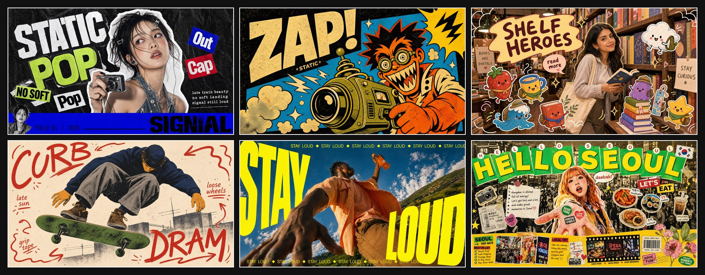
</p>

<p align="center">
  <a href="README.md">English</a> |
  <a href="README.zh-CN.md">简体中文</a> |
  <a href="README.zh-TW.md">繁體中文</a> |
  日本語 |
  <a href="README.ko.md">한국어</a> |
  <a href="README.id.md">Bahasa Indonesia</a>
</p>

<p align="center">
  
  
  
  
</p>

<p align="center">
  <strong>JSON をコピーすれば、ひとつのスタイルが手に入ります。</strong> <code>style.json</code> を ChatGPT、Claude、Nano Banana Pro、または任意の LLM 画像生成ワークフローに入れ、変数だけを差し替えれば、視覚システムを保ったまま使えます。
</p>

<p align="center">
  AI 画像生成向けの、すぐ使えるビジュアルプロンプトスタイル集です。各スタイルは再利用しやすい <code>style.json</code> と、横長・縦長のプレビュー画像で整理されています。
</p>

<p align="center">
  Curated by <a href="https://x.com/VigoCreativeAI">@VigoCreativeAI</a>, structured with assistance from OpenAI Codex. 新しいスタイルを追うには、このリポジトリを Star してください。
</p>

<p align="center">
  🖼️ <strong><a href="https://vigozhao.github.io/AI-Visual-Prompt-Cookbook/site/">オンラインギャラリー</a></strong> · または下の <a href="#all-styles">All Styles ギャラリー</a> / <a href="docs/CATALOG.md">完全なカタログ</a> をご覧ください。
</p>

## クイックリンク

| カテゴリ | 向いている用途 | まず見るスタイル |
| --- | --- | --- |
| 写真 + ドゥードル | SNS風スナップ、ライフスタイル写真、遊びのあるステッカー表現 | [Playful Mascot Doodle Snapshot](#playful-mascot-doodle-snapshot-style), [Subway Doodle Photo Hybrid](#subway-doodle-photo-hybrid-style) |
| Zine + コラージュ | ファッションポスター、音楽ビジュアル、情報量の多いエディトリアル | [K-pop Apocalypse Ransom Zine](#k-pop-apocalypse-ransom-zine-style), [Y2K Grunge Hip-hop Cutout Poster](#y2k-grunge-hiphop-cutout-poster-style) |
| タイポグラフィポスター | 大きな見出し、強いキャンペーングラフィック、視覚インパクト | [Impact Burst Halftone Comic Poster](#impact-burst-halftone-comic-poster-style), [Neon Kinetic Typographic Poster](#neon-kinetic-typographic-poster-style) |
| 旅 + 都市 | 目的地ポスター、ストリートシーン、都市のビジュアル日記 | [Clean Triptych Travel Vlog Thumbnail](#clean-triptych-travel-vlog-thumbnail-style), [Tokyo Kawaii Travel Collage Poster](#tokyo-kawaii-travel-collage-poster-style) |
| エディトリアル + ミニマル | すっきりした構図、構造的なレイアウト、落ち着いたアートディレクション | [Tri Color Hardcut Portrait Poster](#tri-color-hardcut-portrait-poster-style), [Soft Analog Future Editorial Poster](#soft-analog-future-editorial-poster-style) |

## このプロジェクトについて

多くの AI 画像プロンプトは一回限りの文章になりがちで、再利用や比較、安定した改善が難しいものです。このリポジトリでは、各ビジュアルスタイルを構造化された `style.json` に分解しています。テーマを変えても、同じスタイル構造を保ったまま生成を続けられます。

## 使い方

1. [注目スタイル](#注目スタイル)、[クイックリンク](#クイックリンク)、または [All Styles](#all-styles) を見る。
2. 気になるスタイルのフォルダを開き、`style.json` をコピーする。
3. JSON 全体を ChatGPT Images 2、Nano Banana Pro、または他のエンドツーエンドのマルチモーダル画像モデルに貼り付ける。
4. `environment_variables` で宣言された変数に自分の値を指定するか、`examples[*].values` のケースを編集する。
5. 最終画像を生成する。

完全な入力から出力までの流れは、下の [Complete Example](#complete-example) を参照してください。

### Recommended Image Models

このワークフローは、長い構造化 JSON プロンプトを読み取り、最終画像を一段階で生成できるエンドツーエンドのマルチモーダル画像モデルで最もよく機能します。

- ChatGPT Images 2 (OpenAI, gpt-image-2) — テキスト描画が強く、2K/4K 出力に対応し、生成前の推論が可能
- Nano Banana Pro (Google, Gemini 3 Pro Image) — 4K 出力、多言語テキスト精度、強い被写体一貫性

長い JSON プロンプトを受け取れる他のマルチモーダル LLM でも動作する場合がありますが、主な推奨対象ではありません。

## Complete Example

### 入力 → 出力ウォークスルー

この例では [Mono Noir Type Portrait Poster Style](styles/mono-noir-type-portrait-poster-style/) を使います。

#### Step 1 — The Style

<details>
<summary>prompt_template excerpt</summary>

```text
Create a {ASPECT_RATIO} monochrome editorial poster in the Mono Noir Type Portrait Poster Style. Style fidelity lock: {STYLE_FIDELITY_ANCHORS}. Source content to avoid: {SOURCE_CONTENT_TO_AVOID}. Scene: {SUBJECT} {SUBJECT_ACTION} with {PRODUCT_OR_PROP} in {LOCATION}. Background elements: {BACKGROUND_ELEMENTS}. Wardrobe and styling: {WARDROBE_STYLE}. Composition: one large high-contrast black-and-white photographic subject, close crop, deep charcoal background, sparse negative space, shallow depth of field, serious noir editorial mood. If the aspect ratio is 16:9, make a landscape poster with the subject weighted to the right side and the headline block on the left. If the aspect ratio is 9:16, make a vertical poster with the headline stacked in the upper-left or middle-left field and the subject cropped large on the right or lower-right. Typography: render the exact readable lowercase headline text "{MAIN_TEXT}" as three short left-aligned lines...
```

</details>

#### Step 2 — Your Variables

```text
SUBJECT = a tired architect with silver hair
SUBJECT_ACTION = studying a folded blueprint in a late-night pause
PRODUCT_OR_PROP = a rolled plan tube and a pencil held low
LOCATION = a dim concrete studio after midnight
BACKGROUND_ELEMENTS = soft charcoal wall gradient, blurred drafting table edge, deep empty space
MAIN_TEXT = focus / outlasts / noise.
SECONDARY_TEXT = studio log 02:14
ACCENT_SYMBOL = a tiny white plus
WARDROBE_STYLE = dark work jacket over a plain black shirt
ASPECT_RATIO = 16:9
```

#### Step 3 — The Final Prompt

```text
Create a 16:9 monochrome editorial poster in the Mono Noir Type Portrait Poster Style. Style fidelity lock: black-and-white photographic portrait, deep charcoal background, giant lowercase left-aligned headline, first word in a white label, remaining words in white, high contrast, sparse negative space, close crop. Source content to avoid: no young woman with blunt bangs, no freckles close-up, no discipline beats procrastination text, no copied face or exact source crop. Scene: a tired architect with silver hair studying a folded blueprint in a late-night pause with a rolled plan tube and a pencil held low in a dim concrete studio after midnight. Background elements: soft charcoal wall gradient, blurred drafting table edge, deep empty space. Wardrobe and styling: dark work jacket over a plain black shirt. Composition: one large high-contrast black-and-white photographic subject, close crop, deep charcoal background, sparse negative space, shallow depth of field, serious noir editorial mood. If the aspect ratio is 16:9, make a landscape poster with the subject weighted to the right side and the headline block on the left. If the aspect ratio is 9:16, make a vertical poster with the headline stacked in the upper-left or middle-left field and the subject cropped large on the right or lower-right. Typography: render the exact readable lowercase headline text "focus
outlasts
noise." as three short left-aligned lines with tight leading; put the first headline word as black type inside a crisp white rectangular label, then set the remaining lines in heavy white type directly on the dark background. Add "studio log 02:14" only as tiny unobtrusive white microcopy if it fits. Use a tiny white plus only as a minimal typographic mark. Keep type sharp, flat, square-cornered, and massive. Photo treatment: realistic black-and-white studio photography, strong shadow falloff, visible facial or fabric texture, subtle grain, no color, no illustration, no collage, no extra panels, no logos, no watermark.
```

#### Step 4 — The Result

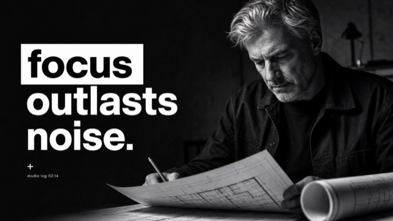

## Copy Prompt Library

まず短い入口から試したい場合は、自動生成された [Copy Prompt Library](docs/copy-prompts/README.md) を開いてください。各スタイルに、そのままコピーできる簡易プロンプトがあります。完全な再利用用スタイルシステムは、引き続き各 `style.json` にあります。

## 注目スタイル

まずこの 6 つを見ると、ライブラリの幅がわかります。すべてのスタイルは 1 つの JSON と 2 枚のプレビュー画像で構成されています。110 種すべては下の [All Styles](#all-styles) ギャラリーで確認できます。

<!-- HTML table used for rich image+link cells -->

<table>
<tr>
<td width="33%" valign="top">
<a href="styles/cobalt-torn-didone-portrait-editorial-style">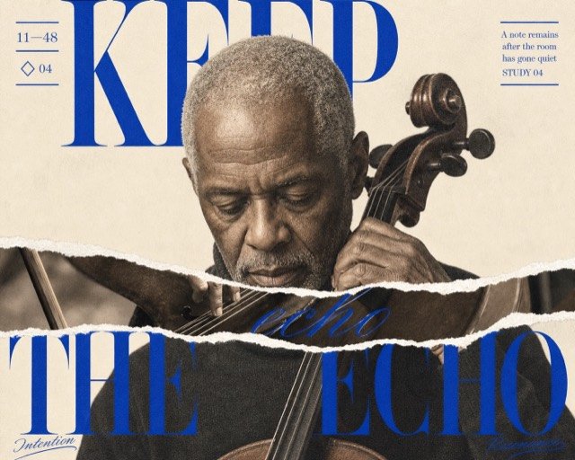</a>
<h3>Cobalt Torn Didone Portrait Editorial</h3>
<p>A sparse fashion-editorial poster system built from a warm paper field, one centered halftone portrait or sculptural subject, monumental cobalt Didone typography, an irregular horizontal torn-paper reveal, and restrained calligraphic and catalog-like corner notes.</p>
<p><a href="styles/cobalt-torn-didone-portrait-editorial-style/style.json"><strong>style.json を開く</strong></a> · <a href="docs/copy-prompts/cobalt-torn-didone-portrait-editorial-style.md">プロンプトをコピー</a> · <a href="styles/cobalt-torn-didone-portrait-editorial-style">フォルダ</a></p>
</td>
<td width="33%" valign="top">
<a href="styles/foreshortened-gradient-impact-ad-style">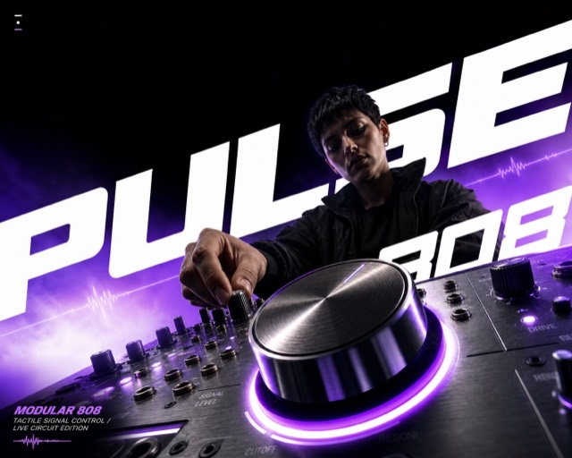</a>
<h3>Foreshortened Gradient Impact Ad Style</h3>
<p>A premium kinetic advertising system built on a worm's-eye ultra-wide photograph, one monumental foreground product, a dynamic figure receding behind it, giant edge-cropped diagonal neo-grotesk typography, and a near-black-to-luminous-color gradient field.</p>
<p><a href="styles/foreshortened-gradient-impact-ad-style/style.json"><strong>style.json を開く</strong></a> · <a href="docs/copy-prompts/foreshortened-gradient-impact-ad-style.md">プロンプトをコピー</a> · <a href="styles/foreshortened-gradient-impact-ad-style">フォルダ</a></p>
</td>
<td width="33%" valign="top">
<a href="styles/vermilion-photocopy-tension-editorial">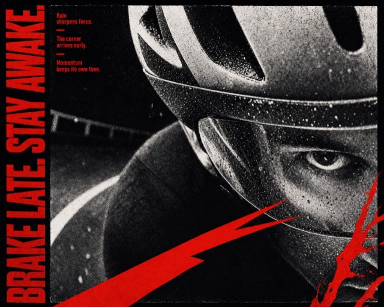</a>
<h3>Vermilion Photocopy Tension Editorial</h3>
<p>A confrontational editorial poster system built from one monumentally cropped black-and-white photograph, near-binary photocopy contrast, dense analog grain, an oversized vertical condensed headline, compact annotation blocks, and a single vermilion ink layer that cuts across the image as urgent shards and edge-born organic forms.</p>
<p><a href="styles/vermilion-photocopy-tension-editorial/style.json"><strong>style.json を開く</strong></a> · <a href="docs/copy-prompts/vermilion-photocopy-tension-editorial.md">プロンプトをコピー</a> · <a href="styles/vermilion-photocopy-tension-editorial">フォルダ</a></p>
</td>
</tr>
<tr>
<td width="33%" valign="top">
<a href="styles/cobalt-xerox-script-editorial-poster-style">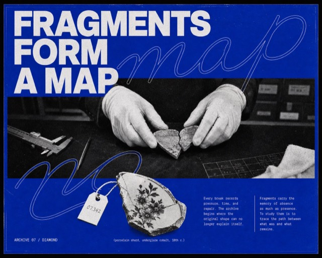</a>
<h3>Cobalt Xerox Script Editorial Poster</h3>
<p>A compressed, confrontational cobalt editorial poster system in which fragmented grotesk headlines, two enormous repeated outline-script words, an ambiguous macro halftone photograph, a dark flat Xerox cutout, and dense microcopy collide across nearly the entire page.</p>
<p><a href="styles/cobalt-xerox-script-editorial-poster-style/style.json"><strong>style.json を開く</strong></a> · <a href="docs/copy-prompts/cobalt-xerox-script-editorial-poster-style.md">プロンプトをコピー</a> · <a href="styles/cobalt-xerox-script-editorial-poster-style">フォルダ</a></p>
</td>
<td width="33%" valign="top">
<a href="styles/coral-window-megatype-motion-poster-style">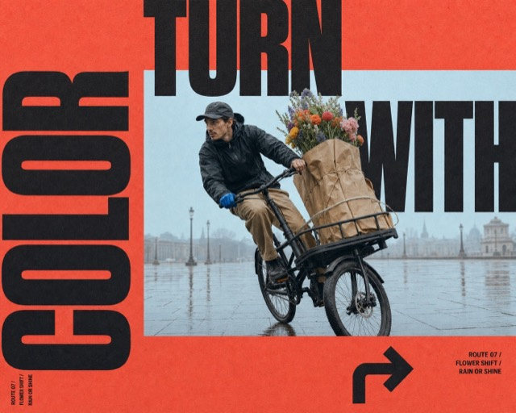</a>
<h3>Coral Window Megatype Motion Poster</h3>
<p>A tactile editorial motion-poster system built from a coral-red paper field, one cool pale-blue photographic window, colossal black condensed typography that crosses the image boundary, a single isolated action subject, sparse micro-editorial labels, and a bold geometric direction symbol.</p>
<p><a href="styles/coral-window-megatype-motion-poster-style/style.json"><strong>style.json を開く</strong></a> · <a href="docs/copy-prompts/coral-window-megatype-motion-poster-style.md">プロンプトをコピー</a> · <a href="styles/coral-window-megatype-motion-poster-style">フォルダ</a></p>
</td>
<td width="33%" valign="top">
<a href="styles/cobalt-megatype-roadside-travel-editorial-style">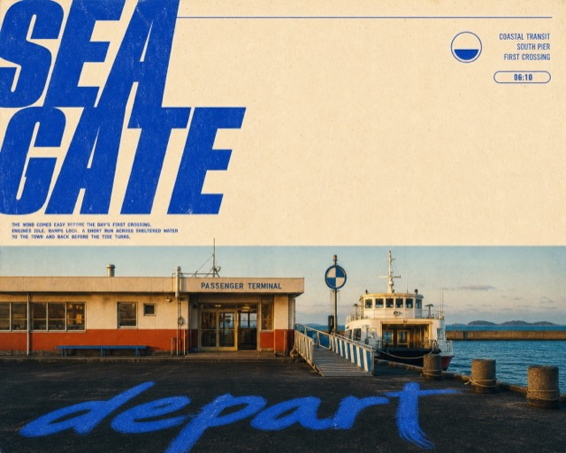</a>
<h3>Cobalt Megatype Roadside Travel Editorial</h3>
<p>A nostalgic roadside-travel editorial poster system that combines cropped cobalt megatype, sparse locator graphics, warm straight-on architectural photography, cream uncoated paper, and one loose hand-painted word across the dark foreground.</p>
<p><a href="styles/cobalt-megatype-roadside-travel-editorial-style/style.json"><strong>style.json を開く</strong></a> · <a href="docs/copy-prompts/cobalt-megatype-roadside-travel-editorial-style.md">プロンプトをコピー</a> · <a href="styles/cobalt-megatype-roadside-travel-editorial-style">フォルダ</a></p>
</td>
</tr>
</table>

## パッケージ構成

```text
styles/<style-slug>/
  style.json          # 機械可読のプロンプトスタイルテンプレート
  preview-16x9.jpg    # 横長プレビュー
  preview-9x16.jpg    # 縦長プレビュー
```

## style.json v2.1

各 `style.json` は自己完結しています。ファイル全体を LLM にコピーし、`environment_variables` で宣言された変数に値を指定するか、`examples[*].values` のケースを編集して使います。

- `prompt_template` は `{VARIABLE}` プレースホルダーを持つ再利用可能なスタイルプロンプトです。
- `environment_variables` はテンプレートで使えるすべての変数を宣言します。
- `examples` は編集しやすいケース集で、各ケースは `case_name` と `values` だけを持ちます。
- `style_fidelity_anchors` と `source_content_to_avoid` は、保つべきスタイル要素とコピーしてはいけない元内容を分けます。
- `negative_prompt` はウォーターマーク、ロゴ、元画像の直接再現、スタイル外れを避けるために使います。

`prompt_9x16`、`prompt_16x9`、`full_prompt` のようなレンダリング済みプロンプトは保存しません。生成時に `prompt_template` と選んだ値から作るため、JSON は軽く、古くなりにくくなります。

検証コマンド：

```bash
python3 scripts/validate-style-json.py .
```

## All Styles

下で全 110 スタイルを閲覧できます。

上の注目スタイルを含む完全なライブラリです。各スタイルの詳細説明と全ファイルリンクは [docs/CATALOG.md](docs/CATALOG.md) を参照してください。

<!-- HTML table used for rich image+link cells -->

<table>
<tr>
<td width="33%" valign="top">
<a id="cobalt-torn-didone-portrait-editorial-style"></a>
<a href="styles/cobalt-torn-didone-portrait-editorial-style"></a>
<p><strong><a href="styles/cobalt-torn-didone-portrait-editorial-style">Cobalt Torn Didone Portrait Editorial</a></strong><br>
<em>Sparse fashion-editorial posters with a warm paper field, a centered halftone portrait, monumental cobalt Didone type, and an irregular torn-paper reveal.</em><br>
<a href="styles/cobalt-torn-didone-portrait-editorial-style/style.json">style.json</a> · <a href="docs/copy-prompts/cobalt-torn-didone-portrait-editorial-style.md">prompt</a> · <a href="styles/cobalt-torn-didone-portrait-editorial-style/preview-9x16.jpg">9:16</a></p>
</td>
<td width="33%" valign="top">
<a id="foreshortened-gradient-impact-ad-style"></a>
<a href="styles/foreshortened-gradient-impact-ad-style"></a>
<p><strong><a href="styles/foreshortened-gradient-impact-ad-style">Foreshortened Gradient Impact Ad Style</a></strong><br>
<em>Kinetic worm's-eye ad posters with a monumental foreground product, a receding figure, giant edge-cropped diagonal neo-grotesk type, and a dark-to-luminous gradient field.</em><br>
<a href="styles/foreshortened-gradient-impact-ad-style/style.json">style.json</a> · <a href="docs/copy-prompts/foreshortened-gradient-impact-ad-style.md">prompt</a> · <a href="styles/foreshortened-gradient-impact-ad-style/preview-9x16.jpg">9:16</a></p>
</td>
<td width="33%" valign="top">
<a id="vermilion-photocopy-tension-editorial"></a>
<a href="styles/vermilion-photocopy-tension-editorial"></a>
<p><strong><a href="styles/vermilion-photocopy-tension-editorial">Vermilion Photocopy Tension Editorial</a></strong><br>
<em>Confrontational posters built from one monumentally cropped near-binary photocopy photograph, a vertical condensed headline rail, compact annotations, and a single vermilion ink layer of sharp shards and edge-born organic forms.</em><br>
<a href="styles/vermilion-photocopy-tension-editorial/style.json">style.json</a> · <a href="docs/copy-prompts/vermilion-photocopy-tension-editorial.md">prompt</a> · <a href="styles/vermilion-photocopy-tension-editorial/preview-9x16.jpg">9:16</a></p>
</td>
</tr>
<tr>
<td width="33%" valign="top">
<a id="cobalt-xerox-script-editorial-poster-style"></a>
<a href="styles/cobalt-xerox-script-editorial-poster-style"></a>
<p><strong><a href="styles/cobalt-xerox-script-editorial-poster-style">Cobalt Xerox Script Editorial Poster</a></strong><br>
<em>Compressed cobalt posters where fragmented grotesk headlines, two enormous repeated outline-script words, an ambiguous macro halftone photo, a dark flat Xerox cutout, and dense microcopy collide edge to edge.</em><br>
<a href="styles/cobalt-xerox-script-editorial-poster-style/style.json">style.json</a> · <a href="docs/copy-prompts/cobalt-xerox-script-editorial-poster-style.md">prompt</a> · <a href="styles/cobalt-xerox-script-editorial-poster-style/preview-9x16.jpg">9:16</a></p>
</td>
<td width="33%" valign="top">
<a id="coral-window-megatype-motion-poster-style"></a>
<a href="styles/coral-window-megatype-motion-poster-style"></a>
<p><strong><a href="styles/coral-window-megatype-motion-poster-style">Coral Window Megatype Motion Poster</a></strong><br>
<em>Tactile motion posters built from a coral-red paper field, one pale-blue photographic window, colossal black condensed type crossing the image boundary, a single action subject, sparse micro labels, and one bold direction symbol.</em><br>
<a href="styles/coral-window-megatype-motion-poster-style/style.json">style.json</a> · <a href="docs/copy-prompts/coral-window-megatype-motion-poster-style.md">prompt</a> · <a href="styles/coral-window-megatype-motion-poster-style/preview-9x16.jpg">9:16</a></p>
</td>
<td width="33%" valign="top">
<a id="cobalt-megatype-roadside-travel-editorial-style"></a>
<a href="styles/cobalt-megatype-roadside-travel-editorial-style"></a>
<p><strong><a href="styles/cobalt-megatype-roadside-travel-editorial-style">Cobalt Megatype Roadside Travel Editorial</a></strong><br>
<em>Nostalgic roadside-travel posters combining cropped cobalt megatype, sparse locator graphics, warm straight-on architectural photography, cream uncoated paper, and one loose hand-painted word across the dark foreground.</em><br>
<a href="styles/cobalt-megatype-roadside-travel-editorial-style/style.json">style.json</a> · <a href="docs/copy-prompts/cobalt-megatype-roadside-travel-editorial-style.md">prompt</a> · <a href="styles/cobalt-megatype-roadside-travel-editorial-style/preview-9x16.jpg">9:16</a></p>
</td>
</tr>
<tr>
<td width="33%" valign="top">
<a id="surreal-megatype-dossier-collage"></a>
<a href="styles/surreal-megatype-dossier-collage">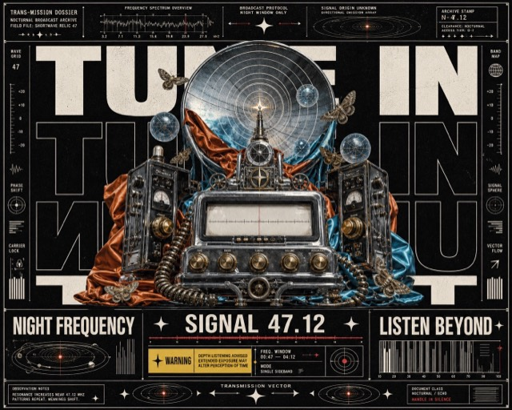</a>
<p><strong><a href="styles/surreal-megatype-dossier-collage">Surreal Megatype Dossier Collage</a></strong><br>
<em>Dense neo-editorial posters layering monumental white typography behind a centered surreal photographic cutout, framed by technical microcopy, ruled panels, celestial symbols, and coarse vintage grain on black.</em><br>
<a href="styles/surreal-megatype-dossier-collage/style.json">style.json</a> · <a href="docs/copy-prompts/surreal-megatype-dossier-collage.md">prompt</a> · <a href="styles/surreal-megatype-dossier-collage/preview-9x16.jpg">9:16</a></p>
</td>
<td width="33%" valign="top">
<a id="urban-photo-ink-beast-collage-style"></a>
<a href="styles/urban-photo-ink-beast-collage-style">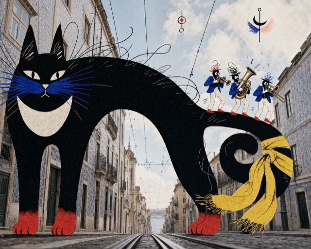</a>
<p><strong><a href="styles/urban-photo-ink-beast-collage-style">Urban Photo Ink Beast Collage Style</a></strong><br>
<em>Surreal collage posters layering monumental flat-ink beasts and tiny figures over faded archival city photography, with cut-paper masses, hand-drawn contours, and sparse bright accents.</em><br>
<a href="styles/urban-photo-ink-beast-collage-style/style.json">style.json</a> · <a href="docs/copy-prompts/urban-photo-ink-beast-collage-style.md">prompt</a> · <a href="styles/urban-photo-ink-beast-collage-style/preview-9x16.jpg">9:16</a></p>
</td>
<td width="33%" valign="top">
<a id="prismatic-glass-animal-weekend-editorial"></a>
<a href="styles/prismatic-glass-animal-weekend-editorial">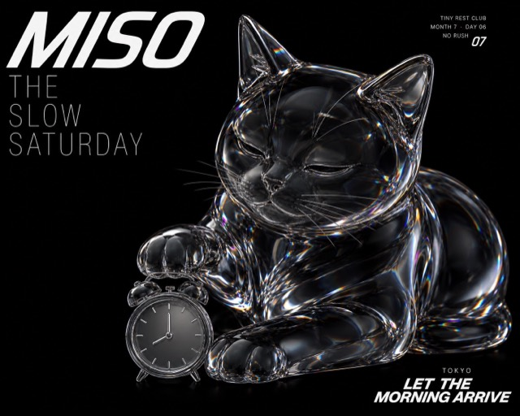</a>
<p><strong><a href="styles/prismatic-glass-animal-weekend-editorial">Prismatic Glass Animal Weekend Editorial</a></strong><br>
<em>Sparse black posters built around one oversized translucent glass animal with smoky depth, liquid-chrome edges, rainbow refractions, and futuristic micro-editorial weekend copy.</em><br>
<a href="styles/prismatic-glass-animal-weekend-editorial/style.json">style.json</a> · <a href="docs/copy-prompts/prismatic-glass-animal-weekend-editorial.md">prompt</a> · <a href="styles/prismatic-glass-animal-weekend-editorial/preview-9x16.jpg">9:16</a></p>
</td>
</tr>
<tr>
<td width="33%" valign="top">
<a id="sun-faded-scenic-editorial-poster"></a>
<a href="styles/sun-faded-scenic-editorial-poster">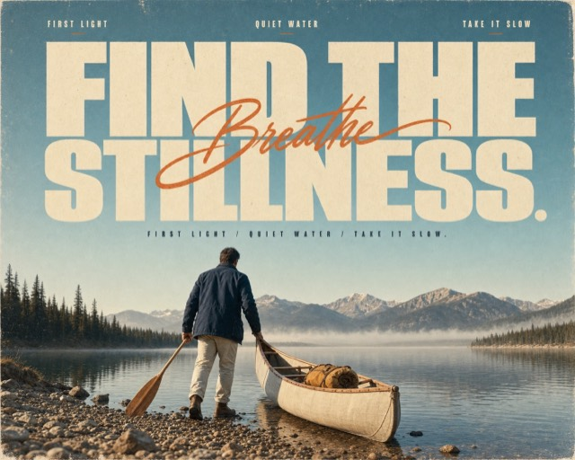</a>
<p><strong><a href="styles/sun-faded-scenic-editorial-poster">Sun-Faded Scenic Editorial Poster</a></strong><br>
<em>Nostalgic scenic travel posters with enormous warm-ivory condensed headlines, a flowing tangerine script accent, tiny magazine microcopy, and sun-faded analog film grain.</em><br>
<a href="styles/sun-faded-scenic-editorial-poster/style.json">style.json</a> · <a href="docs/copy-prompts/sun-faded-scenic-editorial-poster.md">prompt</a> · <a href="styles/sun-faded-scenic-editorial-poster/preview-9x16.jpg">9:16</a></p>
</td>
<td width="33%" valign="top">
<a id="cyan-grain-macro-megatype-poster-style"></a>
<a href="styles/cyan-grain-macro-megatype-poster-style">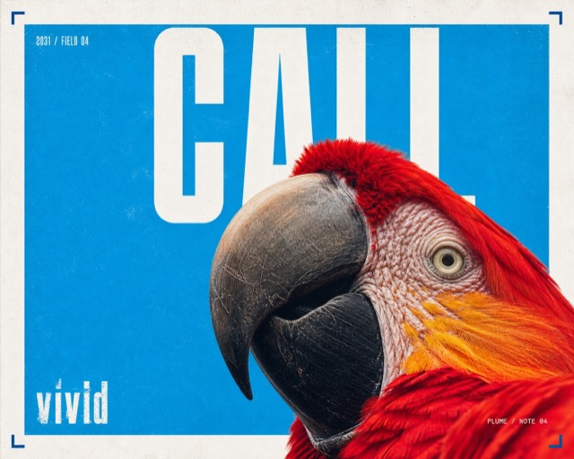</a>
<p><strong><a href="styles/cyan-grain-macro-megatype-poster-style">Cyan Grain Macro Megatype Poster</a></strong><br>
<em>Sparse experimental posters built from one radically enlarged macro photograph, a saturated cyan field, monumental interlocking white letterforms, and tactile analog print grain.</em><br>
<a href="styles/cyan-grain-macro-megatype-poster-style/style.json">style.json</a> · <a href="docs/copy-prompts/cyan-grain-macro-megatype-poster-style.md">prompt</a> · <a href="styles/cyan-grain-macro-megatype-poster-style/preview-9x16.jpg">9:16</a></p>
</td>
<td width="33%" valign="top">
<a id="retro-future-chrome-portrait-dossier"></a>
<a href="styles/retro-future-chrome-portrait-dossier">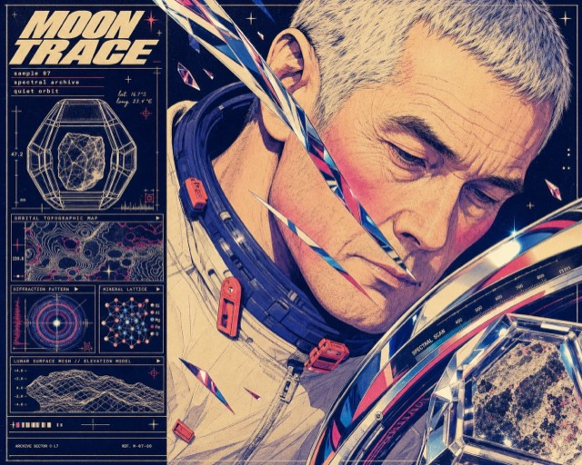</a>
<p><strong><a href="styles/retro-future-chrome-portrait-dossier">Retro Future Chrome Portrait Dossier</a></strong><br>
<em>Retro-futurist editorial portrait posters with a technical dossier sidebar, an edge-cropped posterized face, liquid-chrome interruptions, optical diagrams, and coarse halftone print grain.</em><br>
<a href="styles/retro-future-chrome-portrait-dossier/style.json">style.json</a> · <a href="docs/copy-prompts/retro-future-chrome-portrait-dossier.md">prompt</a> · <a href="styles/retro-future-chrome-portrait-dossier/preview-9x16.jpg">9:16</a></p>
</td>
</tr>
<tr>
<td width="33%" valign="top">
<a id="pink-anime-motorcycle-spec-poster-style"></a>
<a href="styles/pink-anime-motorcycle-spec-poster-style">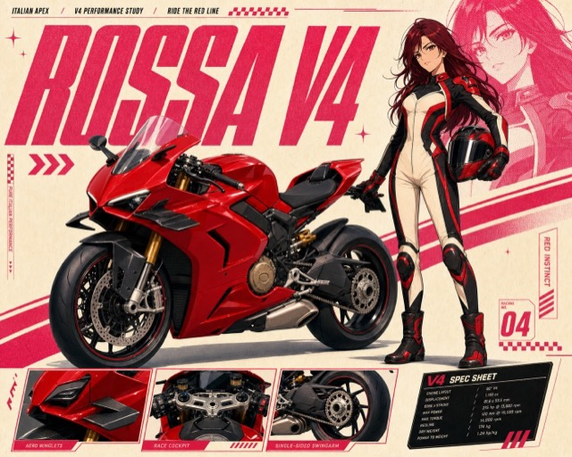</a>
<p><strong><a href="styles/pink-anime-motorcycle-spec-poster-style">Pink Anime Motorcycle Spec Poster Style</a></strong><br>
<em>Anime motorsport dossier posters pairing an original rider with a hero motorcycle, oversized italic model codes, a cream-and-magenta editorial grid, and a compact spec card.</em><br>
<a href="styles/pink-anime-motorcycle-spec-poster-style/style.json">style.json</a> · <a href="docs/copy-prompts/pink-anime-motorcycle-spec-poster-style.md">prompt</a> · <a href="styles/pink-anime-motorcycle-spec-poster-style/preview-9x16.jpg">9:16</a></p>
</td>
<td width="33%" valign="top">
<a id="xerox-neon-editorial-collage-style"></a>
<a href="styles/xerox-neon-editorial-collage-style">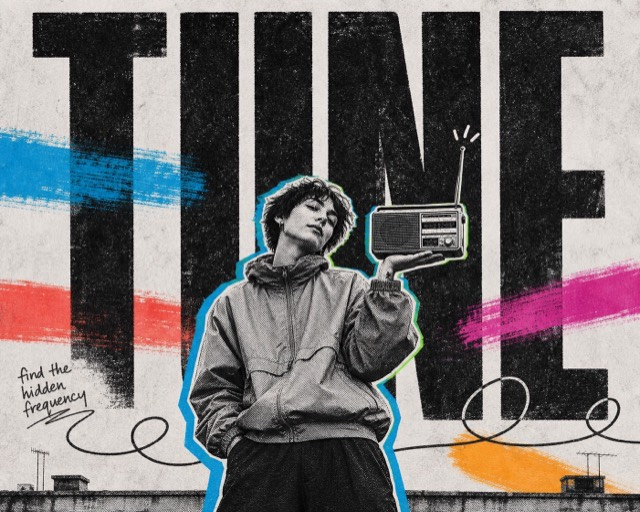</a>
<p><strong><a href="styles/xerox-neon-editorial-collage-style">Xerox Neon Editorial Collage</a></strong><br>
<em>Photocopied editorial collage posters with a distressed black headline, a halftone photo cutout, cyan-green misregistration, fluorescent paint swashes, and marker scribbles.</em><br>
<a href="styles/xerox-neon-editorial-collage-style/style.json">style.json</a> · <a href="docs/copy-prompts/xerox-neon-editorial-collage-style.md">prompt</a> · <a href="styles/xerox-neon-editorial-collage-style/preview-9x16.jpg">9:16</a></p>
</td>
<td width="33%" valign="top">
<a id="crimson-ink-manga-dossier"></a>
<a href="styles/crimson-ink-manga-dossier">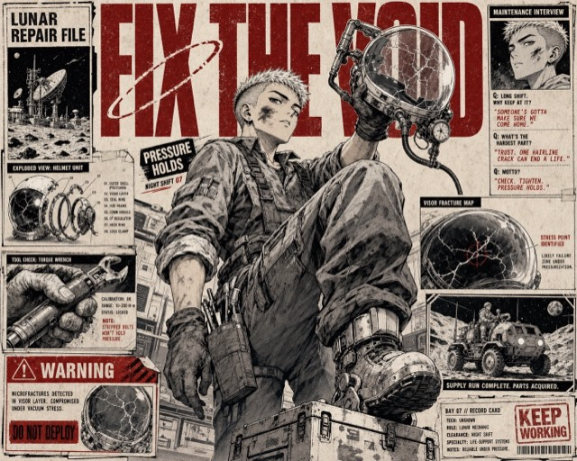</a>
<p><strong><a href="styles/crimson-ink-manga-dossier">Crimson Ink Manga Dossier</a></strong><br>
<em>High-density manga dossier posters with a foreshortened hero, distressed condensed headlines, newspaper sidebars, and a crimson-black-paper palette.</em><br>
<a href="styles/crimson-ink-manga-dossier/style.json">style.json</a> · <a href="docs/copy-prompts/crimson-ink-manga-dossier.md">prompt</a> · <a href="styles/crimson-ink-manga-dossier/preview-9x16.jpg">9:16</a></p>
</td>
</tr>
<tr>
<td width="33%" valign="top">
<a id="lime-loop-megatype-action-poster-style"></a>
<a href="styles/lime-loop-megatype-action-poster-style">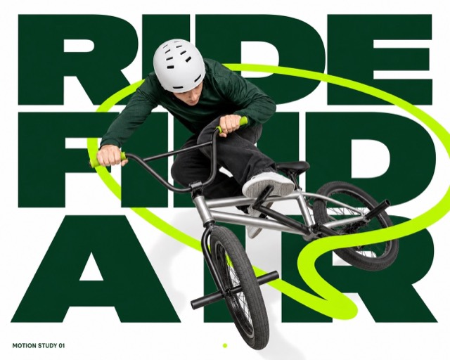</a>
<p><strong><a href="styles/lime-loop-megatype-action-poster-style">Lime Loop Megatype Action Poster</a></strong><br>
<em>Studio action posters with an overhead subject, stacked dark-green megatype, a fluorescent-lime motion loop, and clean white space.</em><br>
<a href="styles/lime-loop-megatype-action-poster-style/style.json">style.json</a> · <a href="docs/copy-prompts/lime-loop-megatype-action-poster-style.md">prompt</a> · <a href="styles/lime-loop-megatype-action-poster-style/preview-9x16.jpg">9:16</a></p>
</td>
<td width="33%" valign="top">
<a id="yellow-graffiti-fisheye-manga-street-poster-style"></a>
<a href="styles/yellow-graffiti-fisheye-manga-street-poster-style">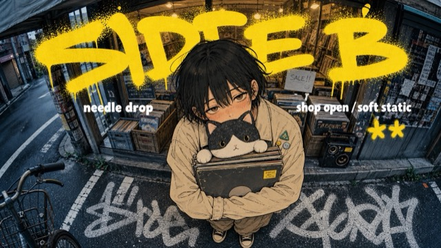</a>
<p><strong><a href="styles/yellow-graffiti-fisheye-manga-street-poster-style">Yellow Graffiti Fisheye Manga Street Poster Style</a></strong><br>
<em>Fisheye street posters mixing manga ink cutouts, sprayed yellow graffiti type, pavement tag texture, and anxious character energy.</em><br>
<a href="styles/yellow-graffiti-fisheye-manga-street-poster-style/style.json">style.json</a> · <a href="docs/copy-prompts/yellow-graffiti-fisheye-manga-street-poster-style.md">prompt</a> · <a href="styles/yellow-graffiti-fisheye-manga-street-poster-style/preview-9x16.jpg">9:16</a></p>
</td>
<td width="33%" valign="top">
<a id="red-yellow-product-trophy-collage-style"></a>
<a href="styles/red-yellow-product-trophy-collage-style">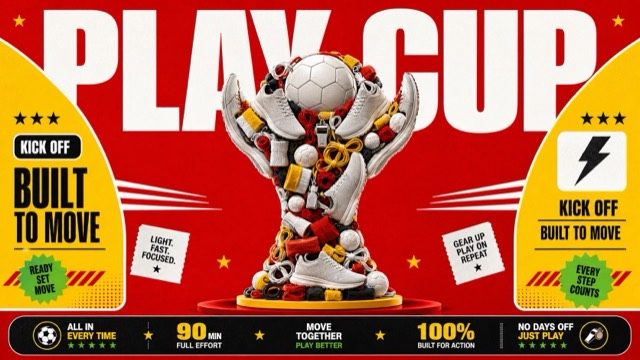</a>
<p><strong><a href="styles/red-yellow-product-trophy-collage-style">Red Yellow Product Trophy Collage Style</a></strong><br>
<em>Fast-food billboard collages with red-and-yellow blocks, glossy cutout products, and a trophy silhouette built from product objects.</em><br>
<a href="styles/red-yellow-product-trophy-collage-style/style.json">style.json</a> · <a href="docs/copy-prompts/red-yellow-product-trophy-collage-style.md">prompt</a> · <a href="styles/red-yellow-product-trophy-collage-style/preview-9x16.jpg">9:16</a></p>
</td>
</tr>
<tr>
<td width="33%" valign="top">
<a id="manga-dossier-blueprint-poster"></a>
<a href="styles/manga-dossier-blueprint-poster">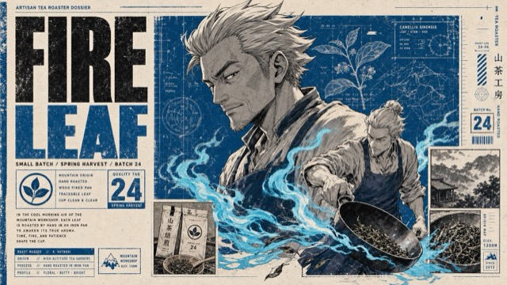</a>
<p><strong><a href="styles/manga-dossier-blueprint-poster">Manga Dossier Blueprint Poster</a></strong><br>
<em>Manga dossier posters with cream margins, grayscale ink portraits, cobalt-blue technical panels, and editorial annotation rails.</em><br>
<a href="styles/manga-dossier-blueprint-poster/style.json">style.json</a> · <a href="docs/copy-prompts/manga-dossier-blueprint-poster.md">prompt</a> · <a href="styles/manga-dossier-blueprint-poster/preview-9x16.jpg">9:16</a></p>
</td>
<td width="33%" valign="top">
<a id="red-black-manga-tabloid-poster-style"></a>
<a href="styles/red-black-manga-tabloid-poster-style">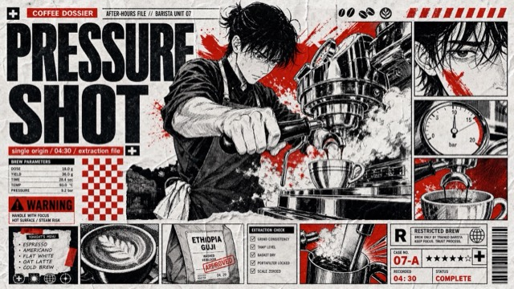</a>
<p><strong><a href="styles/red-black-manga-tabloid-poster-style">Red Black Manga Tabloid Poster Style</a></strong><br>
<em>Dense red-black manga tabloids with cropped ink characters, editorial metadata blocks, halftone shading, and photocopy paper texture.</em><br>
<a href="styles/red-black-manga-tabloid-poster-style/style.json">style.json</a> · <a href="docs/copy-prompts/red-black-manga-tabloid-poster-style.md">prompt</a> · <a href="styles/red-black-manga-tabloid-poster-style/preview-9x16.jpg">9:16</a></p>
</td>
<td width="33%" valign="top">
<a id="ice-cyan-megatype-action-poster-style"></a>
<a href="styles/ice-cyan-megatype-action-poster-style">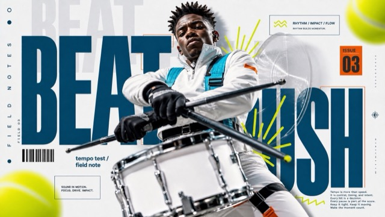</a>
<p><strong><a href="styles/ice-cyan-megatype-action-poster-style">Ice Cyan Megatype Action Poster Style</a></strong><br>
<em>Ice-white action posters with oversized cyan megatype, ghost text layers, a cutout action photo, and chartreuse motion blur.</em><br>
<a href="styles/ice-cyan-megatype-action-poster-style/style.json">style.json</a> · <a href="docs/copy-prompts/ice-cyan-megatype-action-poster-style.md">prompt</a> · <a href="styles/ice-cyan-megatype-action-poster-style/preview-9x16.jpg">9:16</a></p>
</td>
</tr>
<tr>
<td width="33%" valign="top">
<a id="scarlet-megatype-action-collage-style"></a>
<a href="styles/scarlet-megatype-action-collage-style">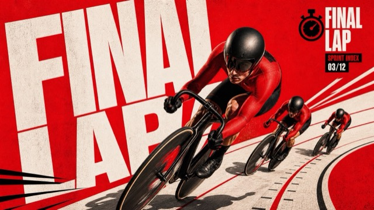</a>
<p><strong><a href="styles/scarlet-megatype-action-collage-style">Scarlet Megatype Action Collage Style</a></strong><br>
<em>Scarlet action key-art with diagonal block megatype, layered cutout subjects, hard graphic shadows, and controlled print grain.</em><br>
<a href="styles/scarlet-megatype-action-collage-style/style.json">style.json</a> · <a href="docs/copy-prompts/scarlet-megatype-action-collage-style.md">prompt</a> · <a href="styles/scarlet-megatype-action-collage-style/preview-9x16.jpg">9:16</a></p>
</td>
<td width="33%" valign="top">
<a id="jagged-red-street-photo-event-poster-style"></a>
<a href="styles/jagged-red-street-photo-event-poster-style">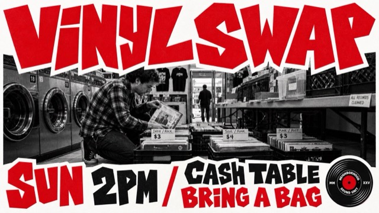</a>
<p><strong><a href="styles/jagged-red-street-photo-event-poster-style">Jagged Red Street Photo Event Poster Style</a></strong><br>
<em>High-impact street posters with black-and-white photo cores, jagged red-and-black display type, thick white gutters, and three-color print energy.</em><br>
<a href="styles/jagged-red-street-photo-event-poster-style/style.json">style.json</a> · <a href="docs/copy-prompts/jagged-red-street-photo-event-poster-style.md">prompt</a> · <a href="styles/jagged-red-street-photo-event-poster-style/preview-9x16.jpg">9:16</a></p>
</td>
<td width="33%" valign="top">
<a id="neon-stadium-3d-hero-type-poster-style"></a>
<a href="styles/neon-stadium-3d-hero-type-poster-style">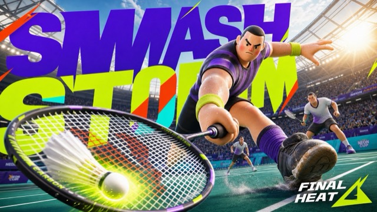</a>
<p><strong><a href="styles/neon-stadium-3d-hero-type-poster-style">Neon Stadium 3D Hero Type Poster Style</a></strong><br>
<em>Hyper-saturated 3D stadium posters with toy-like heroes, cropped condensed type, lime-and-purple fields, and motion-blurred debris.</em><br>
<a href="styles/neon-stadium-3d-hero-type-poster-style/style.json">style.json</a> · <a href="docs/copy-prompts/neon-stadium-3d-hero-type-poster-style.md">prompt</a> · <a href="styles/neon-stadium-3d-hero-type-poster-style/preview-9x16.jpg">9:16</a></p>
</td>
</tr>
<tr>
<td width="33%" valign="top">
<a id="dusk-cyan-layered-type-poster-style"></a>
<a href="styles/dusk-cyan-layered-type-poster-style">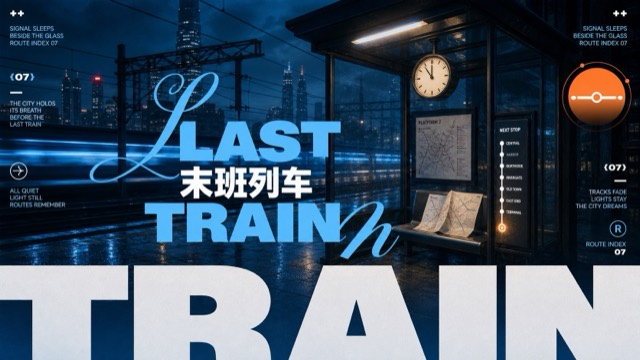</a>
<p><strong><a href="styles/dusk-cyan-layered-type-poster-style">Dusk Cyan Layered Type Poster Style</a></strong><br>
<em>Full-bleed dusk photo posters with navy silhouettes, oversized cyan-and-white type, script swashes, and crisp vector icons.</em><br>
<a href="styles/dusk-cyan-layered-type-poster-style/style.json">style.json</a> · <a href="docs/copy-prompts/dusk-cyan-layered-type-poster-style.md">prompt</a> · <a href="styles/dusk-cyan-layered-type-poster-style/preview-9x16.jpg">9:16</a></p>
</td>
<td width="33%" valign="top">
<a id="electric-blue-cutout-manga-poster-style"></a>
<a href="styles/electric-blue-cutout-manga-poster-style">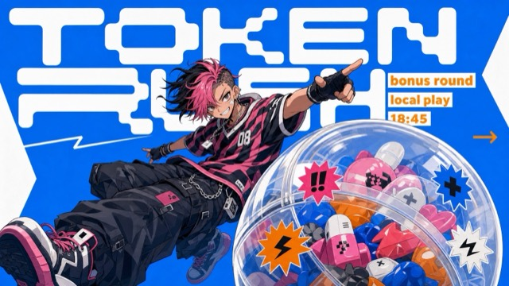</a>
<p><strong><a href="styles/electric-blue-cutout-manga-poster-style">Electric Blue Cutout Manga Poster Style</a></strong><br>
<em>Electric-blue manga posters with white cutout geometry, rounded modular type, orange microtype, and a cel-shaded subject in exaggerated perspective.</em><br>
<a href="styles/electric-blue-cutout-manga-poster-style/style.json">style.json</a> · <a href="docs/copy-prompts/electric-blue-cutout-manga-poster-style.md">prompt</a> · <a href="styles/electric-blue-cutout-manga-poster-style/preview-9x16.jpg">9:16</a></p>
</td>
<td width="33%" valign="top">
<a id="y2k-streetwear-sticker-collage-style"></a>
<a href="styles/y2k-streetwear-sticker-collage-style">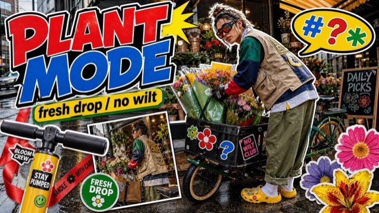</a>
<p><strong><a href="styles/y2k-streetwear-sticker-collage-style">Y2K Streetwear Sticker Collage Style</a></strong><br>
<em>Dense Y2K street collages with cutout subjects, sticker props, comic typography, and saturated yellow-blue-green accents.</em><br>
<a href="styles/y2k-streetwear-sticker-collage-style/style.json">style.json</a> · <a href="docs/copy-prompts/y2k-streetwear-sticker-collage-style.md">prompt</a> · <a href="styles/y2k-streetwear-sticker-collage-style/preview-9x16.jpg">9:16</a></p>
</td>
</tr>
<tr>
<td width="33%" valign="top">
<a id="cream-smoke-city-manga-poster-style"></a>
<a href="styles/cream-smoke-city-manga-poster-style">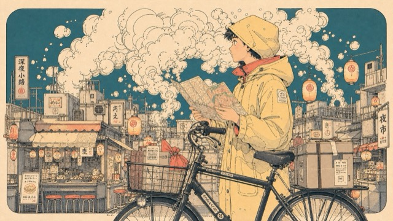</a>
<p><strong><a href="styles/cream-smoke-city-manga-poster-style">Cream Smoke City Manga Poster Style</a></strong><br>
<em>Manga ink city scenes with cream cloud masses, sparse teal frames, peach accents, and precise miniature urban architecture.</em><br>
<a href="styles/cream-smoke-city-manga-poster-style/style.json">style.json</a> · <a href="docs/copy-prompts/cream-smoke-city-manga-poster-style.md">prompt</a> · <a href="styles/cream-smoke-city-manga-poster-style/preview-9x16.jpg">9:16</a></p>
</td>
<td width="33%" valign="top">
<a id="red-yellow-grunge-skate-cover-style"></a>
<a href="styles/red-yellow-grunge-skate-cover-style">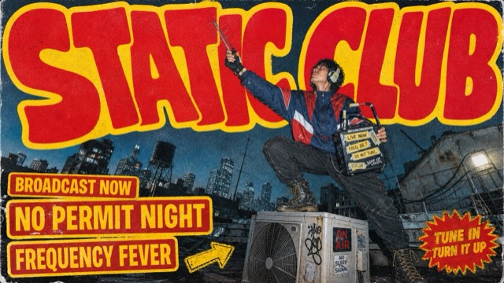</a>
<p><strong><a href="styles/red-yellow-grunge-skate-cover-style">Red Yellow Grunge Skate Cover Style</a></strong><br>
<em>Raw red-and-yellow action-culture covers with flash-lit cutouts, warped headline type, boxed callouts, and analog print grit.</em><br>
<a href="styles/red-yellow-grunge-skate-cover-style/style.json">style.json</a> · <a href="docs/copy-prompts/red-yellow-grunge-skate-cover-style.md">prompt</a> · <a href="styles/red-yellow-grunge-skate-cover-style/preview-9x16.jpg">9:16</a></p>
</td>
<td width="33%" valign="top">
<a id="monochrome-xerox-sports-dossier"></a>
<a href="styles/monochrome-xerox-sports-dossier">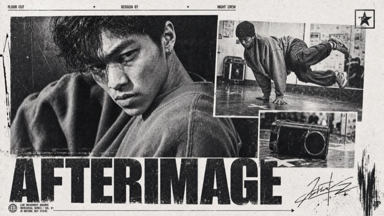</a>
<p><strong><a href="styles/monochrome-xerox-sports-dossier">Monochrome Xerox Sports Dossier</a></strong><br>
<em>Black-and-white xerox sports dossiers with cropped subjects, inset photo panels, distressed condensed type, and press-kit grain.</em><br>
<a href="styles/monochrome-xerox-sports-dossier/style.json">style.json</a> · <a href="docs/copy-prompts/monochrome-xerox-sports-dossier.md">prompt</a> · <a href="styles/monochrome-xerox-sports-dossier/preview-9x16.jpg">9:16</a></p>
</td>
</tr>
<tr>
<td width="33%" valign="top">
<a id="liquid-chrome-clearance-poster-style"></a>
<a href="styles/liquid-chrome-clearance-poster-style">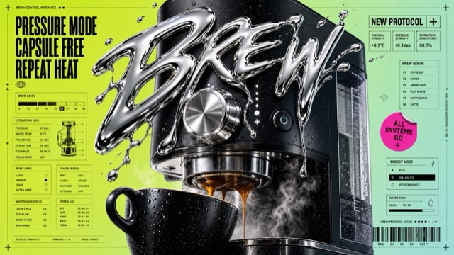</a>
<p><strong><a href="styles/liquid-chrome-clearance-poster-style">Liquid Chrome Clearance Poster Style</a></strong><br>
<em>High-impact clearance posters with glossy liquid-chrome 3D type, acid-lime gradients, sale-interface microcopy, and barcode-style retail panels.</em><br>
<a href="styles/liquid-chrome-clearance-poster-style/style.json">style.json</a> · <a href="docs/copy-prompts/liquid-chrome-clearance-poster-style.md">prompt</a> · <a href="styles/liquid-chrome-clearance-poster-style/preview-9x16.jpg">9:16</a></p>
</td>
<td width="33%" valign="top">
<a id="hot-ink-comic-poster"></a>
<a href="styles/hot-ink-comic-poster">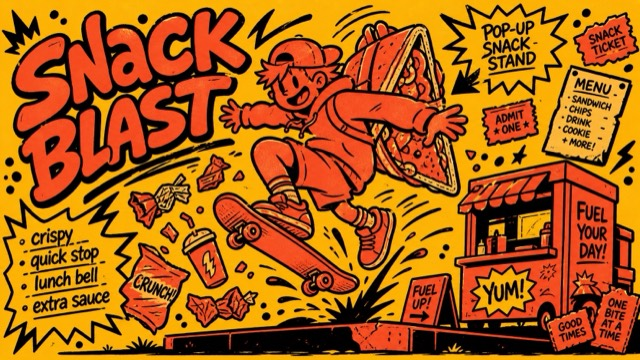</a>
<p><strong><a href="styles/hot-ink-comic-poster">Hot Ink Comic Poster</a></strong><br>
<em>Loud underground comic flyers with mustard fields, coral cutouts, heavy marker outlines, hand-lettered bubble type, and dense comic symbols.</em><br>
<a href="styles/hot-ink-comic-poster/style.json">style.json</a> · <a href="docs/copy-prompts/hot-ink-comic-poster.md">prompt</a> · <a href="styles/hot-ink-comic-poster/preview-9x16.jpg">9:16</a></p>
</td>
<td width="33%" valign="top">
<a id="kinetic-editorial-photo-collage-style"></a>
<a href="styles/kinetic-editorial-photo-collage-style">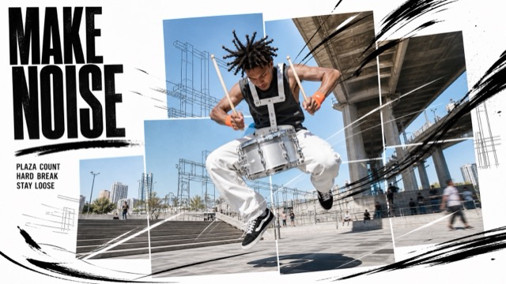</a>
<p><strong><a href="styles/kinetic-editorial-photo-collage-style">Kinetic Editorial Photo Collage</a></strong><br>
<em>High-energy action posters built from staggered photo tiles, a cutout motion subject, bold black condensed type, loose ink speed marks, and sparse line-art scaffolding.</em><br>
<a href="styles/kinetic-editorial-photo-collage-style/style.json">style.json</a> · <a href="docs/copy-prompts/kinetic-editorial-photo-collage-style.md">prompt</a> · <a href="styles/kinetic-editorial-photo-collage-style/preview-9x16.jpg">9:16</a></p>
</td>
</tr>
<tr>
<td width="33%" valign="top">
<a id="sunlit-coastal-product-blitz"></a>
<a href="styles/sunlit-coastal-product-blitz">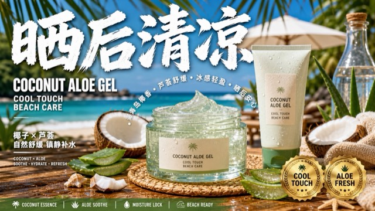</a>
<p><strong><a href="styles/sunlit-coastal-product-blitz">Sunlit Coastal Product Blitz</a></strong><br>
<em>Sunlit photoreal coastal product ads with tropical botanicals, ocean-blue depth, distressed white brush type, dense label blocks, curved callouts, and gold seal badges.</em><br>
<a href="styles/sunlit-coastal-product-blitz/style.json">style.json</a> · <a href="docs/copy-prompts/sunlit-coastal-product-blitz.md">prompt</a> · <a href="styles/sunlit-coastal-product-blitz/preview-9x16.jpg">9:16</a></p>
</td>
<td width="33%" valign="top">
<a id="monochrome-grid-sneaker-tech-spec"></a>
<a href="styles/monochrome-grid-sneaker-tech-spec">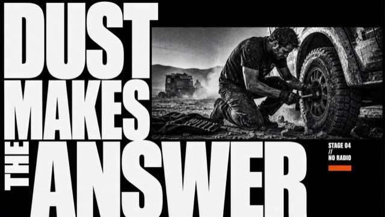</a>
<p><strong><a href="styles/monochrome-grid-sneaker-tech-spec">Monochrome Grid Sneaker Tech Spec</a></strong><br>
<em>Black-and-white footwear tech-spec posters with an oversized sneaker hero, engineering grid, evidence panels, macro callouts, pixelated uppercase type, and coarse halftone print.</em><br>
<a href="styles/monochrome-grid-sneaker-tech-spec/style.json">style.json</a> · <a href="docs/copy-prompts/monochrome-grid-sneaker-tech-spec.md">prompt</a> · <a href="styles/monochrome-grid-sneaker-tech-spec/preview-9x16.jpg">9:16</a></p>
</td>
<td width="33%" valign="top">
<a id="sky-blue-lucky-tag-doodle-poster-style"></a>
<a href="styles/sky-blue-lucky-tag-doodle-poster-style">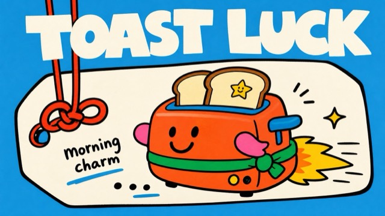</a>
<p><strong><a href="styles/sky-blue-lucky-tag-doodle-poster-style">Sky Blue Lucky Tag Doodle Poster Style</a></strong><br>
<em>Sky-blue doodle posters with chunky white type, a hanging lucky-tag plaque, thick black outlines, and one big playful mascot.</em><br>
<a href="styles/sky-blue-lucky-tag-doodle-poster-style/style.json">style.json</a> · <a href="docs/copy-prompts/sky-blue-lucky-tag-doodle-poster-style.md">prompt</a> · <a href="styles/sky-blue-lucky-tag-doodle-poster-style/preview-9x16.jpg">9:16</a></p>
</td>
</tr>
<tr>
<td width="33%" valign="top">
<a id="neon-type-photo-scribble-poster"></a>
<a href="styles/neon-type-photo-scribble-poster">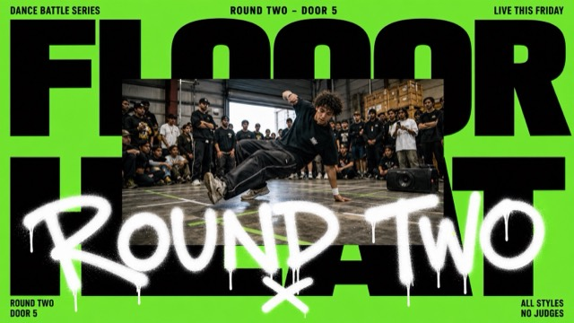</a>
<p><strong><a href="styles/neon-type-photo-scribble-poster">Neon Type Photo Scribble Poster</a></strong><br>
<em>Neon event posters with huge condensed type, documentary photo crops, and raw white scribble gestures.</em><br>
<a href="styles/neon-type-photo-scribble-poster/style.json">style.json</a> · <a href="docs/copy-prompts/neon-type-photo-scribble-poster.md">prompt</a> · <a href="styles/neon-type-photo-scribble-poster/preview-9x16.jpg">9:16</a></p>
</td>
<td width="33%" valign="top">
<a id="loose-scribble-riso-print-style"></a>
<a href="styles/loose-scribble-riso-print-style">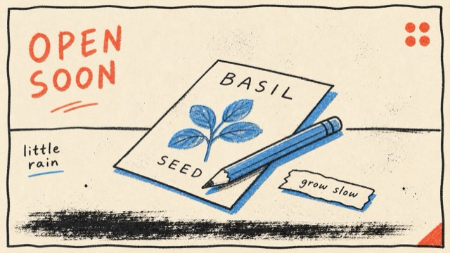</a>
<p><strong><a href="styles/loose-scribble-riso-print-style">Loose Scribble Riso Print Style</a></strong><br>
<em>Sparse riso posters with wavering contours, overprint accents, handwritten margins, and visible paper grain.</em><br>
<a href="styles/loose-scribble-riso-print-style/style.json">style.json</a> · <a href="docs/copy-prompts/loose-scribble-riso-print-style.md">prompt</a> · <a href="styles/loose-scribble-riso-print-style/preview-9x16.jpg">9:16</a></p>
</td>
<td width="33%" valign="top">
<a id="jade-glyph-grocer-collage-poster-style"></a>
<a href="styles/jade-glyph-grocer-collage-poster-style">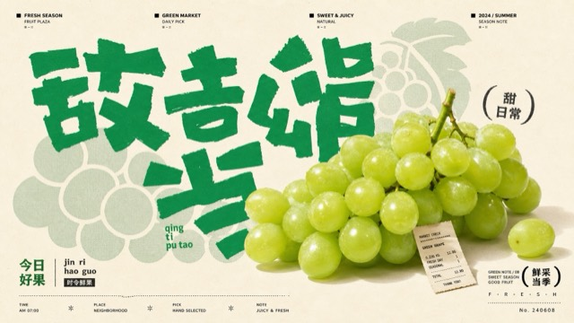</a>
<p><strong><a href="styles/jade-glyph-grocer-collage-poster-style">Jade Glyph Grocer Collage Poster Style</a></strong><br>
<em>Cream grocer posters with jade glyphs, vegetable silhouettes, and glossy produce-photo centerpieces.</em><br>
<a href="styles/jade-glyph-grocer-collage-poster-style/style.json">style.json</a> · <a href="docs/copy-prompts/jade-glyph-grocer-collage-poster-style.md">prompt</a> · <a href="styles/jade-glyph-grocer-collage-poster-style/preview-9x16.jpg">9:16</a></p>
</td>
</tr>
<tr>
<td width="33%" valign="top">
<a id="scarlet-court-photo-type-poster-style"></a>
<a href="styles/scarlet-court-photo-type-poster-style">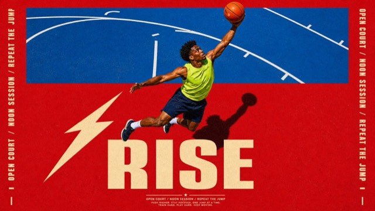</a>
<p><strong><a href="styles/scarlet-court-photo-type-poster-style">Scarlet Court Photo Type Poster</a></strong><br>
<em>Scarlet action posters with blue sports panels, cutout athletes, cream typography, and gritty print texture.</em><br>
<a href="styles/scarlet-court-photo-type-poster-style/style.json">style.json</a> · <a href="docs/copy-prompts/scarlet-court-photo-type-poster-style.md">prompt</a> · <a href="styles/scarlet-court-photo-type-poster-style/preview-9x16.jpg">9:16</a></p>
</td>
<td width="33%" valign="top">
<a id="sunlit-kinetic-block-type-photo-poster-style"></a>
<a href="styles/sunlit-kinetic-block-type-photo-poster-style">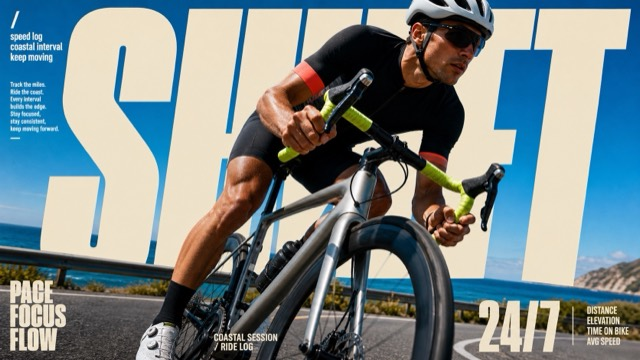</a>
<p><strong><a href="styles/sunlit-kinetic-block-type-photo-poster-style">Sunlit Kinetic Block Type Photo Poster</a></strong><br>
<em>Sunlit sports editorials with oversized cream block type, diagonal photo crops, and bright sky fields.</em><br>
<a href="styles/sunlit-kinetic-block-type-photo-poster-style/style.json">style.json</a> · <a href="docs/copy-prompts/sunlit-kinetic-block-type-photo-poster-style.md">prompt</a> · <a href="styles/sunlit-kinetic-block-type-photo-poster-style/preview-9x16.jpg">9:16</a></p>
</td>
<td width="33%" valign="top">
<a id="scarlet-block-cutout-doodle-book-cover-style"></a>
<a href="styles/scarlet-block-cutout-doodle-book-cover-style">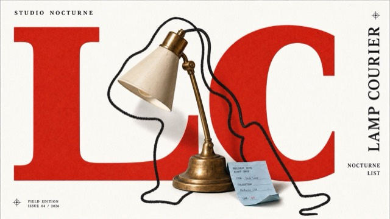</a>
<p><strong><a href="styles/scarlet-block-cutout-doodle-book-cover-style">Scarlet Block Cutout Doodle Book Cover Style</a></strong><br>
<em>Literary white-paper covers with scarlet letterforms, central cutout objects, marker contours, and asymmetrical space.</em><br>
<a href="styles/scarlet-block-cutout-doodle-book-cover-style/style.json">style.json</a> · <a href="docs/copy-prompts/scarlet-block-cutout-doodle-book-cover-style.md">prompt</a> · <a href="styles/scarlet-block-cutout-doodle-book-cover-style/preview-9x16.jpg">9:16</a></p>
</td>
</tr>
<tr>
<td width="33%" valign="top">
<a id="halftone-assemblage-metaphor-psa-poster-style"></a>
<a href="styles/halftone-assemblage-metaphor-psa-poster-style">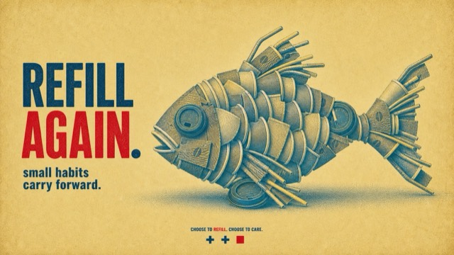</a>
<p><strong><a href="styles/halftone-assemblage-metaphor-psa-poster-style">Halftone Assemblage Metaphor PSA Poster Style</a></strong><br>
<em>日用品で象徴的なハーフトーンシルエットを作る、古紙風のレトロPSAポスター。</em><br>
<a href="styles/halftone-assemblage-metaphor-psa-poster-style/style.json">style.json</a> · <a href="docs/copy-prompts/halftone-assemblage-metaphor-psa-poster-style.md">prompt</a> · <a href="styles/halftone-assemblage-metaphor-psa-poster-style/preview-9x16.jpg">9:16</a></p>
</td>
<td width="33%" valign="top">
<a id="school-grid-paper-cutout-poster"></a>
<a href="styles/school-grid-paper-cutout-poster">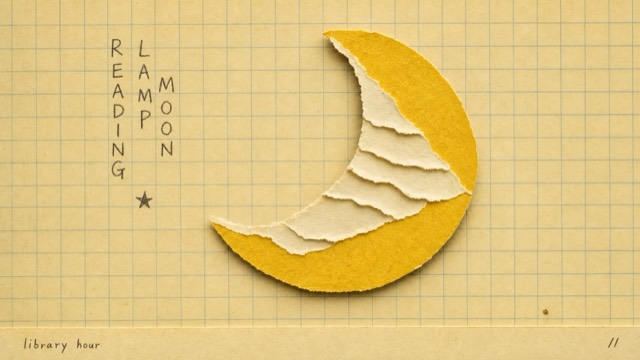</a>
<p><strong><a href="styles/school-grid-paper-cutout-poster">School Grid Paper Cutout Poster</a></strong><br>
<em>方眼紙に切り貼りした紙のオブジェ、手書きメモ、柔らかな影を置く懐かしいポスター。</em><br>
<a href="styles/school-grid-paper-cutout-poster/style.json">style.json</a> · <a href="docs/copy-prompts/school-grid-paper-cutout-poster.md">prompt</a> · <a href="styles/school-grid-paper-cutout-poster/preview-9x16.jpg">9:16</a></p>
</td>
<td width="33%" valign="top">
<a id="naive-marker-quote-card-style"></a>
<a href="styles/naive-marker-quote-card-style">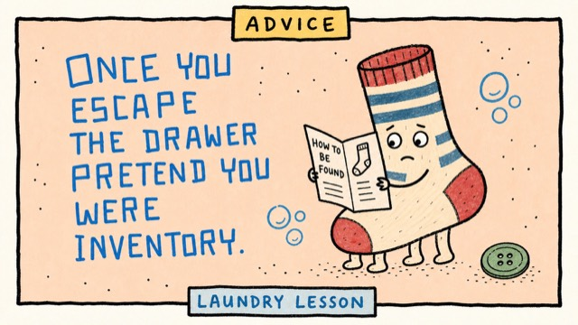</a>
<p><strong><a href="styles/naive-marker-quote-card-style">Naive Marker Quote Card Style</a></strong><br>
<em>粗いマーカー線、パステル面、青い角文字、物のギャグで作る不条理な引用カードポスター。</em><br>
<a href="styles/naive-marker-quote-card-style/style.json">style.json</a> · <a href="docs/copy-prompts/naive-marker-quote-card-style.md">prompt</a> · <a href="styles/naive-marker-quote-card-style/preview-9x16.jpg">9:16</a></p>
</td>
</tr>
<tr>
<td width="33%" valign="top">
<a id="sky-blue-home-life-doodle-poster-style"></a>
<a href="styles/sky-blue-home-life-doodle-poster-style">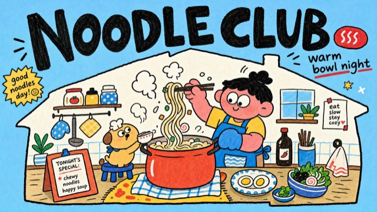</a>
<p><strong><a href="styles/sky-blue-home-life-doodle-poster-style">Sky Blue Home Life Doodle Poster Style</a></strong><br>
<em>空色の家型フレーム、巨大な黒手描き文字、バッジ、マーカー日常シーンのホームポスター。</em><br>
<a href="styles/sky-blue-home-life-doodle-poster-style/style.json">style.json</a> · <a href="docs/copy-prompts/sky-blue-home-life-doodle-poster-style.md">prompt</a> · <a href="styles/sky-blue-home-life-doodle-poster-style/preview-9x16.jpg">9:16</a></p>
</td>
<td width="33%" valign="top">
<a id="playful-marker-grounding-poster-style"></a>
<a href="styles/playful-marker-grounding-poster-style">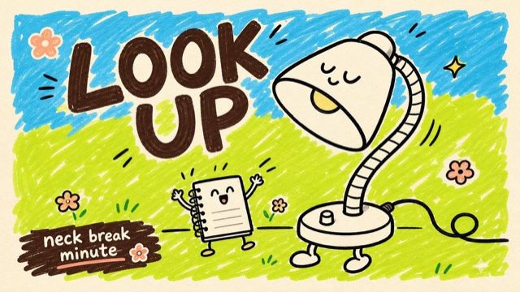</a>
<p><strong><a href="styles/playful-marker-grounding-poster-style">Playful Marker Grounding Poster Style</a></strong><br>
<em>クリーム余白、マーカー色面、太い不均一線、大きな文字、マスコット人物の軽快な啓発ポスター。</em><br>
<a href="styles/playful-marker-grounding-poster-style/style.json">style.json</a> · <a href="docs/copy-prompts/playful-marker-grounding-poster-style.md">prompt</a> · <a href="styles/playful-marker-grounding-poster-style/preview-9x16.jpg">9:16</a></p>
</td>
<td width="33%" valign="top">
<a id="rough-marker-monster-poster-style"></a>
<a href="styles/rough-marker-monster-poster-style">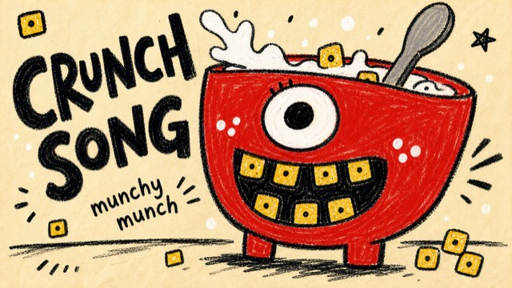</a>
<p><strong><a href="styles/rough-marker-monster-poster-style">Rough Marker Monster Poster Style</a></strong><br>
<em>太いマーカー線、クレヨン塗り、クリーム紙、手描き文字の素朴なモンスターポスター。</em><br>
<a href="styles/rough-marker-monster-poster-style/style.json">style.json</a> · <a href="docs/copy-prompts/rough-marker-monster-poster-style.md">prompt</a> · <a href="styles/rough-marker-monster-poster-style/preview-9x16.jpg">9:16</a></p>
</td>
</tr>
<tr>
<td width="33%" valign="top">
<a id="cyan-red-shockwave-type-poster-style"></a>
<a href="styles/cyan-red-shockwave-type-poster-style">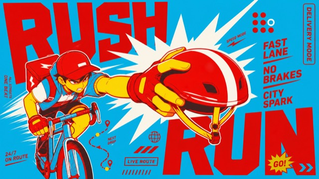</a>
<p><strong><a href="styles/cyan-red-shockwave-type-poster-style">Cyan Red Shockwave Type Poster Style</a></strong><br>
<em>巨大な赤いブロック文字、ギザギザ衝撃波、黄色アクセント、回転小文字のシアン系インパクトポスター。</em><br>
<a href="styles/cyan-red-shockwave-type-poster-style/style.json">style.json</a> · <a href="docs/copy-prompts/cyan-red-shockwave-type-poster-style.md">prompt</a> · <a href="styles/cyan-red-shockwave-type-poster-style/preview-9x16.jpg">9:16</a></p>
</td>
<td width="33%" valign="top">
<a id="fantasy-scribble-mascot-poster-style"></a>
<a href="styles/fantasy-scribble-mascot-poster-style">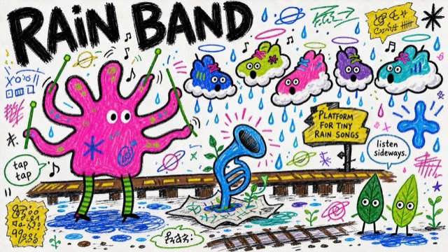</a>
<p><strong><a href="styles/fantasy-scribble-mascot-poster-style">Fantasy Scribble Mascot Poster Style</a></strong><br>
<em>ネオンマーカーのマスコット、巨大な手描き文字、密な落書きで作る素朴な幻想ポスター。</em><br>
<a href="styles/fantasy-scribble-mascot-poster-style/style.json">style.json</a> · <a href="docs/copy-prompts/fantasy-scribble-mascot-poster-style.md">prompt</a> · <a href="styles/fantasy-scribble-mascot-poster-style/preview-9x16.jpg">9:16</a></p>
</td>
<td width="33%" valign="top">
<a id="crayon-catalog-doodle-poster-style"></a>
<a href="styles/crayon-catalog-doodle-poster-style">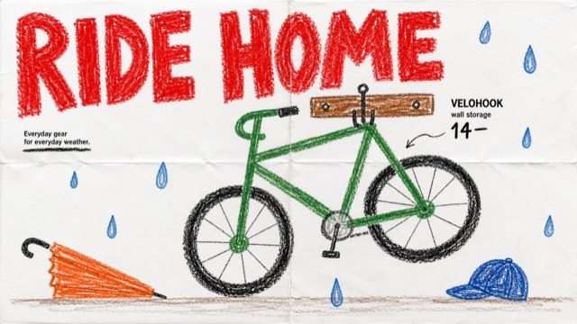</a>
<p><strong><a href="styles/crayon-catalog-doodle-poster-style">Crayon Catalog Doodle Poster Style</a></strong><br>
<em>赤い手描き見出し、シンプルな落書き、折り紙質感で作る余白の多いクレヨン目録ポスター。</em><br>
<a href="styles/crayon-catalog-doodle-poster-style/style.json">style.json</a> · <a href="docs/copy-prompts/crayon-catalog-doodle-poster-style.md">prompt</a> · <a href="styles/crayon-catalog-doodle-poster-style/preview-9x16.jpg">9:16</a></p>
</td>
</tr>
<tr>
<td width="33%" valign="top">
<a id="blue-halftone-ransom-zine-poster-style"></a>
<a href="styles/blue-halftone-ransom-zine-poster-style">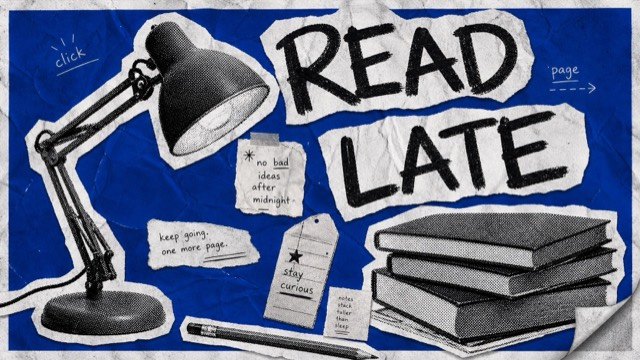</a>
<p><strong><a href="styles/blue-halftone-ransom-zine-poster-style">Blue Halftone Ransom Zine Poster Style</a></strong><br>
<em>破れ紙、ハーフトーン切り抜き、マーカー文字で作るコバルトブルーのransom zineポスター。</em><br>
<a href="styles/blue-halftone-ransom-zine-poster-style/style.json">style.json</a> · <a href="docs/copy-prompts/blue-halftone-ransom-zine-poster-style.md">prompt</a> · <a href="styles/blue-halftone-ransom-zine-poster-style/preview-9x16.jpg">9:16</a></p>
</td>
<td width="33%" valign="top">
<a id="market-brush-produce-poster-style"></a>
<a href="styles/market-brush-produce-poster-style">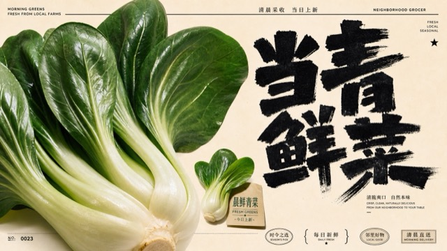</a>
<p><strong><a href="styles/market-brush-produce-poster-style">Market Brush Produce Poster Style</a></strong><br>
<em>巨大な光沢ある青果、荒い筆文字、アイボリーの余白を使う市場ポスター。</em><br>
<a href="styles/market-brush-produce-poster-style/style.json">style.json</a> · <a href="docs/copy-prompts/market-brush-produce-poster-style.md">prompt</a> · <a href="styles/market-brush-produce-poster-style/preview-9x16.jpg">9:16</a></p>
</td>
<td width="33%" valign="top">
<a id="folded-newspaper-product-ad-style"></a>
<a href="styles/folded-newspaper-product-ad-style">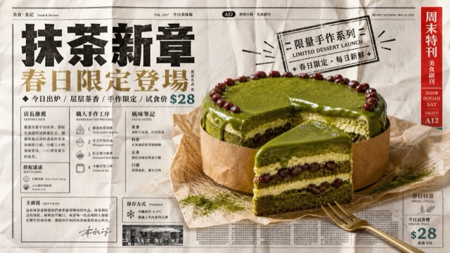</a>
<p><strong><a href="styles/folded-newspaper-product-ad-style">Folded Newspaper Product Ad Style</a></strong><br>
<em>折りたたみ新聞広告風。巨大な商品切り抜き、密なカラム、スタンプ、古金色の見出し。</em><br>
<a href="styles/folded-newspaper-product-ad-style/style.json">style.json</a> · <a href="docs/copy-prompts/folded-newspaper-product-ad-style.md">prompt</a> · <a href="styles/folded-newspaper-product-ad-style/preview-9x16.jpg">9:16</a></p>
</td>
</tr>
<tr>
<td width="33%" valign="top">
<a id="sunlit-supermodel-nameplate-editorial"></a>
<a href="styles/sunlit-supermodel-nameplate-editorial">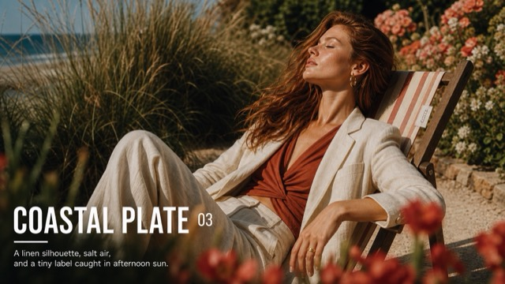</a>
<p><strong><a href="styles/sunlit-supermodel-nameplate-editorial">Sunlit Supermodel Nameplate Editorial</a></strong><br>
<em>日差しのあるスーパーモデル編集ビジュアル、屋外質感、ネームプレート、整った下三分の一組版。</em><br>
<a href="styles/sunlit-supermodel-nameplate-editorial/style.json">style.json</a> · <a href="docs/copy-prompts/sunlit-supermodel-nameplate-editorial.md">prompt</a> · <a href="styles/sunlit-supermodel-nameplate-editorial/preview-9x16.jpg">9:16</a></p>
</td>
<td width="33%" valign="top">
<a id="black-cutout-food-card-ad-style"></a>
<a href="styles/black-cutout-food-card-ad-style"></a>
<p><strong><a href="styles/black-cutout-food-card-ad-style">Black Cutout Food Card Ad</a></strong><br>
<em>黒背景フードカード広告、手描き文字、切り抜き写真、屋台印刷テクスチャ。</em><br>
<a href="styles/black-cutout-food-card-ad-style/style.json">style.json</a> · <a href="docs/copy-prompts/black-cutout-food-card-ad-style.md">prompt</a> · <a href="styles/black-cutout-food-card-ad-style/preview-9x16.jpg">9:16</a></p>
</td>
<td width="33%" valign="top">
<a id="kinetic-geometric-doodle-cutouts"></a>
<a href="styles/kinetic-geometric-doodle-cutouts">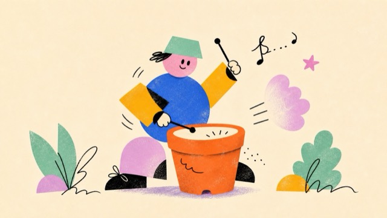</a>
<p><strong><a href="styles/kinetic-geometric-doodle-cutouts">Kinetic Geometric Doodle Cutouts</a></strong><br>
<em>幾何カットアウトとドゥードル線、紙粒子で作る遊び心あるイラスト。</em><br>
<a href="styles/kinetic-geometric-doodle-cutouts/style.json">style.json</a> · <a href="docs/copy-prompts/kinetic-geometric-doodle-cutouts.md">prompt</a> · <a href="styles/kinetic-geometric-doodle-cutouts/preview-9x16.jpg">9:16</a></p>
</td>
</tr>
<tr>
<td width="33%" valign="top">
<a id="quiet-luxury-furniture-nameplate-poster-style"></a>
<a href="styles/quiet-luxury-furniture-nameplate-poster-style">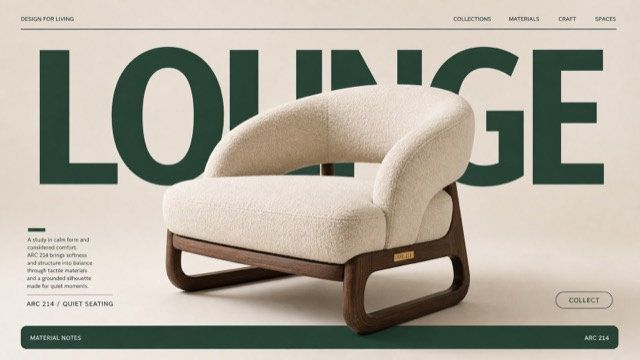</a>
<p><strong><a href="styles/quiet-luxury-furniture-nameplate-poster-style">Quiet Luxury Furniture Nameplate Poster Style</a></strong><br>
<em>フォレストグリーンの大文字とカタログ感を持つ静かな高級家具ポスター。</em><br>
<a href="styles/quiet-luxury-furniture-nameplate-poster-style/style.json">style.json</a> · <a href="docs/copy-prompts/quiet-luxury-furniture-nameplate-poster-style.md">prompt</a> · <a href="styles/quiet-luxury-furniture-nameplate-poster-style/preview-9x16.jpg">9:16</a></p>
</td>
<td width="33%" valign="top">
<a id="kinetic-luxury-street-fashion-cover-style"></a>
<a href="styles/kinetic-luxury-street-fashion-cover-style">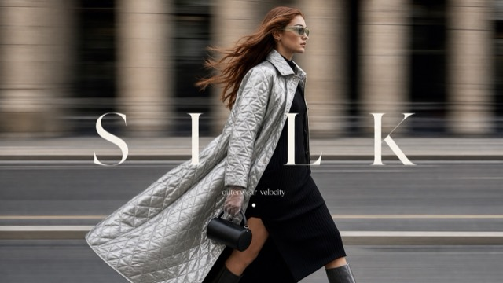</a>
<p><strong><a href="styles/kinetic-luxury-street-fashion-cover-style">Kinetic Luxury Street Fashion Cover Style</a></strong><br>
<em>ブレた建築、ラグジュアリー衣装、広い字間のセリフ体によるファッションカバー。</em><br>
<a href="styles/kinetic-luxury-street-fashion-cover-style/style.json">style.json</a> · <a href="docs/copy-prompts/kinetic-luxury-street-fashion-cover-style.md">prompt</a> · <a href="styles/kinetic-luxury-street-fashion-cover-style/preview-9x16.jpg">9:16</a></p>
</td>
<td width="33%" valign="top">
<a id="sunlit-architectural-fashion-editorial"></a>
<a href="styles/sunlit-architectural-fashion-editorial">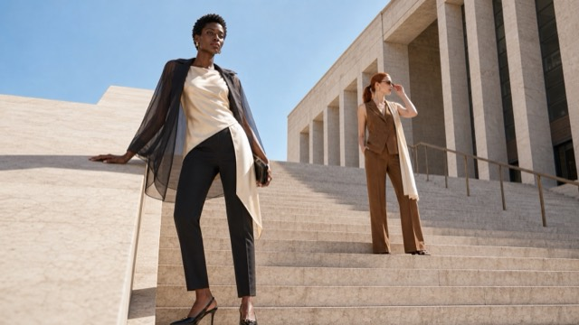</a>
<p><strong><a href="styles/sunlit-architectural-fashion-editorial">Sunlit Architectural Fashion Editorial</a></strong><br>
<em>低い建築視点、暖かな石材、長いシルエットで作る日差しのファッション編集写真。</em><br>
<a href="styles/sunlit-architectural-fashion-editorial/style.json">style.json</a> · <a href="docs/copy-prompts/sunlit-architectural-fashion-editorial.md">prompt</a> · <a href="styles/sunlit-architectural-fashion-editorial/preview-9x16.jpg">9:16</a></p>
</td>
</tr>
<tr>
<td width="33%" valign="top">
<a id="multi-color-beverage-splash-ad-system-style"></a>
<a href="styles/multi-color-beverage-splash-ad-system-style">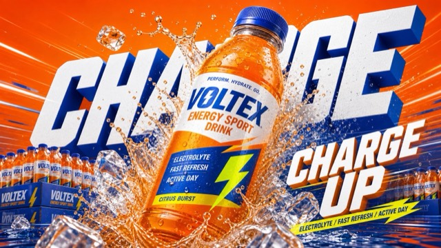</a>
<p><strong><a href="styles/multi-color-beverage-splash-ad-system-style">Multi-Color Beverage Splash Ad System Style</a></strong><br>
<em>巨大な白い3D文字と凍った飛沫で作る多色飲料ローンチ広告。</em><br>
<a href="styles/multi-color-beverage-splash-ad-system-style/style.json">style.json</a> · <a href="docs/copy-prompts/multi-color-beverage-splash-ad-system-style.md">prompt</a> · <a href="styles/multi-color-beverage-splash-ad-system-style/preview-9x16.jpg">9:16</a></p>
</td>
<td width="33%" valign="top">
<a id="yellow-black-manga-food-zine-ad-style"></a>
<a href="styles/yellow-black-manga-food-zine-ad-style">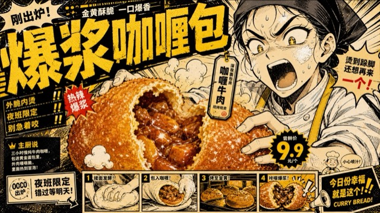</a>
<p><strong><a href="styles/yellow-black-manga-food-zine-ad-style">Yellow Black Manga Food Zine Ad Style</a></strong><br>
<em>黒黄の漫画フード zine 広告、歪んだ大文字と光沢ある主役オブジェクト。</em><br>
<a href="styles/yellow-black-manga-food-zine-ad-style/style.json">style.json</a> · <a href="docs/copy-prompts/yellow-black-manga-food-zine-ad-style.md">prompt</a> · <a href="styles/yellow-black-manga-food-zine-ad-style/preview-9x16.jpg">9:16</a></p>
</td>
<td width="33%" valign="top">
<a id="neon-outdoor-diary-longform-collage-style"></a>
<a href="styles/neon-outdoor-diary-longform-collage-style">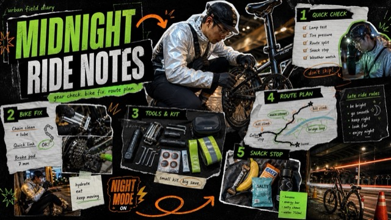</a>
<p><strong><a href="styles/neon-outdoor-diary-longform-collage-style">Neon Outdoor Diary Longform Collage Style</a></strong><br>
<em>酸性グリーン見出し、破れ紙パネル、写真切り抜きの屋外日記ロングコラージュ。</em><br>
<a href="styles/neon-outdoor-diary-longform-collage-style/style.json">style.json</a> · <a href="docs/copy-prompts/neon-outdoor-diary-longform-collage-style.md">prompt</a> · <a href="styles/neon-outdoor-diary-longform-collage-style/preview-9x16.jpg">9:16</a></p>
</td>
</tr>
<tr>
<td width="33%" valign="top">
<a id="acid-lime-3d-streetwear-type-poster-style"></a>
<a href="styles/acid-lime-3d-streetwear-type-poster-style">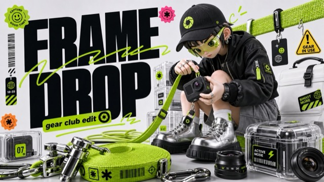</a>
<p><strong><a href="styles/acid-lime-3d-streetwear-type-poster-style">Acid Lime 3D Streetwear Type Poster Style</a></strong><br>
<em>黒いブロック文字と酸性ライムのアクセントが効いた光沢 C4D ストリートウェア広告。</em><br>
<a href="styles/acid-lime-3d-streetwear-type-poster-style/style.json">style.json</a> · <a href="docs/copy-prompts/acid-lime-3d-streetwear-type-poster-style.md">prompt</a> · <a href="styles/acid-lime-3d-streetwear-type-poster-style/preview-9x16.jpg">9:16</a></p>
</td>
<td width="33%" valign="top">
<a id="electric-blue-silhouette-product-launch-style"></a>
<a href="styles/electric-blue-silhouette-product-launch-style">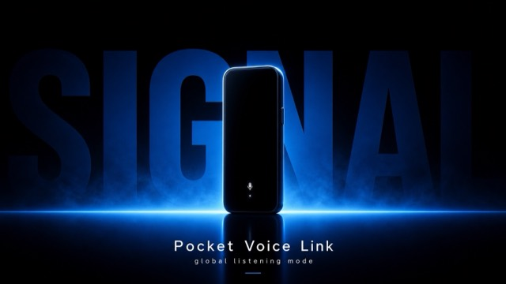</a>
<p><strong><a href="styles/electric-blue-silhouette-product-launch-style">Electric Blue Silhouette Product Launch Style</a></strong><br>
<em>黒と青の高級製品発表、発光シルエットとクロップ文字。</em><br>
<a href="styles/electric-blue-silhouette-product-launch-style/style.json">style.json</a> · <a href="docs/copy-prompts/electric-blue-silhouette-product-launch-style.md">prompt</a> · <a href="styles/electric-blue-silhouette-product-launch-style/preview-9x16.jpg">9:16</a></p>
</td>
<td width="33%" valign="top">
<a id="luxury-perspective-checkerboard-editorial"></a>
<a href="styles/luxury-perspective-checkerboard-editorial">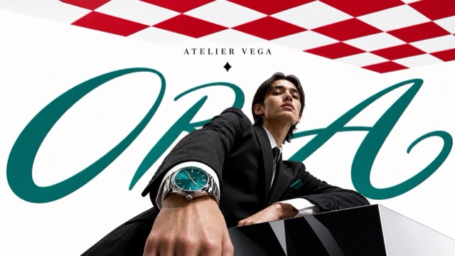</a>
<p><strong><a href="styles/luxury-perspective-checkerboard-editorial">Luxury Perspective Checkerboard Editorial</a></strong><br>
<em>チェック遠近法、スクリプト文字、洗練された余白のラグジュアリー編集。</em><br>
<a href="styles/luxury-perspective-checkerboard-editorial/style.json">style.json</a> · <a href="docs/copy-prompts/luxury-perspective-checkerboard-editorial.md">prompt</a> · <a href="styles/luxury-perspective-checkerboard-editorial/preview-9x16.jpg">9:16</a></p>
</td>
</tr>
<tr>
<td width="33%" valign="top">
<a id="sunny-3d-avatar-campaign-style"></a>
<a href="styles/sunny-3d-avatar-campaign-style">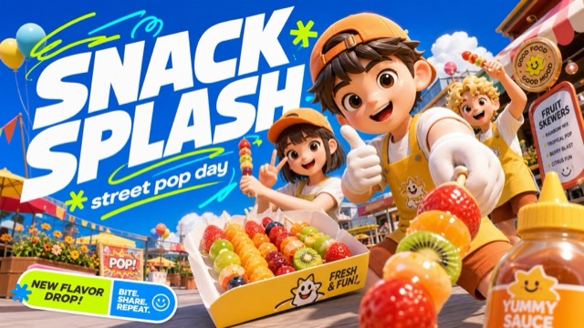</a>
<p><strong><a href="styles/sunny-3d-avatar-campaign-style">Sunny 3D Avatar Campaign Style</a></strong><br>
<em>晴れたキャンペーン向け3Dアバター、青空、大きな斜体文字、ネオンの動線。</em><br>
<a href="styles/sunny-3d-avatar-campaign-style/style.json">style.json</a> · <a href="docs/copy-prompts/sunny-3d-avatar-campaign-style.md">prompt</a> · <a href="styles/sunny-3d-avatar-campaign-style/preview-9x16.jpg">9:16</a></p>
</td>
<td width="33%" valign="top">
<a id="y2k-mirror-ui-scribble-collage-style"></a>
<a href="styles/y2k-mirror-ui-scribble-collage-style">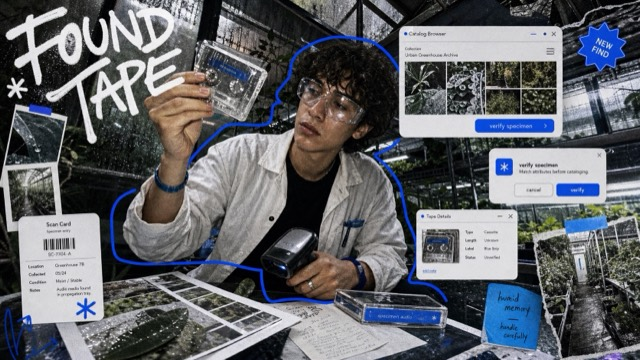</a>
<p><strong><a href="styles/y2k-mirror-ui-scribble-collage-style">Y2K Mirror UI Scribble Collage Style</a></strong><br>
<em>フラッシュ写真にY2KのUI断片、青い落書き線、粗い画面ノイズを重ねる。</em><br>
<a href="styles/y2k-mirror-ui-scribble-collage-style/style.json">style.json</a> · <a href="docs/copy-prompts/y2k-mirror-ui-scribble-collage-style.md">prompt</a> · <a href="styles/y2k-mirror-ui-scribble-collage-style/preview-9x16.jpg">9:16</a></p>
</td>
<td width="33%" valign="top">
<a id="neon-plush-gadget-pop-3d-style"></a>
<a href="styles/neon-plush-gadget-pop-3d-style">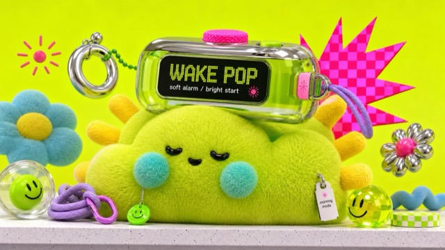</a>
<p><strong><a href="styles/neon-plush-gadget-pop-3d-style">Neon Plush Gadget Pop 3D Style</a></strong><br>
<em>ぬいぐるみマスコットと分厚いガジェット小物のネオントイ商品 3D レンダー。</em><br>
<a href="styles/neon-plush-gadget-pop-3d-style/style.json">style.json</a> · <a href="docs/copy-prompts/neon-plush-gadget-pop-3d-style.md">prompt</a> · <a href="styles/neon-plush-gadget-pop-3d-style/preview-9x16.jpg">9:16</a></p>
</td>
</tr>
<tr>
<td width="33%" valign="top">
<a id="blue-lime-kinetic-comic-type-poster-style"></a>
<a href="styles/blue-lime-kinetic-comic-type-poster-style">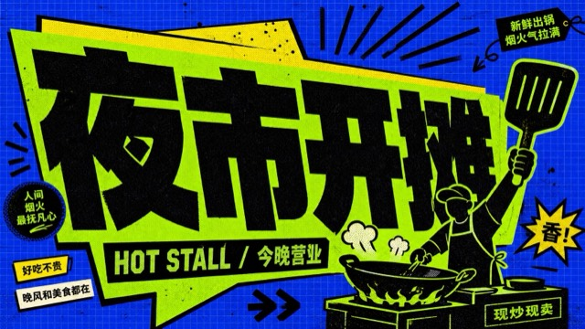</a>
<p><strong><a href="styles/blue-lime-kinetic-comic-type-poster-style">Blue Lime Kinetic Comic Type Poster Style</a></strong><br>
<em>Electric-blue comic posters with lime speech panels and massive black type.</em><br>
<a href="styles/blue-lime-kinetic-comic-type-poster-style/style.json">style.json</a> · <a href="docs/copy-prompts/blue-lime-kinetic-comic-type-poster-style.md">prompt</a> · <a href="styles/blue-lime-kinetic-comic-type-poster-style/preview-9x16.jpg">9:16</a></p>
</td>
<td width="33%" valign="top">
<a id="blue-chinese-perspective-type-canyon-style"></a>
<a href="styles/blue-chinese-perspective-type-canyon-style">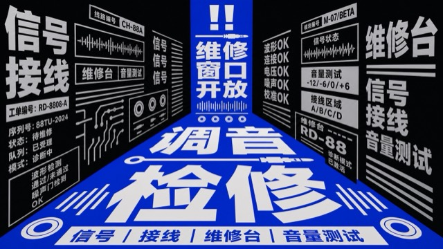</a>
<p><strong><a href="styles/blue-chinese-perspective-type-canyon-style">Blue Chinese Perspective Type Canyon Style</a></strong><br>
<em>Blue perspective corridors with stacked Chinese display type.</em><br>
<a href="styles/blue-chinese-perspective-type-canyon-style/style.json">style.json</a> · <a href="docs/copy-prompts/blue-chinese-perspective-type-canyon-style.md">prompt</a> · <a href="styles/blue-chinese-perspective-type-canyon-style/preview-9x16.jpg">9:16</a></p>
</td>
<td width="33%" valign="top">
<a id="rough-ink-music-doodle-poster-style"></a>
<a href="styles/rough-ink-music-doodle-poster-style">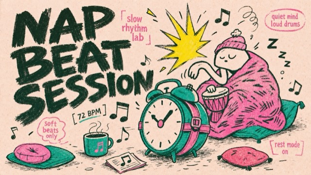</a>
<p><strong><a href="styles/rough-ink-music-doodle-poster-style">Rough Ink Music Doodle Poster Style</a></strong><br>
<em>Hand-inked music posters with brush lettering and playful doodles.</em><br>
<a href="styles/rough-ink-music-doodle-poster-style/style.json">style.json</a> · <a href="docs/copy-prompts/rough-ink-music-doodle-poster-style.md">prompt</a> · <a href="styles/rough-ink-music-doodle-poster-style/preview-9x16.jpg">9:16</a></p>
</td>
</tr>
<tr>
<td width="33%" valign="top">
<a id="mono-noir-type-portrait-poster-style"></a>
<a href="styles/mono-noir-type-portrait-poster-style"></a>
<p><strong><a href="styles/mono-noir-type-portrait-poster-style">Mono Noir Type Portrait Poster Style</a></strong><br>
<em>Black-and-white editorial portraits with massive lowercase type.</em><br>
<a href="styles/mono-noir-type-portrait-poster-style/style.json">style.json</a> · <a href="docs/copy-prompts/mono-noir-type-portrait-poster-style.md">prompt</a> · <a href="styles/mono-noir-type-portrait-poster-style/preview-9x16.jpg">9:16</a></p>
</td>
<td width="33%" valign="top">
<a id="bold-block-mascot-poster-style"></a>
<a href="styles/bold-block-mascot-poster-style">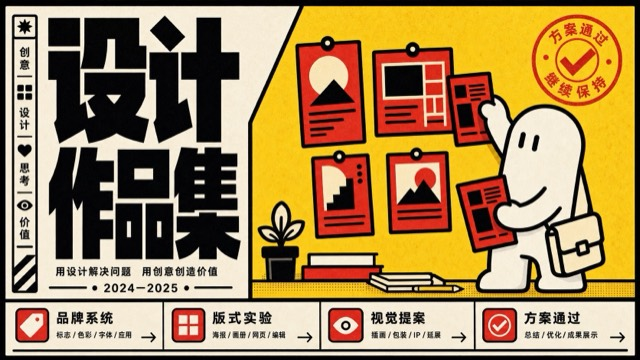</a>
<p><strong><a href="styles/bold-block-mascot-poster-style">Bold Block Mascot Poster Style</a></strong><br>
<em>Flat mascot posters with chunky block type and sticker figures.</em><br>
<a href="styles/bold-block-mascot-poster-style/style.json">style.json</a> · <a href="docs/copy-prompts/bold-block-mascot-poster-style.md">prompt</a> · <a href="styles/bold-block-mascot-poster-style/preview-9x16.jpg">9:16</a></p>
</td>
<td width="33%" valign="top">
<a id="blue-hud-macro-product-poster"></a>
<a href="styles/blue-hud-macro-product-poster">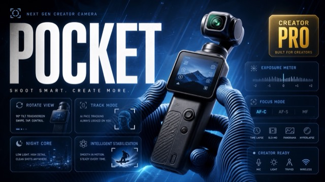</a>
<p><strong><a href="styles/blue-hud-macro-product-poster">Blue HUD Macro Creator Tech Poster</a></strong><br>
<em>Glossy macro product posters with blue HUD launch graphics.</em><br>
<a href="styles/blue-hud-macro-product-poster/style.json">style.json</a> · <a href="docs/copy-prompts/blue-hud-macro-product-poster.md">prompt</a> · <a href="styles/blue-hud-macro-product-poster/preview-9x16.jpg">9:16</a></p>
</td>
</tr>
<tr>
<td width="33%" valign="top">
<a id="warm-fisheye-product-impact-ad-style"></a>
<a href="styles/warm-fisheye-product-impact-ad-style">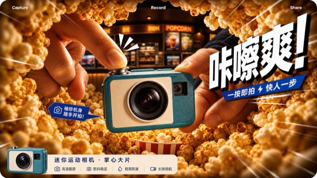</a>
<p><strong><a href="styles/warm-fisheye-product-impact-ad-style">Warm Fisheye Product Impact Ad Style</a></strong><br>
<em>Warm fisheye product ads with bold Chinese social-commerce type.</em><br>
<a href="styles/warm-fisheye-product-impact-ad-style/style.json">style.json</a> · <a href="docs/copy-prompts/warm-fisheye-product-impact-ad-style.md">prompt</a> · <a href="styles/warm-fisheye-product-impact-ad-style/preview-9x16.jpg">9:16</a></p>
</td>
<td width="33%" valign="top">
<a id="olive-scribble-sports-poster-style"></a>
<a href="styles/olive-scribble-sports-poster-style">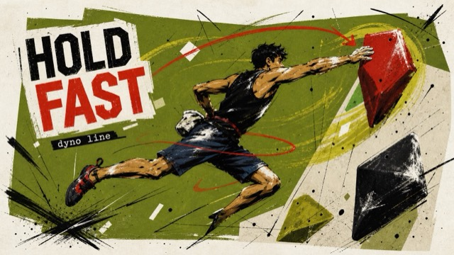</a>
<p><strong><a href="styles/olive-scribble-sports-poster-style">Olive Scribble Sports Poster Style</a></strong><br>
<em>Handmade sports posters with olive blocks and kinetic scribbles.</em><br>
<a href="styles/olive-scribble-sports-poster-style/style.json">style.json</a> · <a href="docs/copy-prompts/olive-scribble-sports-poster-style.md">prompt</a> · <a href="styles/olive-scribble-sports-poster-style/preview-9x16.jpg">9:16</a></p>
</td>
<td width="33%" valign="top">
<a id="bold-anime-reaction-thumbnail-style"></a>
<a href="styles/bold-anime-reaction-thumbnail-style">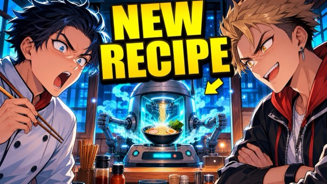</a>
<p><strong><a href="styles/bold-anime-reaction-thumbnail-style">Bold Anime Reaction Thumbnail Style</a></strong><br>
<em>High-impact anime thumbnails with bold yellow reaction typography.</em><br>
<a href="styles/bold-anime-reaction-thumbnail-style/style.json">style.json</a> · <a href="docs/copy-prompts/bold-anime-reaction-thumbnail-style.md">prompt</a> · <a href="styles/bold-anime-reaction-thumbnail-style/preview-9x16.jpg">9:16</a></p>
</td>
</tr>
<tr>
<td width="33%" valign="top">
<a id="turquoise-red-techno-manga-poster-style"></a>
<a href="styles/turquoise-red-techno-manga-poster-style">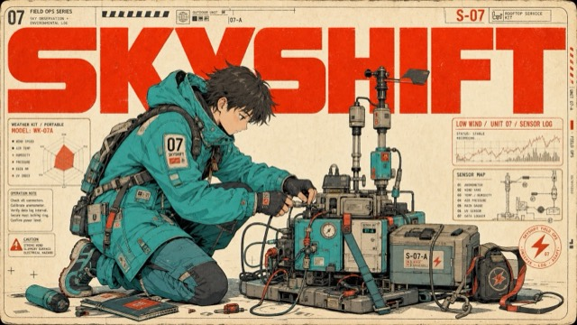</a>
<p><strong><a href="styles/turquoise-red-techno-manga-poster-style">Turquoise Red Techno Manga Poster Style</a></strong><br>
<em>Retro techno-manga posters with turquoise hardware and red lettering.</em><br>
<a href="styles/turquoise-red-techno-manga-poster-style/style.json">style.json</a> · <a href="docs/copy-prompts/turquoise-red-techno-manga-poster-style.md">prompt</a> · <a href="styles/turquoise-red-techno-manga-poster-style/preview-9x16.jpg">9:16</a></p>
</td>
<td width="33%" valign="top">
<a id="chromatic-fisheye-orbit-pop-poster-style"></a>
<a href="styles/chromatic-fisheye-orbit-pop-poster-style">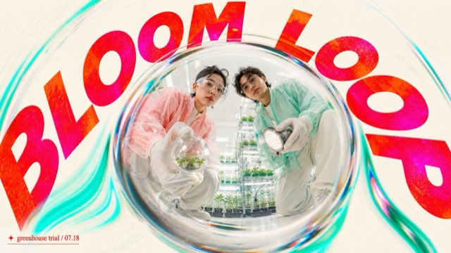</a>
<p><strong><a href="styles/chromatic-fisheye-orbit-pop-poster-style">Chromatic Fisheye Orbit Pop Poster Style</a></strong><br>
<em>Pop fisheye posters with orbiting type and chromatic arcs.</em><br>
<a href="styles/chromatic-fisheye-orbit-pop-poster-style/style.json">style.json</a> · <a href="docs/copy-prompts/chromatic-fisheye-orbit-pop-poster-style.md">prompt</a> · <a href="styles/chromatic-fisheye-orbit-pop-poster-style/preview-9x16.jpg">9:16</a></p>
</td>
<td width="33%" valign="top">
<a id="naive-marker-psa-poster-style"></a>
<a href="styles/naive-marker-psa-poster-style">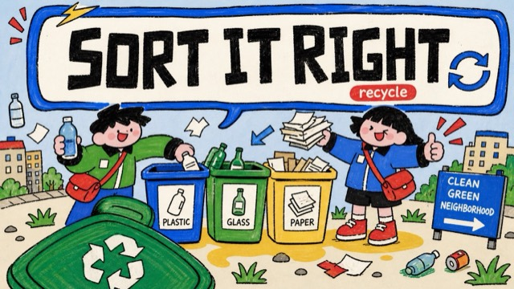</a>
<p><strong><a href="styles/naive-marker-psa-poster-style">Naive Marker PSA Poster Style</a></strong><br>
<em>Friendly civic PSA posters with naive marker drawings.</em><br>
<a href="styles/naive-marker-psa-poster-style/style.json">style.json</a> · <a href="docs/copy-prompts/naive-marker-psa-poster-style.md">prompt</a> · <a href="styles/naive-marker-psa-poster-style/preview-9x16.jpg">9:16</a></p>
</td>
</tr>
<tr>
<td width="33%" valign="top">
<a id="blue-bubble-fisheye-action-poster-style"></a>
<a href="styles/blue-bubble-fisheye-action-poster-style">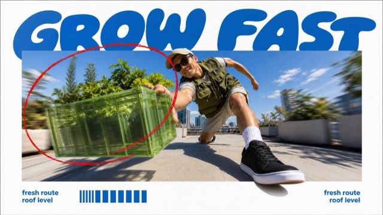</a>
<p><strong><a href="styles/blue-bubble-fisheye-action-poster-style">Blue Bubble Fisheye Action Poster Style</a></strong><br>
<em>Youth action posters with blue bubble type and fisheye photos.</em><br>
<a href="styles/blue-bubble-fisheye-action-poster-style/style.json">style.json</a> · <a href="docs/copy-prompts/blue-bubble-fisheye-action-poster-style.md">prompt</a> · <a href="styles/blue-bubble-fisheye-action-poster-style/preview-9x16.jpg">9:16</a></p>
</td>
<td width="33%" valign="top">
<a id="cozy-bedroom-doodle-companion-snapshot-style"></a>
<a href="styles/cozy-bedroom-doodle-companion-snapshot-style">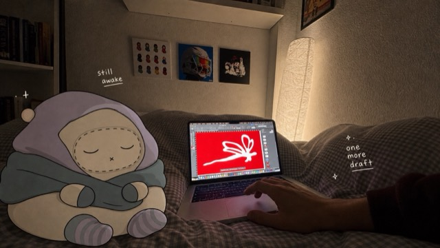</a>
<p><strong><a href="styles/cozy-bedroom-doodle-companion-snapshot-style">Cozy Bedroom Doodle Companion Snapshot Style</a></strong><br>
<em>Low-light bedroom snapshots with quiet doodle companion energy.</em><br>
<a href="styles/cozy-bedroom-doodle-companion-snapshot-style/style.json">style.json</a> · <a href="docs/copy-prompts/cozy-bedroom-doodle-companion-snapshot-style.md">prompt</a> · <a href="styles/cozy-bedroom-doodle-companion-snapshot-style/preview-9x16.jpg">9:16</a></p>
</td>
<td width="33%" valign="top">
<a id="surreal-fish-doodle-landmark-photo-collage-style"></a>
<a href="styles/surreal-fish-doodle-landmark-photo-collage-style">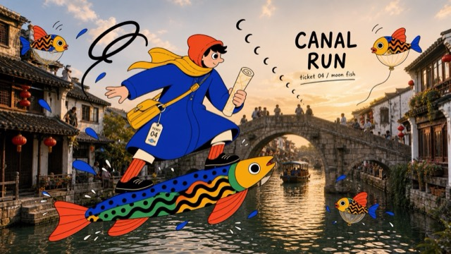</a>
<p><strong><a href="styles/surreal-fish-doodle-landmark-photo-collage-style">Surreal Fish Doodle Landmark Photo Collage Style</a></strong><br>
<em>Landmark travel photos remixed with folk-art fish doodles.</em><br>
<a href="styles/surreal-fish-doodle-landmark-photo-collage-style/style.json">style.json</a> · <a href="docs/copy-prompts/surreal-fish-doodle-landmark-photo-collage-style.md">prompt</a> · <a href="styles/surreal-fish-doodle-landmark-photo-collage-style/preview-9x16.jpg">9:16</a></p>
</td>
</tr>
<tr>
<td width="33%" valign="top">
<a id="plush-comic-toy-product-poster-style"></a>
<a href="styles/plush-comic-toy-product-poster-style">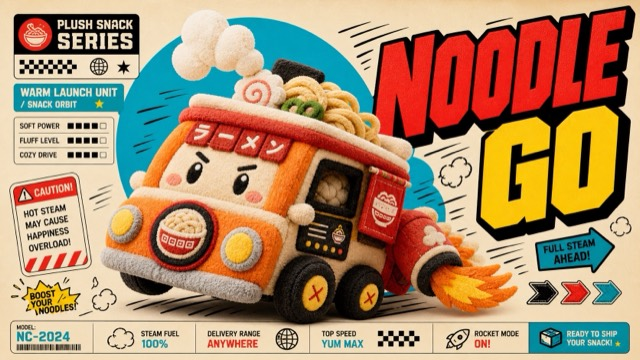</a>
<p><strong><a href="styles/plush-comic-toy-product-poster-style">Plush Comic Toy Product Poster Style</a></strong><br>
<em>Toy-product posters with fuzzy plush heroes and comic typography.</em><br>
<a href="styles/plush-comic-toy-product-poster-style/style.json">style.json</a> · <a href="docs/copy-prompts/plush-comic-toy-product-poster-style.md">prompt</a> · <a href="styles/plush-comic-toy-product-poster-style/preview-9x16.jpg">9:16</a></p>
</td>
<td width="33%" valign="top">
<a id="rough-animation-pet-sketch-storyboard-style"></a>
<a href="styles/rough-animation-pet-sketch-storyboard-style">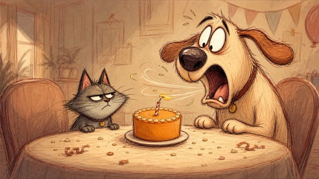</a>
<p><strong><a href="styles/rough-animation-pet-sketch-storyboard-style">Rough Animation Pet Sketch Storyboard Style</a></strong><br>
<em>Loose pet-comedy storyboard frames with warm sketch texture.</em><br>
<a href="styles/rough-animation-pet-sketch-storyboard-style/style.json">style.json</a> · <a href="docs/copy-prompts/rough-animation-pet-sketch-storyboard-style.md">prompt</a> · <a href="styles/rough-animation-pet-sketch-storyboard-style/preview-9x16.jpg">9:16</a></p>
</td>
<td width="33%" valign="top">
<a id="tri-color-hardcut-portrait-poster-style"></a>
<a href="styles/tri-color-hardcut-portrait-poster-style">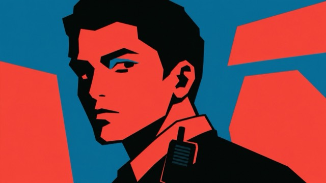</a>
<p><strong><a href="styles/tri-color-hardcut-portrait-poster-style">Tri Color Hardcut Portrait Poster Style</a></strong><br>
<em>Three-color portrait posters built from hard-edged cutout planes.</em><br>
<a href="styles/tri-color-hardcut-portrait-poster-style/style.json">style.json</a> · <a href="docs/copy-prompts/tri-color-hardcut-portrait-poster-style.md">prompt</a> · <a href="styles/tri-color-hardcut-portrait-poster-style/preview-9x16.jpg">9:16</a></p>
</td>
</tr>
<tr>
<td width="33%" valign="top">
<a id="clean-triptych-travel-vlog-thumbnail-style"></a>
<a href="styles/clean-triptych-travel-vlog-thumbnail-style">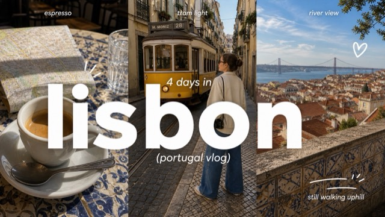</a>
<p><strong><a href="styles/clean-triptych-travel-vlog-thumbnail-style">Clean Triptych Travel Vlog Thumbnail Style</a></strong><br>
<em>Clean travel thumbnails with three photo panels and soft notes.</em><br>
<a href="styles/clean-triptych-travel-vlog-thumbnail-style/style.json">style.json</a> · <a href="docs/copy-prompts/clean-triptych-travel-vlog-thumbnail-style.md">prompt</a> · <a href="styles/clean-triptych-travel-vlog-thumbnail-style/preview-9x16.jpg">9:16</a></p>
</td>
<td width="33%" valign="top">
<a id="playful-mascot-doodle-snapshot-style"></a>
<a href="styles/playful-mascot-doodle-snapshot-style">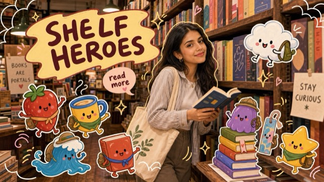</a>
<p><strong><a href="styles/playful-mascot-doodle-snapshot-style">Playful Mascot Doodle Snapshot Style</a></strong><br>
<em>Real-life snapshots layered with mascot stickers and doodles.</em><br>
<a href="styles/playful-mascot-doodle-snapshot-style/style.json">style.json</a> · <a href="docs/copy-prompts/playful-mascot-doodle-snapshot-style.md">prompt</a> · <a href="styles/playful-mascot-doodle-snapshot-style/preview-9x16.jpg">9:16</a></p>
</td>
<td width="33%" valign="top">
<a id="teenage-skate-scribble-screenprint-poster-style"></a>
<a href="styles/teenage-skate-scribble-screenprint-poster-style">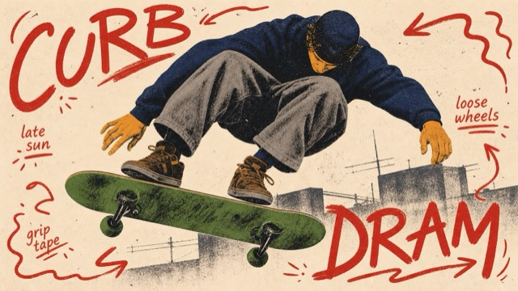</a>
<p><strong><a href="styles/teenage-skate-scribble-screenprint-poster-style">Teenage Skate Scribble Screenprint Poster Style</a></strong><br>
<em>Retro skate posters with scribbled borders and screenprint grit.</em><br>
<a href="styles/teenage-skate-scribble-screenprint-poster-style/style.json">style.json</a> · <a href="docs/copy-prompts/teenage-skate-scribble-screenprint-poster-style.md">prompt</a> · <a href="styles/teenage-skate-scribble-screenprint-poster-style/preview-9x16.jpg">9:16</a></p>
</td>
</tr>
<tr>
<td width="33%" valign="top">
<a id="impact-burst-halftone-comic-poster-style"></a>
<a href="styles/impact-burst-halftone-comic-poster-style">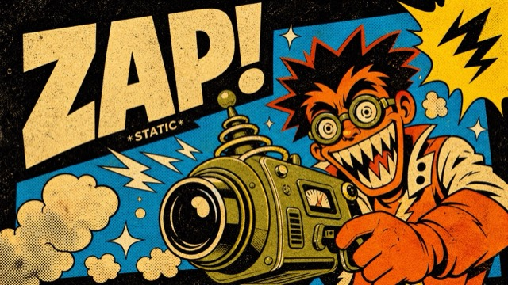</a>
<p><strong><a href="styles/impact-burst-halftone-comic-poster-style">Impact Burst Halftone Comic Poster Style</a></strong><br>
<em>Loud comic posters with impact type and halftone bursts.</em><br>
<a href="styles/impact-burst-halftone-comic-poster-style/style.json">style.json</a> · <a href="docs/copy-prompts/impact-burst-halftone-comic-poster-style.md">prompt</a> · <a href="styles/impact-burst-halftone-comic-poster-style/preview-9x16.jpg">9:16</a></p>
</td>
<td width="33%" valign="top">
<a id="sunburst-fisheye-bubble-type-poster-style"></a>
<a href="styles/sunburst-fisheye-bubble-type-poster-style">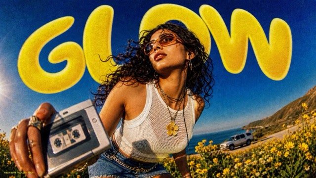</a>
<p><strong><a href="styles/sunburst-fisheye-bubble-type-poster-style">Sunburst Fisheye Bubble Type Poster Style</a></strong><br>
<em>Summer fisheye posters with sunny bubble typography.</em><br>
<a href="styles/sunburst-fisheye-bubble-type-poster-style/style.json">style.json</a> · <a href="docs/copy-prompts/sunburst-fisheye-bubble-type-poster-style.md">prompt</a> · <a href="styles/sunburst-fisheye-bubble-type-poster-style/preview-9x16.jpg">9:16</a></p>
</td>
<td width="33%" valign="top">
<a id="backseat-transit-doodle-letter-poster-style"></a>
<a href="styles/backseat-transit-doodle-letter-poster-style">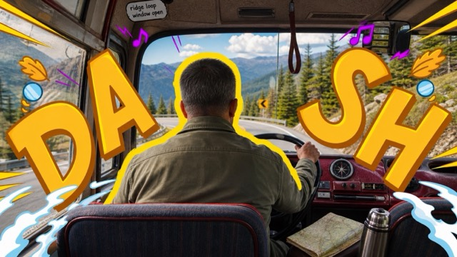</a>
<p><strong><a href="styles/backseat-transit-doodle-letter-poster-style">Backseat Transit Doodle Letter Poster Style</a></strong><br>
<em>Transit photos turned into energetic hand-lettered travel posters.</em><br>
<a href="styles/backseat-transit-doodle-letter-poster-style/style.json">style.json</a> · <a href="docs/copy-prompts/backseat-transit-doodle-letter-poster-style.md">prompt</a> · <a href="styles/backseat-transit-doodle-letter-poster-style/preview-9x16.jpg">9:16</a></p>
</td>
</tr>
<tr>
<td width="33%" valign="top">
<a id="analog-sticker-diary-portrait-poster-style"></a>
<a href="styles/analog-sticker-diary-portrait-poster-style">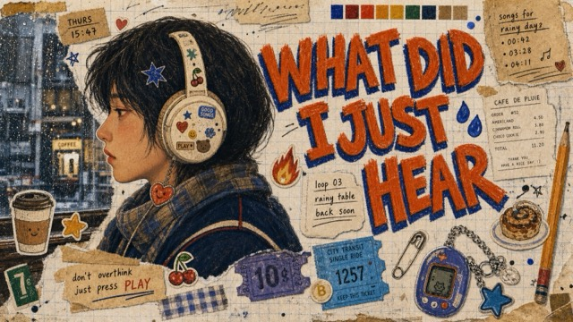</a>
<p><strong><a href="styles/analog-sticker-diary-portrait-poster-style">Analog Sticker Diary Portrait Poster Style</a></strong><br>
<em>Nostalgic diary portraits with stickers and distressed lettering.</em><br>
<a href="styles/analog-sticker-diary-portrait-poster-style/style.json">style.json</a> · <a href="docs/copy-prompts/analog-sticker-diary-portrait-poster-style.md">prompt</a> · <a href="styles/analog-sticker-diary-portrait-poster-style/preview-9x16.jpg">9:16</a></p>
</td>
<td width="33%" valign="top">
<a id="folded-diamond-perspective-type-poster-style"></a>
<a href="styles/folded-diamond-perspective-type-poster-style">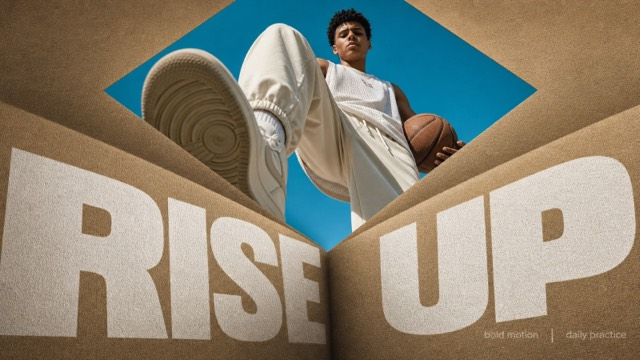</a>
<p><strong><a href="styles/folded-diamond-perspective-type-poster-style">Folded Diamond Perspective Type Poster Style</a></strong><br>
<em>Minimal diamond-aperture posters with folded perspective typography.</em><br>
<a href="styles/folded-diamond-perspective-type-poster-style/style.json">style.json</a> · <a href="docs/copy-prompts/folded-diamond-perspective-type-poster-style.md">prompt</a> · <a href="styles/folded-diamond-perspective-type-poster-style/preview-9x16.jpg">9:16</a></p>
</td>
<td width="33%" valign="top">
<a id="gothic-cat-doodle-photo-collage-style"></a>
<a href="styles/gothic-cat-doodle-photo-collage-style">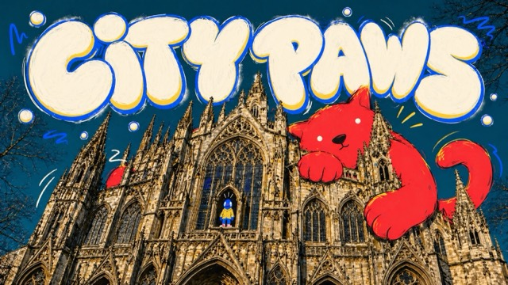</a>
<p><strong><a href="styles/gothic-cat-doodle-photo-collage-style">Gothic Cat Doodle Photo Collage Style</a></strong><br>
<em>Dramatic architecture photos with playful cartoon creature overlays.</em><br>
<a href="styles/gothic-cat-doodle-photo-collage-style/style.json">style.json</a> · <a href="docs/copy-prompts/gothic-cat-doodle-photo-collage-style.md">prompt</a> · <a href="styles/gothic-cat-doodle-photo-collage-style/preview-9x16.jpg">9:16</a></p>
</td>
</tr>
<tr>
<td width="33%" valign="top">
<a id="k-pop-apocalypse-ransom-zine-style"></a>
<a href="styles/k-pop-apocalypse-ransom-zine-style">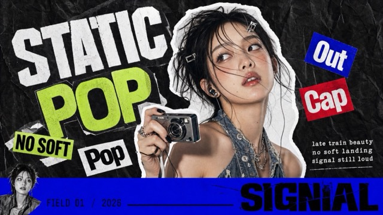</a>
<p><strong><a href="styles/k-pop-apocalypse-ransom-zine-style">K-Pop Apocalypse Ransom Zine Style</a></strong><br>
<em>Maximal K-pop zines with ransom type and sticker blocks.</em><br>
<a href="styles/k-pop-apocalypse-ransom-zine-style/style.json">style.json</a> · <a href="docs/copy-prompts/k-pop-apocalypse-ransom-zine-style.md">prompt</a> · <a href="styles/k-pop-apocalypse-ransom-zine-style/preview-9x16.jpg">9:16</a></p>
</td>
<td width="33%" valign="top">
<a id="metro-doodle-snapshot-diary-style"></a>
<a href="styles/metro-doodle-snapshot-diary-style">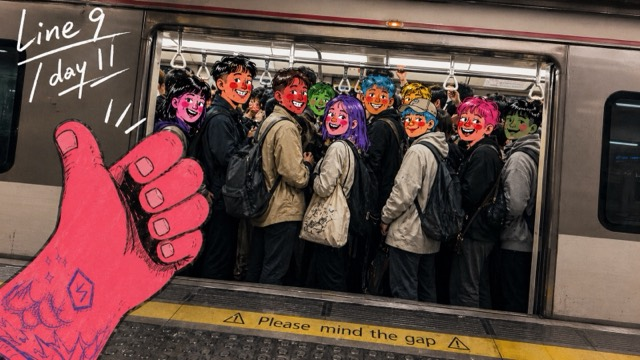</a>
<p><strong><a href="styles/metro-doodle-snapshot-diary-style">Metro Doodle Snapshot Diary</a></strong><br>
<em>Crowded transit snapshots layered with marker doodles and oversized comic faces.</em><br>
<a href="styles/metro-doodle-snapshot-diary-style/style.json">style.json</a> · <a href="docs/copy-prompts/metro-doodle-snapshot-diary-style.md">prompt</a> · <a href="styles/metro-doodle-snapshot-diary-style/preview-9x16.jpg">9:16</a></p>
</td>
<td width="33%" valign="top">
<a id="mountain-trail-monster-doodle-poster-style"></a>
<a href="styles/mountain-trail-monster-doodle-poster-style">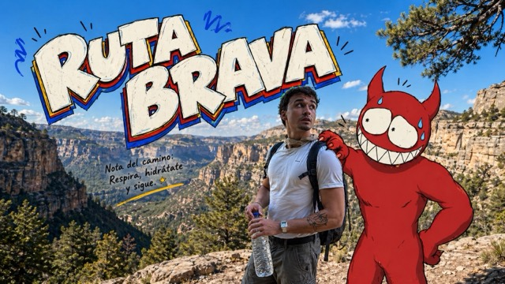</a>
<p><strong><a href="styles/mountain-trail-monster-doodle-poster-style">Mountain Trail Monster Doodle Poster Style</a></strong><br>
<em>Outdoor hiking photos remixed with monster companions and annotations.</em><br>
<a href="styles/mountain-trail-monster-doodle-poster-style/style.json">style.json</a> · <a href="docs/copy-prompts/mountain-trail-monster-doodle-poster-style.md">prompt</a> · <a href="styles/mountain-trail-monster-doodle-poster-style/preview-9x16.jpg">9:16</a></p>
</td>
</tr>
<tr>
<td width="33%" valign="top">
<a id="neon-doodle-gallery-snapshot-style"></a>
<a href="styles/neon-doodle-gallery-snapshot-style">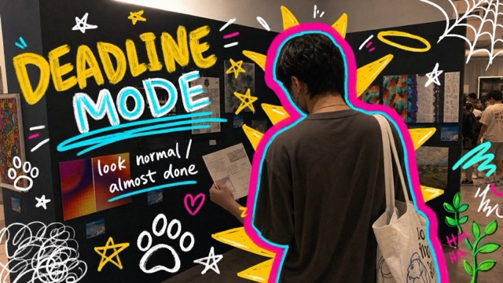</a>
<p><strong><a href="styles/neon-doodle-gallery-snapshot-style">Neon Doodle Gallery Snapshot</a></strong><br>
<em>Phone photos covered in hot neon diary doodles.</em><br>
<a href="styles/neon-doodle-gallery-snapshot-style/style.json">style.json</a> · <a href="docs/copy-prompts/neon-doodle-gallery-snapshot-style.md">prompt</a> · <a href="styles/neon-doodle-gallery-snapshot-style/preview-9x16.jpg">9:16</a></p>
</td>
<td width="33%" valign="top">
<a id="neon-kinetic-typographic-poster-style"></a>
<a href="styles/neon-kinetic-typographic-poster-style">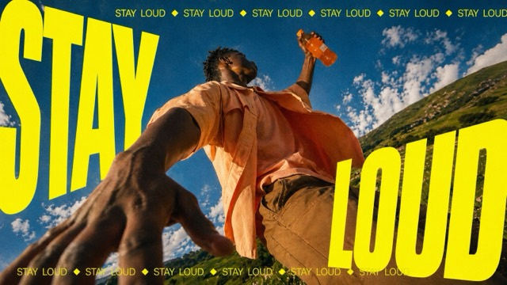</a>
<p><strong><a href="styles/neon-kinetic-typographic-poster-style">Neon Kinetic Typographic Poster</a></strong><br>
<em>Outdoor editorial posters with warped neon kinetic typography.</em><br>
<a href="styles/neon-kinetic-typographic-poster-style/style.json">style.json</a> · <a href="docs/copy-prompts/neon-kinetic-typographic-poster-style.md">prompt</a> · <a href="styles/neon-kinetic-typographic-poster-style/preview-9x16.jpg">9:16</a></p>
</td>
<td width="33%" valign="top">
<a id="orange-brush-mascot-action-poster-style"></a>
<a href="styles/orange-brush-mascot-action-poster-style">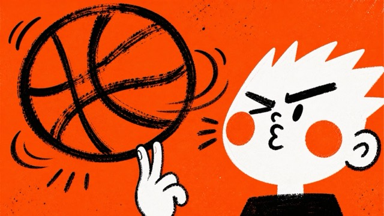</a>
<p><strong><a href="styles/orange-brush-mascot-action-poster-style">Orange Brush Mascot Action Poster Style</a></strong><br>
<em>Sparse mascot illustrations with orange brush texture and print grain.</em><br>
<a href="styles/orange-brush-mascot-action-poster-style/style.json">style.json</a> · <a href="docs/copy-prompts/orange-brush-mascot-action-poster-style.md">prompt</a> · <a href="styles/orange-brush-mascot-action-poster-style/preview-9x16.jpg">9:16</a></p>
</td>
</tr>
<tr>
<td width="33%" valign="top">
<a id="photo-illustration-overlay-poster-style"></a>
<a href="styles/photo-illustration-overlay-poster-style">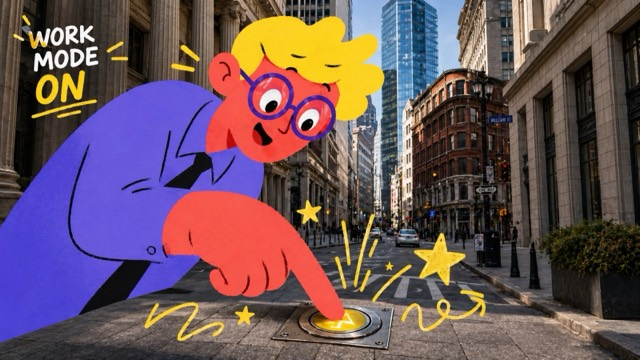</a>
<p><strong><a href="styles/photo-illustration-overlay-poster-style">Photo Illustration Overlay Poster</a></strong><br>
<em>City photos composited with saturated 2D character overlays.</em><br>
<a href="styles/photo-illustration-overlay-poster-style/style.json">style.json</a> · <a href="docs/copy-prompts/photo-illustration-overlay-poster-style.md">prompt</a> · <a href="styles/photo-illustration-overlay-poster-style/preview-9x16.jpg">9:16</a></p>
</td>
<td width="33%" valign="top">
<a id="plush-city-festival-mobile-poster-style"></a>
<a href="styles/plush-city-festival-mobile-poster-style">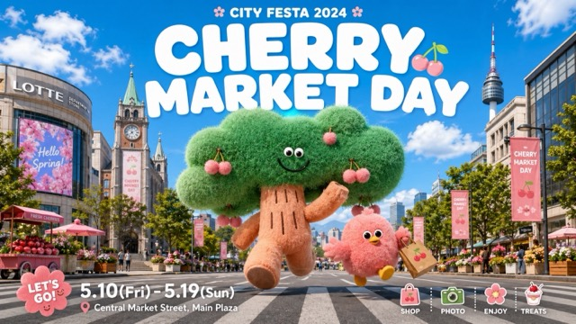</a>
<p><strong><a href="styles/plush-city-festival-mobile-poster-style">Plush City Festival Mobile Poster</a></strong><br>
<em>Mobile city-event posters with fuzzy mascots and app-card framing.</em><br>
<a href="styles/plush-city-festival-mobile-poster-style/style.json">style.json</a> · <a href="docs/copy-prompts/plush-city-festival-mobile-poster-style.md">prompt</a> · <a href="styles/plush-city-festival-mobile-poster-style/preview-9x16.jpg">9:16</a></p>
</td>
<td width="33%" valign="top">
<a id="pop-bubble-letter-photo-poster-style"></a>
<a href="styles/pop-bubble-letter-photo-poster-style">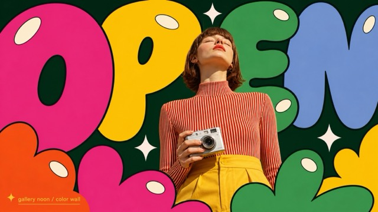</a>
<p><strong><a href="styles/pop-bubble-letter-photo-poster-style">Pop Bubble Letter Photo Poster Style</a></strong><br>
<em>Fashion photo posters framed by candy-colored bubble letters.</em><br>
<a href="styles/pop-bubble-letter-photo-poster-style/style.json">style.json</a> · <a href="docs/copy-prompts/pop-bubble-letter-photo-poster-style.md">prompt</a> · <a href="styles/pop-bubble-letter-photo-poster-style/preview-9x16.jpg">9:16</a></p>
</td>
</tr>
<tr>
<td width="33%" valign="top">
<a id="soft-analog-future-editorial-poster-style"></a>
<a href="styles/soft-analog-future-editorial-poster-style">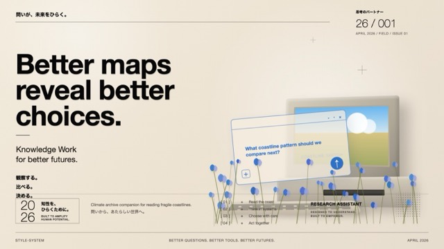</a>
<p><strong><a href="styles/soft-analog-future-editorial-poster-style">Soft Analog Future Editorial Poster</a></strong><br>
<em>Quiet analog-future editorials with grids and retro technology.</em><br>
<a href="styles/soft-analog-future-editorial-poster-style/style.json">style.json</a> · <a href="docs/copy-prompts/soft-analog-future-editorial-poster-style.md">prompt</a> · <a href="styles/soft-analog-future-editorial-poster-style/preview-9x16.jpg">9:16</a></p>
</td>
<td width="33%" valign="top">
<a id="subway-doodle-photo-hybrid-style"></a>
<a href="styles/subway-doodle-photo-hybrid-style">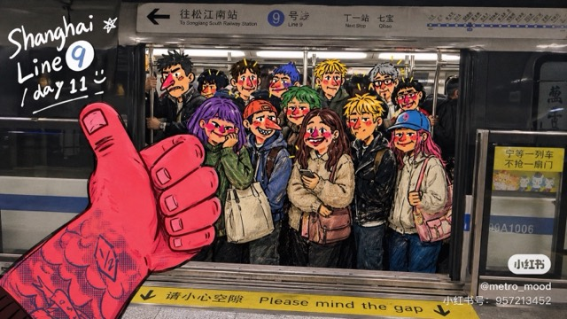</a>
<p><strong><a href="styles/subway-doodle-photo-hybrid-style">Subway Doodle Photo Hybrid</a></strong><br>
<em>Subway photos overlaid with social-media-style cartoon doodles and handwritten notes.</em><br>
<a href="styles/subway-doodle-photo-hybrid-style/style.json">style.json</a> · <a href="docs/copy-prompts/subway-doodle-photo-hybrid-style.md">prompt</a> · <a href="styles/subway-doodle-photo-hybrid-style/preview-9x16.jpg">9:16</a></p>
</td>
<td width="33%" valign="top">
<a id="tokyo-kawaii-travel-collage-poster-style"></a>
<a href="styles/tokyo-kawaii-travel-collage-poster-style">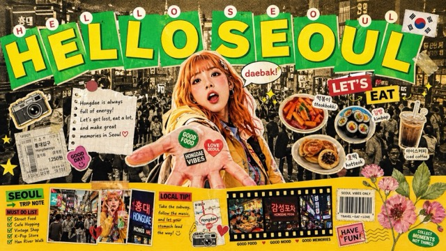</a>
<p><strong><a href="styles/tokyo-kawaii-travel-collage-poster-style">Tokyo Kawaii Travel Collage Poster</a></strong><br>
<em>Maximal Tokyo travel collages with manga bubbles and stickers.</em><br>
<a href="styles/tokyo-kawaii-travel-collage-poster-style/style.json">style.json</a> · <a href="docs/copy-prompts/tokyo-kawaii-travel-collage-poster-style.md">prompt</a> · <a href="styles/tokyo-kawaii-travel-collage-poster-style/preview-9x16.jpg">9:16</a></p>
</td>
</tr>
<tr>
<td width="33%" valign="top">
<a id="urban-transit-doodle-diary-style"></a>
<a href="styles/urban-transit-doodle-diary-style">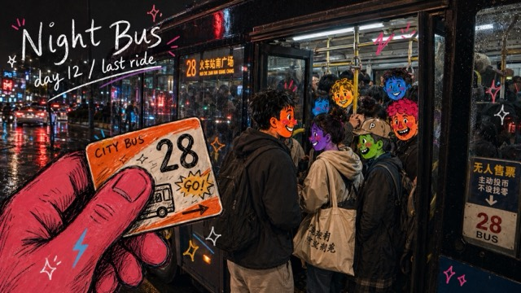</a>
<p><strong><a href="styles/urban-transit-doodle-diary-style">Urban Transit Doodle Diary Style</a></strong><br>
<em>Public-space photos remixed with bold foreground gestures and travel diary notes.</em><br>
<a href="styles/urban-transit-doodle-diary-style/style.json">style.json</a> · <a href="docs/copy-prompts/urban-transit-doodle-diary-style.md">prompt</a> · <a href="styles/urban-transit-doodle-diary-style/preview-9x16.jpg">9:16</a></p>
</td>
<td width="33%" valign="top">
<a id="y2k-grunge-hiphop-cutout-poster-style"></a>
<a href="styles/y2k-grunge-hiphop-cutout-poster-style">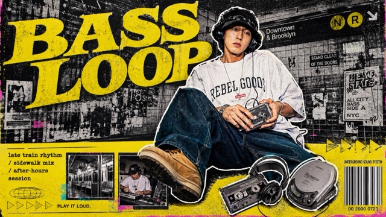</a>
<p><strong><a href="styles/y2k-grunge-hiphop-cutout-poster-style">Y2K Grunge Hip-Hop Cutout Poster Style</a></strong><br>
<em>Y2K hip-hop collage posters with acid type and photocopy grit.</em><br>
<a href="styles/y2k-grunge-hiphop-cutout-poster-style/style.json">style.json</a> · <a href="docs/copy-prompts/y2k-grunge-hiphop-cutout-poster-style.md">prompt</a> · <a href="styles/y2k-grunge-hiphop-cutout-poster-style/preview-9x16.jpg">9:16</a></p>
</td>
</tr>
</table>

## 公開方針

- 1 つのディレクトリ = 1 つのスタイル
- 新しいスタイルは注目スタイルと All Styles ギャラリーに先に表示し、詳しい説明は [docs/CATALOG.md](docs/CATALOG.md) に追加します
- main ブランチには各スタイルの `style.json` と 2 枚の JPG プレビューのみを配置します
- 完全なギャラリーはこのリポジトリには含めません
- 元の参考画像、透かし、プラットフォームロゴ、QR コード、アカウント情報、非公開プロンプト、未許可のブランド素材は公開しません

## Contributing

新しいスタイルを投稿する場合は、[CONTRIBUTING.md](CONTRIBUTING.md) の公開パッケージ構成、検証ルール、PR checklist に従ってください。

## ライセンス

コード、スクリプト、ドキュメントは [MIT ライセンス](LICENSE) です。`style.json` のプロンプト内容は [CC BY 4.0](https://creativecommons.org/licenses/by/4.0/) でライセンスされています——[@VigoCreativeAI](https://x.com/VigoCreativeAI) のクレジット表記のうえ、自由に再利用・改変できます。プレビュー画像は視覚参照として含まれています。
