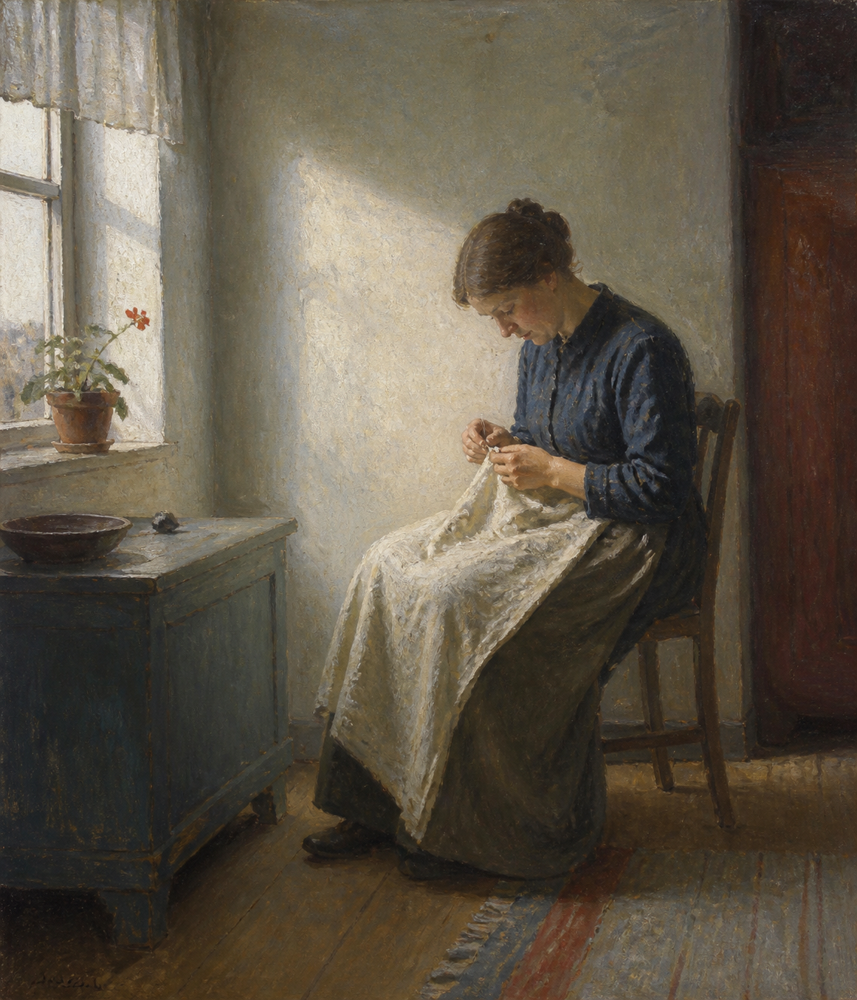
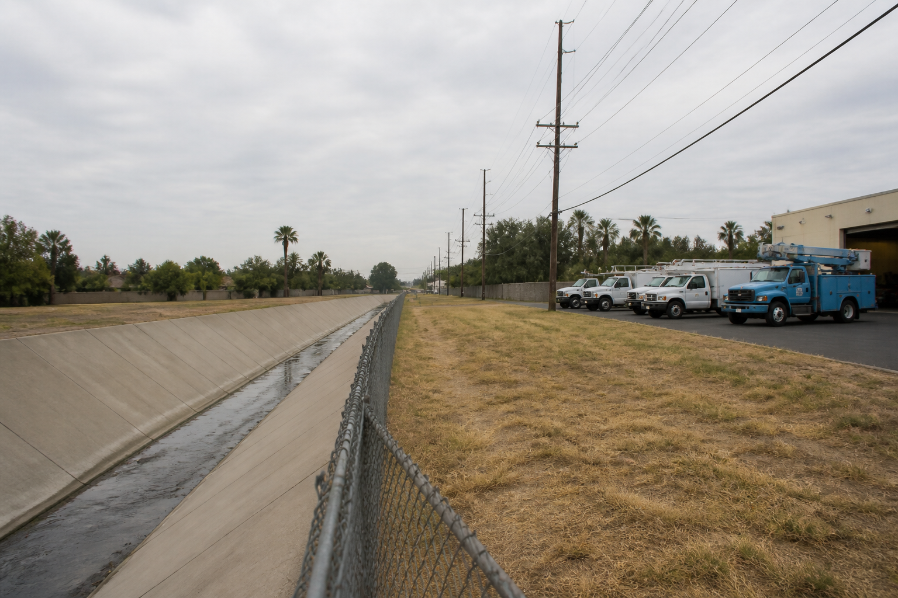

# OhMyStyle

[](https://www.python.org/)
[](LICENSE)
[](docs/DEMO-PACKAGES.md)
[](docs/CATALOG.md)

OhMyStyle is an independent, model-agnostic toolkit for building reproducible
visual-style packages for image generation.

It organizes visual knowledge into executable packages for artists,
photographers, schools, movements, techniques, game-art systems, and original
presets. Each package can describe its visual signature, process, references,
provenance, prompt constraints, evaluation rules, and anonymous generated
examples.

The repository is designed for both strong and weak image models. A model may
interpret the scene, but the package and runtime keep the style requirements,
references, safety rules, and evaluation steps explicit.

## Overview

```text
Style Package
    ↓
Preflight task
    ↓
Provider-neutral prompt job
    ↓
Model / provider adapter
    ↓
Generated image
    ↓
Mask + deterministic postprocess when required
    ↓
Metrics + human review
```

The runtime is not an image model, a training dataset, or a promise of exact
replication of any artist's work. It translates observable visual decisions
into reusable instructions and makes uncertainty visible.

## Getting Started

### Installation

Install the local validation and runtime dependencies:

```bash
git clone https://github.com/ZhouYinLong-lab/OhMyStyle.git
cd OhMyStyle
python -m pip install -r requirements-dev.txt
```

Compile a package into a provider-neutral job:

```bash
python tools/compile-style.py \
  style-packages/schools/new-topographics \
  --subject "a quiet coastal public pool after summer" \
  --profile weak \
  --var LOCATION="a small coastal town" \
  --var BACKGROUND_ELEMENTS="closed pool equipment and empty deck chairs" \
  --output tmp/new-topographics-job.json
```

For a strict task, run preflight before generation:

```bash
python tools/preflight-render.py tasks/same-luminance-portrait.yaml
```

The complete workflow is documented in [Executable Style Package
Workflow](docs/EXECUTABLE-WORKFLOW.md). Automatic semantic-mask adapters and
safe color segmentation are documented in [Mask
Adapters](docs/MASK-ADAPTERS.md).

## Executable style package gallery

These are the current structured packages. The linked `anonymous-v1.png`
files are generated demonstrations of package behavior, not source artworks.
Reference manifests record provenance and rights status separately.

### Artists

| Preview | Package | Focus |
| --- | --- | --- |
|  | [Anna Ancher](style-packages/artists/anna-ancher/) | Northern daylight, domestic interiors, working figures, restrained color planes |

### Photographers

| Preview | Package | Focus |
| --- | --- | --- |
|  | [Masahisa Fukase](style-packages/photographers/masahisa-fukase/) | Serial observation, intimacy, recurring motifs, psychological distance |

### Movements and schools

| Preview | Package | Focus |
| --- | --- | --- |
|  | [Greek Geometric Period](style-packages/movements/greek-geometric-period/) | Registers, angular signs, terracotta, repeated motifs |
|  | [Greek Archaic Period](style-packages/movements/greek-archaic-period/) | Contour narrative, ceramic fields, patterned naturalism |
|  | [Greek Classical Period](style-packages/movements/greek-classical-period/) | Proportion, balance, measured weight shift, lucid space |
|  | [Greek Hellenistic Period](style-packages/movements/greek-hellenistic-period/) | Torsion, diagonal force, pathos, varied bodies |
|  | [Italian High Renaissance](style-packages/movements/italian-high-renaissance-raphaelesque/) | Drawing, proportion, clear space, calm narrative action |
|  | [Neue Sachlichkeit](style-packages/movements/neue-sachlichkeit/) | Matter-of-fact realism, social typology, precise surfaces |
|  | [New Topographics](style-packages/schools/new-topographics/) | Human-altered terrain, neutral description, documentary order |

### Techniques

| Preview | Package | Focus |
| --- | --- | --- |
|  | [Gum Bichromate](style-packages/techniques/gum-bichromate/) | Pigment, paper, contact exposure, layered hand control |

### Game art

| Preview | Package | Focus |
| --- | --- | --- |
|  | [ZX Spectrum Attribute Pixel Art](style-packages/game-art/zx-spectrum-attribute-pixel/) | 256×192 raster, 8×8 attribute cells, compact palette, color clash |

### Original presets

| Preview | Package | Focus |
| --- | --- | --- |
|  | [Quiet Documentary](styles/quiet-documentary/) | Independent available-light photography preset |
| — | [High-Chroma Color Pairing](style-packages/presets/high-chroma-color-pairing/) | Subject-neutral color-pair system with area-ratio and luminance checks |

## Reference, provenance, and rights

Reference images are not automatically treated as style templates or training
assets. A package must state the role of each reference and record its source,
license, attribution, and usage boundary in its manifest or provenance file.

The repository prefers:

- link-only references when redistribution rights are not established;
- anonymous generated examples for demonstrating package behavior;
- observable visual descriptions instead of copying a named work's exact
  composition, characters, text, or signature;
- explicit separation between historical reference material and new package
  content.

Do not upload an artwork, screenshot, watermark, platform interface, private
prompt, brand asset, or source image unless the repository records a valid
right to redistribute it.

## Legacy style.json catalog

The original `styles/` directory remains available as a separate legacy
catalog of 110 lightweight `style.json` entries. It is not the same data model
as the executable packages above.

Browse the legacy catalog by broad direction:

- [Photo and Doodle](docs/CATALOG.md) — snapshots, lifestyle scenes, and hand-drawn overlays
- [Zine and Collage](docs/CATALOG.md) — editorial, music, and cut-paper systems
- [Type Posters](docs/CATALOG.md) — headline-led poster compositions
- [Travel and City](docs/CATALOG.md) — roadside, urban, and destination treatments
- [Editorial and Minimal](docs/CATALOG.md) — quieter structured layouts

The full descriptions and file links are in [docs/CATALOG.md](docs/CATALOG.md).
Legacy entries retain their inherited folder structure and licensing scope.

## Repository structure

```text
OhMyStyle/
├── style-packages/             # Executable packages by domain and direction
│   ├── artists/
│   ├── photographers/
│   ├── movements/
│   ├── schools/
│   ├── techniques/
│   ├── game-art/
│   └── presets/
├── styles/                     # Legacy style.json catalog
├── schema/                     # Package and render-task schemas
├── tasks/                      # Strict and fuzzy render task examples
├── tools/                      # Compiler, preflight, masks, metrics, validators
├── docs/                       # Workflow, package notes, catalog, provenance guidance
├── assets/                     # Legacy catalog preview assets
├── NOTICE                      # Attribution and inherited licensing boundaries
├── LICENSE                     # Preserved applicable license text
└── README.md
```

## Validation

Run the checks before publishing a package or changing the runtime:

```bash
python -m unittest discover -s tests -v
python tools/validate-package.py style-packages
python tools/validate.py
python scripts/validate-style-json.py
git diff --check
```

## Reporting Issues

Please open an issue with the affected package or tool, the exact command,
the model/provider adapter involved, and a minimal reproducible example. Do
not attach copyrighted source artwork or private prompts unless you have the
right to redistribute them.

## Contributing

For a new executable package, start with [Demo Package
Set](docs/DEMO-PACKAGES.md), provide a complete provenance record, and keep
reference rights explicit. For a legacy `style.json` entry, follow
[CONTRIBUTING.md](CONTRIBUTING.md) and its folder-level validation rules.

Please do not present a package as an exact reproduction of a living artist's
or photographer's work. Describe observable techniques, compositional habits,
materials, lighting, and context, and keep new content independently authored.

## Acknowledgements

The runtime uses Python, Pillow, PyYAML, JSON Schema validation, and GitHub as
its open tooling foundation. Historical context and reference provenance are
recorded per package; acknowledgements do not transfer ownership of external
artworks or imply endorsement by their creators or institutions.

## Project origin and licensing

OhMyStyle is independently maintained and is not a GitHub fork. It began from
the repository structure and selected materials of the original [AI Visual
Prompt Cookbook](https://github.com/VigoZhao/AI-Visual-Prompt-Cookbook), which is
credited in [NOTICE](NOTICE).

The applicable license and attribution boundaries differ between inherited
code, legacy prompt content, preview assets, external references, and new
package material. Read [LICENSE](LICENSE) and [NOTICE](NOTICE) before copying
or redistributing any part of the repository. Do not infer artwork rights from
the presence of a link or an image in the catalog.
