# OhMyStyle

[English](README.en.md)

 

OhMyStyle 是一个面向生图用户的视觉风格预设库。你可以从艺术家、摄影师、艺术流派、工艺、游戏美术和原创预设中选择一个独立风格包，再把它用于自己的主题。

想要新增风格包？请从[风格包贡献工作流](CONTRIBUTING.md#创建一个包)开始；模板位于 [`templates/style-package`](templates/style-package)，创建命令会生成完整目录、双语说明、来源清单、Prompt 和评估骨架。

## 风格包画廊

主画廊只展示独立风格包。所有卡片统一使用横版 16:9 代表图，点击图片或名称进入风格包 README。

### 艺术家

<table>
<tr>
<td width="33%" valign="top" align="center"><a href="style-packages/artists/georges-seurat/README.md">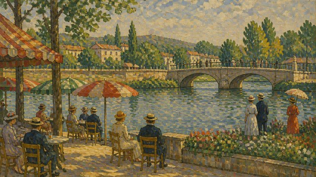</a> <strong>乔治·修拉</strong> <a href="style-packages/artists/georges-seurat/README.md">打开 README</a></td>
<td width="33%" valign="top" align="center"><a href="style-packages/artists/henri-matisse/README.md">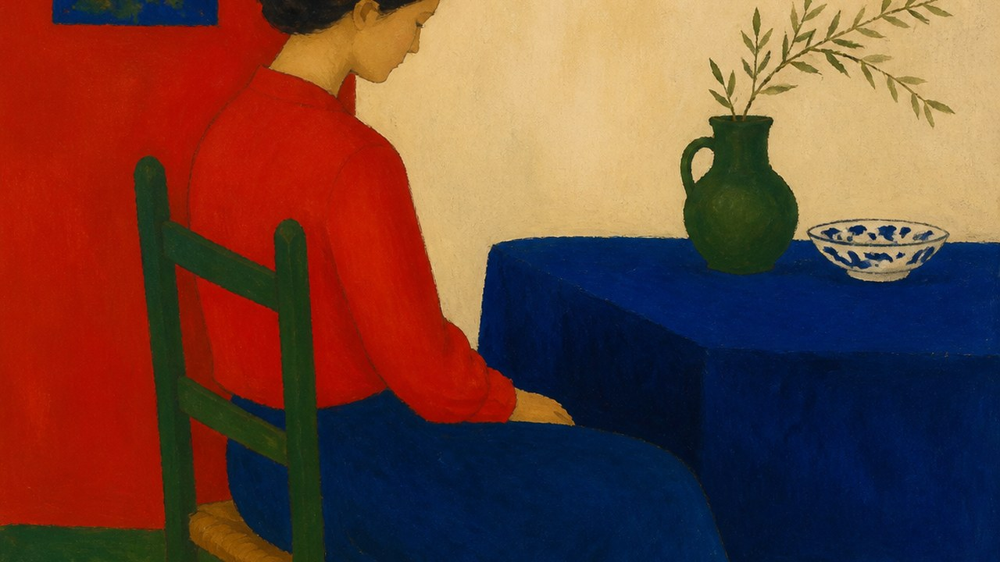</a> <strong>亨利·马蒂斯</strong> <a href="style-packages/artists/henri-matisse/README.md">打开 README</a></td>
<td width="33%" valign="top" align="center"><a href="style-packages/artists/rembrandt/README.md">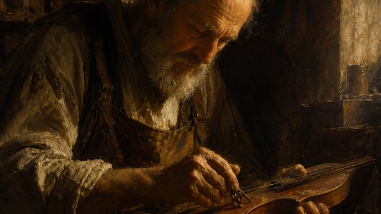</a> <strong>伦勃朗·范·莱因</strong> <a href="style-packages/artists/rembrandt/README.md">打开 README</a></td>
</tr>
<tr>
<td width="33%" valign="top" align="center"><a href="style-packages/artists/paul-cezanne/README.md">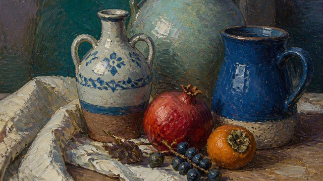</a> <strong>保罗·塞尚</strong> <a href="style-packages/artists/paul-cezanne/README.md">打开 README</a></td>
<td width="33%" valign="top" align="center"><a href="style-packages/artists/paul-gauguin/README.md">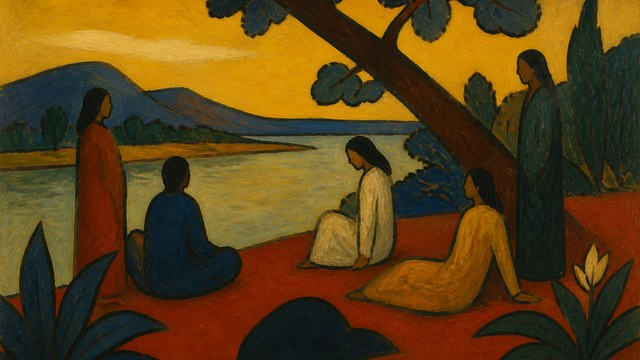</a> <strong>保罗·高更</strong> <a href="style-packages/artists/paul-gauguin/README.md">打开 README</a></td>
<td width="33%" valign="top" align="center"><a href="style-packages/artists/claude-monet/README.md">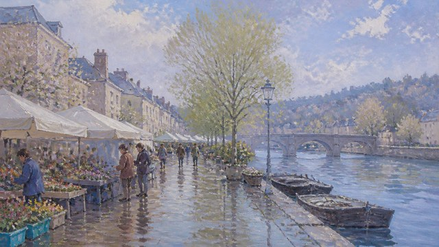</a> <strong>克劳德·莫奈</strong> <a href="style-packages/artists/claude-monet/README.md">打开 README</a></td>
</tr>
<tr>
<td width="33%" valign="top" align="center"><a href="style-packages/artists/caravaggio/README.md">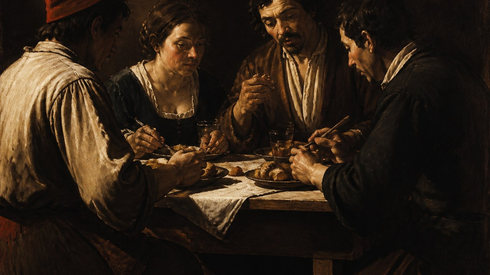</a> <strong>卡拉瓦乔</strong> <a href="style-packages/artists/caravaggio/README.md">打开 README</a></td>
<td width="33%" valign="top" align="center"><a href="style-packages/artists/gustave-courbet/README.md">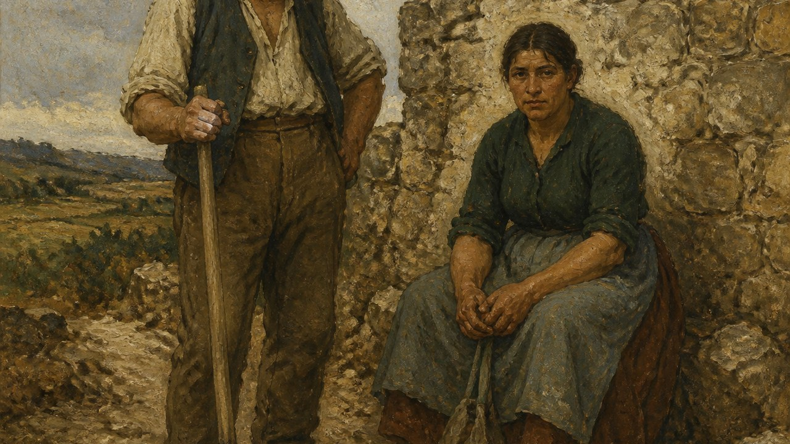</a> <strong>古斯塔夫·库尔贝</strong> <a href="style-packages/artists/gustave-courbet/README.md">打开 README</a></td>
<td width="33%" valign="top" align="center"><a href="style-packages/artists/el-greco/README.md">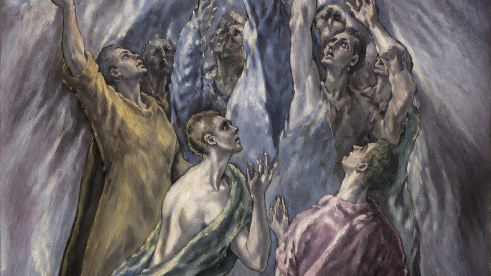</a> <strong>埃尔·格列柯</strong> <a href="style-packages/artists/el-greco/README.md">打开 README</a></td>
</tr>
<tr>
<td width="33%" valign="top" align="center"><a href="style-packages/artists/edgar-degas/README.md">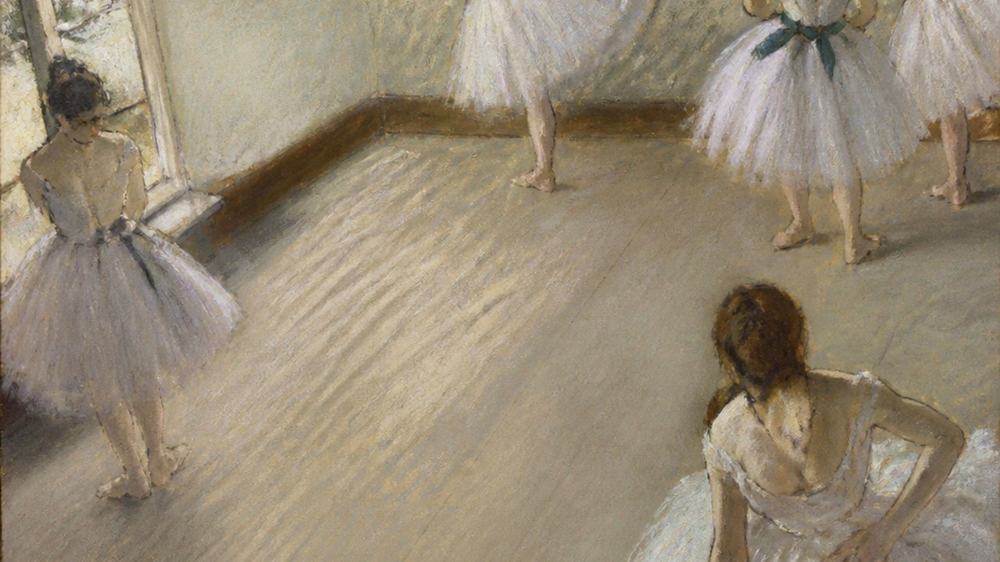</a> <strong>埃德加·德加</strong> <a href="style-packages/artists/edgar-degas/README.md">打开 README</a></td>
<td width="33%" valign="top" align="center"><a href="style-packages/artists/anna-ancher/README.md">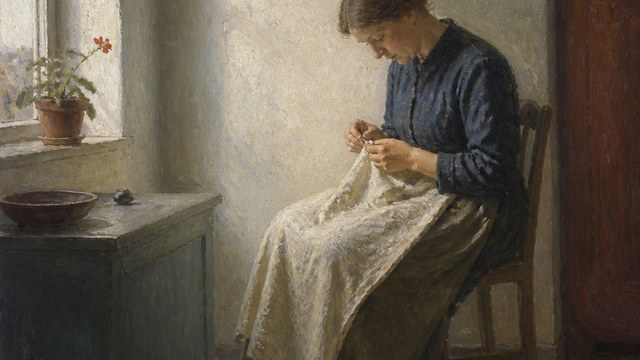</a> <strong>安娜·安彻</strong> <a href="style-packages/artists/anna-ancher/README.md">打开 README</a></td>
<td width="33%" valign="top" align="center"><a href="style-packages/artists/pablo-picasso/README.md">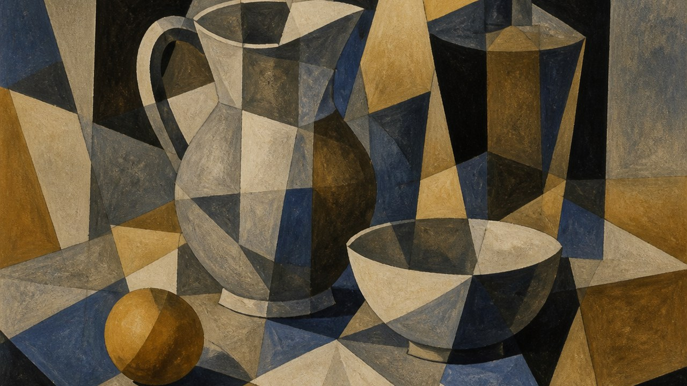</a> <strong>巴勃罗·毕加索</strong> <a href="style-packages/artists/pablo-picasso/README.md">打开 README</a></td>
</tr>
<tr>
<td width="33%" valign="top" align="center"><a href="style-packages/artists/francisco-goya/README.md">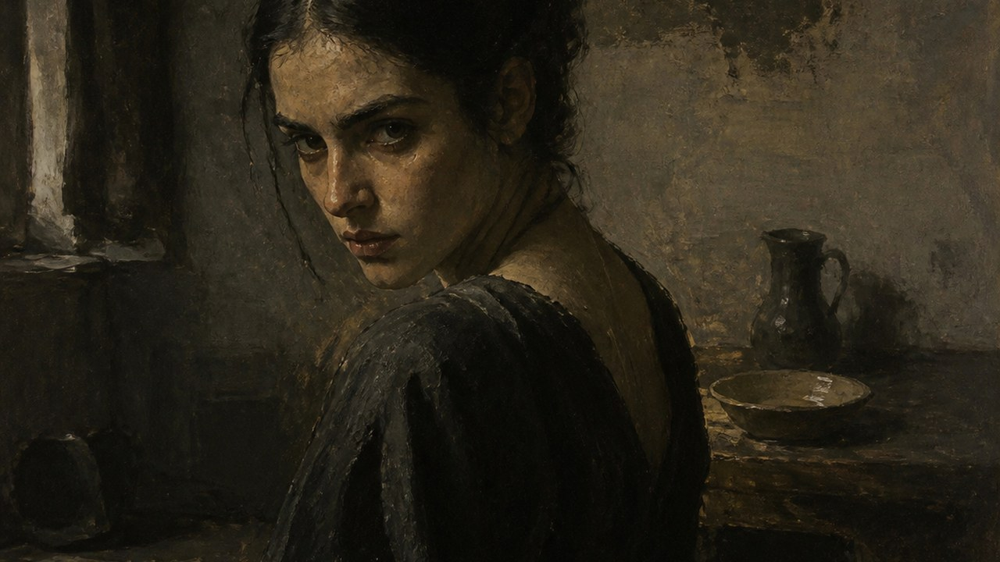</a> <strong>弗朗西斯科·戈雅</strong> <a href="style-packages/artists/francisco-goya/README.md">打开 README</a></td>
<td width="33%" valign="top" align="center"><a href="style-packages/artists/raphael-sanzio/README.md">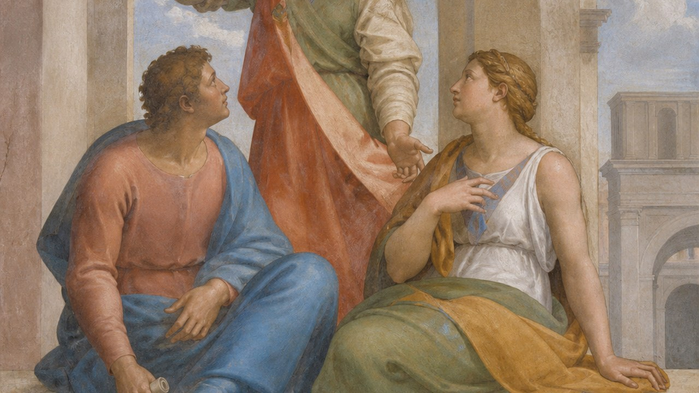</a> <strong>拉斐尔</strong> <a href="style-packages/artists/raphael-sanzio/README.md">打开 README</a></td>
<td width="33%" valign="top" align="center"><a href="style-packages/artists/vincent-van-gogh/README.md">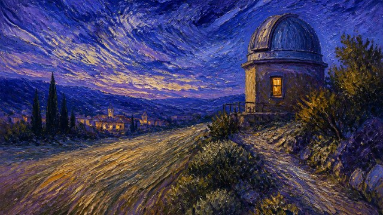</a> <strong>文森特·梵高</strong> <a href="style-packages/artists/vincent-van-gogh/README.md">打开 README</a></td>
</tr>
<tr>
<td width="33%" valign="top" align="center"><a href="style-packages/artists/grant-wood/README.md">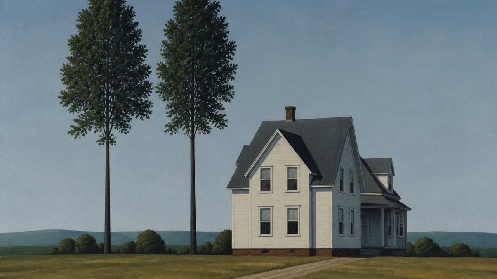</a> <strong>格兰特·伍德</strong> <a href="style-packages/artists/grant-wood/README.md">打开 README</a></td>
<td width="33%" valign="top" align="center"><a href="style-packages/artists/eugene-delacroix/README.md">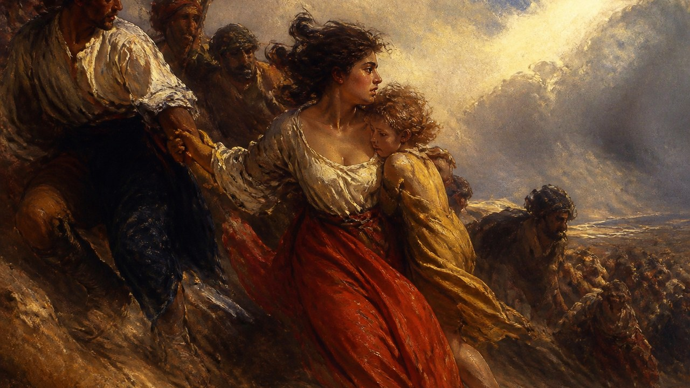</a> <strong>欧仁·德拉克罗瓦</strong> <a href="style-packages/artists/eugene-delacroix/README.md">打开 README</a></td>
<td width="33%" valign="top" align="center"><a href="style-packages/artists/edvard-munch/README.md">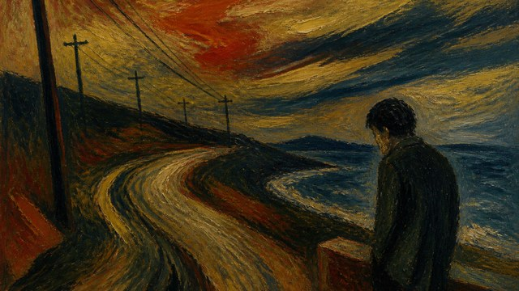</a> <strong>爱德华·蒙克</strong> <a href="style-packages/artists/edvard-munch/README.md">打开 README</a></td>
</tr>
<tr>
<td width="33%" valign="top" align="center"><a href="style-packages/artists/wassily-kandinsky/README.md">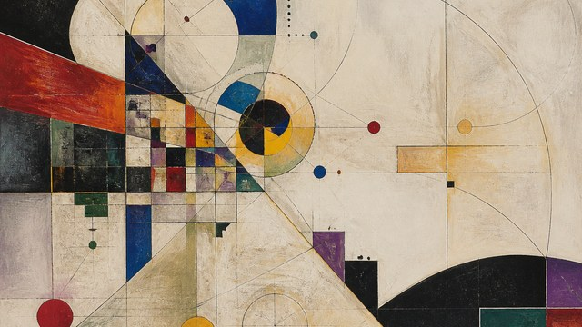</a> <strong>瓦西里·康定斯基</strong> <a href="style-packages/artists/wassily-kandinsky/README.md">打开 README</a></td>
<td width="33%" valign="top" align="center"><a href="style-packages/artists/pierre-auguste-renoir/README.md">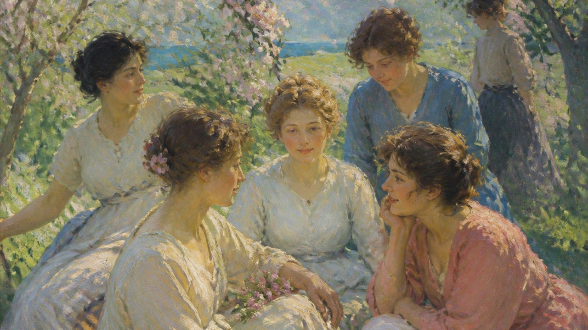</a> <strong>皮埃尔-奥古斯特·雷诺阿</strong> <a href="style-packages/artists/pierre-auguste-renoir/README.md">打开 README</a></td>
<td width="33%" valign="top" align="center"><a href="style-packages/artists/michelangelo-buonarroti/README.md">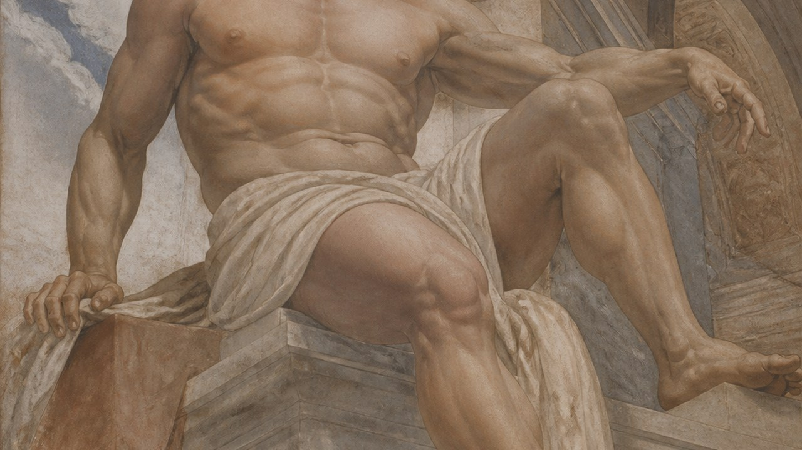</a> <strong>米开朗基罗</strong> <a href="style-packages/artists/michelangelo-buonarroti/README.md">打开 README</a></td>
</tr>
<tr>
<td width="33%" valign="top" align="center"><a href="style-packages/artists/jmw-turner/README.md">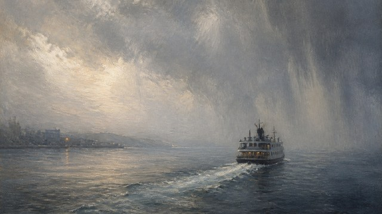</a> <strong>约瑟夫·马洛德·威廉·透纳</strong> <a href="style-packages/artists/jmw-turner/README.md">打开 README</a></td>
<td width="33%" valign="top" align="center"><a href="style-packages/artists/johannes-vermeer/README.md">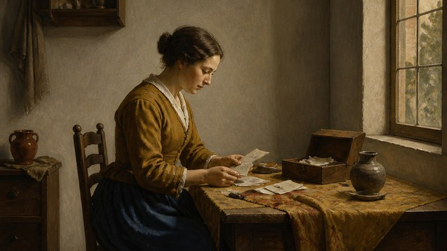</a> <strong>约翰内斯·维米尔</strong> <a href="style-packages/artists/johannes-vermeer/README.md">打开 README</a></td>
<td width="33%" valign="top" align="center"><a href="style-packages/artists/pieter-bruegel-the-elder/README.md">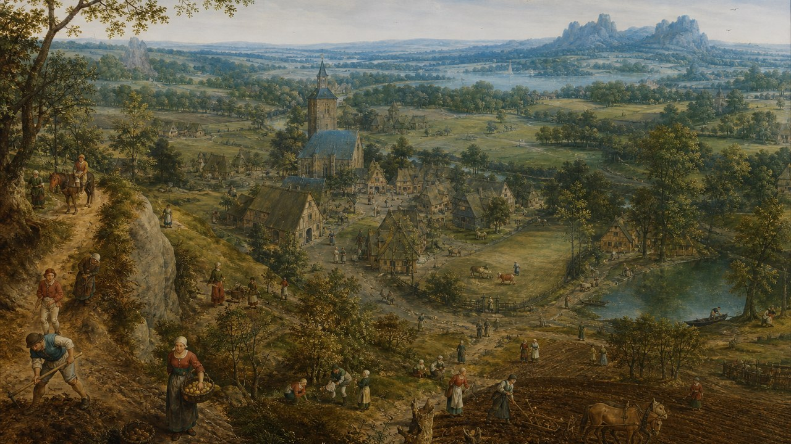</a> <strong>老彼得·勃鲁盖尔</strong> <a href="style-packages/artists/pieter-bruegel-the-elder/README.md">打开 README</a></td>
</tr>
<tr>
<td width="33%" valign="top" align="center"><a href="style-packages/artists/joan-miro/README.md">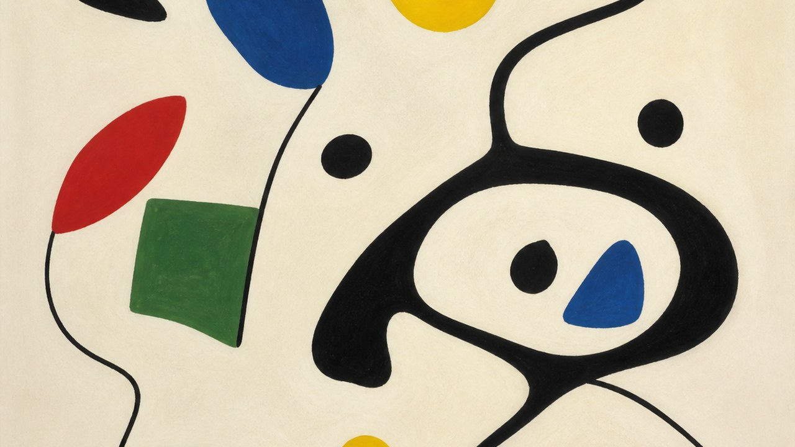</a> <strong>胡安·米罗</strong> <a href="style-packages/artists/joan-miro/README.md">打开 README</a></td>
<td width="33%" valign="top" align="center"><a href="style-packages/artists/leonardo-da-vinci/README.md">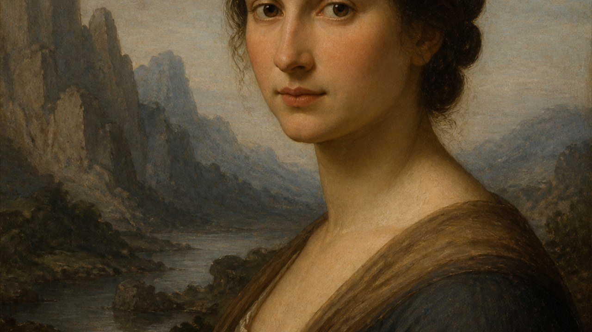</a> <strong>莱昂纳多·达·芬奇</strong> <a href="style-packages/artists/leonardo-da-vinci/README.md">打开 README</a></td>
<td width="33%" valign="top" align="center"> <strong>迭戈·委拉斯开兹</strong> <a href="style-packages/artists/diego-velazquez/README.md">打开 README</a></td>
</tr>
</table>

### 游戏美术

<table>
<tr>
<td width="33%" valign="top" align="center"><a href="style-packages/game-art/low-poly-adventure-game-art/README.md">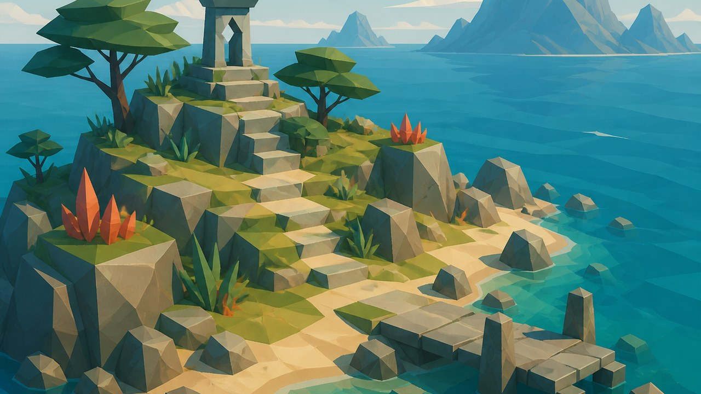</a> <strong>低多边形冒险游戏美术</strong> <a href="style-packages/game-art/low-poly-adventure-game-art/README.md">打开 README</a></td>
<td width="33%" valign="top" align="center"><a href="style-packages/game-art/top-down-16-bit-adventure/README.md">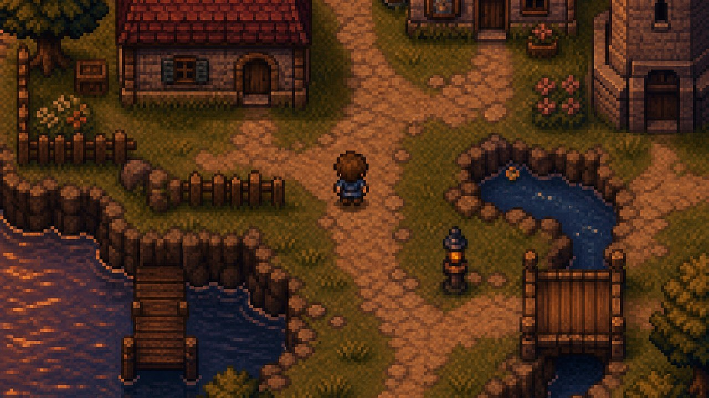</a> <strong>俯视角16位冒险美术</strong> <a href="style-packages/game-art/top-down-16-bit-adventure/README.md">打开 README</a></td>
<td width="33%" valign="top" align="center"><a href="style-packages/game-art/zx-spectrum-attribute-pixel/README.md">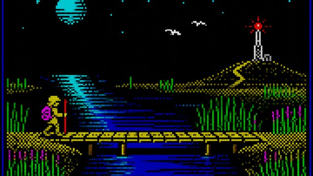</a> <strong>属性受限像素美术</strong> <a href="style-packages/game-art/zx-spectrum-attribute-pixel/README.md">打开 README</a></td>
</tr>
<tr>
<td width="33%" valign="top" align="center"><a href="style-packages/game-art/side-scrolling-platformer-pixel/README.md">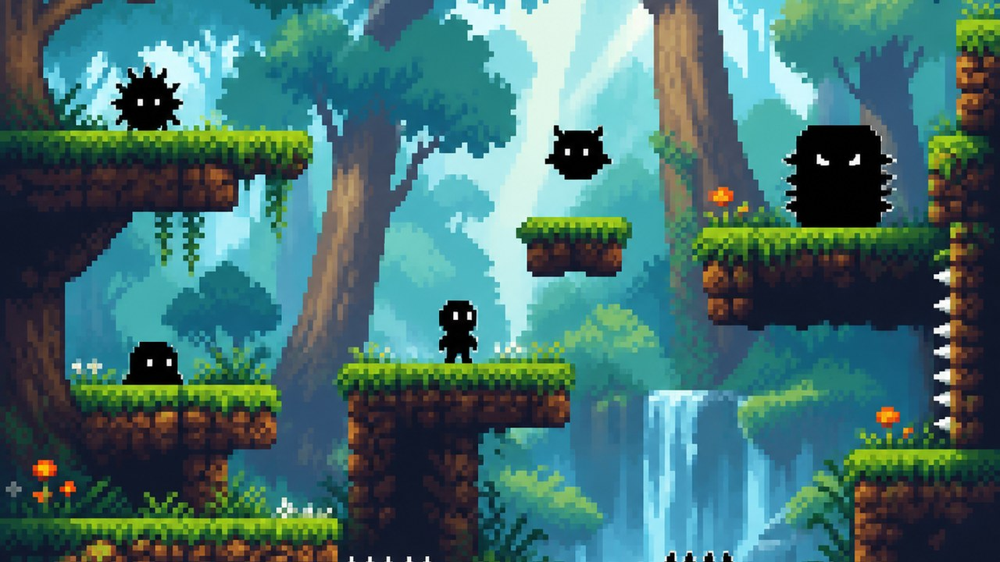</a> <strong>横版平台跳跃像素美术</strong> <a href="style-packages/game-art/side-scrolling-platformer-pixel/README.md">打开 README</a></td>
<td width="33%" valign="top" align="center"><a href="style-packages/game-art/cinematic-pixel-adventure/README.md">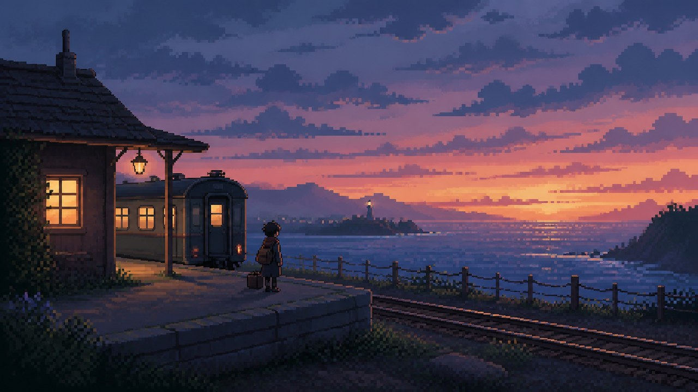</a> <strong>电影化像素冒险美术</strong> <a href="style-packages/game-art/cinematic-pixel-adventure/README.md">打开 README</a></td>
<td width="33%" valign="top" align="center"><a href="style-packages/game-art/isometric-pixel-tactics/README.md">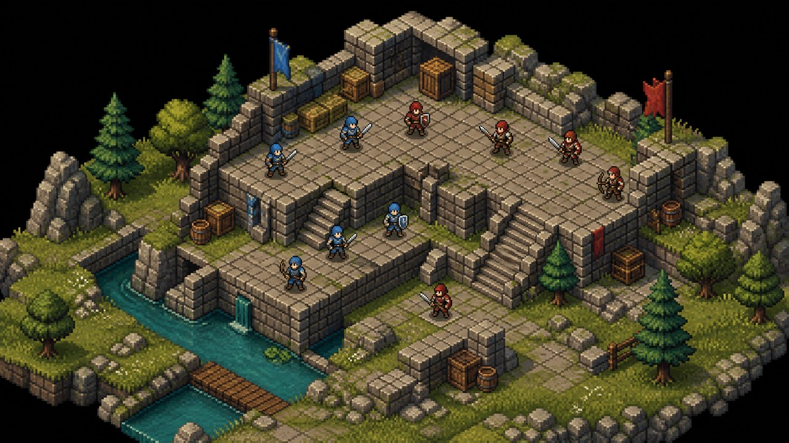</a> <strong>等距像素策略美术</strong> <a href="style-packages/game-art/isometric-pixel-tactics/README.md">打开 README</a></td>
</tr>
<tr>
<td width="33%" valign="top" align="center"><a href="style-packages/game-art/rpg-maker-pixel-art/README.md">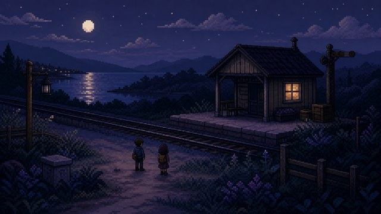</a> <strong>角色扮演游戏像素美术</strong> <a href="style-packages/game-art/rpg-maker-pixel-art/README.md">打开 README</a></td>
<td width="33%"></td>
<td width="33%"></td>
</tr>
</table>

### 艺术流派与历史时期

<table>
<tr>
<td width="33%" valign="top" align="center"><a href="style-packages/movements/impressionism/README.md">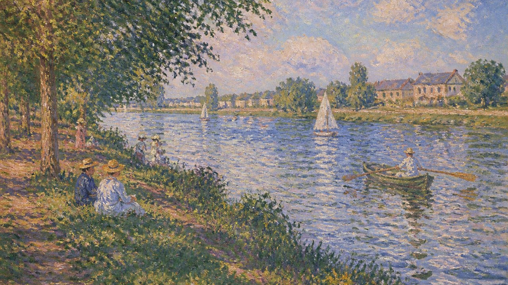</a> <strong>印象主义</strong> <a href="style-packages/movements/impressionism/README.md">打开 README</a></td>
<td width="33%" valign="top" align="center"><a href="style-packages/movements/greek-geometric-period/README.md">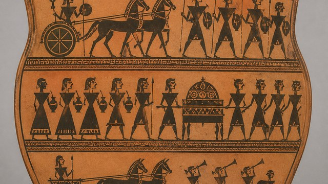</a> <strong>古希腊几何时期</strong> <a href="style-packages/movements/greek-geometric-period/README.md">打开 README</a></td>
<td width="33%" valign="top" align="center"><a href="style-packages/movements/greek-hellenistic-period/README.md">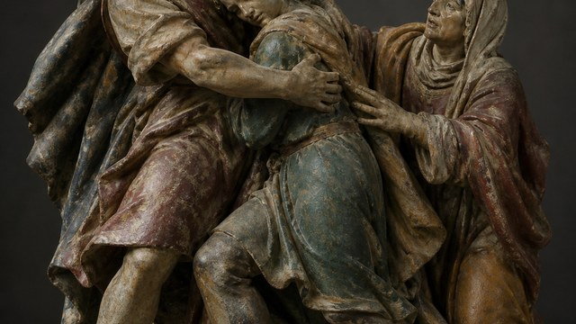</a> <strong>古希腊化时期</strong> <a href="style-packages/movements/greek-hellenistic-period/README.md">打开 README</a></td>
</tr>
<tr>
<td width="33%" valign="top" align="center"><a href="style-packages/movements/greek-classical-period/README.md">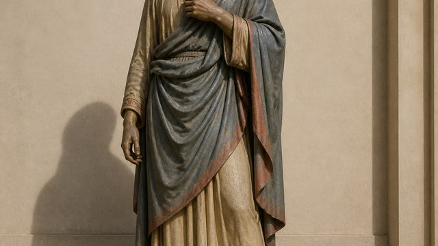</a> <strong>古希腊古典时期</strong> <a href="style-packages/movements/greek-classical-period/README.md">打开 README</a></td>
<td width="33%" valign="top" align="center"><a href="style-packages/movements/greek-archaic-period/README.md">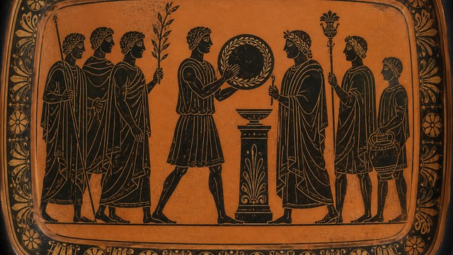</a> <strong>古希腊古风时期</strong> <a href="style-packages/movements/greek-archaic-period/README.md">打开 README</a></td>
<td width="33%" valign="top" align="center"><a href="style-packages/movements/post-impressionism/README.md">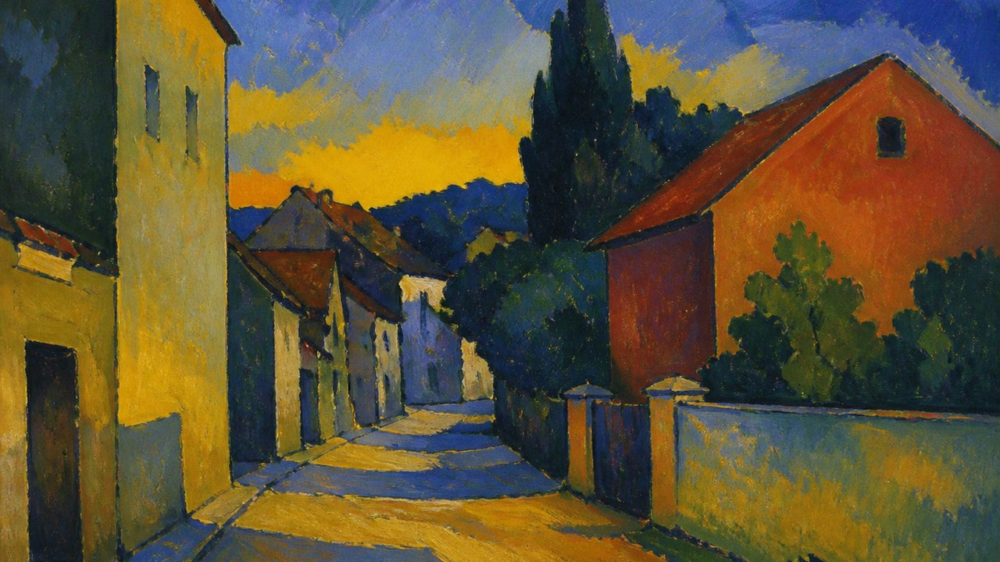</a> <strong>后印象主义</strong> <a href="style-packages/movements/post-impressionism/README.md">打开 README</a></td>
</tr>
<tr>
<td width="33%" valign="top" align="center"><a href="style-packages/movements/baroque/README.md">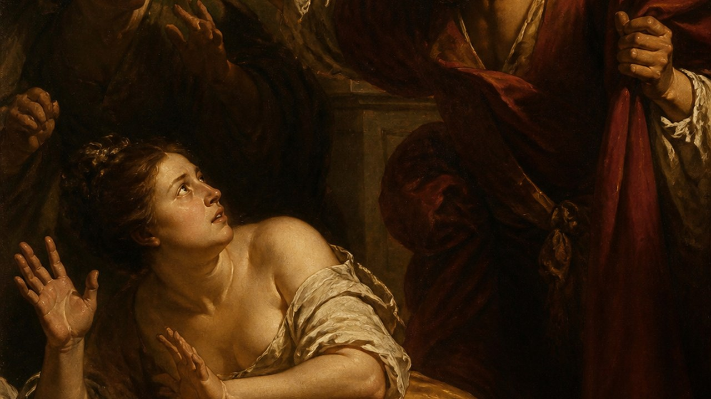</a> <strong>巴洛克</strong> <a href="style-packages/movements/baroque/README.md">打开 README</a></td>
<td width="33%" valign="top" align="center"><a href="style-packages/movements/italian-high-renaissance-raphaelesque/README.md">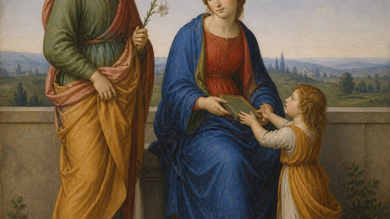</a> <strong>意大利文艺复兴盛期</strong> <a href="style-packages/movements/italian-high-renaissance-raphaelesque/README.md">打开 README</a></td>
<td width="33%" valign="top" align="center"> <strong>新即物主义</strong> <a href="style-packages/movements/neue-sachlichkeit/README.md">打开 README</a></td>
</tr>
<tr>
<td width="33%" valign="top" align="center"><a href="style-packages/movements/neoclassicism/README.md">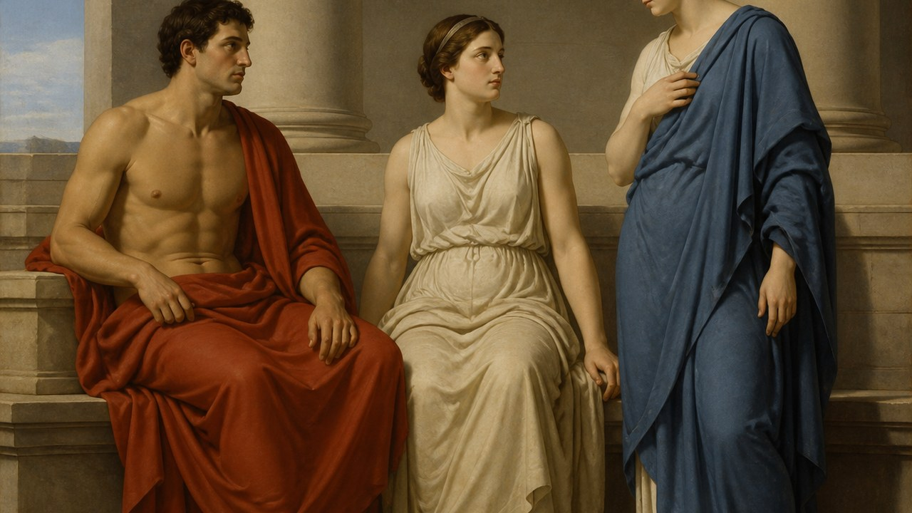</a> <strong>新古典主义</strong> <a href="style-packages/movements/neoclassicism/README.md">打开 README</a></td>
<td width="33%" valign="top" align="center"><a href="style-packages/movements/art-nouveau/README.md">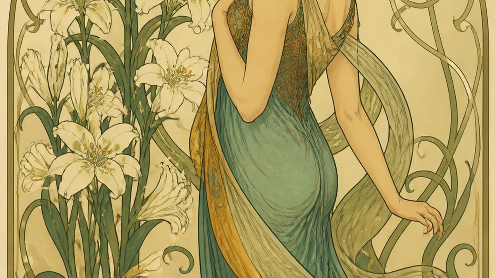</a> <strong>新艺术运动</strong> <a href="style-packages/movements/art-nouveau/README.md">打开 README</a></td>
<td width="33%" valign="top" align="center"><a href="style-packages/movements/futurism/README.md">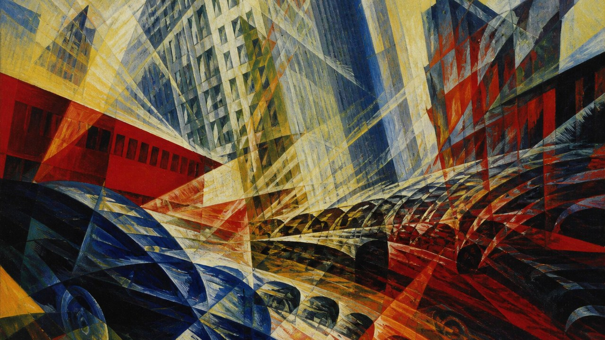</a> <strong>未来主义</strong> <a href="style-packages/movements/futurism/README.md">打开 README</a></td>
</tr>
<tr>
<td width="33%" valign="top" align="center"><a href="style-packages/movements/rococo/README.md">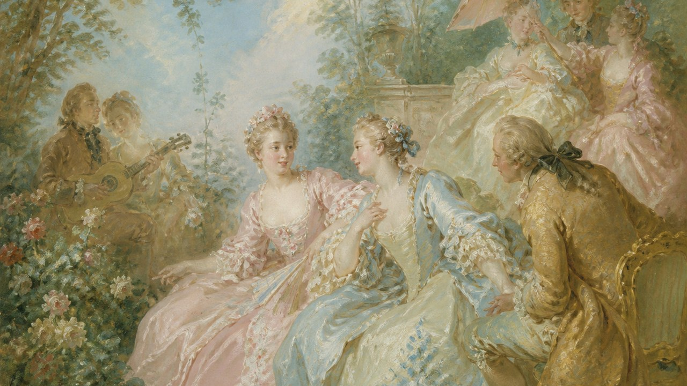</a> <strong>洛可可</strong> <a href="style-packages/movements/rococo/README.md">打开 README</a></td>
<td width="33%" valign="top" align="center"><a href="style-packages/movements/romanticism/README.md">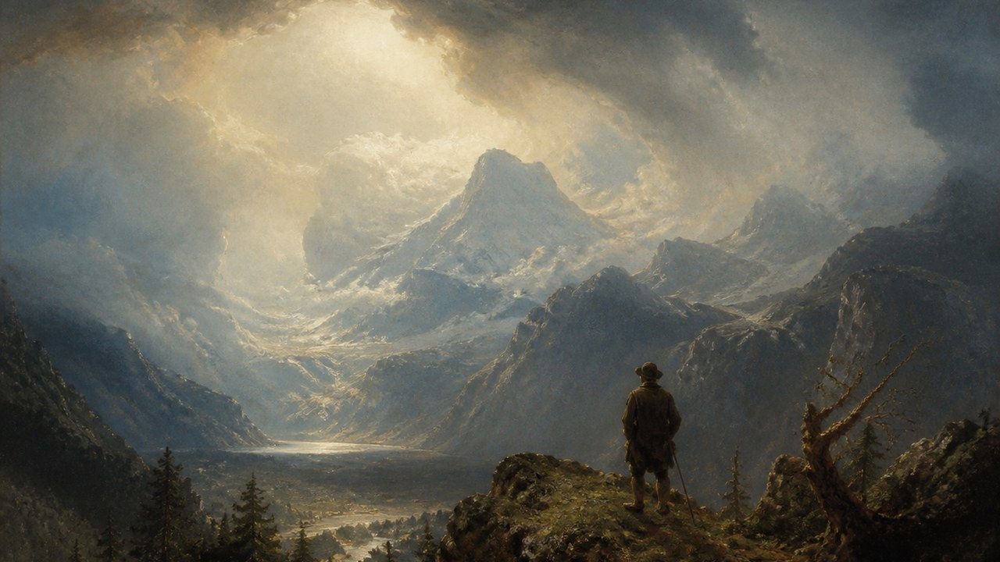</a> <strong>浪漫主义</strong> <a href="style-packages/movements/romanticism/README.md">打开 README</a></td>
<td width="33%" valign="top" align="center"><a href="style-packages/movements/realism/README.md">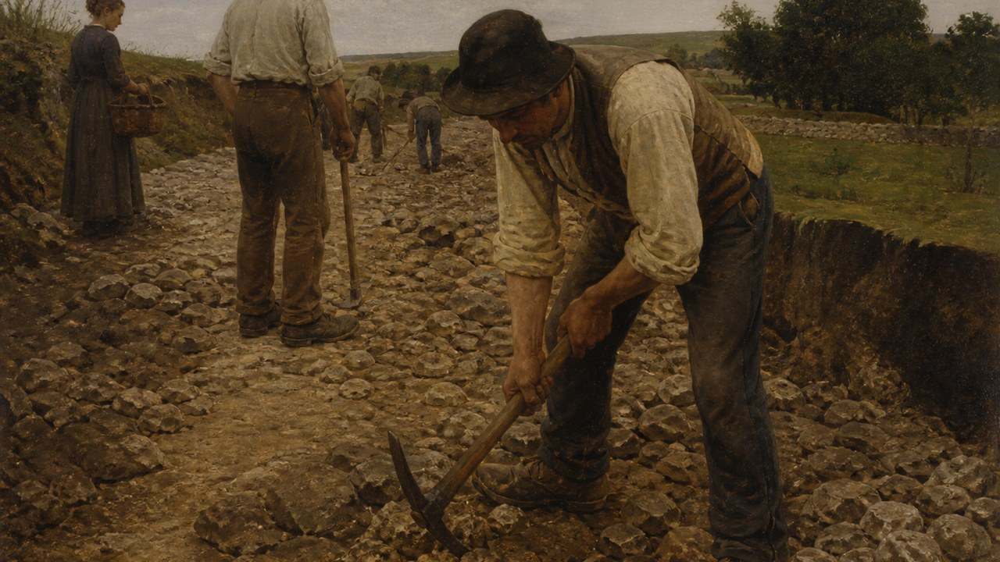</a> <strong>现实主义</strong> <a href="style-packages/movements/realism/README.md">打开 README</a></td>
</tr>
<tr>
<td width="33%" valign="top" align="center"><a href="style-packages/movements/cubism/README.md">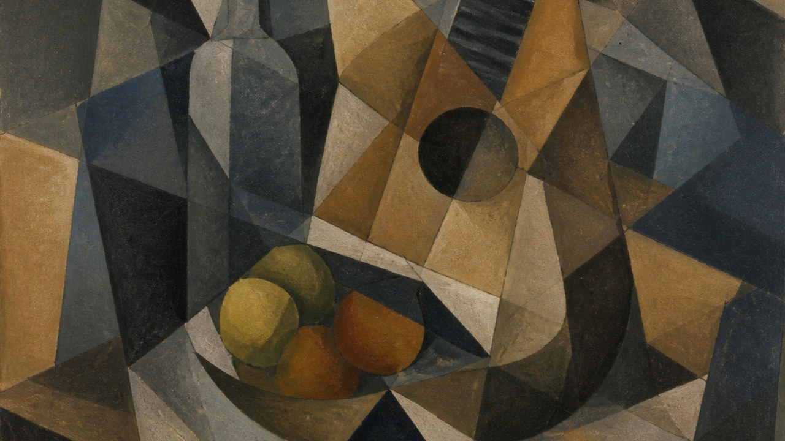</a> <strong>立体主义</strong> <a href="style-packages/movements/cubism/README.md">打开 README</a></td>
<td width="33%" valign="top" align="center"><a href="style-packages/movements/expressionism/README.md">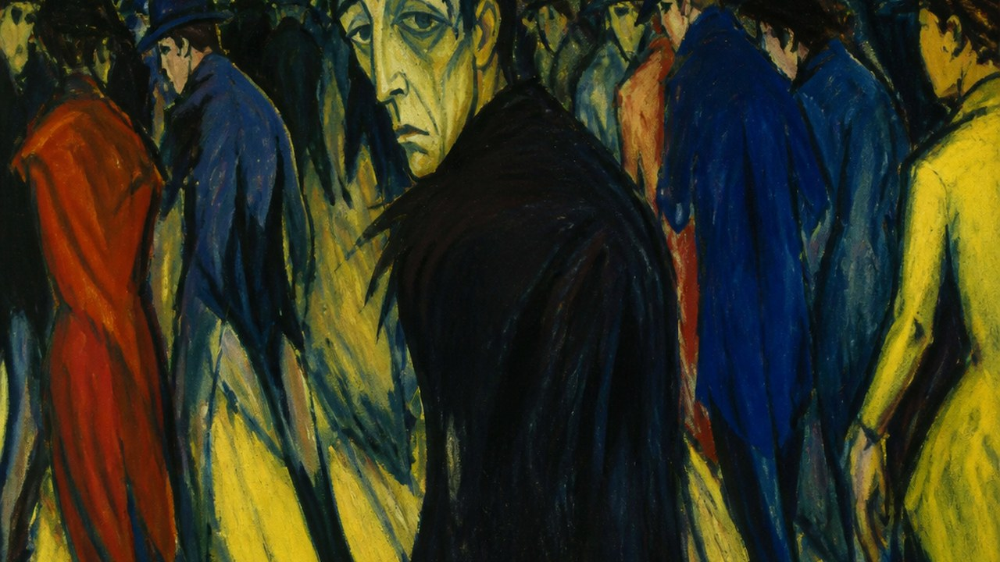</a> <strong>表现主义</strong> <a href="style-packages/movements/expressionism/README.md">打开 README</a></td>
<td width="33%" valign="top" align="center"><a href="style-packages/movements/surrealism/README.md">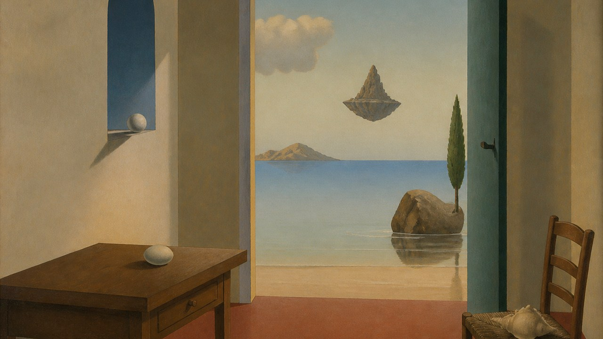</a> <strong>超现实主义</strong> <a href="style-packages/movements/surrealism/README.md">打开 README</a></td>
</tr>
</table>

### 摄影师

<table>
<tr>
<td width="33%" valign="top" align="center"> <strong>亨利·卡蒂埃-布列松</strong> <a href="style-packages/photographers/henri-cartier-bresson/README.md">打开 README</a></td>
<td width="33%" valign="top" align="center"> <strong>刘易斯·海因</strong> <a href="style-packages/photographers/lewis-hine/README.md">打开 README</a></td>
<td width="33%" valign="top" align="center"><a href="style-packages/photographers/eadweard-muybridge/README.md">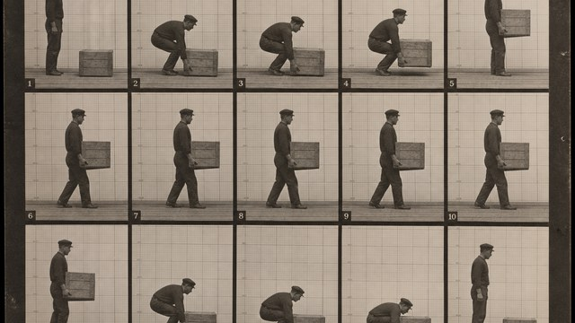</a> <strong>埃德沃德·迈布里奇</strong> <a href="style-packages/photographers/eadweard-muybridge/README.md">打开 README</a></td>
</tr>
<tr>
<td width="33%" valign="top" align="center"><a href="style-packages/photographers/dorothea-lange/README.md">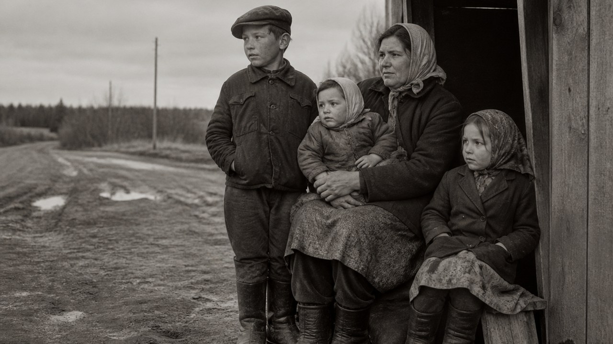</a> <strong>多萝西娅·兰格</strong> <a href="style-packages/photographers/dorothea-lange/README.md">打开 README</a></td>
<td width="33%" valign="top" align="center"><a href="style-packages/photographers/william-eggleston/README.md">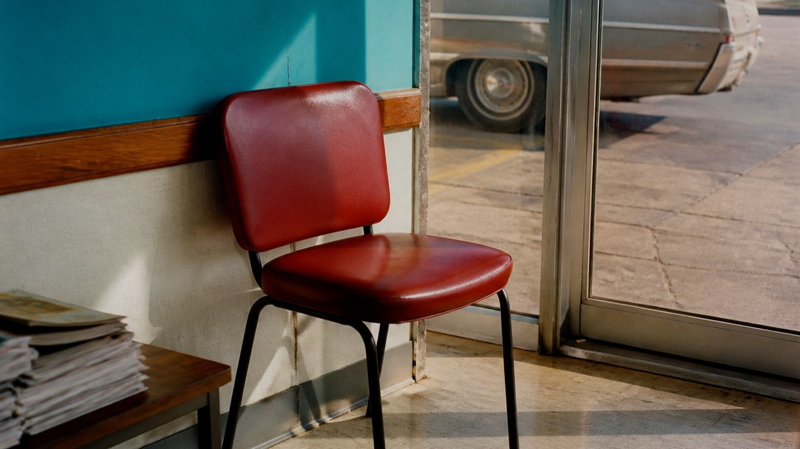</a> <strong>威廉·埃格尔斯顿</strong> <a href="style-packages/photographers/william-eggleston/README.md">打开 README</a></td>
<td width="33%" valign="top" align="center"><a href="style-packages/photographers/ansel-adams/README.md">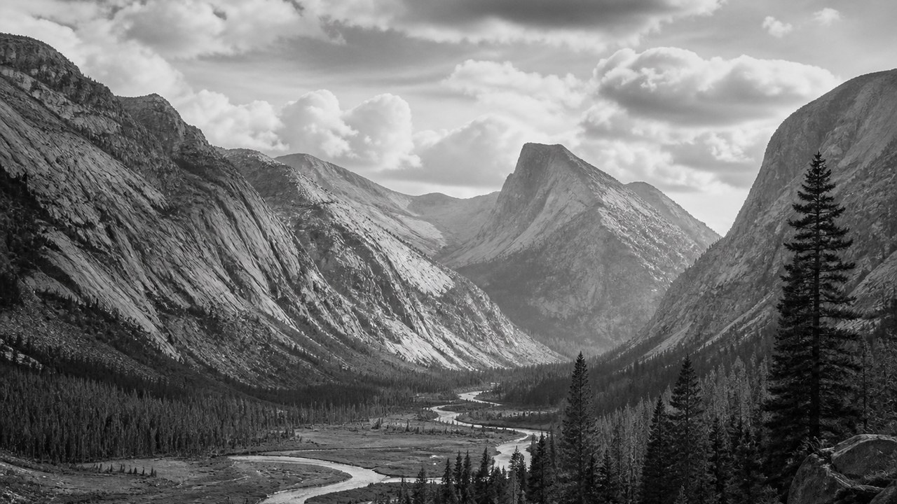</a> <strong>安塞尔·亚当斯</strong> <a href="style-packages/photographers/ansel-adams/README.md">打开 README</a></td>
</tr>
<tr>
<td width="33%" valign="top" align="center"> <strong>朱莉娅·玛格丽特·卡梅隆</strong> <a href="style-packages/photographers/julia-margaret-cameron/README.md">打开 README</a></td>
<td width="33%" valign="top" align="center"><a href="style-packages/photographers/daido-moriyama/README.md">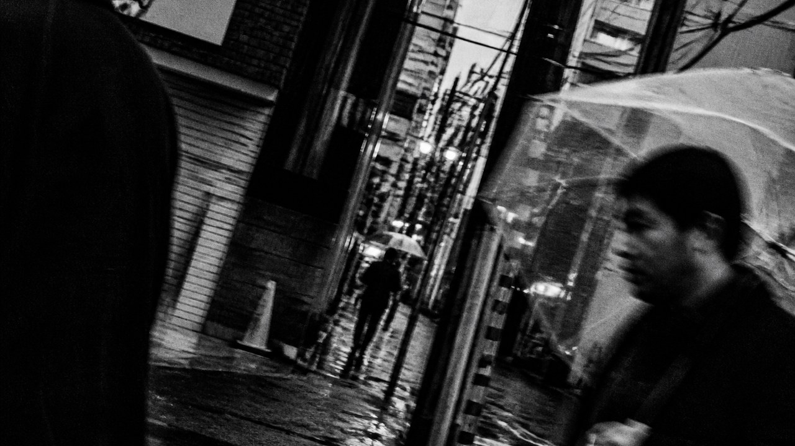</a> <strong>森山大道</strong> <a href="style-packages/photographers/daido-moriyama/README.md">打开 README</a></td>
<td width="33%" valign="top" align="center"><a href="style-packages/photographers/eugene-atget/README.md">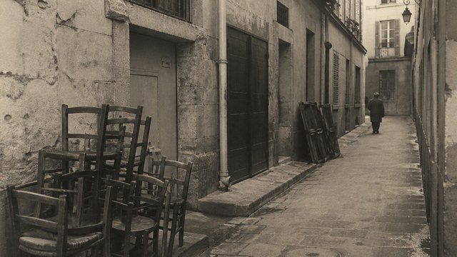</a> <strong>欧仁·阿杰</strong> <a href="style-packages/photographers/eugene-atget/README.md">打开 README</a></td>
</tr>
<tr>
<td width="33%" valign="top" align="center"><a href="style-packages/photographers/walker-evans/README.md">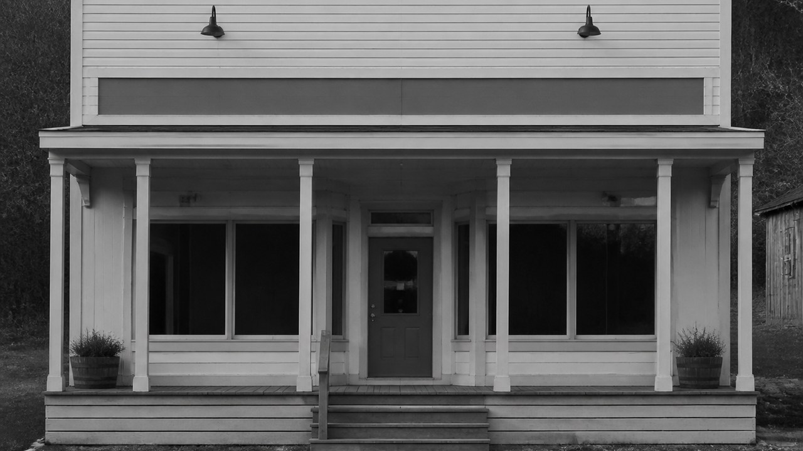</a> <strong>沃克·埃文斯</strong> <a href="style-packages/photographers/walker-evans/README.md">打开 README</a></td>
<td width="33%" valign="top" align="center"><a href="style-packages/photographers/masahisa-fukase/README.md">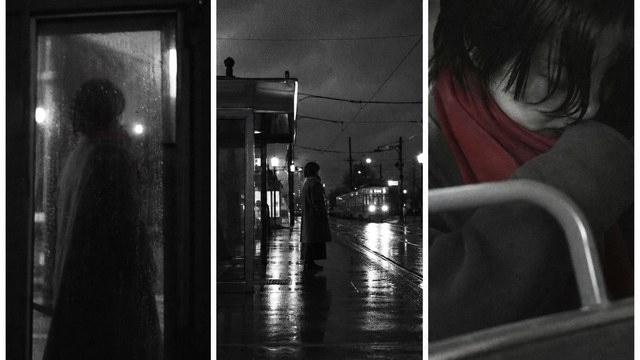</a> <strong>深濑昌久</strong> <a href="style-packages/photographers/masahisa-fukase/README.md">打开 README</a></td>
<td width="33%" valign="top" align="center"><a href="style-packages/photographers/nadar/README.md">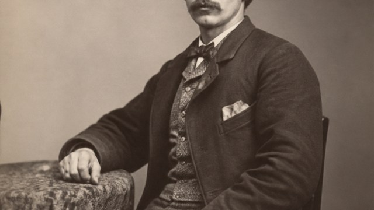</a> <strong>纳达尔</strong> <a href="style-packages/photographers/nadar/README.md">打开 README</a></td>
</tr>
<tr>
<td width="33%" valign="top" align="center"> <strong>罗伯特·卡帕</strong> <a href="style-packages/photographers/robert-capa/README.md">打开 README</a></td>
<td width="33%" valign="top" align="center"><a href="style-packages/photographers/roger-fenton/README.md">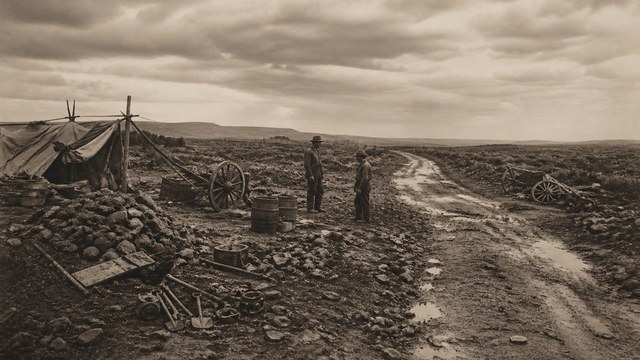</a> <strong>罗杰·芬顿</strong> <a href="style-packages/photographers/roger-fenton/README.md">打开 README</a></td>
<td width="33%" valign="top" align="center"><a href="style-packages/photographers/etienne-jules-marey/README.md">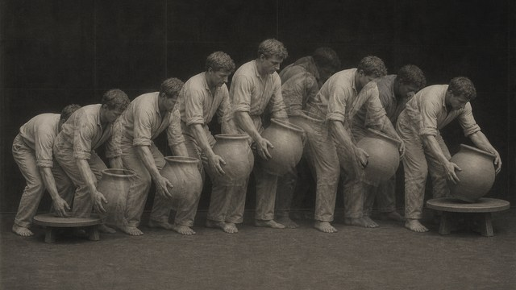</a> <strong>艾蒂安-朱尔·马雷</strong> <a href="style-packages/photographers/etienne-jules-marey/README.md">打开 README</a></td>
</tr>
<tr>
<td width="33%" valign="top" align="center"><a href="style-packages/photographers/alfred-stieglitz/README.md">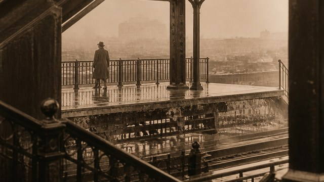</a> <strong>阿尔弗雷德·斯蒂格利茨</strong> <a href="style-packages/photographers/alfred-stieglitz/README.md">打开 README</a></td>
<td width="33%" valign="top" align="center"> <strong>黛安·阿勃丝</strong> <a href="style-packages/photographers/diane-arbus/README.md">打开 README</a></td>
<td width="33%"></td>
</tr>
</table>

### 原创预设

<table>
<tr>
<td width="33%" valign="top" align="center"><a href="style-packages/presets/muted-documentary-color/README.md">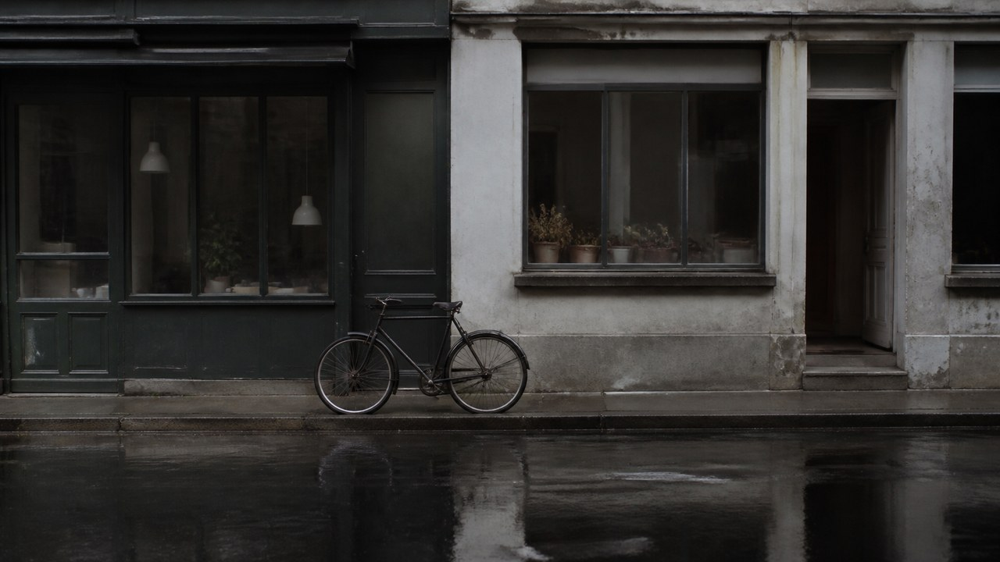</a> <strong>低饱和纪实色彩</strong> <a href="style-packages/presets/muted-documentary-color/README.md">打开 README</a></td>
<td width="33%" valign="top" align="center"><a href="style-packages/presets/nocturnal-blue-hour/README.md">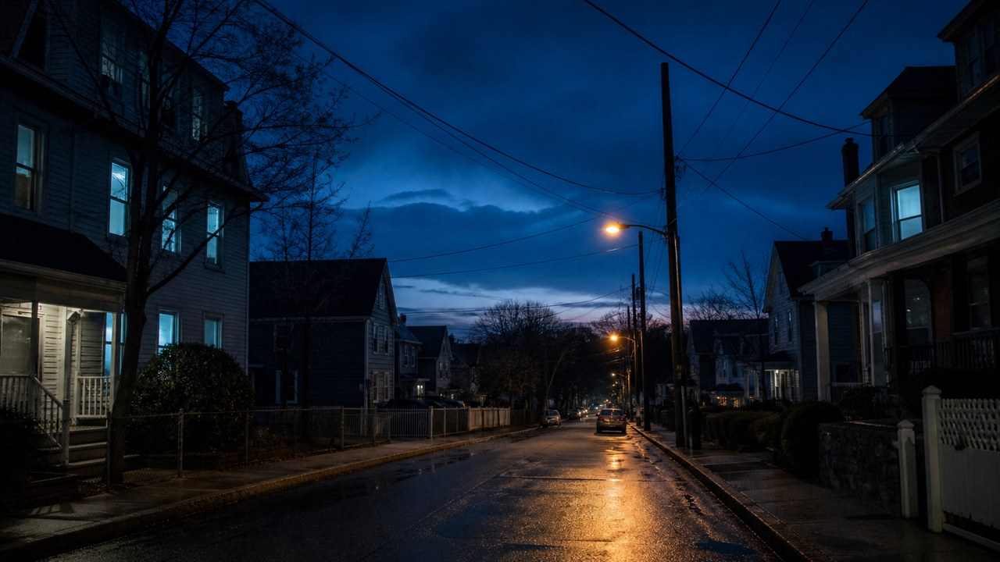</a> <strong>夜色蓝调</strong> <a href="style-packages/presets/nocturnal-blue-hour/README.md">打开 README</a></td>
<td width="33%" valign="top" align="center"><a href="style-packages/presets/hard-light-color-blocking/README.md">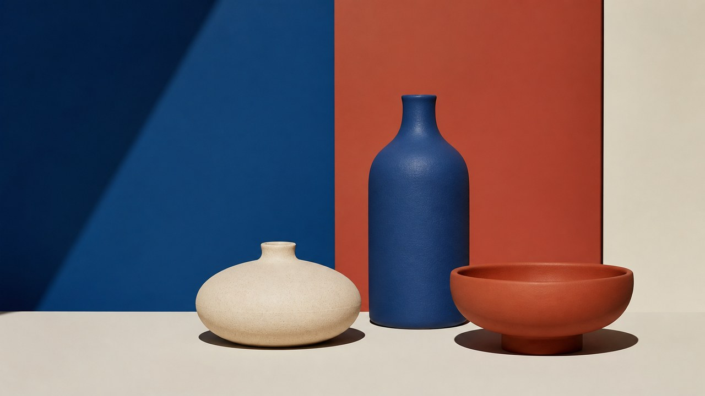</a> <strong>硬光色块摄影</strong> <a href="style-packages/presets/hard-light-color-blocking/README.md">打开 README</a></td>
</tr>
<tr>
<td width="33%" valign="top" align="center"> <strong>粉彩胶片人像</strong> <a href="style-packages/presets/pastel-film-portrait/README.md">打开 README</a></td>
<td width="33%" valign="top" align="center"> <strong>自然窗光</strong> <a href="style-packages/presets/natural-window-light/README.md">打开 README</a></td>
<td width="33%" valign="top" align="center"><a href="style-packages/presets/monochrome-silver-gelatin/README.md">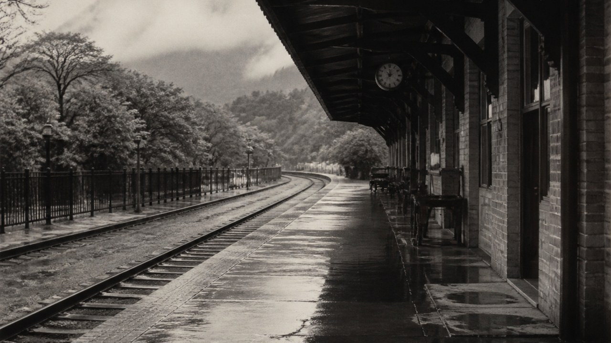</a> <strong>银盐黑白纪实</strong> <a href="style-packages/presets/monochrome-silver-gelatin/README.md">打开 README</a></td>
</tr>
<tr>
<td width="33%" valign="top" align="center"> <strong>高纯度撞色</strong> <a href="style-packages/presets/high-chroma-color-pairing/README.md">打开 README</a></td>
<td width="33%"></td>
<td width="33%"></td>
</tr>
</table>

### 艺术与摄影学校

<table>
<tr>
<td width="33%" valign="top" align="center"><a href="style-packages/schools/ulm-school/README.md">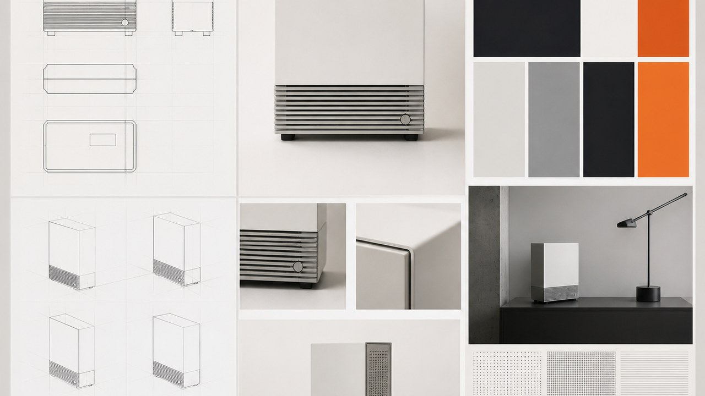</a> <strong>乌尔姆设计学院</strong> <a href="style-packages/schools/ulm-school/README.md">打开 README</a></td>
<td width="33%" valign="top" align="center"><a href="style-packages/schools/bauhaus/README.md">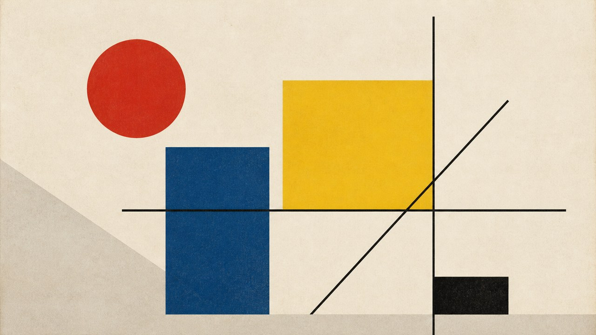</a> <strong>包豪斯</strong> <a href="style-packages/schools/bauhaus/README.md">打开 README</a></td>
<td width="33%" valign="top" align="center"><a href="style-packages/schools/international-typographic-style/README.md">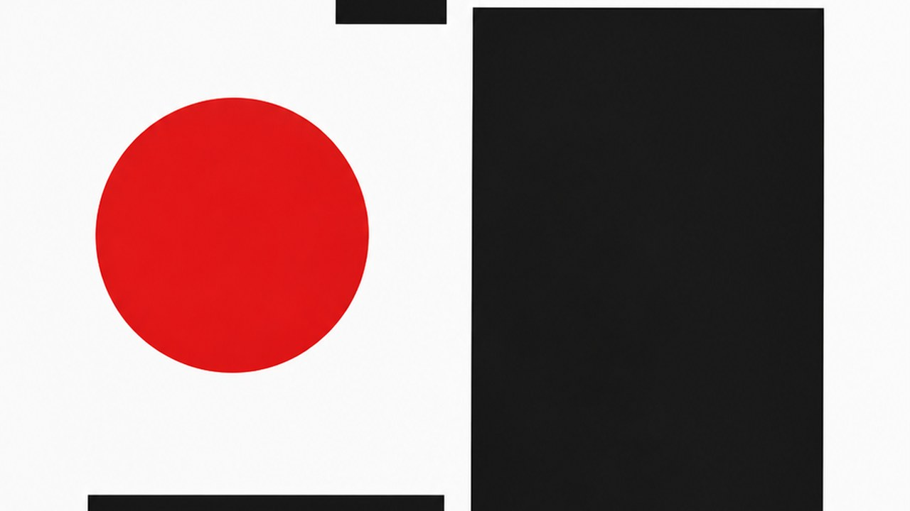</a> <strong>国际主义版式风格</strong> <a href="style-packages/schools/international-typographic-style/README.md">打开 README</a></td>
</tr>
<tr>
<td width="33%" valign="top" align="center"><a href="style-packages/schools/new-bauhaus/README.md">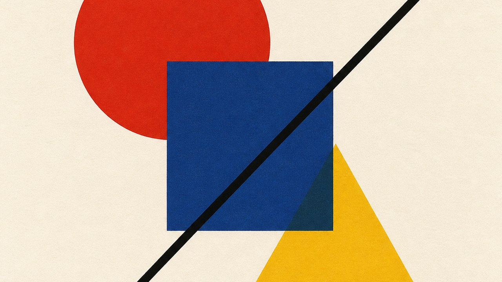</a> <strong>新包豪斯</strong> <a href="style-packages/schools/new-bauhaus/README.md">打开 README</a></td>
<td width="33%" valign="top" align="center"><a href="style-packages/schools/new-topographics/README.md">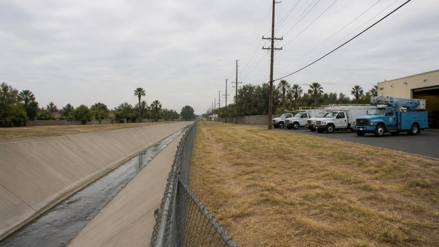</a> <strong>新地形学</strong> <a href="style-packages/schools/new-topographics/README.md">打开 README</a></td>
<td width="33%" valign="top" align="center"><a href="style-packages/schools/de-stijl/README.md">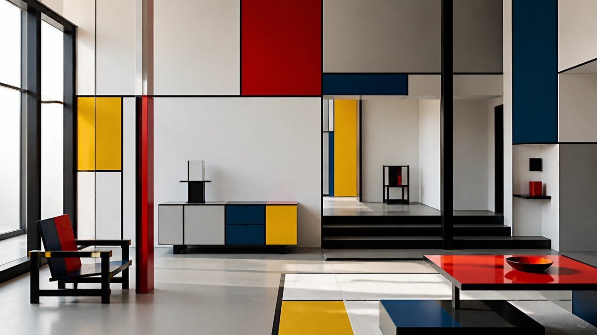</a> <strong>荷兰风格派</strong> <a href="style-packages/schools/de-stijl/README.md">打开 README</a></td>
</tr>
<tr>
<td width="33%" valign="top" align="center"><a href="style-packages/schools/art-deco/README.md">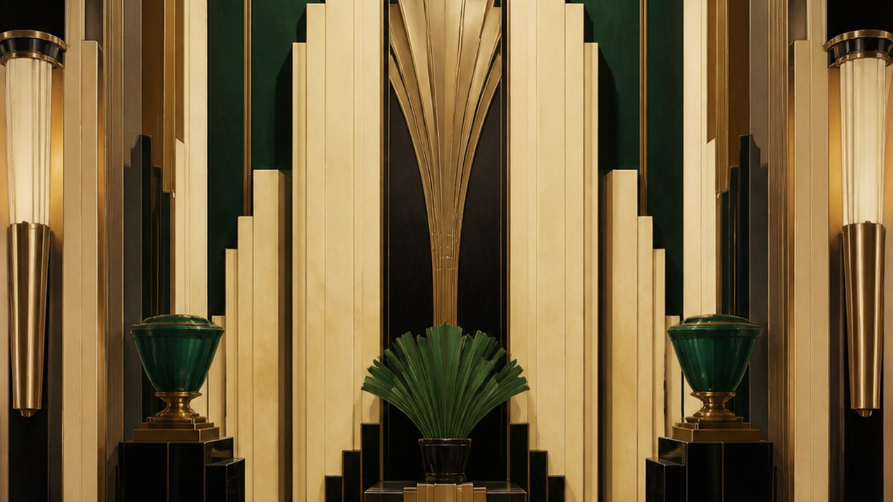</a> <strong>装饰艺术</strong> <a href="style-packages/schools/art-deco/README.md">打开 README</a></td>
<td width="33%"></td>
<td width="33%"></td>
</tr>
</table>

### 工艺与媒介

<table>
<tr>
<td width="33%" valign="top" align="center"><a href="style-packages/techniques/screen-printing/README.md">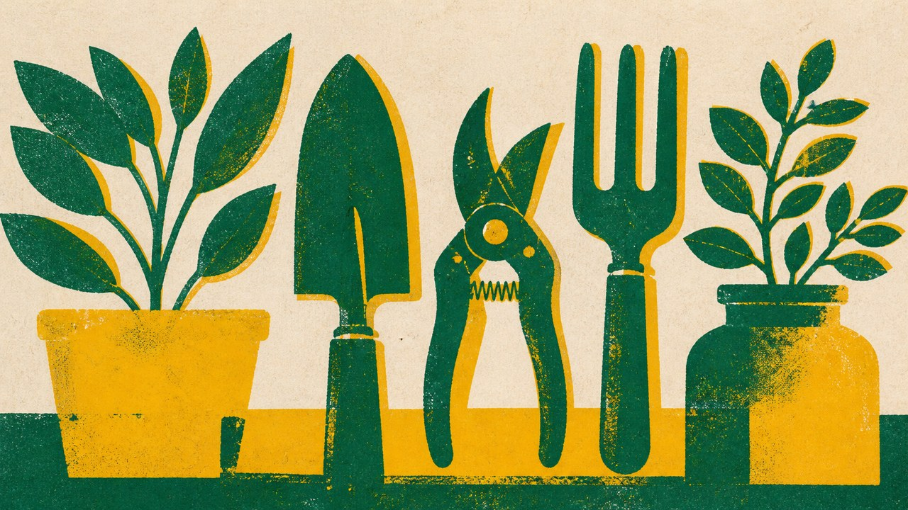</a> <strong>丝网印刷</strong> <a href="style-packages/techniques/screen-printing/README.md">打开 README</a></td>
<td width="33%" valign="top" align="center"><a href="style-packages/techniques/drypoint-etching/README.md">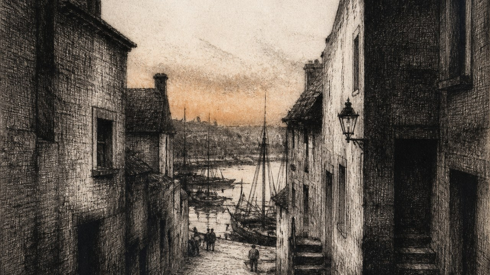</a> <strong>干刻版画</strong> <a href="style-packages/techniques/drypoint-etching/README.md">打开 README</a></td>
<td width="33%" valign="top" align="center"><a href="style-packages/techniques/woodcut/README.md">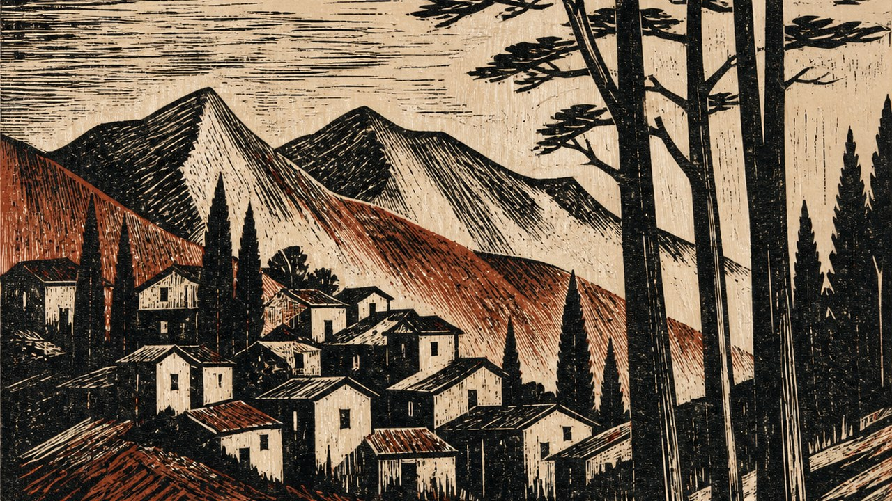</a> <strong>木刻版画</strong> <a href="style-packages/techniques/woodcut/README.md">打开 README</a></td>
</tr>
<tr>
<td width="33%" valign="top" align="center"><a href="style-packages/techniques/cyanotype/README.md">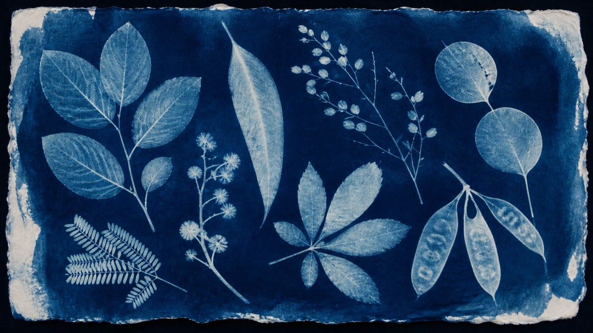</a> <strong>氰版印相</strong> <a href="style-packages/techniques/cyanotype/README.md">打开 README</a></td>
<td width="33%" valign="top" align="center"><a href="style-packages/techniques/watercolor/README.md">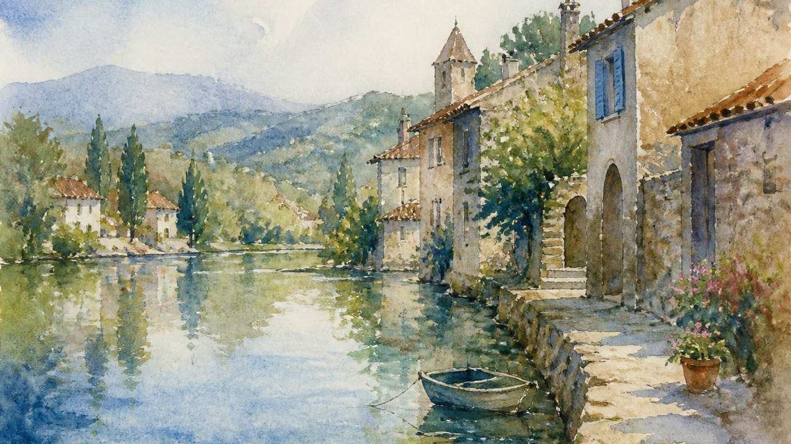</a> <strong>水彩画</strong> <a href="style-packages/techniques/watercolor/README.md">打开 README</a></td>
<td width="33%" valign="top" align="center"><a href="style-packages/techniques/oil-painting/README.md">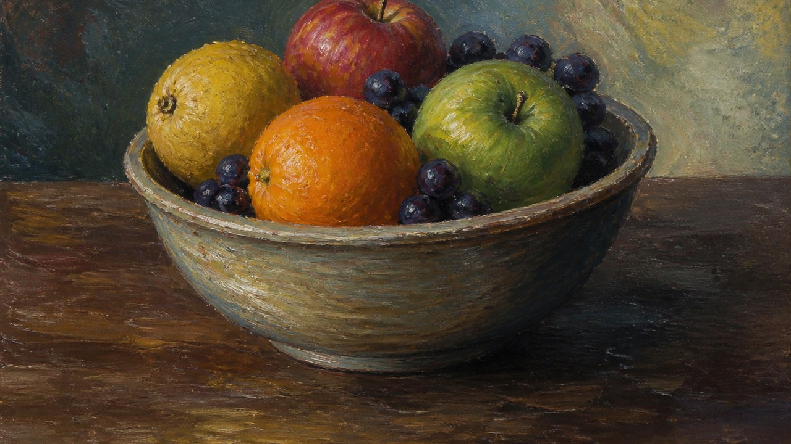</a> <strong>油画</strong> <a href="style-packages/techniques/oil-painting/README.md">打开 README</a></td>
</tr>
<tr>
<td width="33%" valign="top" align="center"><a href="style-packages/techniques/gum-bichromate/README.md">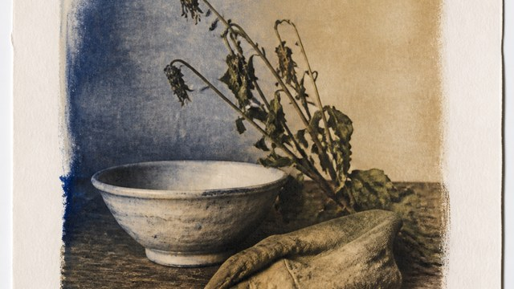</a> <strong>重铬酸盐胶印</strong> <a href="style-packages/techniques/gum-bichromate/README.md">打开 README</a></td>
<td width="33%"></td>
<td width="33%"></td>
</tr>
</table>

### 继承的 110 个轻量预设

原始 110 个 `style.json` 预设保留在 [`styles/`](styles/) 中，下面直接展示全部预设。

<table>
<tr>
<td width="33%" valign="top" align="center">
<a href="styles/acid-lime-3d-streetwear-type-poster-style/README.md">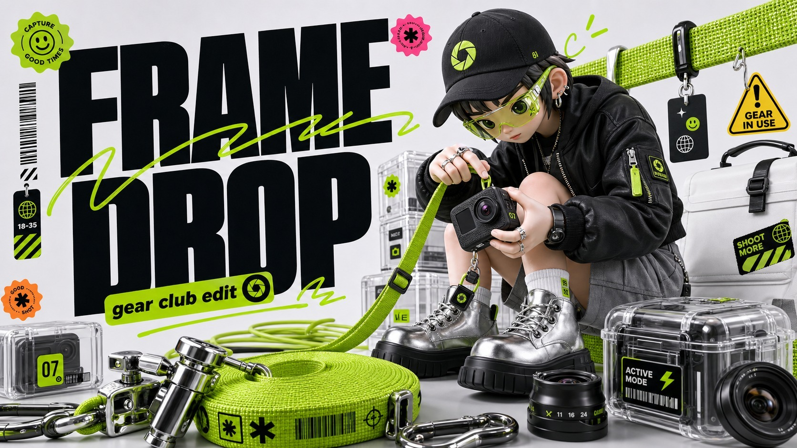</a> 
<strong>Acid Lime 3D Streetwear Type Poster Style</strong> 
<a href="styles/acid-lime-3d-streetwear-type-poster-style/README.md">打开 README</a>
</td>
<td width="33%" valign="top" align="center">
<a href="styles/analog-sticker-diary-portrait-poster-style/README.md">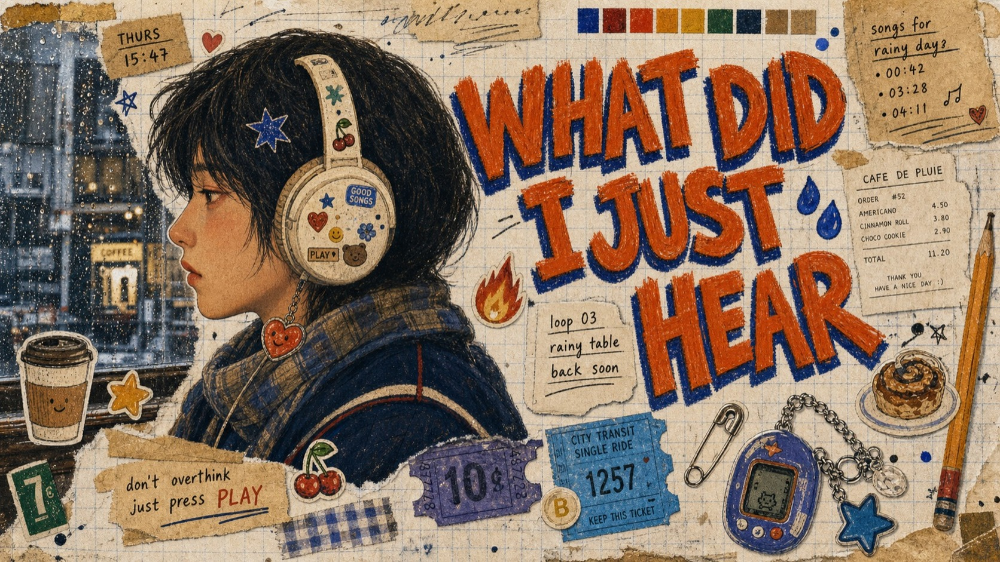</a> 
<strong>Analog Sticker Diary Portrait Poster Style</strong> 
<a href="styles/analog-sticker-diary-portrait-poster-style/README.md">打开 README</a>
</td>
<td width="33%" valign="top" align="center">
<a href="styles/backseat-transit-doodle-letter-poster-style/README.md">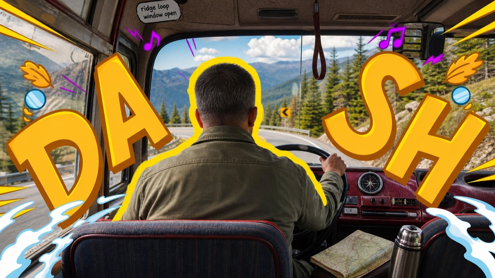</a> 
<strong>Backseat Transit Doodle Letter Poster Style</strong> 
<a href="styles/backseat-transit-doodle-letter-poster-style/README.md">打开 README</a>
</td>
</tr>
<tr>
<td width="33%" valign="top" align="center">
 
<strong>Black Cutout Food Card Ad</strong> 
<a href="styles/black-cutout-food-card-ad-style/README.md">打开 README</a>
</td>
<td width="33%" valign="top" align="center">
<a href="styles/blue-bubble-fisheye-action-poster-style/README.md">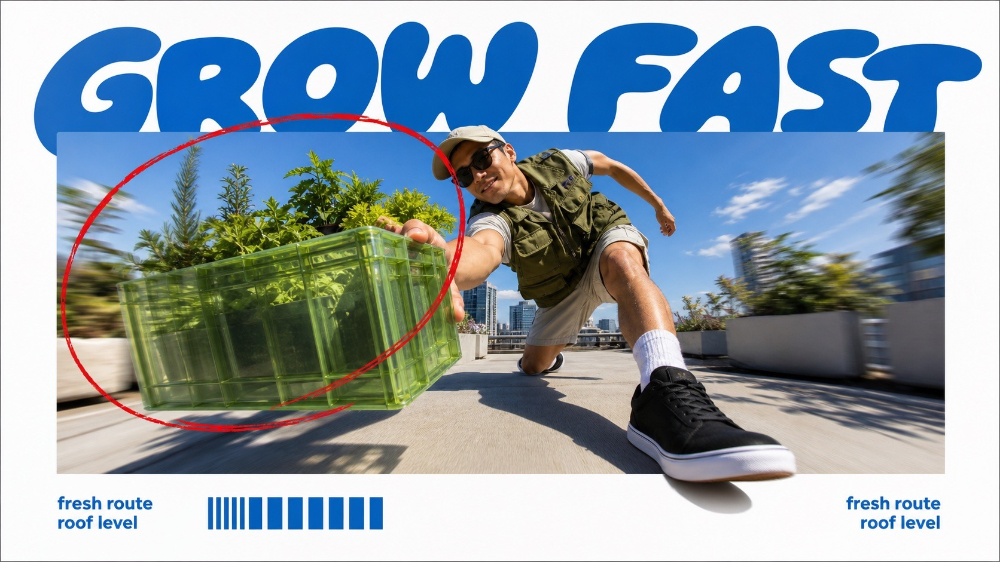</a> 
<strong>Blue Bubble Fisheye Action Poster Style</strong> 
<a href="styles/blue-bubble-fisheye-action-poster-style/README.md">打开 README</a>
</td>
<td width="33%" valign="top" align="center">
<a href="styles/blue-chinese-perspective-type-canyon-style/README.md">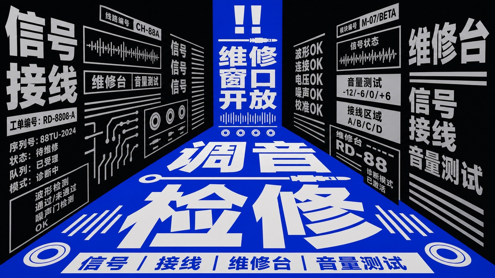</a> 
<strong>Blue Chinese Perspective Type Canyon Style</strong> 
<a href="styles/blue-chinese-perspective-type-canyon-style/README.md">打开 README</a>
</td>
</tr>
<tr>
<td width="33%" valign="top" align="center">
<a href="styles/blue-halftone-ransom-zine-poster-style/README.md">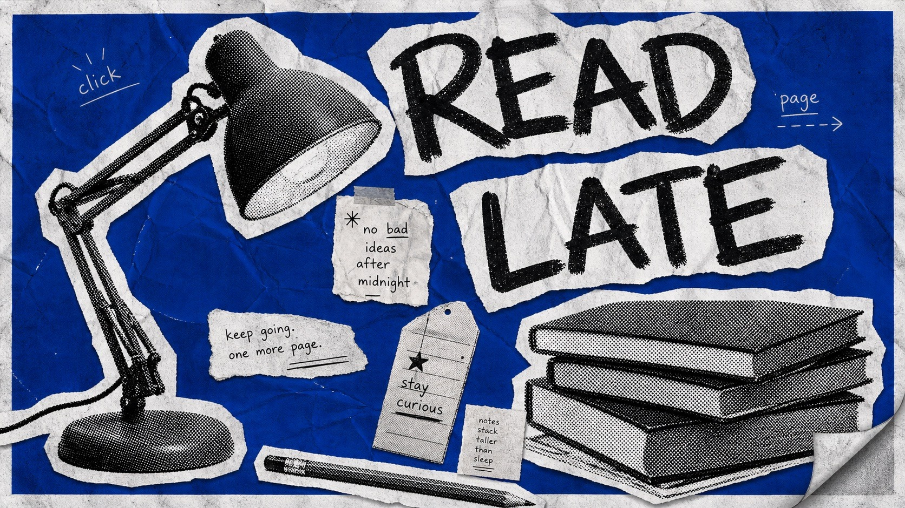</a> 
<strong>Blue Halftone Ransom Zine Poster Style</strong> 
<a href="styles/blue-halftone-ransom-zine-poster-style/README.md">打开 README</a>
</td>
<td width="33%" valign="top" align="center">
<a href="styles/blue-hud-macro-product-poster/README.md">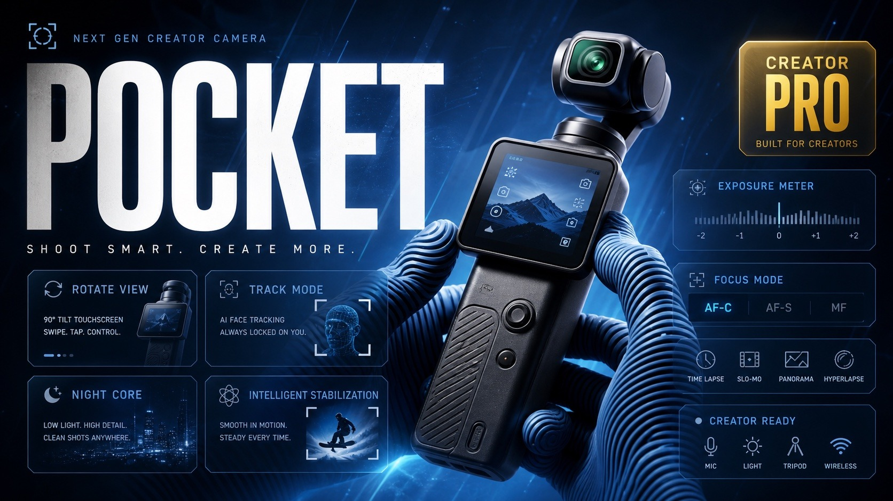</a> 
<strong>Blue HUD Macro Creator Tech Poster</strong> 
<a href="styles/blue-hud-macro-product-poster/README.md">打开 README</a>
</td>
<td width="33%" valign="top" align="center">
 
<strong>Blue Lime Kinetic Comic Type Poster Style</strong> 
<a href="styles/blue-lime-kinetic-comic-type-poster-style/README.md">打开 README</a>
</td>
</tr>
<tr>
<td width="33%" valign="top" align="center">
<a href="styles/bold-anime-reaction-thumbnail-style/README.md">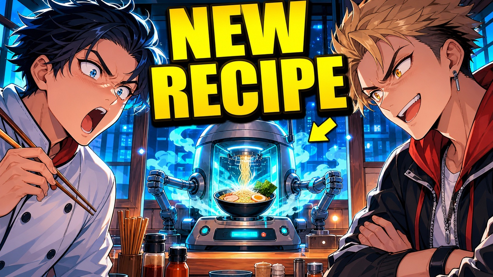</a> 
<strong>Bold Anime Reaction Thumbnail Style</strong> 
<a href="styles/bold-anime-reaction-thumbnail-style/README.md">打开 README</a>
</td>
<td width="33%" valign="top" align="center">
<a href="styles/bold-block-mascot-poster-style/README.md">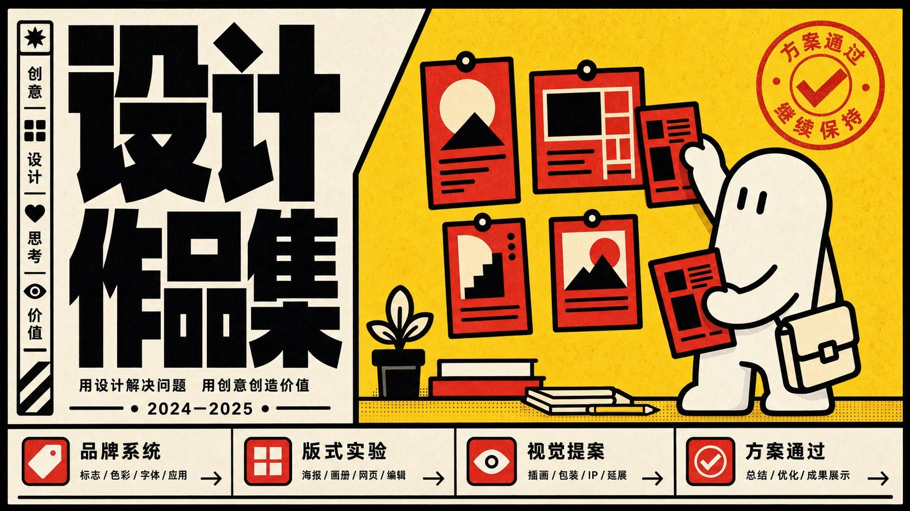</a> 
<strong>Bold Block Mascot Poster Style</strong> 
<a href="styles/bold-block-mascot-poster-style/README.md">打开 README</a>
</td>
<td width="33%" valign="top" align="center">
<a href="styles/chromatic-fisheye-orbit-pop-poster-style/README.md">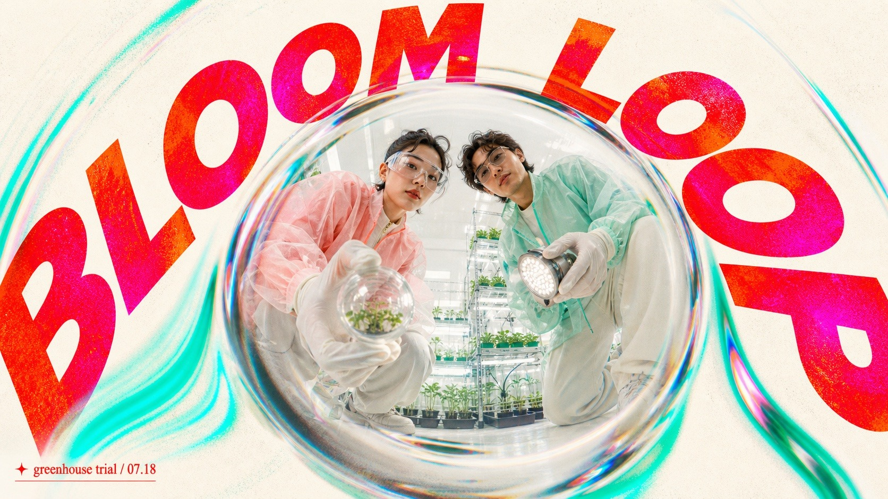</a> 
<strong>Chromatic Fisheye Orbit Pop Poster Style</strong> 
<a href="styles/chromatic-fisheye-orbit-pop-poster-style/README.md">打开 README</a>
</td>
</tr>
<tr>
<td width="33%" valign="top" align="center">
<a href="styles/clean-triptych-travel-vlog-thumbnail-style/README.md">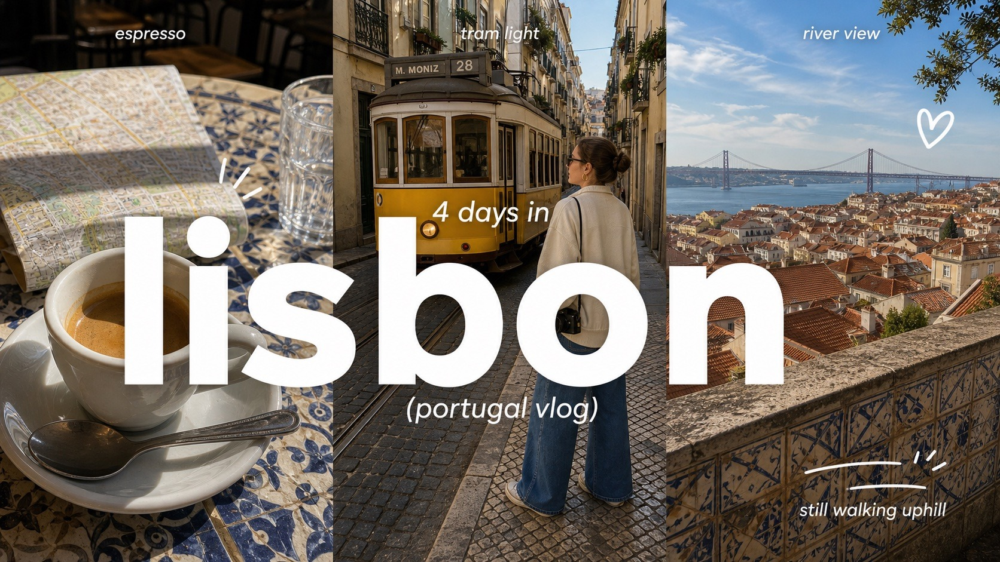</a> 
<strong>Clean Triptych Travel Vlog Thumbnail Style</strong> 
<a href="styles/clean-triptych-travel-vlog-thumbnail-style/README.md">打开 README</a>
</td>
<td width="33%" valign="top" align="center">
 
<strong>Cobalt Megatype Roadside Travel Editorial</strong> 
<a href="styles/cobalt-megatype-roadside-travel-editorial-style/README.md">打开 README</a>
</td>
<td width="33%" valign="top" align="center">
 
<strong>Cobalt Torn Didone Portrait Editorial</strong> 
<a href="styles/cobalt-torn-didone-portrait-editorial-style/README.md">打开 README</a>
</td>
</tr>
<tr>
<td width="33%" valign="top" align="center">
 
<strong>Cobalt Xerox Script Editorial Poster</strong> 
<a href="styles/cobalt-xerox-script-editorial-poster-style/README.md">打开 README</a>
</td>
<td width="33%" valign="top" align="center">
 
<strong>Coral Window Megatype Motion Poster</strong> 
<a href="styles/coral-window-megatype-motion-poster-style/README.md">打开 README</a>
</td>
<td width="33%" valign="top" align="center">
<a href="styles/cozy-bedroom-doodle-companion-snapshot-style/README.md">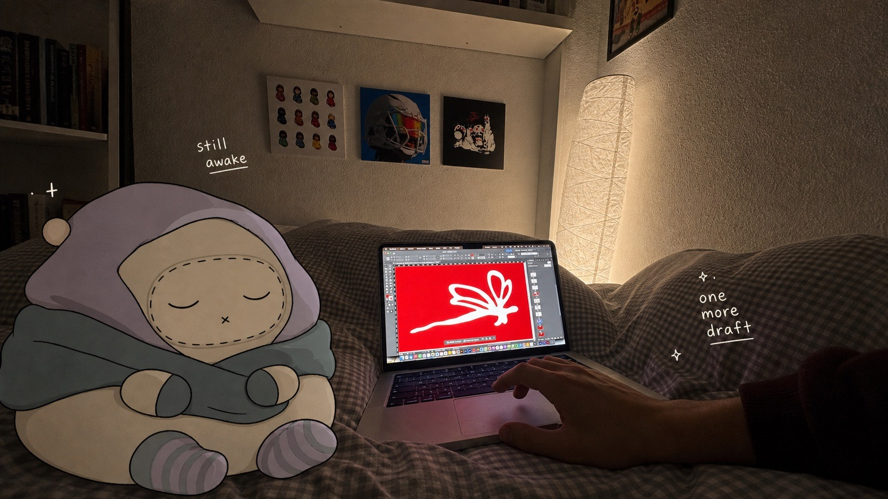</a> 
<strong>Cozy Bedroom Doodle Companion Snapshot Style</strong> 
<a href="styles/cozy-bedroom-doodle-companion-snapshot-style/README.md">打开 README</a>
</td>
</tr>
<tr>
<td width="33%" valign="top" align="center">
<a href="styles/crayon-catalog-doodle-poster-style/README.md">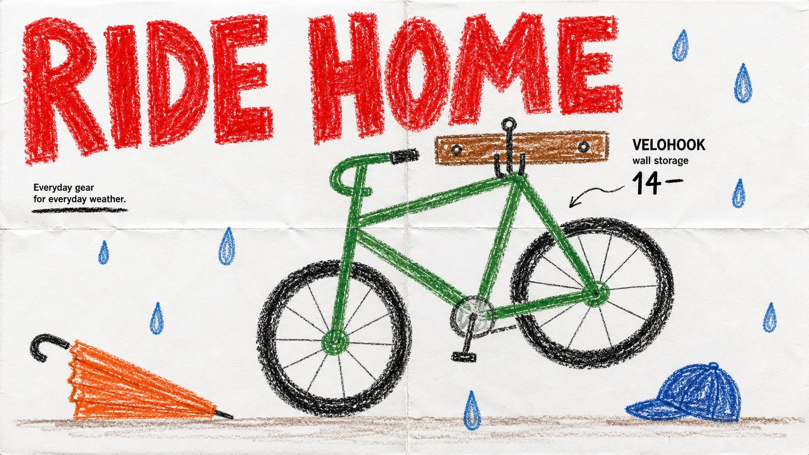</a> 
<strong>Crayon Catalog Doodle Poster Style</strong> 
<a href="styles/crayon-catalog-doodle-poster-style/README.md">打开 README</a>
</td>
<td width="33%" valign="top" align="center">
<a href="styles/cream-smoke-city-manga-poster-style/README.md">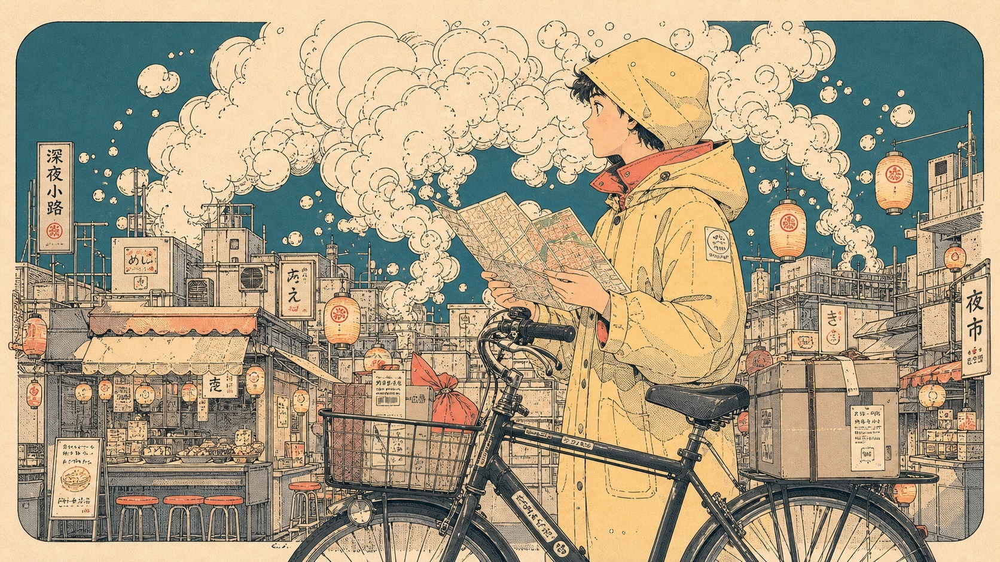</a> 
<strong>Cream Smoke City Manga Poster Style</strong> 
<a href="styles/cream-smoke-city-manga-poster-style/README.md">打开 README</a>
</td>
<td width="33%" valign="top" align="center">
<a href="styles/crimson-ink-manga-dossier/README.md">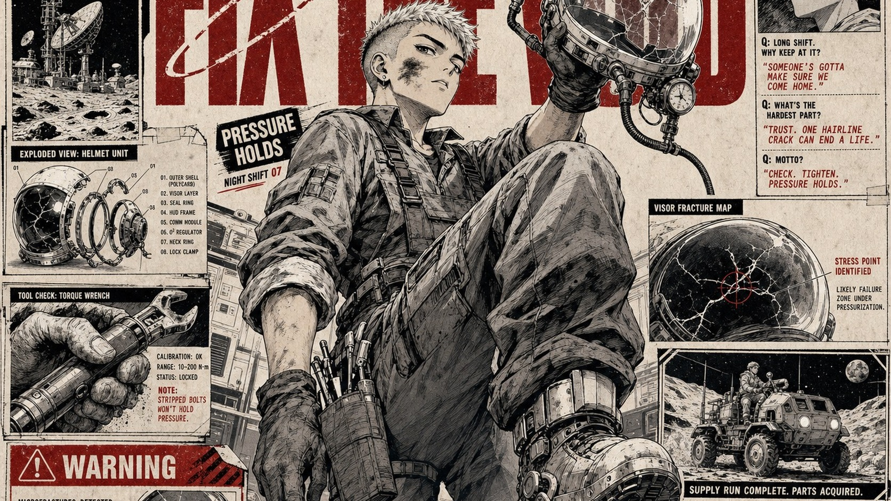</a> 
<strong>Crimson Ink Manga Dossier</strong> 
<a href="styles/crimson-ink-manga-dossier/README.md">打开 README</a>
</td>
</tr>
<tr>
<td width="33%" valign="top" align="center">
<a href="styles/cyan-grain-macro-megatype-poster-style/README.md">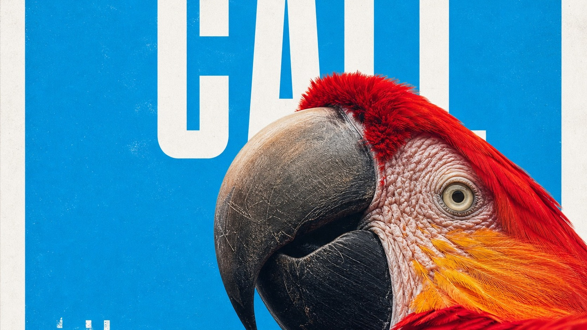</a> 
<strong>Cyan Grain Macro Megatype Poster</strong> 
<a href="styles/cyan-grain-macro-megatype-poster-style/README.md">打开 README</a>
</td>
<td width="33%" valign="top" align="center">
<a href="styles/cyan-red-shockwave-type-poster-style/README.md">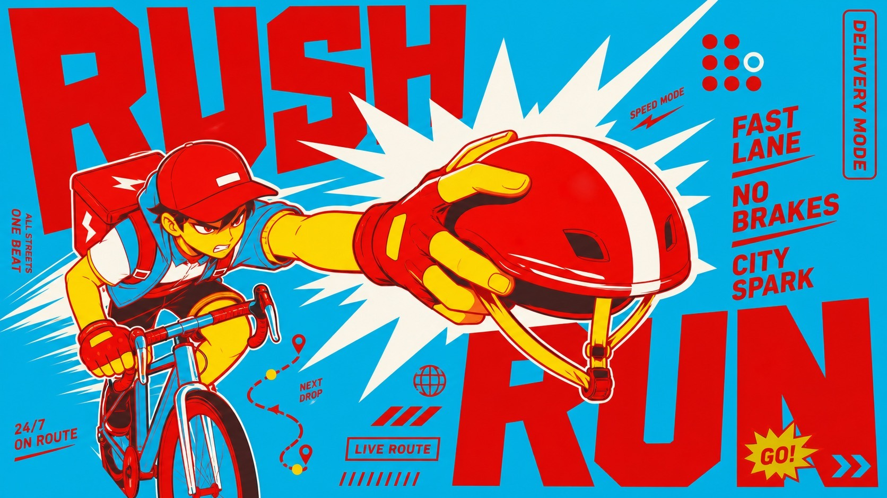</a> 
<strong>Cyan Red Shockwave Type Poster Style</strong> 
<a href="styles/cyan-red-shockwave-type-poster-style/README.md">打开 README</a>
</td>
<td width="33%" valign="top" align="center">
<a href="styles/dusk-cyan-layered-type-poster-style/README.md">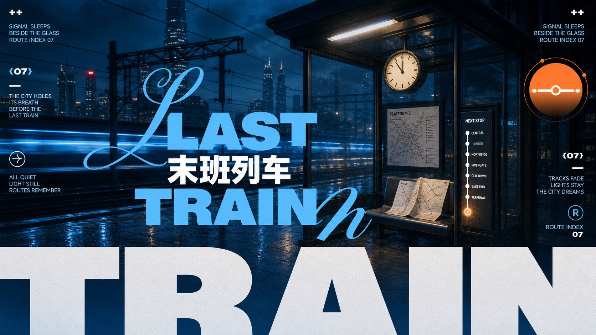</a> 
<strong>Dusk Cyan Layered Type Poster Style</strong> 
<a href="styles/dusk-cyan-layered-type-poster-style/README.md">打开 README</a>
</td>
</tr>
<tr>
<td width="33%" valign="top" align="center">
<a href="styles/electric-blue-cutout-manga-poster-style/README.md">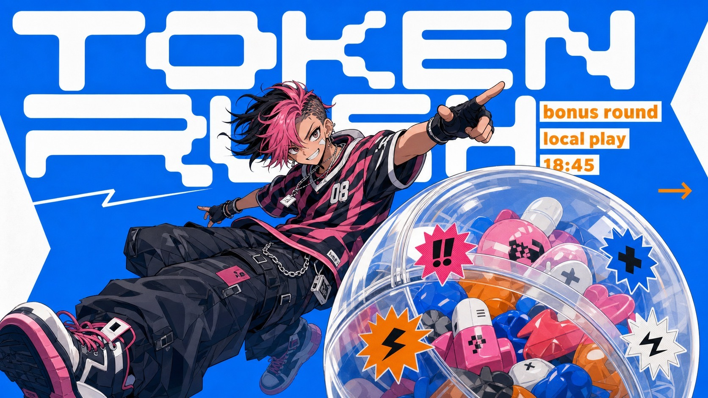</a> 
<strong>Electric Blue Cutout Manga Poster Style</strong> 
<a href="styles/electric-blue-cutout-manga-poster-style/README.md">打开 README</a>
</td>
<td width="33%" valign="top" align="center">
<a href="styles/electric-blue-silhouette-product-launch-style/README.md">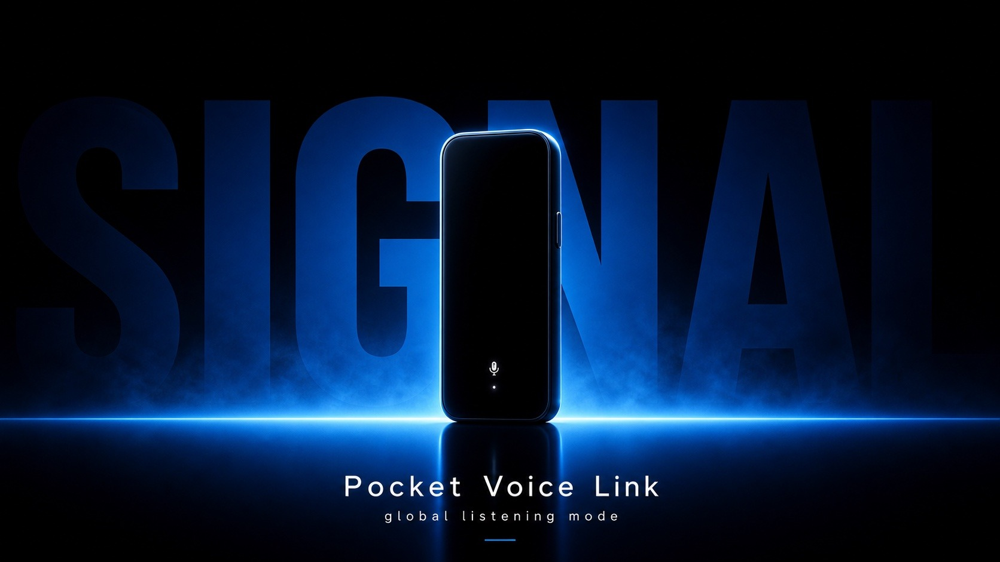</a> 
<strong>Electric Blue Silhouette Product Launch Style</strong> 
<a href="styles/electric-blue-silhouette-product-launch-style/README.md">打开 README</a>
</td>
<td width="33%" valign="top" align="center">
<a href="styles/fantasy-scribble-mascot-poster-style/README.md">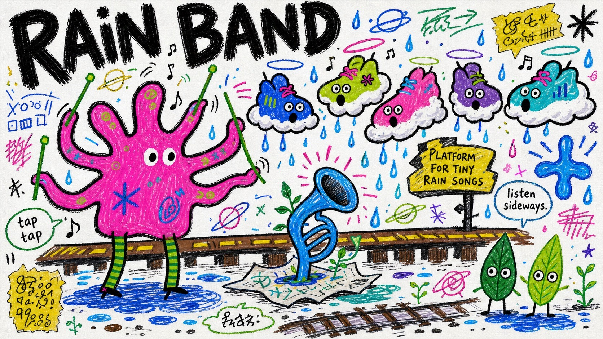</a> 
<strong>Fantasy Scribble Mascot Poster Style</strong> 
<a href="styles/fantasy-scribble-mascot-poster-style/README.md">打开 README</a>
</td>
</tr>
<tr>
<td width="33%" valign="top" align="center">
<a href="styles/folded-diamond-perspective-type-poster-style/README.md">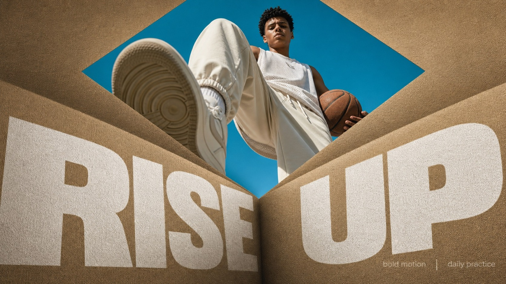</a> 
<strong>Folded Diamond Perspective Type Poster Style</strong> 
<a href="styles/folded-diamond-perspective-type-poster-style/README.md">打开 README</a>
</td>
<td width="33%" valign="top" align="center">
<a href="styles/folded-newspaper-product-ad-style/README.md">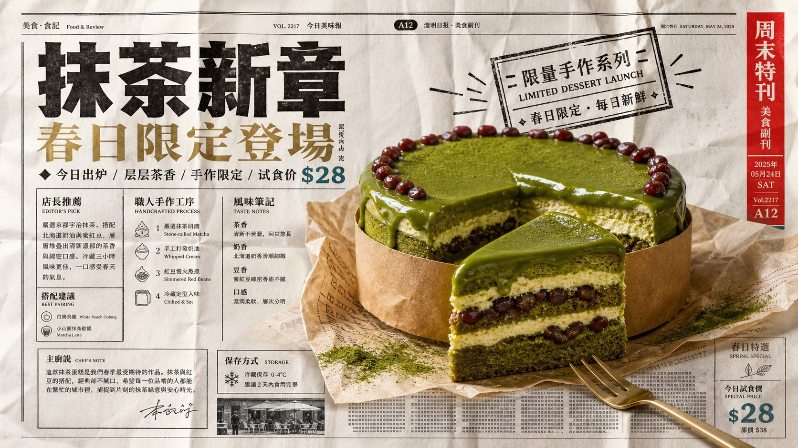</a> 
<strong>Folded Newspaper Product Ad Style</strong> 
<a href="styles/folded-newspaper-product-ad-style/README.md">打开 README</a>
</td>
<td width="33%" valign="top" align="center">
 
<strong>Foreshortened Gradient Impact Ad Style</strong> 
<a href="styles/foreshortened-gradient-impact-ad-style/README.md">打开 README</a>
</td>
</tr>
<tr>
<td width="33%" valign="top" align="center">
<a href="styles/gothic-cat-doodle-photo-collage-style/README.md">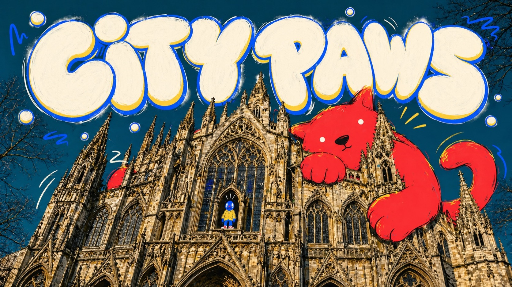</a> 
<strong>Gothic Cat Doodle Photo Collage Style</strong> 
<a href="styles/gothic-cat-doodle-photo-collage-style/README.md">打开 README</a>
</td>
<td width="33%" valign="top" align="center">
<a href="styles/halftone-assemblage-metaphor-psa-poster-style/README.md">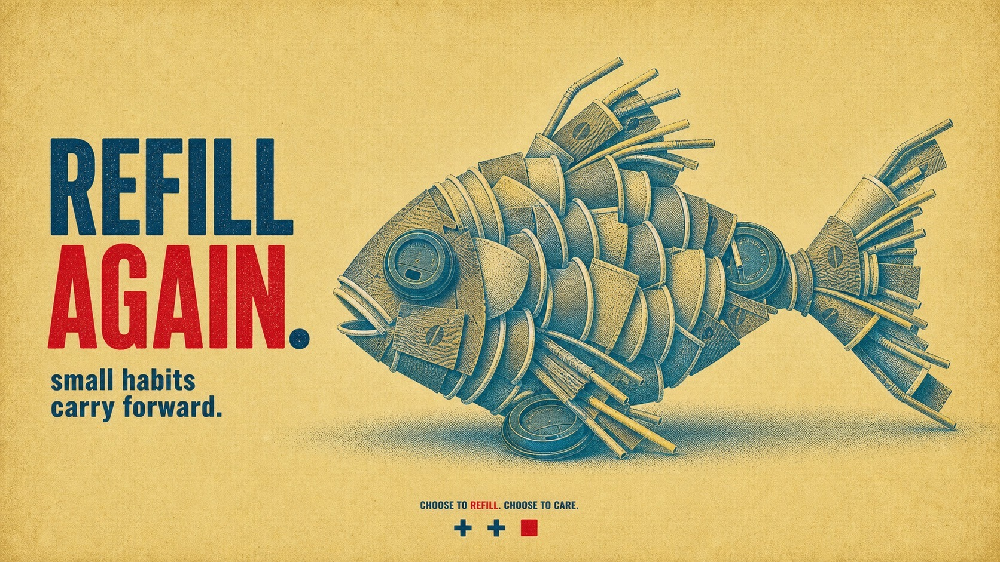</a> 
<strong>Halftone Assemblage Metaphor PSA Poster Style</strong> 
<a href="styles/halftone-assemblage-metaphor-psa-poster-style/README.md">打开 README</a>
</td>
<td width="33%" valign="top" align="center">
<a href="styles/hot-ink-comic-poster/README.md">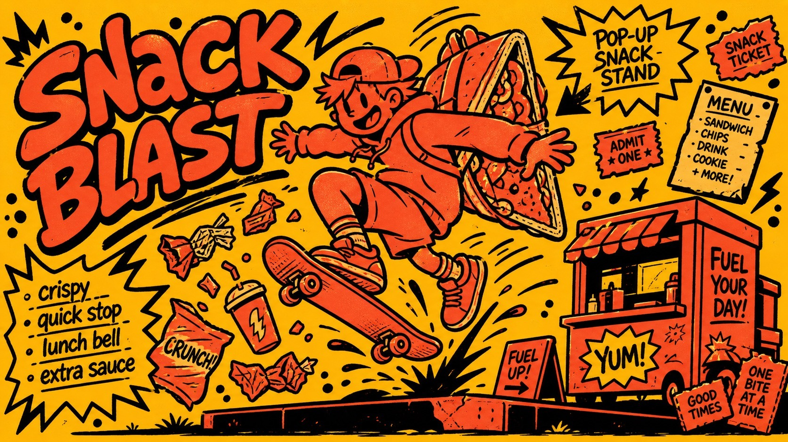</a> 
<strong>Hot Ink Comic Poster</strong> 
<a href="styles/hot-ink-comic-poster/README.md">打开 README</a>
</td>
</tr>
<tr>
<td width="33%" valign="top" align="center">
<a href="styles/ice-cyan-megatype-action-poster-style/README.md">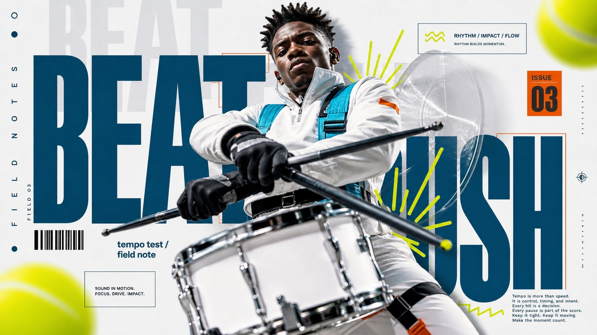</a> 
<strong>Ice Cyan Megatype Action Poster Style</strong> 
<a href="styles/ice-cyan-megatype-action-poster-style/README.md">打开 README</a>
</td>
<td width="33%" valign="top" align="center">
<a href="styles/impact-burst-halftone-comic-poster-style/README.md">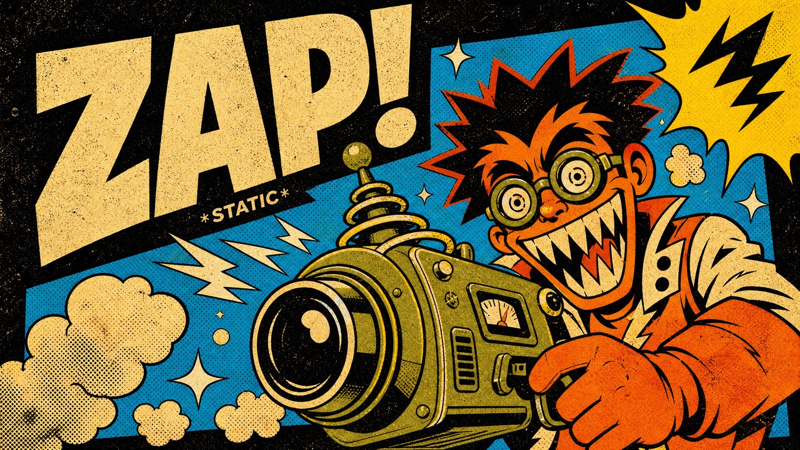</a> 
<strong>Impact Burst Halftone Comic Poster Style</strong> 
<a href="styles/impact-burst-halftone-comic-poster-style/README.md">打开 README</a>
</td>
<td width="33%" valign="top" align="center">
<a href="styles/jade-glyph-grocer-collage-poster-style/README.md">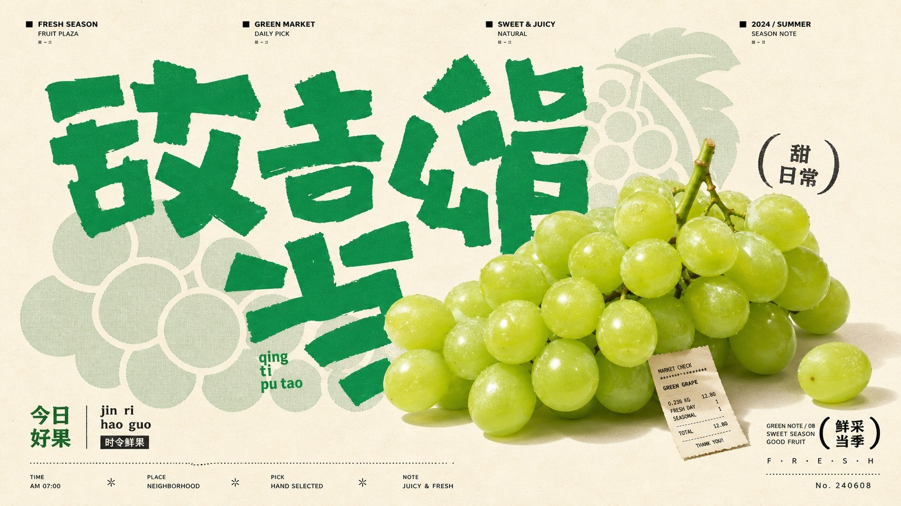</a> 
<strong>Jade Glyph Grocer Collage Poster Style</strong> 
<a href="styles/jade-glyph-grocer-collage-poster-style/README.md">打开 README</a>
</td>
</tr>
<tr>
<td width="33%" valign="top" align="center">
<a href="styles/jagged-red-street-photo-event-poster-style/README.md">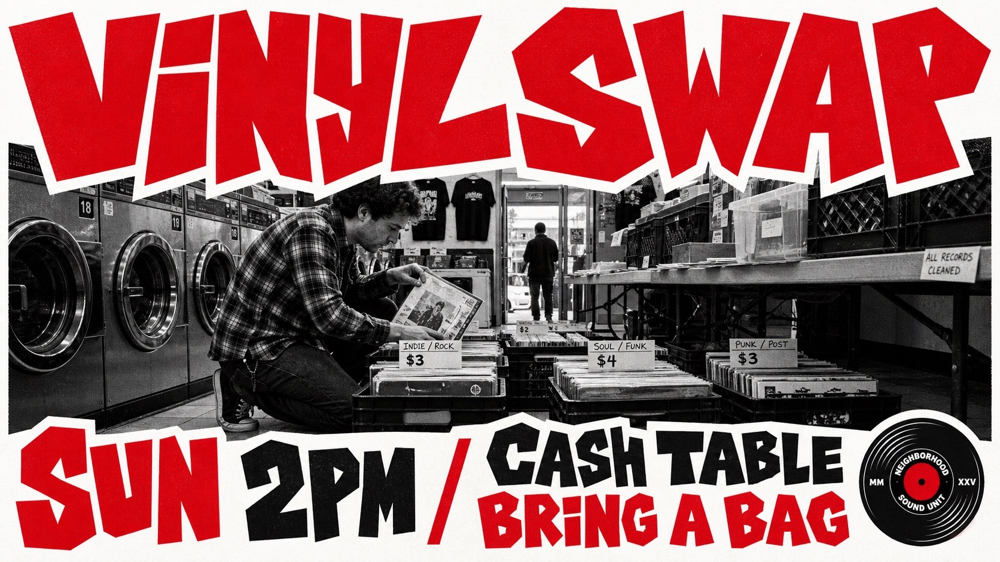</a> 
<strong>Jagged Red Street Photo Event Poster Style</strong> 
<a href="styles/jagged-red-street-photo-event-poster-style/README.md">打开 README</a>
</td>
<td width="33%" valign="top" align="center">
<a href="styles/k-pop-apocalypse-ransom-zine-style/README.md">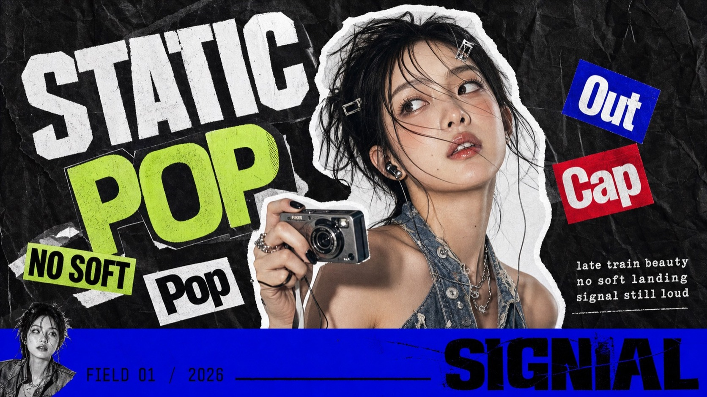</a> 
<strong>K-Pop Apocalypse Ransom Zine Style</strong> 
<a href="styles/k-pop-apocalypse-ransom-zine-style/README.md">打开 README</a>
</td>
<td width="33%" valign="top" align="center">
<a href="styles/kinetic-editorial-photo-collage-style/README.md">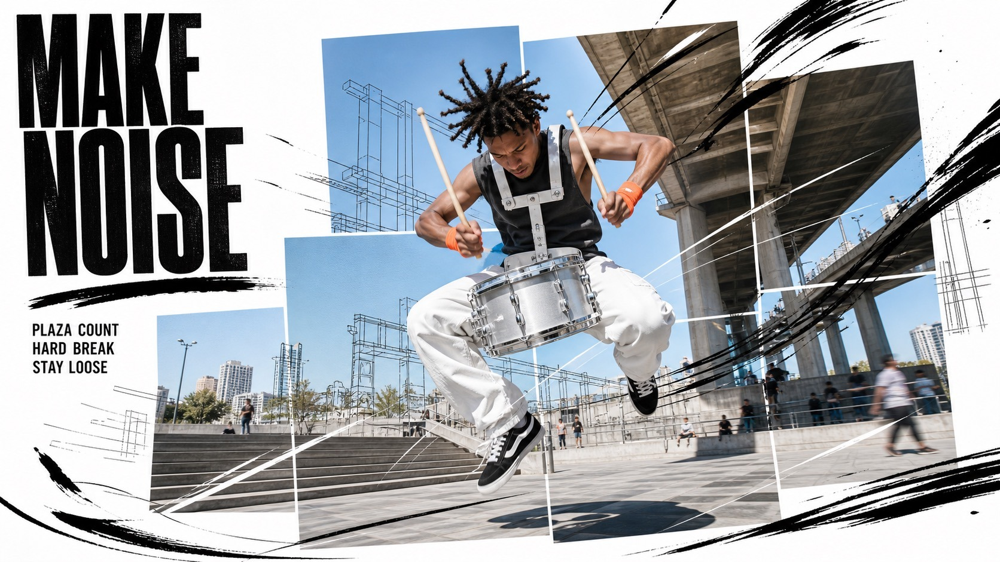</a> 
<strong>Kinetic Editorial Photo Collage</strong> 
<a href="styles/kinetic-editorial-photo-collage-style/README.md">打开 README</a>
</td>
</tr>
<tr>
<td width="33%" valign="top" align="center">
 
<strong>Kinetic Geometric Doodle Cutouts</strong> 
<a href="styles/kinetic-geometric-doodle-cutouts/README.md">打开 README</a>
</td>
<td width="33%" valign="top" align="center">
<a href="styles/kinetic-luxury-street-fashion-cover-style/README.md">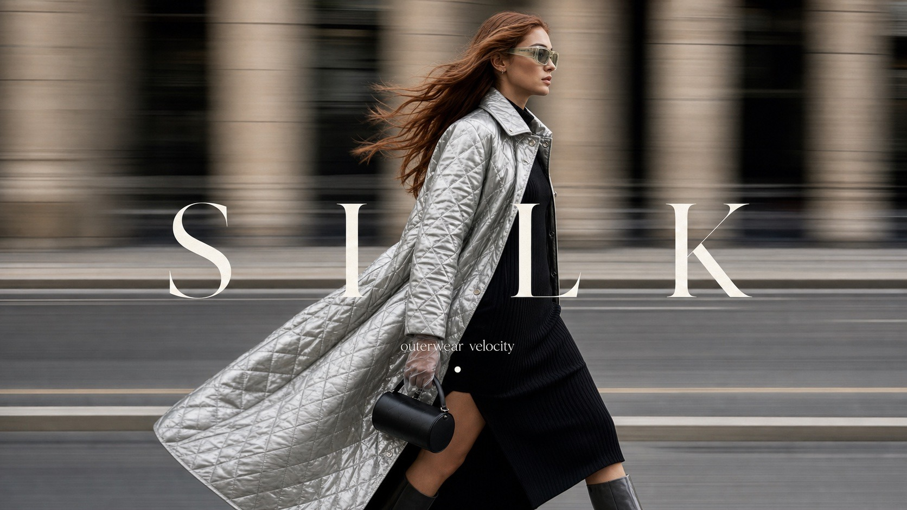</a> 
<strong>Kinetic Luxury Street Fashion Cover Style</strong> 
<a href="styles/kinetic-luxury-street-fashion-cover-style/README.md">打开 README</a>
</td>
<td width="33%" valign="top" align="center">
<a href="styles/lime-loop-megatype-action-poster-style/README.md">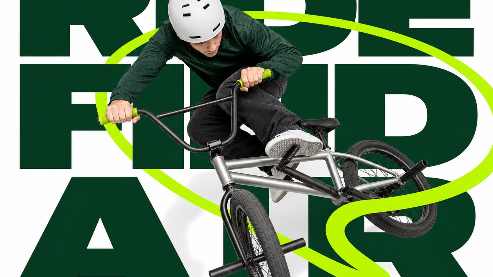</a> 
<strong>Lime Loop Megatype Action Poster</strong> 
<a href="styles/lime-loop-megatype-action-poster-style/README.md">打开 README</a>
</td>
</tr>
<tr>
<td width="33%" valign="top" align="center">
<a href="styles/liquid-chrome-clearance-poster-style/README.md">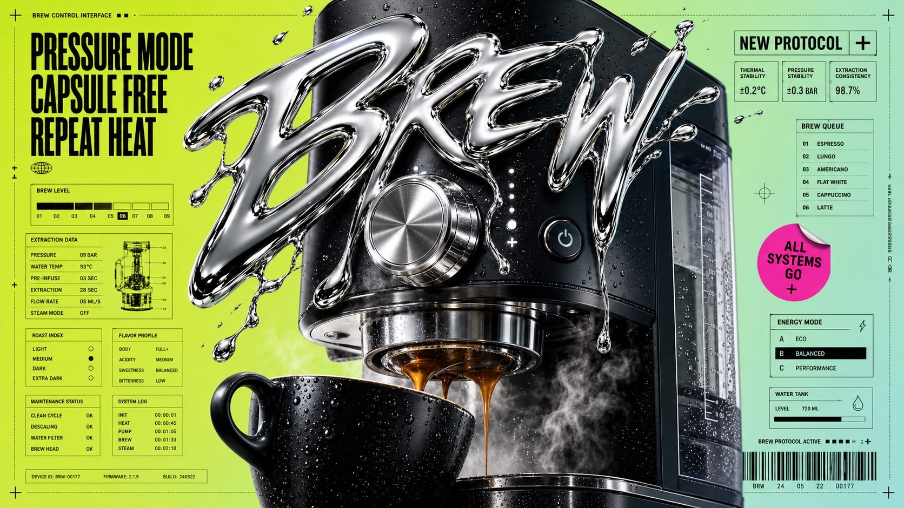</a> 
<strong>Liquid Chrome Clearance Poster Style</strong> 
<a href="styles/liquid-chrome-clearance-poster-style/README.md">打开 README</a>
</td>
<td width="33%" valign="top" align="center">
<a href="styles/loose-scribble-riso-print-style/README.md">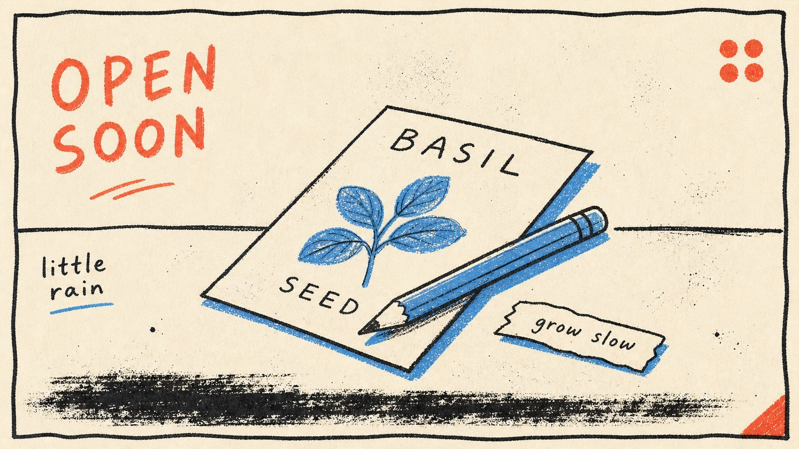</a> 
<strong>Loose Scribble Riso Print Style</strong> 
<a href="styles/loose-scribble-riso-print-style/README.md">打开 README</a>
</td>
<td width="33%" valign="top" align="center">
<a href="styles/luxury-perspective-checkerboard-editorial/README.md">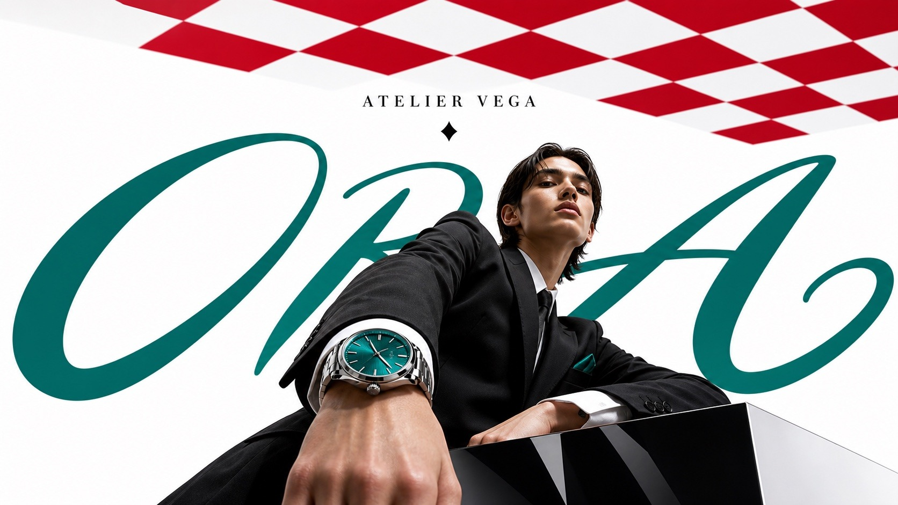</a> 
<strong>Luxury Perspective Checkerboard Editorial</strong> 
<a href="styles/luxury-perspective-checkerboard-editorial/README.md">打开 README</a>
</td>
</tr>
<tr>
<td width="33%" valign="top" align="center">
<a href="styles/manga-dossier-blueprint-poster/README.md">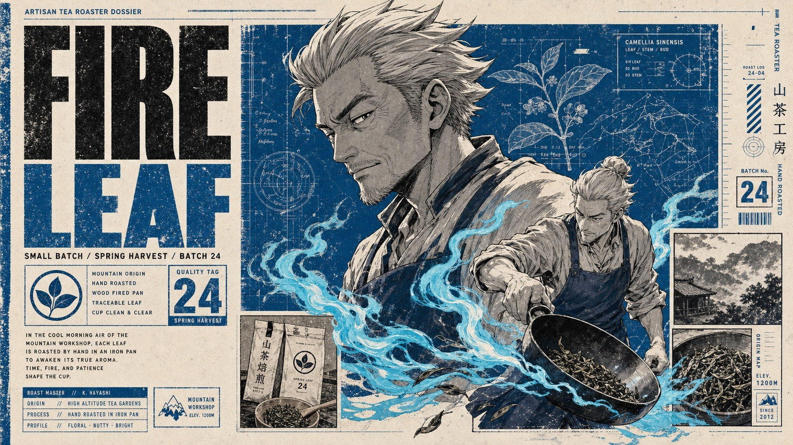</a> 
<strong>Manga Dossier Blueprint Poster</strong> 
<a href="styles/manga-dossier-blueprint-poster/README.md">打开 README</a>
</td>
<td width="33%" valign="top" align="center">
<a href="styles/market-brush-produce-poster-style/README.md">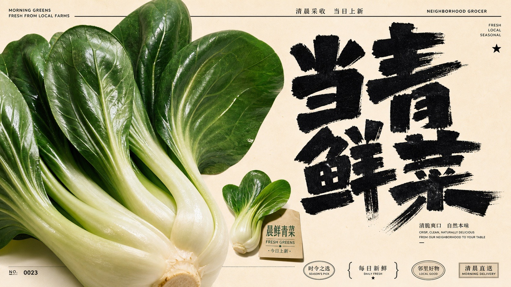</a> 
<strong>Market Brush Produce Poster Style</strong> 
<a href="styles/market-brush-produce-poster-style/README.md">打开 README</a>
</td>
<td width="33%" valign="top" align="center">
<a href="styles/metro-doodle-snapshot-diary-style/README.md">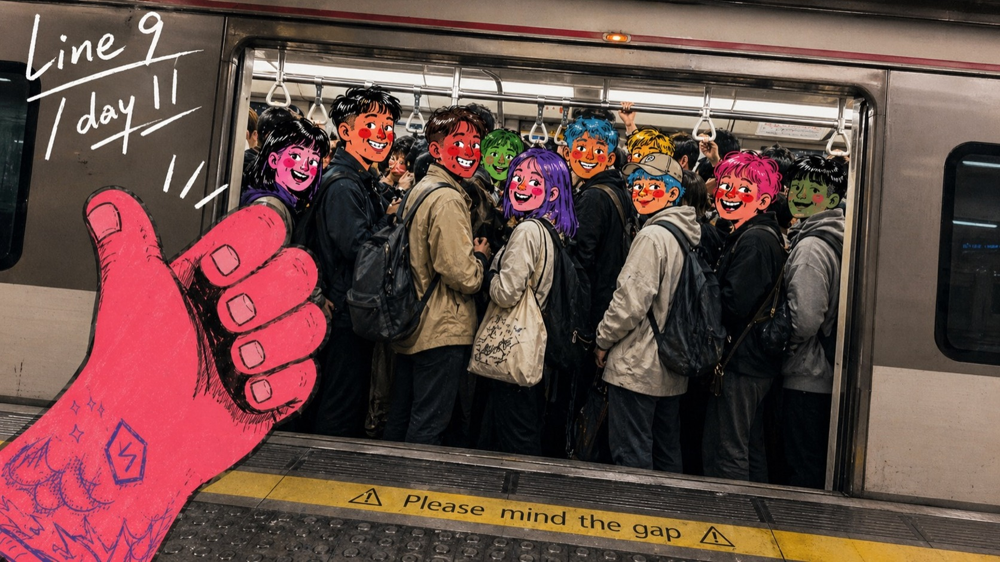</a> 
<strong>Metro Doodle Snapshot Diary</strong> 
<a href="styles/metro-doodle-snapshot-diary-style/README.md">打开 README</a>
</td>
</tr>
<tr>
<td width="33%" valign="top" align="center">
<a href="styles/mono-noir-type-portrait-poster-style/README.md">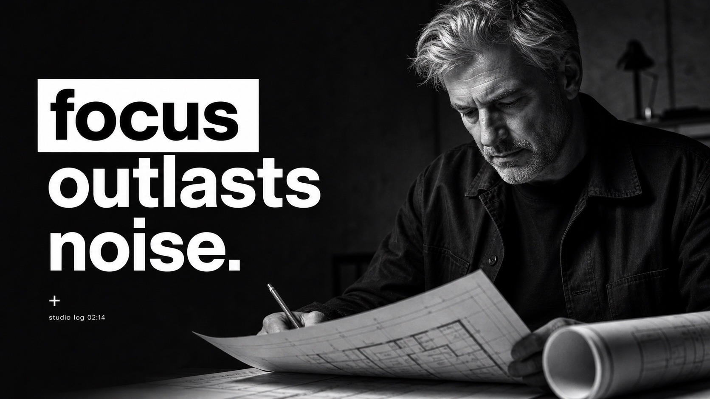</a> 
<strong>Mono Noir Type Portrait Poster Style</strong> 
<a href="styles/mono-noir-type-portrait-poster-style/README.md">打开 README</a>
</td>
<td width="33%" valign="top" align="center">
<a href="styles/monochrome-grid-sneaker-tech-spec/README.md">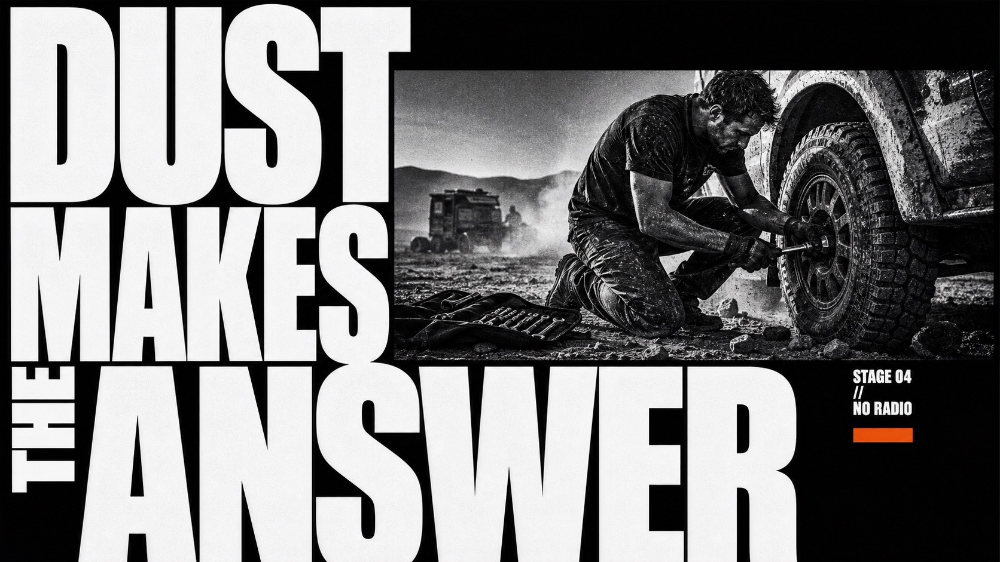</a> 
<strong>Monochrome Grid Sneaker Tech Spec</strong> 
<a href="styles/monochrome-grid-sneaker-tech-spec/README.md">打开 README</a>
</td>
<td width="33%" valign="top" align="center">
<a href="styles/monochrome-xerox-sports-dossier/README.md">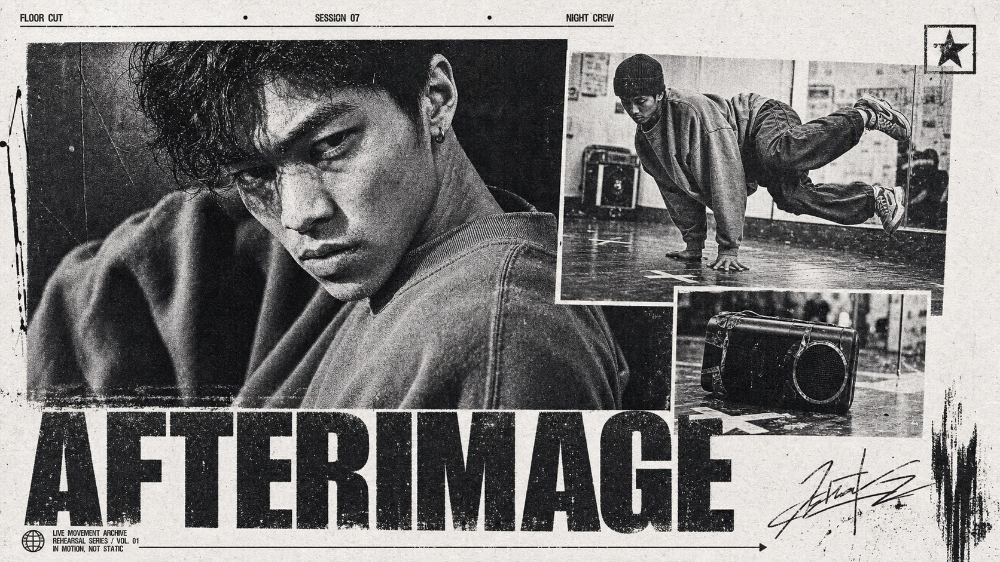</a> 
<strong>Monochrome Xerox Sports Dossier</strong> 
<a href="styles/monochrome-xerox-sports-dossier/README.md">打开 README</a>
</td>
</tr>
<tr>
<td width="33%" valign="top" align="center">
<a href="styles/mountain-trail-monster-doodle-poster-style/README.md">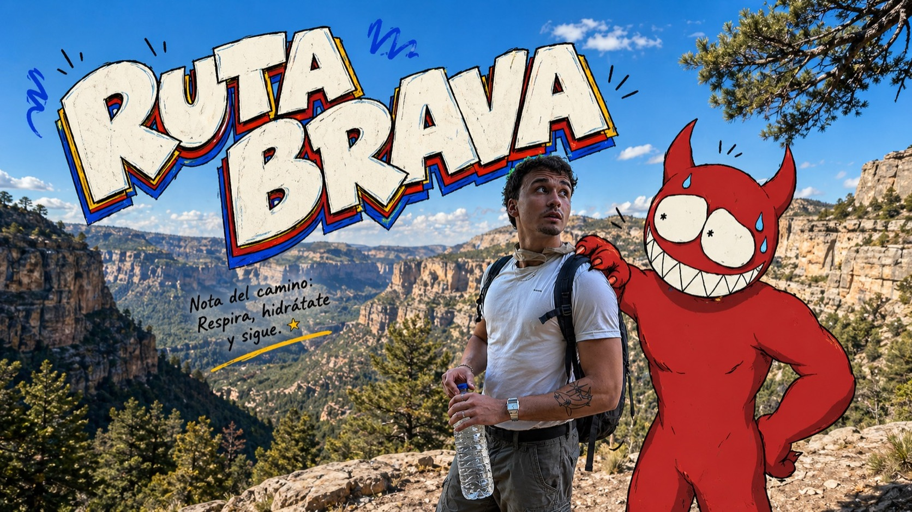</a> 
<strong>Mountain Trail Monster Doodle Poster Style</strong> 
<a href="styles/mountain-trail-monster-doodle-poster-style/README.md">打开 README</a>
</td>
<td width="33%" valign="top" align="center">
<a href="styles/multi-color-beverage-splash-ad-system-style/README.md">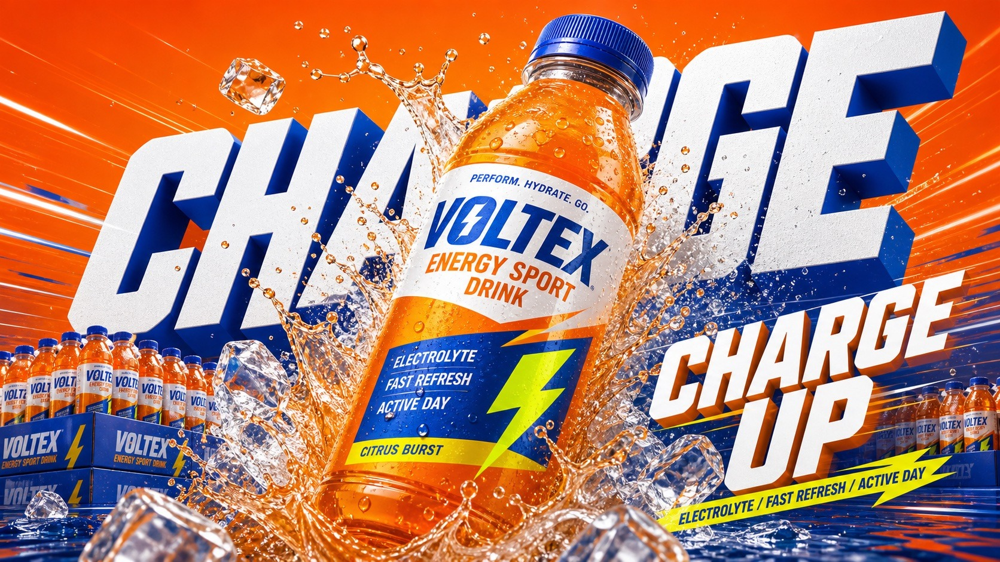</a> 
<strong>Multi-Color Beverage Splash Ad System Style</strong> 
<a href="styles/multi-color-beverage-splash-ad-system-style/README.md">打开 README</a>
</td>
<td width="33%" valign="top" align="center">
<a href="styles/naive-marker-psa-poster-style/README.md">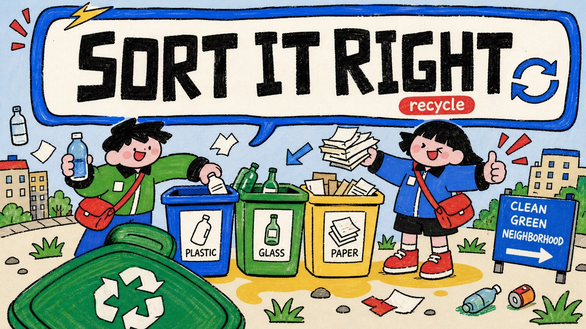</a> 
<strong>Naive Marker PSA Poster Style</strong> 
<a href="styles/naive-marker-psa-poster-style/README.md">打开 README</a>
</td>
</tr>
<tr>
<td width="33%" valign="top" align="center">
<a href="styles/naive-marker-quote-card-style/README.md">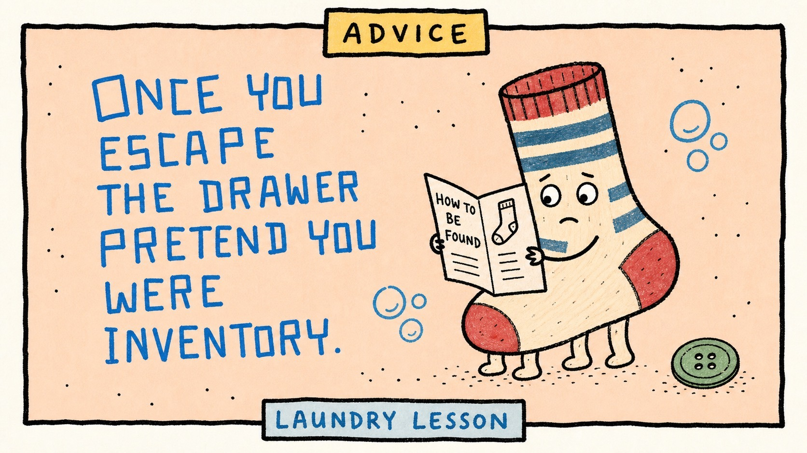</a> 
<strong>Naive Marker Quote Card Style</strong> 
<a href="styles/naive-marker-quote-card-style/README.md">打开 README</a>
</td>
<td width="33%" valign="top" align="center">
<a href="styles/neon-doodle-gallery-snapshot-style/README.md">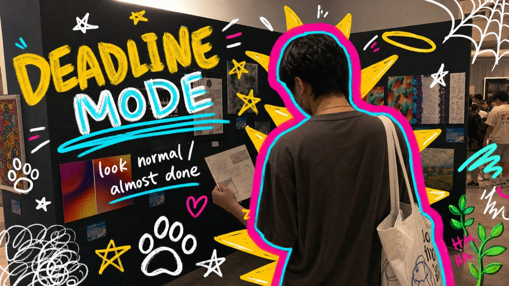</a> 
<strong>Neon Doodle Gallery Snapshot</strong> 
<a href="styles/neon-doodle-gallery-snapshot-style/README.md">打开 README</a>
</td>
<td width="33%" valign="top" align="center">
<a href="styles/neon-kinetic-typographic-poster-style/README.md">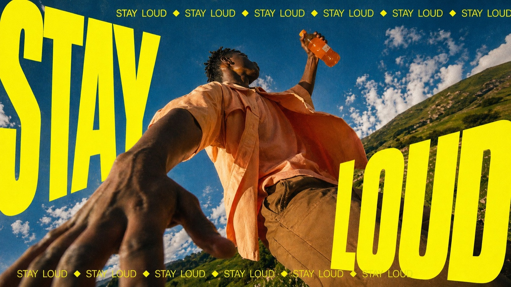</a> 
<strong>Neon Kinetic Typographic Poster</strong> 
<a href="styles/neon-kinetic-typographic-poster-style/README.md">打开 README</a>
</td>
</tr>
<tr>
<td width="33%" valign="top" align="center">
 
<strong>Neon Outdoor Diary Longform Collage Style</strong> 
<a href="styles/neon-outdoor-diary-longform-collage-style/README.md">打开 README</a>
</td>
<td width="33%" valign="top" align="center">
 
<strong>Neon Plush Gadget Pop 3D Style</strong> 
<a href="styles/neon-plush-gadget-pop-3d-style/README.md">打开 README</a>
</td>
<td width="33%" valign="top" align="center">
 
<strong>Neon Stadium 3D Hero Type Poster Style</strong> 
<a href="styles/neon-stadium-3d-hero-type-poster-style/README.md">打开 README</a>
</td>
</tr>
<tr>
<td width="33%" valign="top" align="center">
<a href="styles/neon-type-photo-scribble-poster/README.md">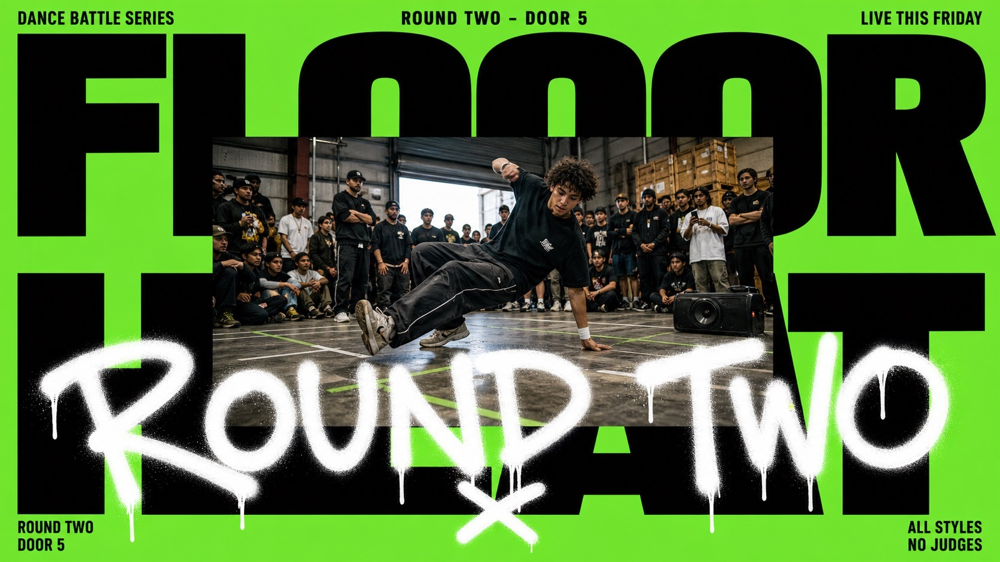</a> 
<strong>Neon Type Photo Scribble Poster</strong> 
<a href="styles/neon-type-photo-scribble-poster/README.md">打开 README</a>
</td>
<td width="33%" valign="top" align="center">
<a href="styles/olive-scribble-sports-poster-style/README.md">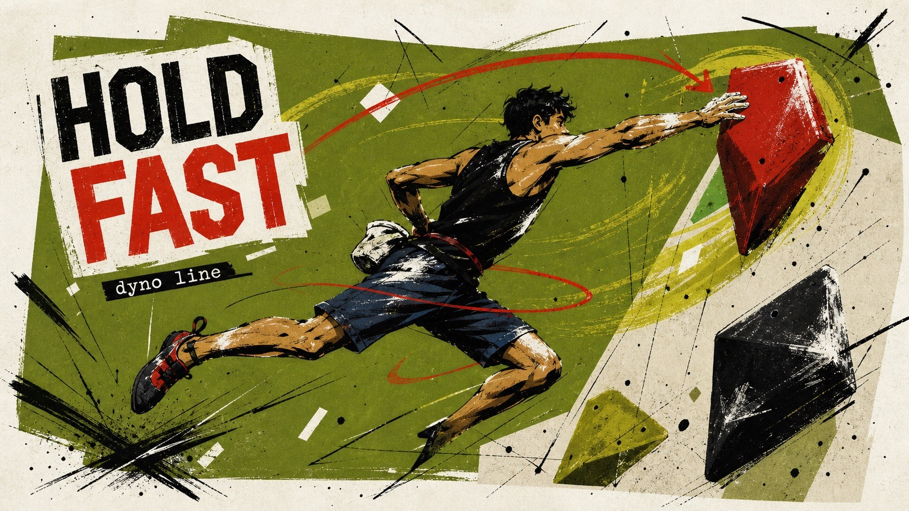</a> 
<strong>Olive Scribble Sports Poster Style</strong> 
<a href="styles/olive-scribble-sports-poster-style/README.md">打开 README</a>
</td>
<td width="33%" valign="top" align="center">
<a href="styles/orange-brush-mascot-action-poster-style/README.md">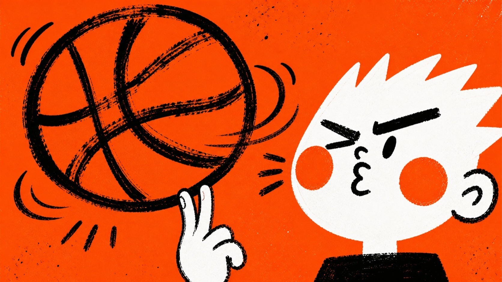</a> 
<strong>Orange Brush Mascot Action Poster Style</strong> 
<a href="styles/orange-brush-mascot-action-poster-style/README.md">打开 README</a>
</td>
</tr>
<tr>
<td width="33%" valign="top" align="center">
<a href="styles/photo-illustration-overlay-poster-style/README.md">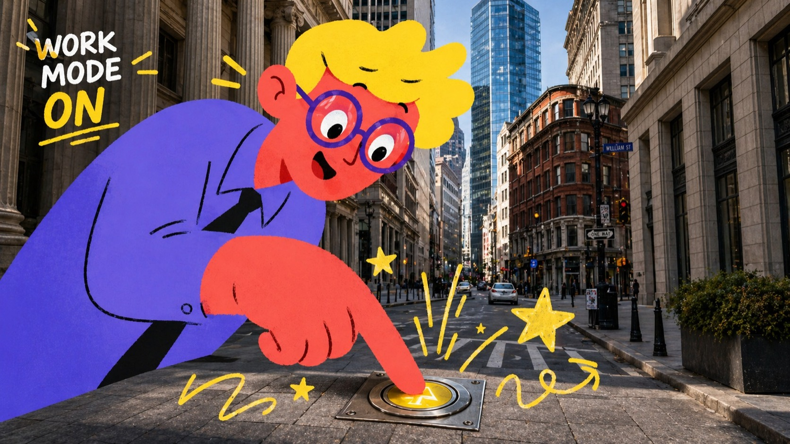</a> 
<strong>Photo Illustration Overlay Poster</strong> 
<a href="styles/photo-illustration-overlay-poster-style/README.md">打开 README</a>
</td>
<td width="33%" valign="top" align="center">
<a href="styles/pink-anime-motorcycle-spec-poster-style/README.md">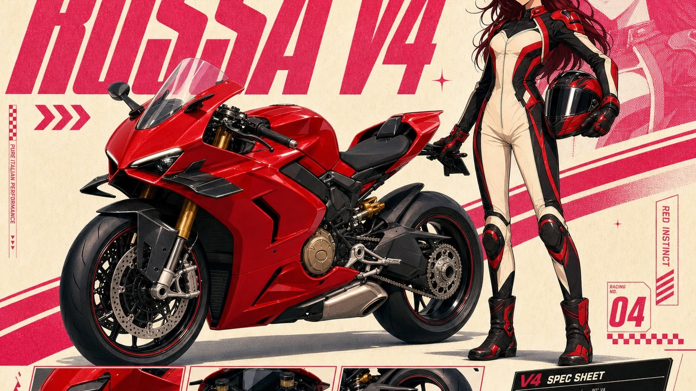</a> 
<strong>Pink Anime Motorcycle Spec Poster Style</strong> 
<a href="styles/pink-anime-motorcycle-spec-poster-style/README.md">打开 README</a>
</td>
<td width="33%" valign="top" align="center">
<a href="styles/playful-marker-grounding-poster-style/README.md">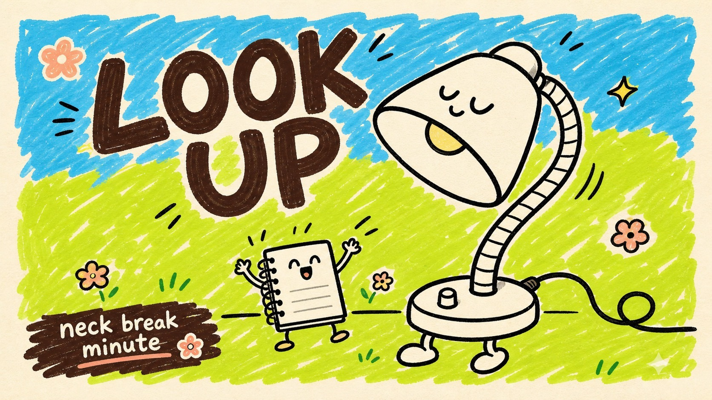</a> 
<strong>Playful Marker Grounding Poster Style</strong> 
<a href="styles/playful-marker-grounding-poster-style/README.md">打开 README</a>
</td>
</tr>
<tr>
<td width="33%" valign="top" align="center">
 
<strong>Playful Mascot Doodle Snapshot Style</strong> 
<a href="styles/playful-mascot-doodle-snapshot-style/README.md">打开 README</a>
</td>
<td width="33%" valign="top" align="center">
<a href="styles/plush-city-festival-mobile-poster-style/README.md">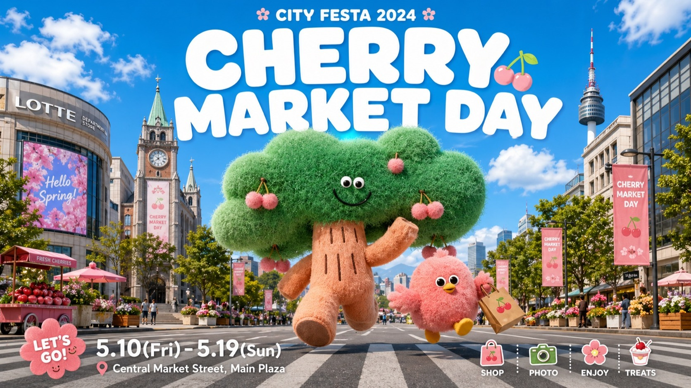</a> 
<strong>Plush City Festival Mobile Poster</strong> 
<a href="styles/plush-city-festival-mobile-poster-style/README.md">打开 README</a>
</td>
<td width="33%" valign="top" align="center">
<a href="styles/plush-comic-toy-product-poster-style/README.md">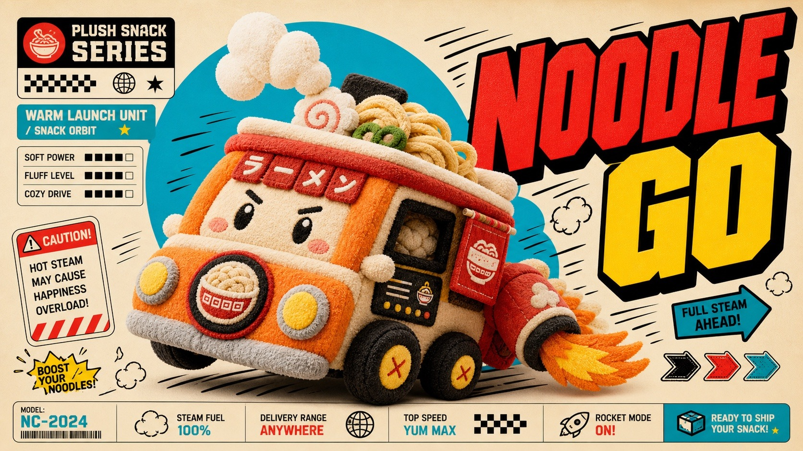</a> 
<strong>Plush Comic Toy Product Poster Style</strong> 
<a href="styles/plush-comic-toy-product-poster-style/README.md">打开 README</a>
</td>
</tr>
<tr>
<td width="33%" valign="top" align="center">
<a href="styles/pop-bubble-letter-photo-poster-style/README.md">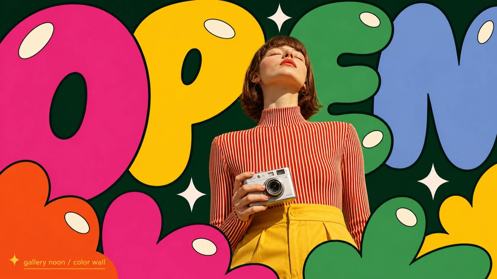</a> 
<strong>Pop Bubble Letter Photo Poster Style</strong> 
<a href="styles/pop-bubble-letter-photo-poster-style/README.md">打开 README</a>
</td>
<td width="33%" valign="top" align="center">
 
<strong>Prismatic Glass Animal Weekend Editorial</strong> 
<a href="styles/prismatic-glass-animal-weekend-editorial/README.md">打开 README</a>
</td>
<td width="33%" valign="top" align="center">
<a href="styles/quiet-luxury-furniture-nameplate-poster-style/README.md">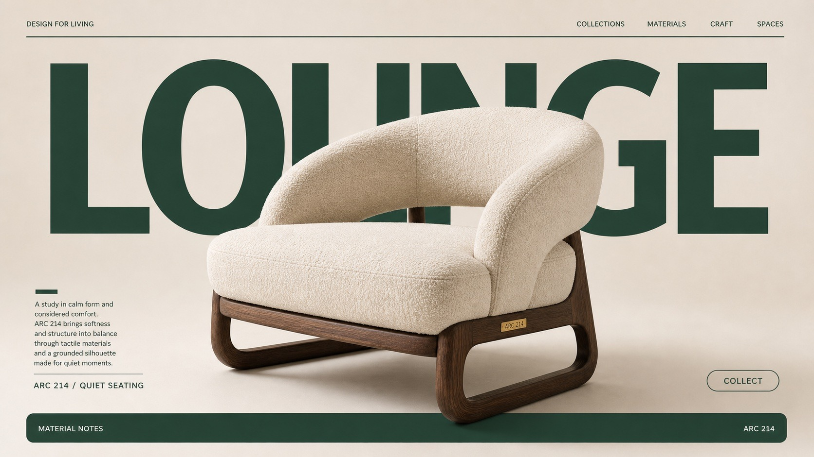</a> 
<strong>Quiet Luxury Furniture Nameplate Poster Style</strong> 
<a href="styles/quiet-luxury-furniture-nameplate-poster-style/README.md">打开 README</a>
</td>
</tr>
<tr>
<td width="33%" valign="top" align="center">
<a href="styles/red-black-manga-tabloid-poster-style/README.md">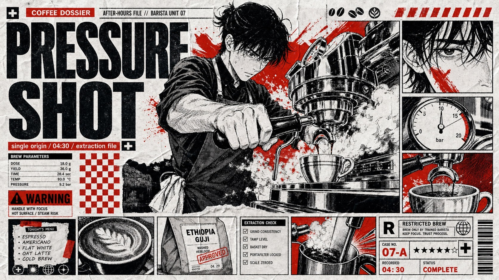</a> 
<strong>Red Black Manga Tabloid Poster Style</strong> 
<a href="styles/red-black-manga-tabloid-poster-style/README.md">打开 README</a>
</td>
<td width="33%" valign="top" align="center">
<a href="styles/red-yellow-grunge-skate-cover-style/README.md">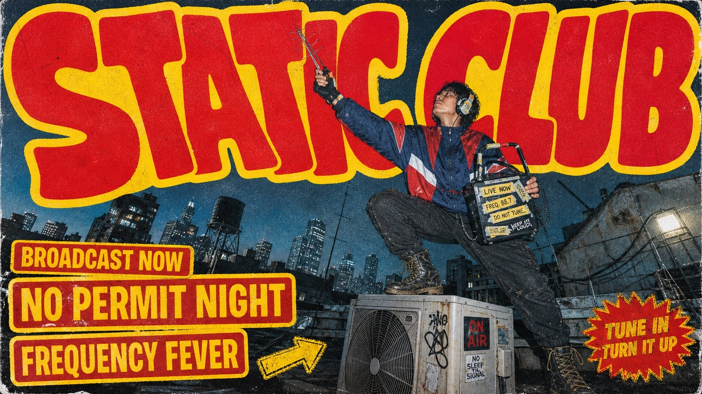</a> 
<strong>Red Yellow Grunge Skate Cover Style</strong> 
<a href="styles/red-yellow-grunge-skate-cover-style/README.md">打开 README</a>
</td>
<td width="33%" valign="top" align="center">
<a href="styles/red-yellow-product-trophy-collage-style/README.md">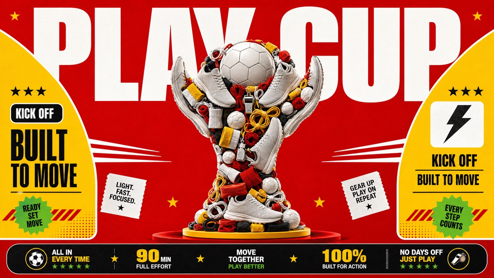</a> 
<strong>Red Yellow Product Trophy Collage Style</strong> 
<a href="styles/red-yellow-product-trophy-collage-style/README.md">打开 README</a>
</td>
</tr>
<tr>
<td width="33%" valign="top" align="center">
<a href="styles/retro-future-chrome-portrait-dossier/README.md">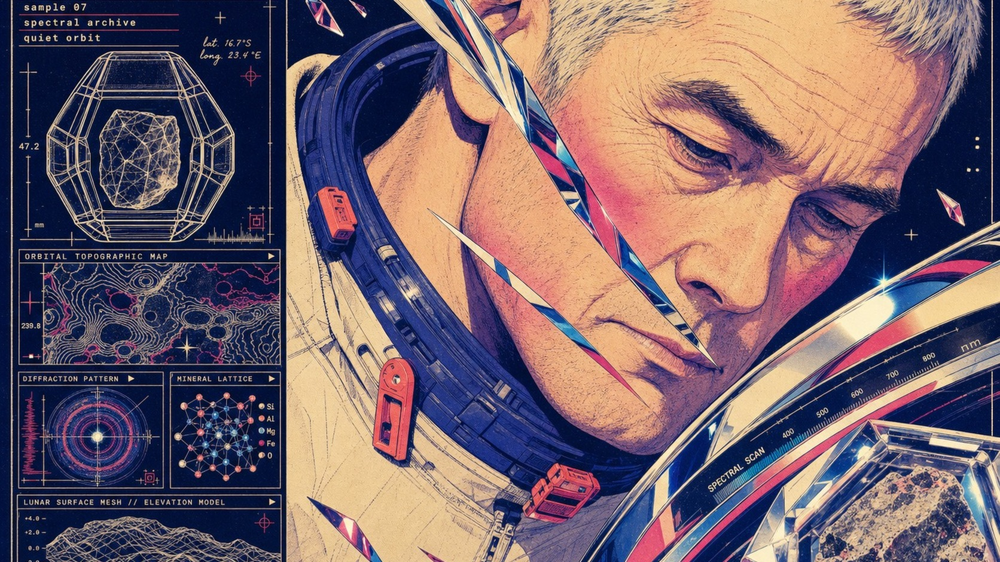</a> 
<strong>Retro Future Chrome Portrait Dossier</strong> 
<a href="styles/retro-future-chrome-portrait-dossier/README.md">打开 README</a>
</td>
<td width="33%" valign="top" align="center">
<a href="styles/rough-animation-pet-sketch-storyboard-style/README.md">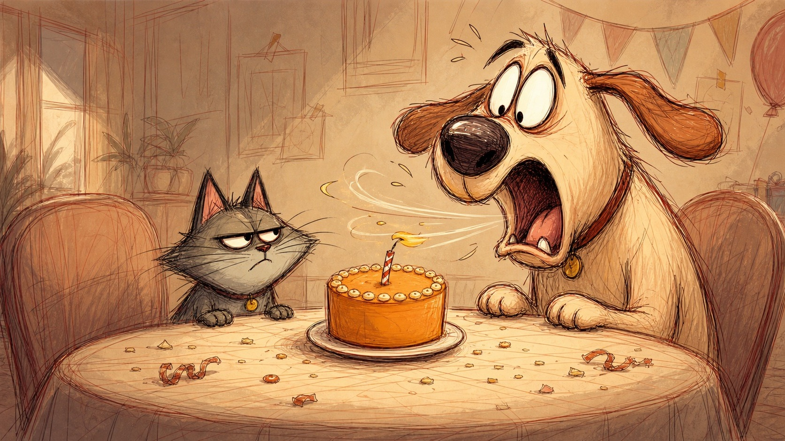</a> 
<strong>Rough Animation Pet Sketch Storyboard Style</strong> 
<a href="styles/rough-animation-pet-sketch-storyboard-style/README.md">打开 README</a>
</td>
<td width="33%" valign="top" align="center">
<a href="styles/rough-ink-music-doodle-poster-style/README.md">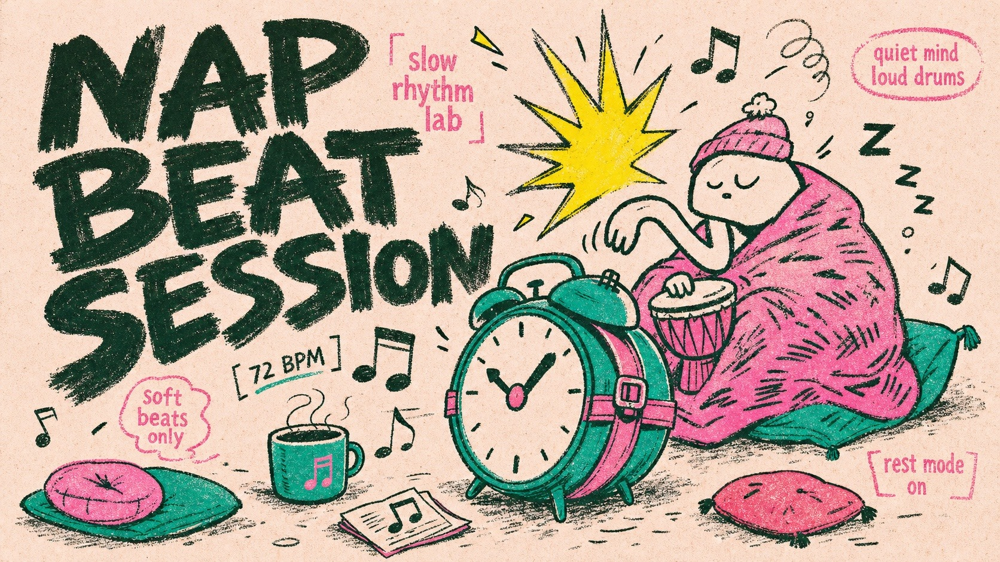</a> 
<strong>Rough Ink Music Doodle Poster Style</strong> 
<a href="styles/rough-ink-music-doodle-poster-style/README.md">打开 README</a>
</td>
</tr>
<tr>
<td width="33%" valign="top" align="center">
<a href="styles/rough-marker-monster-poster-style/README.md">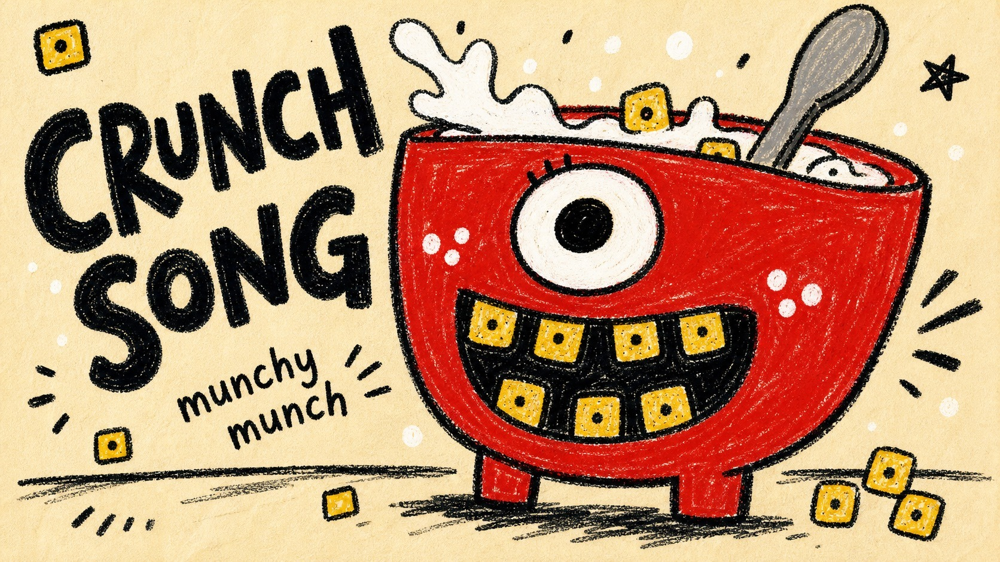</a> 
<strong>Rough Marker Monster Poster Style</strong> 
<a href="styles/rough-marker-monster-poster-style/README.md">打开 README</a>
</td>
<td width="33%" valign="top" align="center">
<a href="styles/scarlet-block-cutout-doodle-book-cover-style/README.md">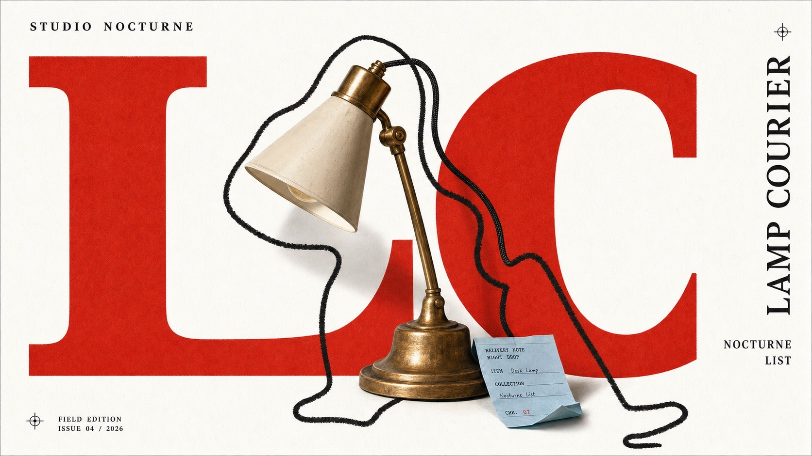</a> 
<strong>Scarlet Block Cutout Doodle Book Cover Style</strong> 
<a href="styles/scarlet-block-cutout-doodle-book-cover-style/README.md">打开 README</a>
</td>
<td width="33%" valign="top" align="center">
<a href="styles/scarlet-court-photo-type-poster-style/README.md">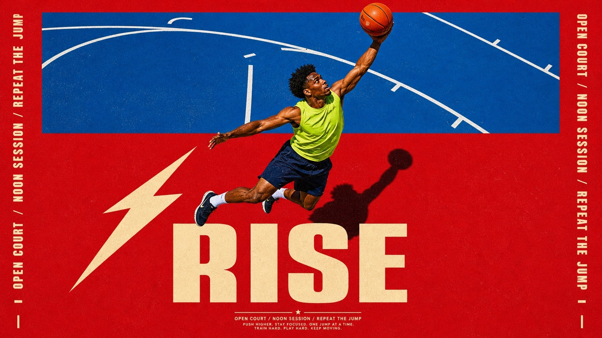</a> 
<strong>Scarlet Court Photo Type Poster</strong> 
<a href="styles/scarlet-court-photo-type-poster-style/README.md">打开 README</a>
</td>
</tr>
<tr>
<td width="33%" valign="top" align="center">
<a href="styles/scarlet-megatype-action-collage-style/README.md">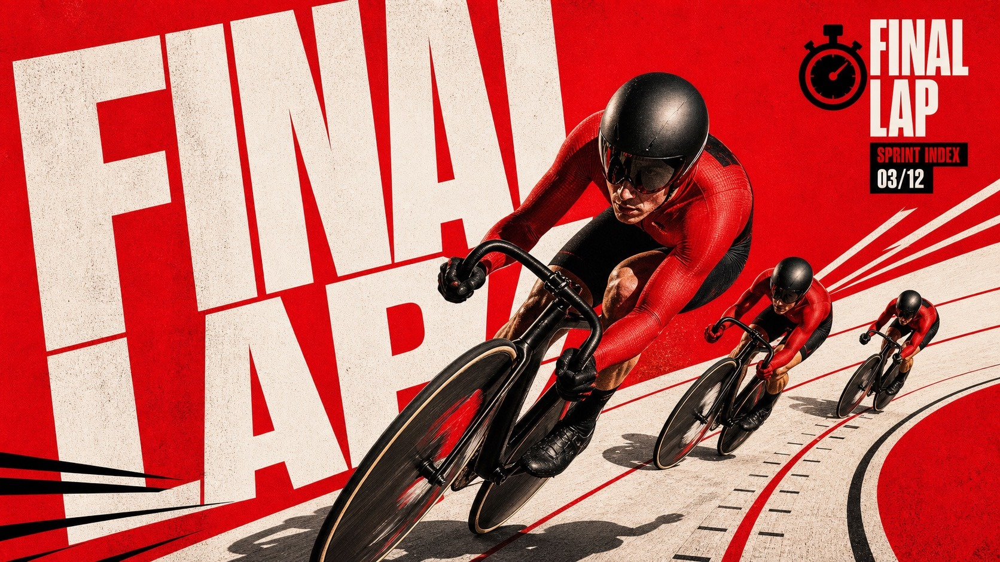</a> 
<strong>Scarlet Megatype Action Collage Style</strong> 
<a href="styles/scarlet-megatype-action-collage-style/README.md">打开 README</a>
</td>
<td width="33%" valign="top" align="center">
<a href="styles/school-grid-paper-cutout-poster/README.md">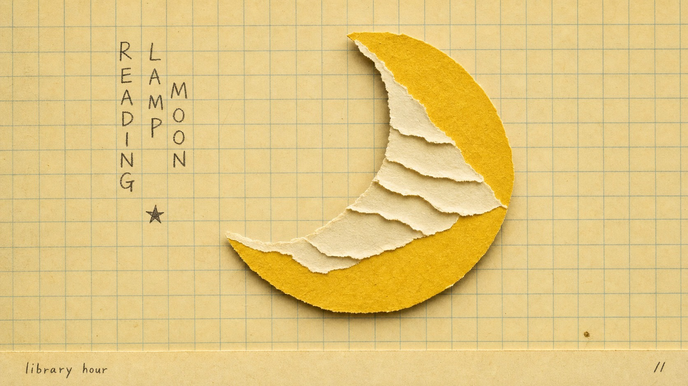</a> 
<strong>School Grid Paper Cutout Poster</strong> 
<a href="styles/school-grid-paper-cutout-poster/README.md">打开 README</a>
</td>
<td width="33%" valign="top" align="center">
<a href="styles/sky-blue-home-life-doodle-poster-style/README.md">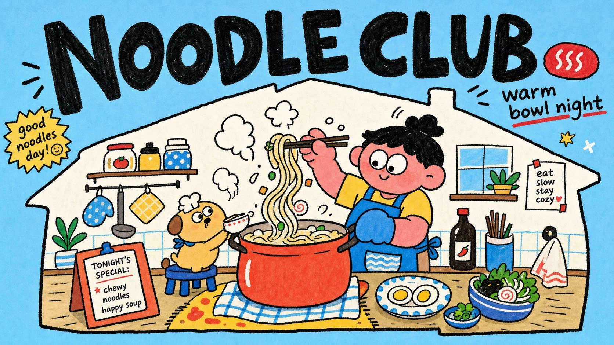</a> 
<strong>Sky Blue Home Life Doodle Poster Style</strong> 
<a href="styles/sky-blue-home-life-doodle-poster-style/README.md">打开 README</a>
</td>
</tr>
<tr>
<td width="33%" valign="top" align="center">
<a href="styles/sky-blue-lucky-tag-doodle-poster-style/README.md">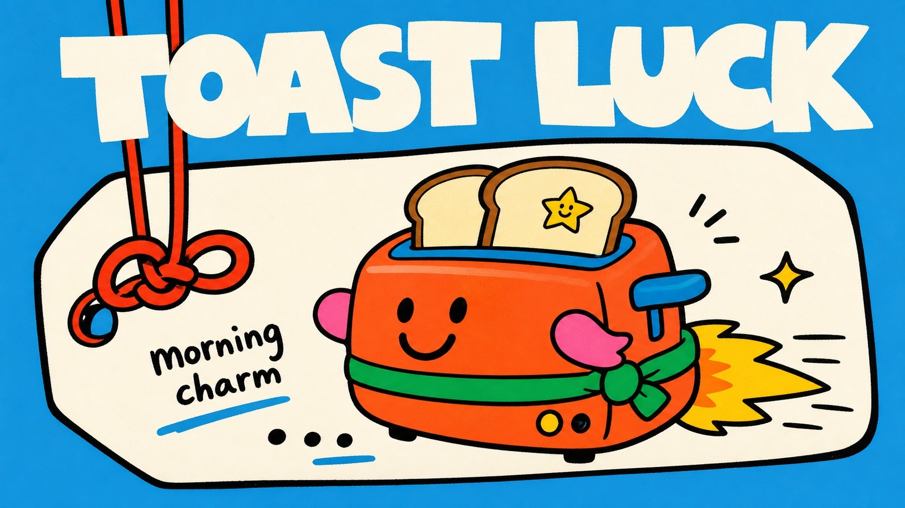</a> 
<strong>Sky Blue Lucky Tag Doodle Poster Style</strong> 
<a href="styles/sky-blue-lucky-tag-doodle-poster-style/README.md">打开 README</a>
</td>
<td width="33%" valign="top" align="center">
<a href="styles/soft-analog-future-editorial-poster-style/README.md">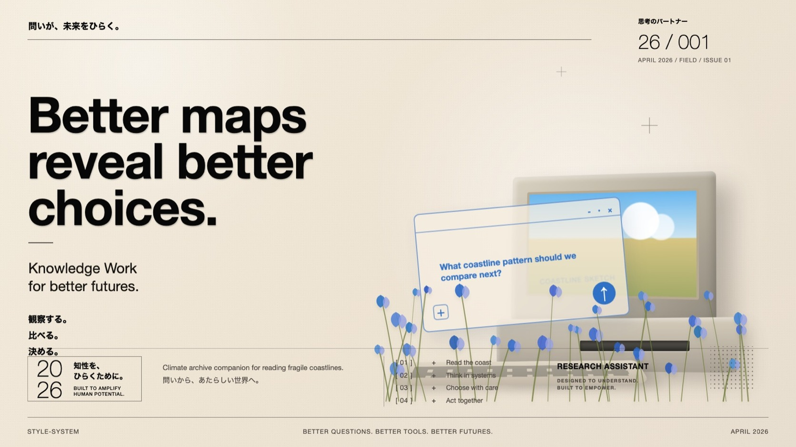</a> 
<strong>Soft Analog Future Editorial Poster</strong> 
<a href="styles/soft-analog-future-editorial-poster-style/README.md">打开 README</a>
</td>
<td width="33%" valign="top" align="center">
<a href="styles/subway-doodle-photo-hybrid-style/README.md">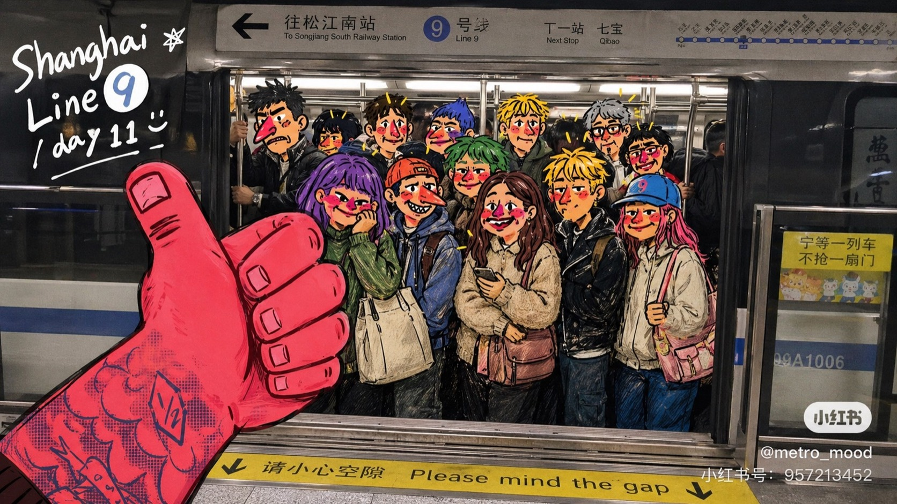</a> 
<strong>Subway Doodle Photo Hybrid</strong> 
<a href="styles/subway-doodle-photo-hybrid-style/README.md">打开 README</a>
</td>
</tr>
<tr>
<td width="33%" valign="top" align="center">
<a href="styles/sun-faded-scenic-editorial-poster/README.md">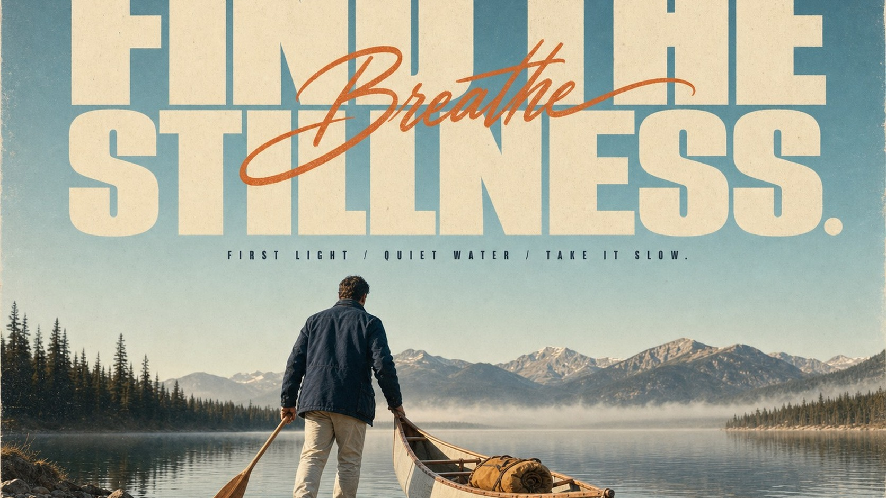</a> 
<strong>Sun-Faded Scenic Editorial Poster</strong> 
<a href="styles/sun-faded-scenic-editorial-poster/README.md">打开 README</a>
</td>
<td width="33%" valign="top" align="center">
<a href="styles/sunburst-fisheye-bubble-type-poster-style/README.md">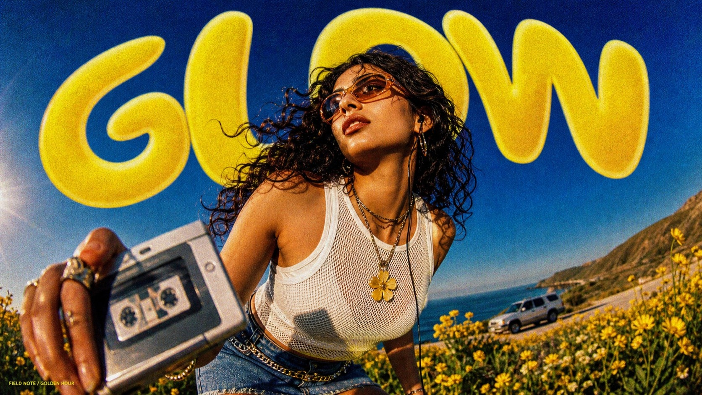</a> 
<strong>Sunburst Fisheye Bubble Type Poster Style</strong> 
<a href="styles/sunburst-fisheye-bubble-type-poster-style/README.md">打开 README</a>
</td>
<td width="33%" valign="top" align="center">
<a href="styles/sunlit-architectural-fashion-editorial/README.md">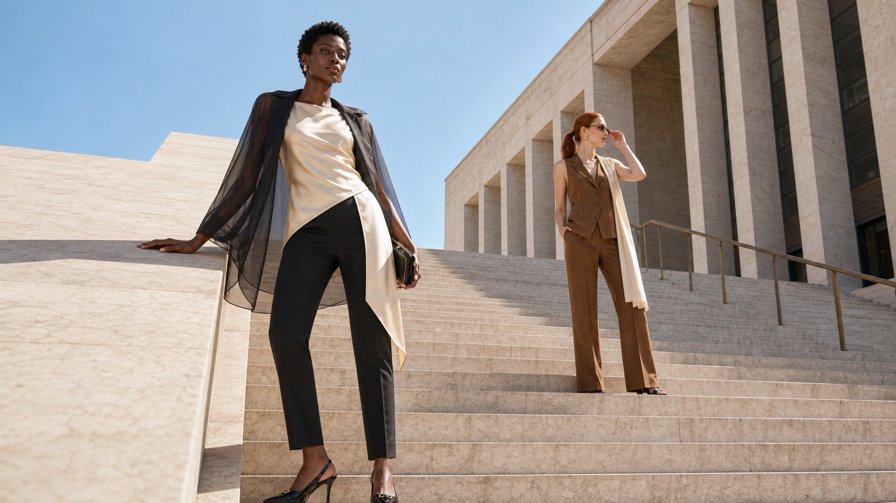</a> 
<strong>Sunlit Architectural Fashion Editorial</strong> 
<a href="styles/sunlit-architectural-fashion-editorial/README.md">打开 README</a>
</td>
</tr>
<tr>
<td width="33%" valign="top" align="center">
<a href="styles/sunlit-coastal-product-blitz/README.md">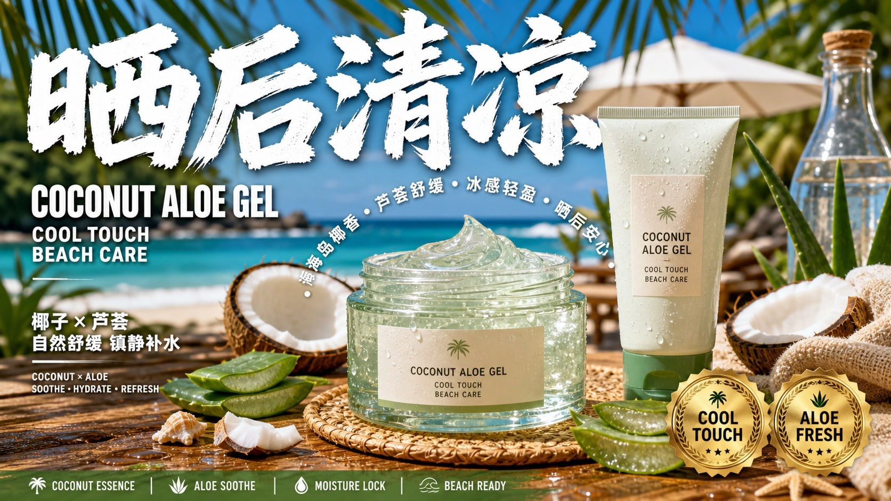</a> 
<strong>Sunlit Coastal Product Blitz</strong> 
<a href="styles/sunlit-coastal-product-blitz/README.md">打开 README</a>
</td>
<td width="33%" valign="top" align="center">
<a href="styles/sunlit-kinetic-block-type-photo-poster-style/README.md">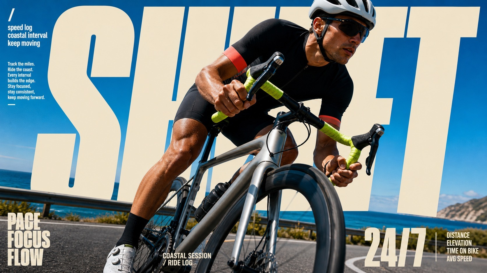</a> 
<strong>Sunlit Kinetic Block Type Photo Poster</strong> 
<a href="styles/sunlit-kinetic-block-type-photo-poster-style/README.md">打开 README</a>
</td>
<td width="33%" valign="top" align="center">
<a href="styles/sunlit-supermodel-nameplate-editorial/README.md">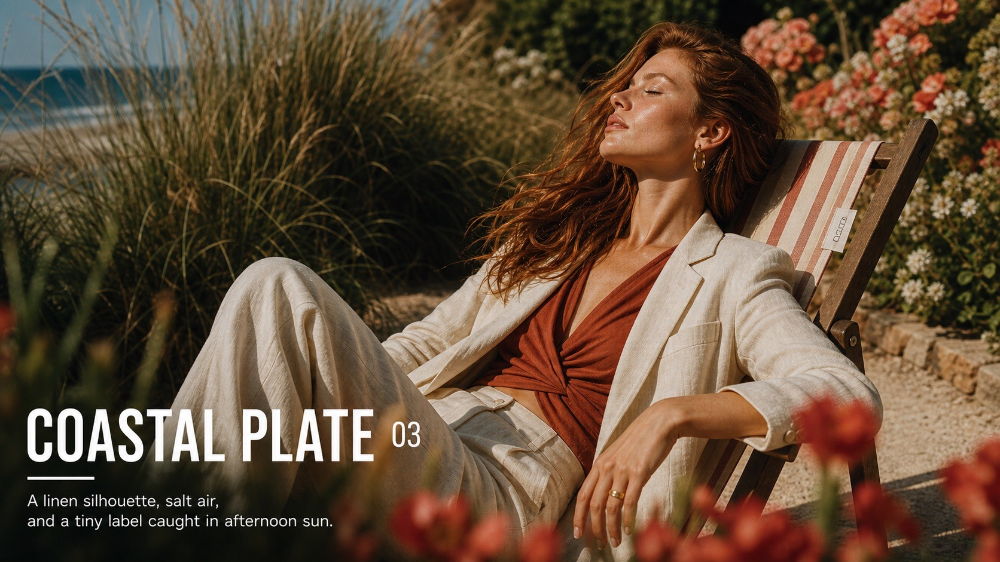</a> 
<strong>Sunlit Supermodel Nameplate Editorial</strong> 
<a href="styles/sunlit-supermodel-nameplate-editorial/README.md">打开 README</a>
</td>
</tr>
<tr>
<td width="33%" valign="top" align="center">
<a href="styles/sunny-3d-avatar-campaign-style/README.md">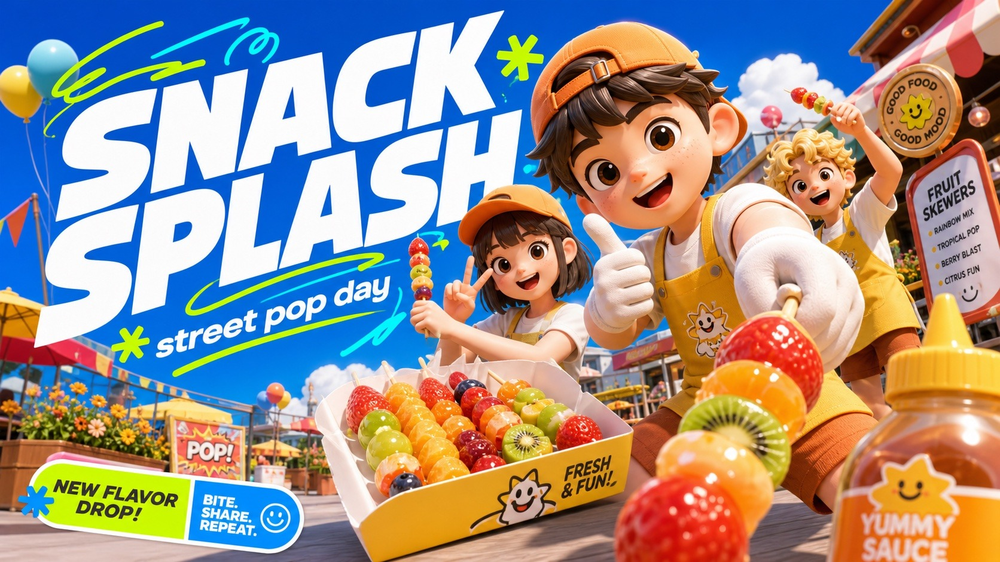</a> 
<strong>Sunny 3D Avatar Campaign Style</strong> 
<a href="styles/sunny-3d-avatar-campaign-style/README.md">打开 README</a>
</td>
<td width="33%" valign="top" align="center">
<a href="styles/surreal-fish-doodle-landmark-photo-collage-style/README.md">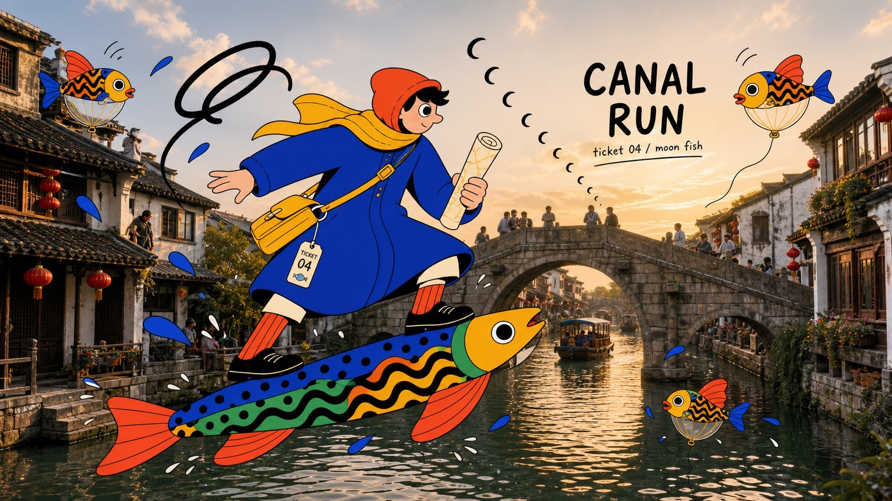</a> 
<strong>Surreal Fish Doodle Landmark Photo Collage Style</strong> 
<a href="styles/surreal-fish-doodle-landmark-photo-collage-style/README.md">打开 README</a>
</td>
<td width="33%" valign="top" align="center">
 
<strong>Surreal Megatype Dossier Collage</strong> 
<a href="styles/surreal-megatype-dossier-collage/README.md">打开 README</a>
</td>
</tr>
<tr>
<td width="33%" valign="top" align="center">
<a href="styles/teenage-skate-scribble-screenprint-poster-style/README.md">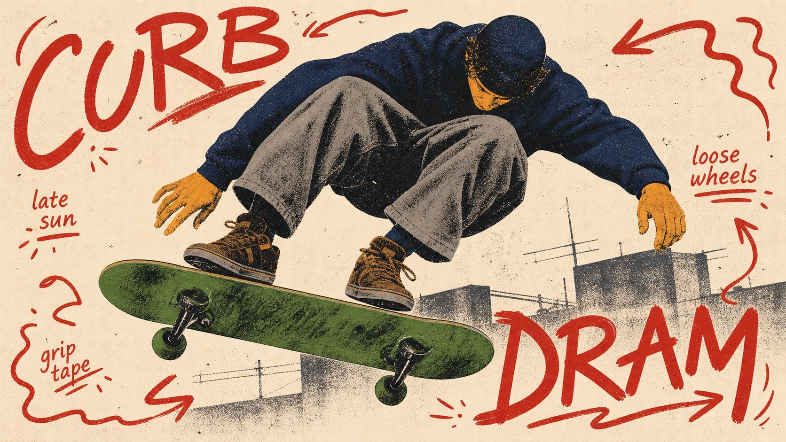</a> 
<strong>Teenage Skate Scribble Screenprint Poster Style</strong> 
<a href="styles/teenage-skate-scribble-screenprint-poster-style/README.md">打开 README</a>
</td>
<td width="33%" valign="top" align="center">
<a href="styles/tokyo-kawaii-travel-collage-poster-style/README.md">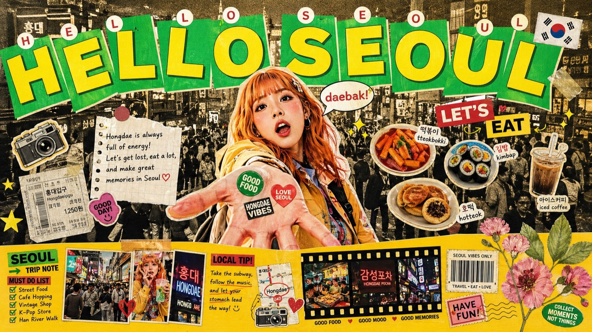</a> 
<strong>Tokyo Kawaii Travel Collage Poster</strong> 
<a href="styles/tokyo-kawaii-travel-collage-poster-style/README.md">打开 README</a>
</td>
<td width="33%" valign="top" align="center">
<a href="styles/tri-color-hardcut-portrait-poster-style/README.md">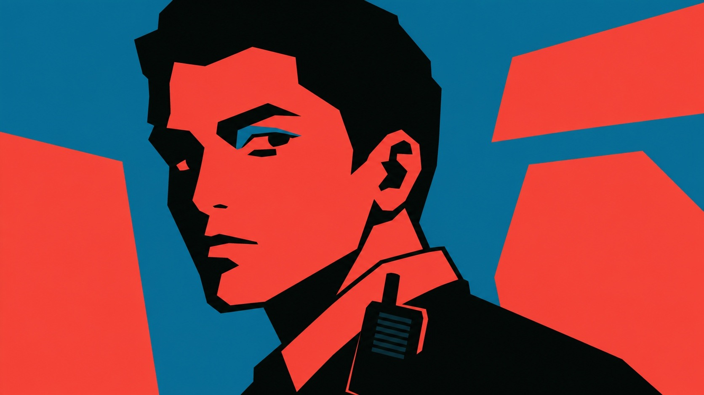</a> 
<strong>Tri Color Hardcut Portrait Poster Style</strong> 
<a href="styles/tri-color-hardcut-portrait-poster-style/README.md">打开 README</a>
</td>
</tr>
<tr>
<td width="33%" valign="top" align="center">
<a href="styles/turquoise-red-techno-manga-poster-style/README.md">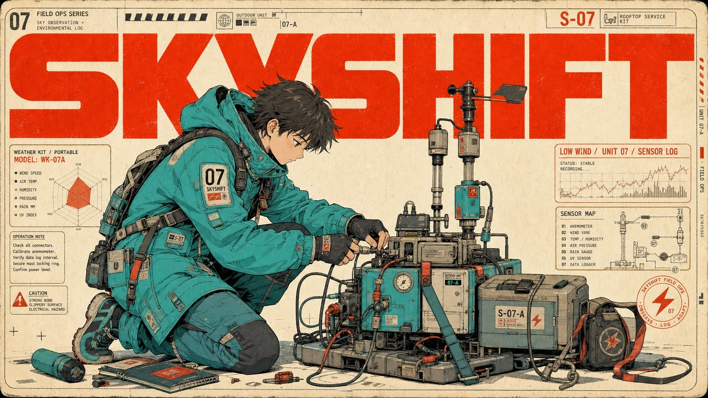</a> 
<strong>Turquoise Red Techno Manga Poster Style</strong> 
<a href="styles/turquoise-red-techno-manga-poster-style/README.md">打开 README</a>
</td>
<td width="33%" valign="top" align="center">
 
<strong>Urban Photo Ink Beast Collage Style</strong> 
<a href="styles/urban-photo-ink-beast-collage-style/README.md">打开 README</a>
</td>
<td width="33%" valign="top" align="center">
<a href="styles/urban-transit-doodle-diary-style/README.md">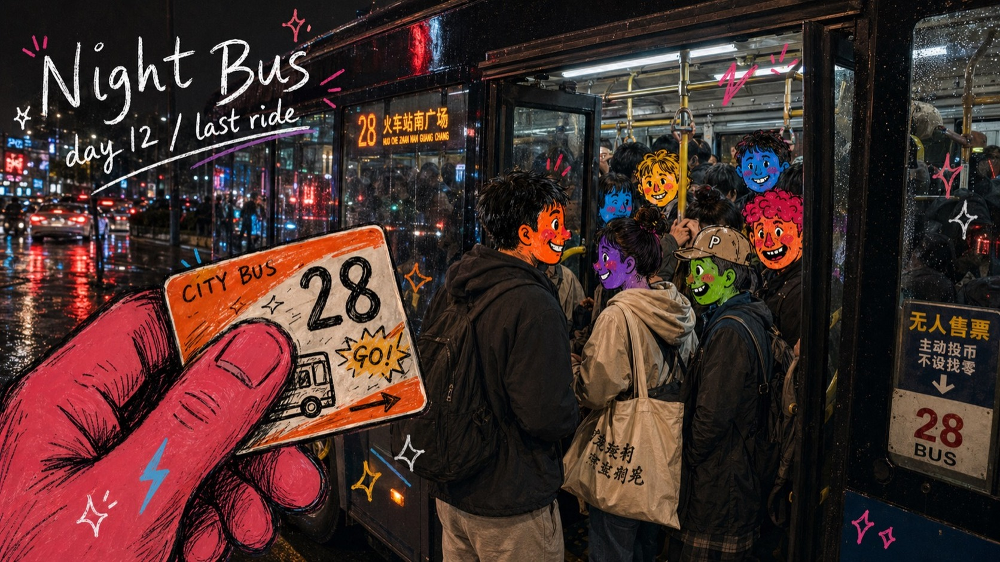</a> 
<strong>Urban Transit Doodle Diary Style</strong> 
<a href="styles/urban-transit-doodle-diary-style/README.md">打开 README</a>
</td>
</tr>
<tr>
<td width="33%" valign="top" align="center">
 
<strong>Vermilion Photocopy Tension Editorial</strong> 
<a href="styles/vermilion-photocopy-tension-editorial/README.md">打开 README</a>
</td>
<td width="33%" valign="top" align="center">
 
<strong>Warm Fisheye Product Impact Ad Style</strong> 
<a href="styles/warm-fisheye-product-impact-ad-style/README.md">打开 README</a>
</td>
<td width="33%" valign="top" align="center">
<a href="styles/xerox-neon-editorial-collage-style/README.md">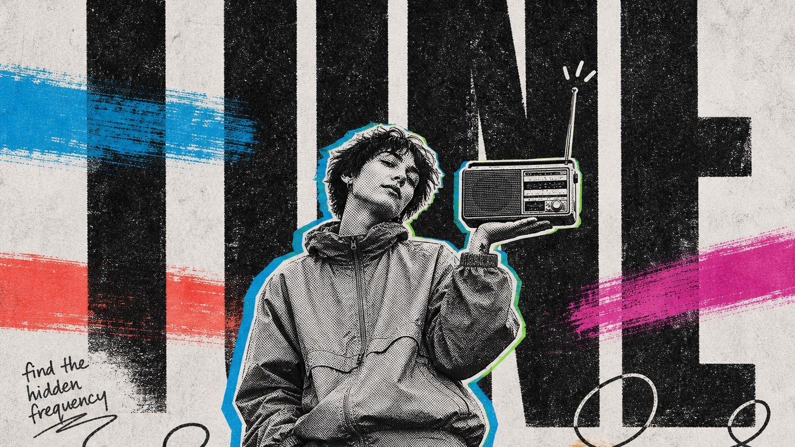</a> 
<strong>Xerox Neon Editorial Collage</strong> 
<a href="styles/xerox-neon-editorial-collage-style/README.md">打开 README</a>
</td>
</tr>
<tr>
<td width="33%" valign="top" align="center">
<a href="styles/y2k-grunge-hiphop-cutout-poster-style/README.md">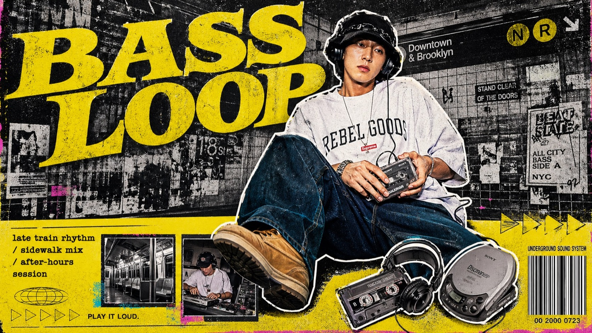</a> 
<strong>Y2K Grunge Hip-Hop Cutout Poster Style</strong> 
<a href="styles/y2k-grunge-hiphop-cutout-poster-style/README.md">打开 README</a>
</td>
<td width="33%" valign="top" align="center">
<a href="styles/y2k-mirror-ui-scribble-collage-style/README.md">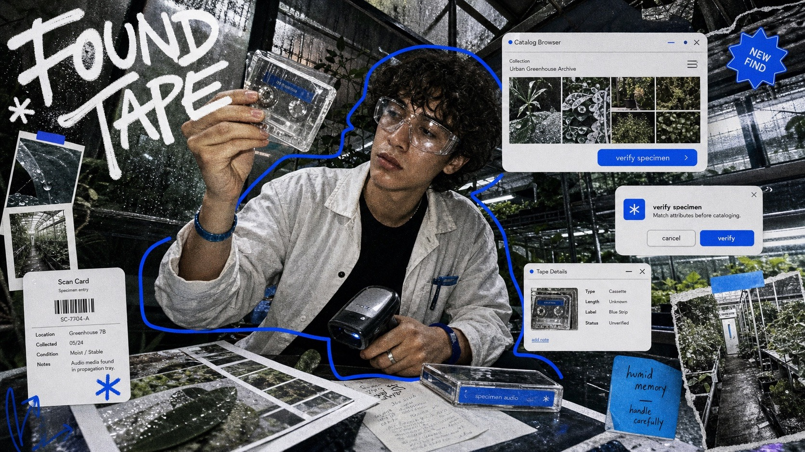</a> 
<strong>Y2K Mirror UI Scribble Collage Style</strong> 
<a href="styles/y2k-mirror-ui-scribble-collage-style/README.md">打开 README</a>
</td>
<td width="33%" valign="top" align="center">
<a href="styles/y2k-streetwear-sticker-collage-style/README.md">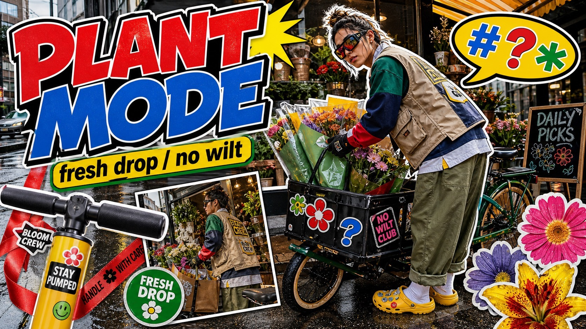</a> 
<strong>Y2K Streetwear Sticker Collage Style</strong> 
<a href="styles/y2k-streetwear-sticker-collage-style/README.md">打开 README</a>
</td>
</tr>
<tr>
<td width="33%" valign="top" align="center">
<a href="styles/yellow-black-manga-food-zine-ad-style/README.md">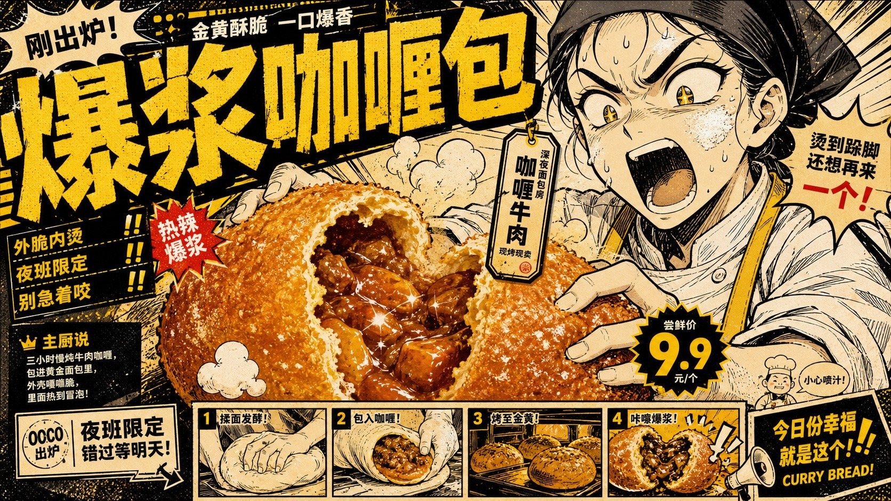</a> 
<strong>Yellow Black Manga Food Zine Ad Style</strong> 
<a href="styles/yellow-black-manga-food-zine-ad-style/README.md">打开 README</a>
</td>
<td width="33%" valign="top" align="center">
<a href="styles/yellow-graffiti-fisheye-manga-street-poster-style/README.md">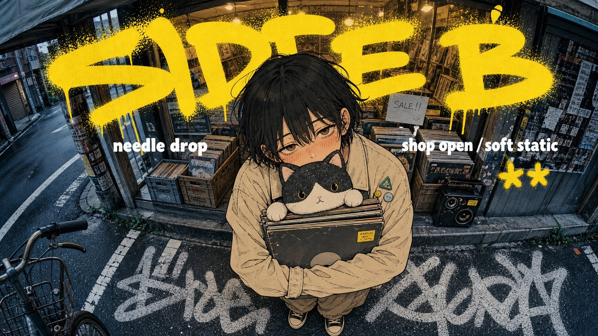</a> 
<strong>Yellow Graffiti Fisheye Manga Street Poster Style</strong> 
<a href="styles/yellow-graffiti-fisheye-manga-street-poster-style/README.md">打开 README</a>
</td>
<td width="33%"></td>
</tr>
</table>

[打开独立预设目录](styles/)

## 交叉风格功能

交叉风格不作为独立风格加入上面的主画廊。它是一种可选组合机制，可以把不同风格包分别分配给媒介、光线、色彩、前景或背景等职责。

可用模式：`stack`（分工叠加）、`blend`（加权融合）、`contrast`（区域对比）。详细规则和示例见 [交叉风格功能](style-packages/composites/README.md)。

<table>
<tr>
<td width="33%" valign="top" align="center"><a href="style-packages/composites/rpg-maker-x-gauguin/README.md">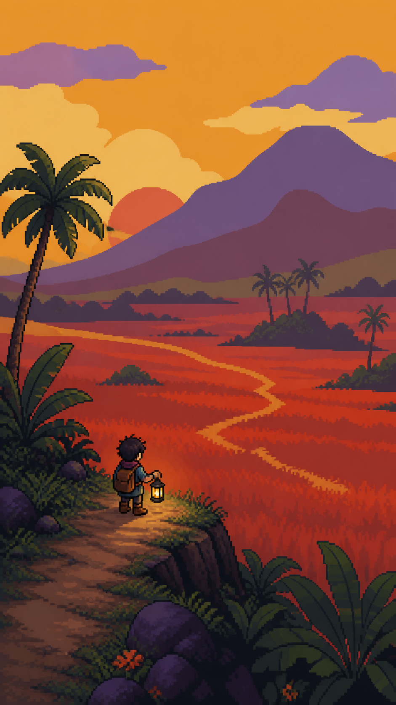</a> <strong>像素前景 + 高更背景</strong></td>
<td width="33%" valign="top" align="center"><a href="style-packages/composites/rpg-maker-x-turner/README.md">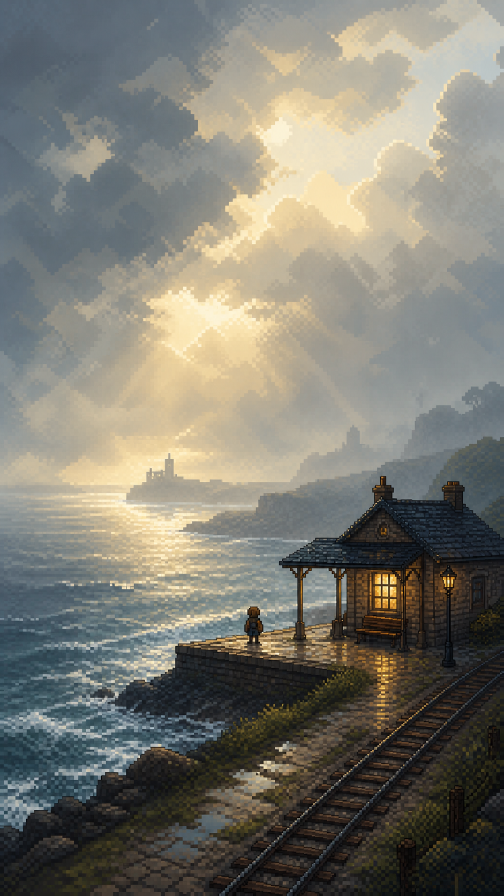</a> <strong>日系 RPG 像素 + 透纳天空</strong></td>
<td width="33%" valign="top" align="center"><a href="style-packages/composites/vermeer-x-monet/README.md">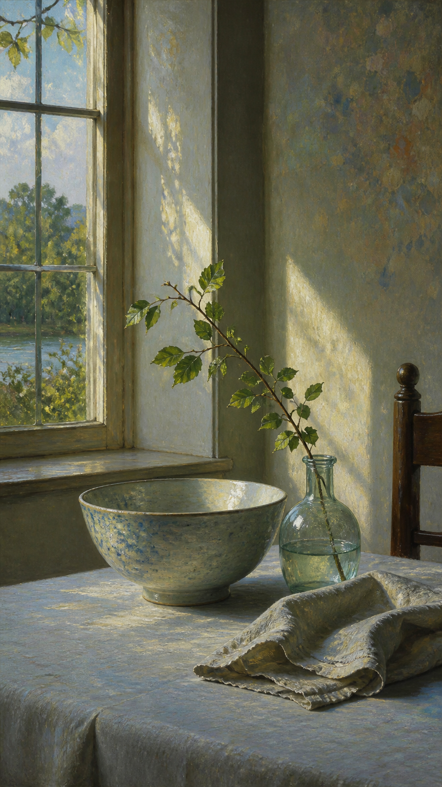</a> <strong>维米尔光线 + 莫奈色彩</strong></td>
</tr>
</table>

## 来源与版权

请先阅读 [NOTICE](NOTICE)、[LICENSE](LICENSE)、[LICENSE-OHMYSTYLE.md](LICENSE-OHMYSTYLE.md) 和具体风格包的 `provenance.yaml`。参考作品用于研究和风格拆解，不代表复制具体作品获得授权。
