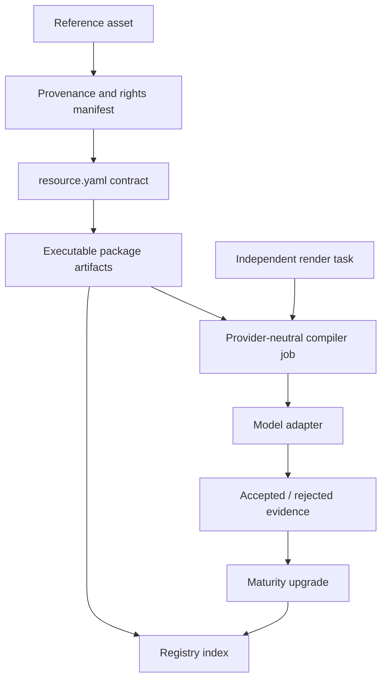

# Core resource architecture

OhMyStyle treats a visual style as a reusable, evidence-backed resource rather
than a long prompt or a subject-specific image recipe.

```text
Reference works + provenance
            ↓
     resource.yaml contract
            ↓
       package.yaml
   ┌────────┼─────────┐
   ↓        ↓         ↓
visual   reproduction evaluation
signature  + prompts   + examples
            ↓
      provider-neutral job
            ↓
       model adapter
            ↓
       metrics + review
```

## Resource and task boundaries

`style-packages/**/resource.yaml` describes how a style behaves. It must be
independent of a particular subject, character, story, or narrative. The
existing `package.yaml`, prompt files, visual signature, reproduction rules,
references, and evaluation files are the implementation artifacts.

Render tasks under `tasks/` describe what to generate. A task may contain a
subject, composition request, narrative, aspect ratio, or strict measurable
constraint. A task is not part of an artist or movement package and is not
required for a style to be valid.

## Maturity contract

- `L0`: name or descriptor only;
- `L1`: structured style description;
- `L2`: reference-backed executable package;
- `L3`: L2 plus an accepted generated example and review evidence;
- `L4`: L3 plus tested interoperability across providers or adapters.

The current registry intentionally distinguishes L2 packages from L3 packages
instead of claiming that every demo has already passed human evaluation.

## Resource dimensions

Dimensions are orthogonal to subject and narrative. Current dimensions include
medium, process, camera, composition, lighting, palette, surface, texture,
depth, subject treatment, and layout. Composite recipes may assign these
dimensions to `stack`, `blend`, or `contrast` roles without modifying the base
packages.

## Evidence and rights

Every package points to a reference manifest. Each row records the source URL,
creator, license, attribution, local asset path, and analytical role. The
manifest is the authority for whether a reference can be redistributed.
Generated examples are anonymous new scenes and must not be presented as
source artworks. A missing or ambiguous rights record lowers the package's
readiness rather than being silently ignored.

## Registry workflow


