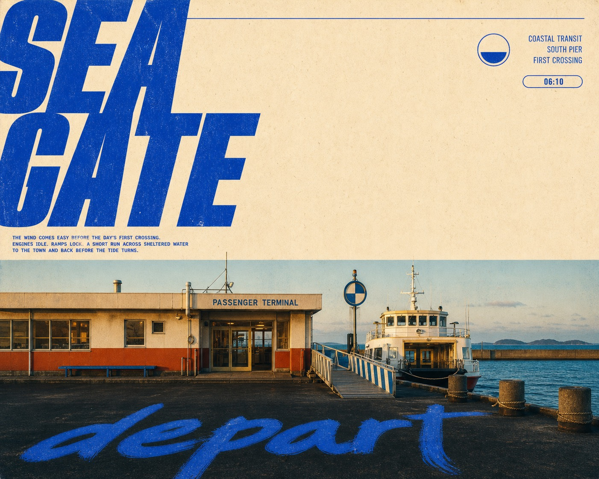

# Cobalt Megatype Roadside Travel Editorial



A nostalgic roadside-travel editorial poster system that combines cropped cobalt megatype, sparse locator graphics, warm straight-on architectural photography, cream uncoated paper, and one loose hand-painted word across the dark foreground.

## Copy Prompt

Default case: `Coastal Ferry Gate`

```text
Use the "Cobalt Megatype Roadside Travel Editorial" visual style as the locked style.

Create a 16:9 image.

Subject: a low cream-and-vermilion public ferry terminal with a compact passenger ferry beside it
Action: opening for the first crossing while the ferry rests at the gangway
Prop / product: a striped boarding ramp, one circular harbor signal, and unbranded mooring posts
Location: a quiet windswept island harbor
Background: flat blue water, a long concrete breakwater, low distant islands, pale sky, and no mountains
Main text: SEA GATE
Secondary text: COASTAL TRANSIT / SOUTH PIER / FIRST CROSSING
Accent symbol: depart
Styling: if any incidental traveler appears, use a plain navy windbreaker and cream trousers with no marks

Style direction:
A nostalgic roadside-travel editorial poster system that combines cropped cobalt megatype,
sparse locator graphics, warm straight-on architectural photography, cream uncoated paper, and
one loose hand-painted word across the dark foreground.

Keep visible:
- A poster split into a cream editorial field above and a full-width documentary location photograph below, with the boundary near the middle.
- Two enormous stacked words in ultra-heavy italic condensed sans type occupy the upper-left and crop decisively beyond the left edge.
- The headline is printed in one saturated cobalt blue with tight spacing, hard silhouettes, and slightly weathered ink edges.
- The upper-right stays relatively open and carries a tiny locator system: thin horizontal rule, small label stack, circular icon, and outlined capsule.
- A short compact paragraph of cobalt microcopy sits low in the cream field, balancing the giant headline without filling the negative space.

Avoid:
Do not recreate Mount Fuji, a volcanic mountain silhouette, the LAWSON convenience store, blue-
red retail stripe, convenience-store parking lot, branded storefront products, the MT. FUJI
headline, original Japanese captions, Fuji-Hakone-Izu location copy, Honshu Island label,
original asphalt calligraphy, or the source travel premise. No logos, trademarks, watermarks,
usernames, signatures, QR codes, platform marks, branded vehicles, dense retail signage, crowds,
featured faces, glossy tourism advertising, corporate brochure polish, HDR, neon cyberpunk,
cinematic night lighting, collage panels, stickers, prices, maps, UI chrome, anime,
illustration, vector scenery, painterly architecture, 3D rendering, miniature diorama, plastic
textures, mountains dominating the horizon, excessive blur, heavy distress, severe chromatic
aberration, compression artifacts, or excessive noise.

Do not copy source content, real logos, watermarks, platform UI, QR codes, or exact
reference layouts. Keep the visual system, but change the subject, text, and scene.
```

## Full Style

- [Open style.json](../../styles/cobalt-megatype-roadside-travel-editorial-style/style.json)
- [Open style folder](../../styles/cobalt-megatype-roadside-travel-editorial-style/)

<!-- Generated by scripts/generate-copy-prompts.py. Do not edit manually. -->
