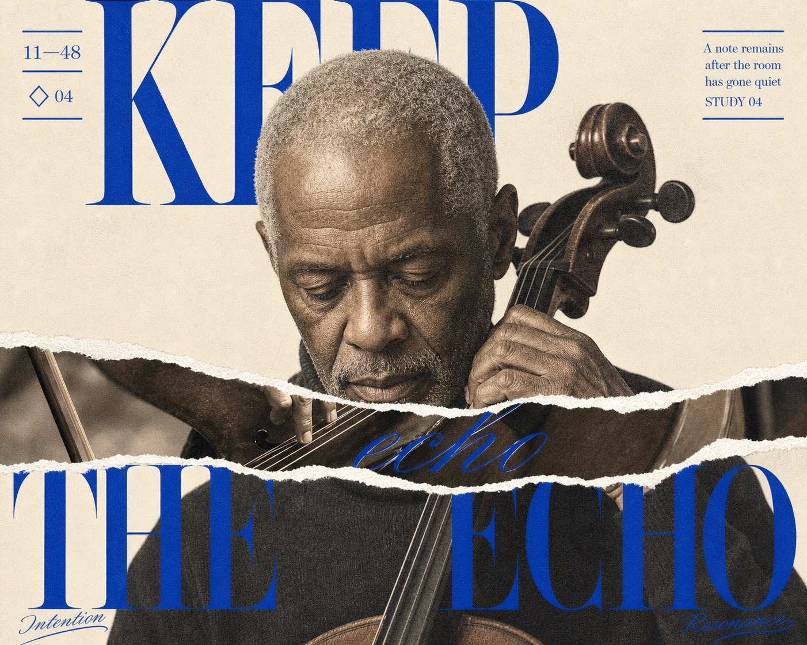

# Cobalt Torn Didone Portrait Editorial



A sparse fashion-editorial poster system built from a warm paper field, one centered halftone portrait or sculptural subject, monumental cobalt Didone typography, an irregular horizontal torn-paper reveal, and restrained calligraphic and catalog-like corner notes.

## Copy Prompt

Default case: `midnight-cellist`

```text
Use the "Cobalt Torn Didone Portrait Editorial" visual style as the locked style.

Create a 16:9 image.

Subject: an older Black male cellist with close-cropped silver hair and a weathered, calm face
Action: pausing between notes with his head gently lowered while one hand steadies the cello neck
Prop / product: the dark wooden cello scroll and a slim bow entering the close portrait crop
Location: a nearly empty rehearsal studio after midnight
Background: one faint acoustic-panel seam and a soft fragment of a music stand, mostly lost into the ivory field
Main text: KEEP THE ECHO
Secondary text: 11—48 / A note remains after the room has gone quiet / STUDY 04
Accent symbol: ◇ 04
Styling: a plain charcoal wool turtleneck with no jewelry or branding

Style direction:
A sparse fashion-editorial poster system built from a warm paper field, one centered halftone
portrait or sculptural subject, monumental cobalt Didone typography, an irregular horizontal
torn-paper reveal, and restrained calligraphic and catalog-like corner notes.

Keep visible:
- A warm ivory paper field remains visibly open around the subject, with roughly one third of the design functioning as calm negative space rather than a full-bleed scene.
- One front-facing or gently turned chest-up subject dominates the center and lower field at near life-size scale, cropped by the bottom and sometimes by one side.
- One broad irregular horizontal torn-paper reveal slices across the central subject; bright fibrous white edges and a slightly displaced photographic strip make the physical rip unmistakable.
- The main headline uses monumental high-contrast Didone serif letterforms in saturated cobalt, split across upper and lower zones, extending beyond the canvas and passing both behind and in front of the subject.
- A single elegant hairline calligraphic word crosses the torn central band, while two smaller curved or diagonal script labels counterbalance the lower corners.

Avoid:
Source woman, recognizable source face, sideways source gaze, dark shaggy bob, blue patterned
shirt, repeated source eyes, exact eye-reveal strip, HOLD, YOUR, VISION, PERCEPTION, REALITY,
original date, original slogan, copied line breaks, copied tear contour, future-vision premise,
multiple people, full scenic background, dense magazine cover lines, sticker collage, scrapbook,
comic panel, retail badge, product grid, sans-serif megatype, slab serif, bubble letters,
graffiti, ransom type, extra saturated color, neon gradient, glossy advertising finish, 3D type,
bevel, extrusion, cast shadow, lens flare, dramatic colored lighting, extreme grunge, unreadable
text, pseudo-text, malformed anatomy, duplicated face, malformed hands, logo, watermark, creator
ID, username, signature, QR code, platform mark, wall mockup, floating poster card.

Do not copy source content, real logos, watermarks, platform UI, QR codes, or exact
reference layouts. Keep the visual system, but change the subject, text, and scene.
```

## Full Style

- [Open style.json](../../styles/cobalt-torn-didone-portrait-editorial-style/style.json)
- [Open style folder](../../styles/cobalt-torn-didone-portrait-editorial-style/)

<!-- Generated by scripts/generate-copy-prompts.py. Do not edit manually. -->
