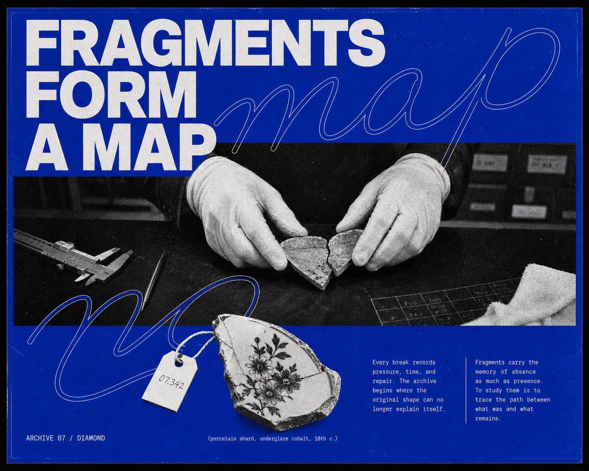

# Cobalt Xerox Script Editorial Poster



A compressed, confrontational cobalt editorial poster system in which fragmented grotesk headlines, two enormous repeated outline-script words, an ambiguous macro halftone photograph, a dark flat Xerox cutout, and dense microcopy collide across nearly the entire page.

## Copy Prompt

Default case: `ceramic-archive`

```text
Use the "Cobalt Xerox Script Editorial Poster" visual style as the locked style.

Create a 16:9 image.

Subject: the near-abstract macro junction of two white-gloved fingertips, a black sleeve edge, and a cracked ceramic glaze, with no face or full hand visible
Action: pressing the two fractured glaze edges close enough that the dark seam dominates the image
Prop / product: an irregular mostly black silhouette of a broken porcelain fragment with one jagged white glaze vein and a torn catalog tag
Location: a silent museum conservation laboratory after hours
Background: only a sliver of shadowed caliper metal, a torn cotton fiber, and a nearly lost catalog grid
Main text: FRAGMENTS FORM A MAP
Secondary text: Every break records pressure, time, and repair. The archive begins where the original shape can no longer explain itself. A missing edge becomes evidence; a stain becomes chronology. Reconstruction does not erase damage. It gives the damage a position, a scale, and a relation to what remains.
Accent symbol: ARCHIVE 07 / ◇
Styling: matte black cotton sleeves and plain white conservation gloves

Style direction:
A compressed, confrontational cobalt editorial poster system in which fragmented grotesk
headlines, two enormous repeated outline-script words, an ambiguous macro halftone photograph, a
dark flat Xerox cutout, and dense microcopy collide across nearly the entire page.

Keep visible:
- The poster artwork fills the raster nearly edge to edge with only a thin black keyline; there is no outer black presentation mat, floating card, wall mockup, or large safe margin.
- Page density is extremely high: typography, script, photo, cutout, and microcopy occupy roughly 88 to 94 percent of the usable poster, leaving only narrow cobalt seams rather than large calm blue fields.
- The supplied all-caps headline is forcibly split into two separate monumental neo-grotesk blocks: the opening words crowd the upper band and the remaining words reappear below the photo, never as one tidy complete title at the top.
- One selected word from the new headline is written twice as an enormous legible hairline cursive outline, each instance wider than the page and visibly cropped, crossing behind and in front of the headline and photo boundaries.
- A single wide black-and-white photo panel uses an ambiguous extreme macro crop with almost no environmental context; surface, gesture, or anatomy fills the frame at confrontational scale instead of showing a normal documentary scene.

Avoid:
Outer black presentation mat, floating poster card, wall mockup, room scene, clean infographic,
archival placard, museum label, large empty blue field, generous safe margin, complete headline
only at top, small abstract script loop, only one cursive repetition, conventional documentary
scene, medium shot, fully visible person, centered product hero, circular medallion floating
alone, realistic object shadow, source face or eyes, pinecone, seed cone, source slogan, source
masthead, copied body text, copied line breaks, logo, watermark, username, signature, QR code,
platform mark, full-color photography, additional hues, gradient, glossy finish, smooth digital
grayscale, 3D type, extrusion, bevel, glow, cinematic lighting, lens flare, sticker clutter,
comic panels, illegible main headline.

Do not copy source content, real logos, watermarks, platform UI, QR codes, or exact
reference layouts. Keep the visual system, but change the subject, text, and scene.
```

## Full Style

- [Open style.json](../../styles/cobalt-xerox-script-editorial-poster-style/style.json)
- [Open style folder](../../styles/cobalt-xerox-script-editorial-poster-style/)

<!-- Generated by scripts/generate-copy-prompts.py. Do not edit manually. -->
