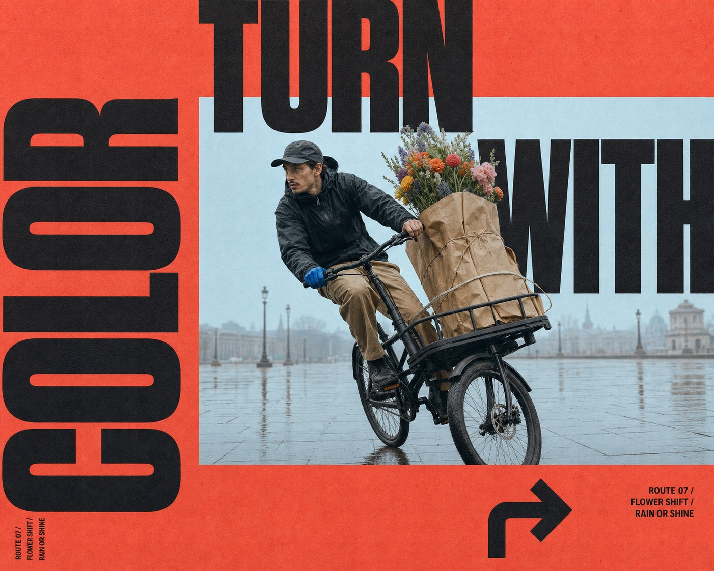

# Coral Window Megatype Motion Poster



A tactile editorial motion-poster system built from a coral-red paper field, one cool pale-blue photographic window, colossal black condensed typography that crosses the image boundary, a single isolated action subject, sparse micro-editorial labels, and a bold geometric direction symbol.

## Copy Prompt

Default case: `rain-cargo-cyclist`

```text
Use the "Coral Window Megatype Motion Poster" visual style as the locked style.

Create a 16:9 image.

Subject: a city flower courier on a cargo bicycle
Action: leaning through a sharp wet-street turn while balancing a tall bundle of wrapped flowers
Prop / product: an unbranded matte-black cargo bicycle and paper-wrapped flowers
Location: a quiet rain-washed city plaza
Background: a pale misty sky and only a faint wet-ground reflection
Main text: TURN / WITH / COLOR
Secondary text: ROUTE 07 / FLOWER SHIFT / RAIN OR SHINE
Accent symbol: right-turn arrow
Styling: charcoal waterproof jacket, loose sand trousers, and one small cobalt glove accent

Style direction:
A tactile editorial motion-poster system built from a coral-red paper field, one cool pale-blue
photographic window, colossal black condensed typography that crosses the image boundary, a
single isolated action subject, sparse micro-editorial labels, and a bold geometric direction
symbol.

Keep visible:
- A warm coral-red matte paper field dominates roughly two-thirds of the poster and acts as both border and graphic ground.
- One large rectangular pale powder-blue photographic window sits off-center with a clean hard edge and no visible frame stroke.
- A single realistic full-body subject is isolated against the quiet photo window and captured at a decisive moment of motion.
- The subject, photo window, and typography interlock through deliberate occlusion, with the body crossing over some letterforms and behind others.
- Colossal near-black ultra-heavy condensed sans-serif words run in opposing horizontal and vertical directions, exceed the canvas, and are cropped at the edges.

Avoid:
same woman, identifiable model, exact airborne side leap, bent-knee jump silhouette, flying
hair, dropped sunglasses, beige sleeveless dress, white chunky sneaker hero pose, SOME KINDA
MOOD, copied words, copied credits, copied issue labels, copied dates, exact source arrow
placement, exact source geometry, signature, watermark, username, platform logo, QR code, brand
mark, celebrity likeness, multiple subjects, busy scenic background, dense sticker collage,
comic burst, painterly illustration, vector-only art, 3D render, glossy gradient, chrome, neon
glow, cinematic flare, dark studio lighting, more than one accent hue, thin serif headline,
bubble type, tiny conventional headline, random gibberish main text, corrupt anatomy, heavy
motion blur, low-resolution texture

Do not copy source content, real logos, watermarks, platform UI, QR codes, or exact
reference layouts. Keep the visual system, but change the subject, text, and scene.
```

## Full Style

- [Open style.json](../../styles/coral-window-megatype-motion-poster-style/style.json)
- [Open style folder](../../styles/coral-window-megatype-motion-poster-style/)

<!-- Generated by scripts/generate-copy-prompts.py. Do not edit manually. -->
