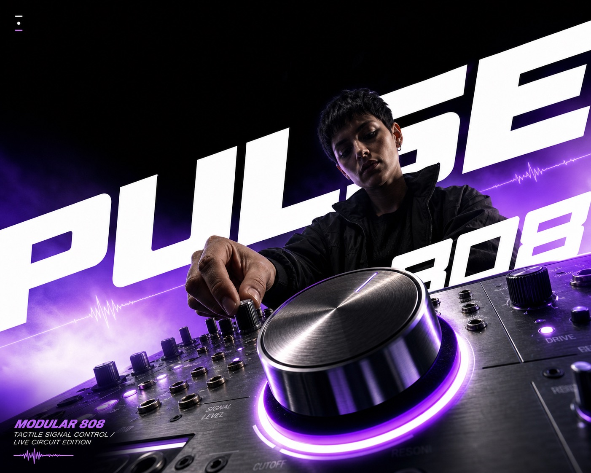

# Foreshortened Gradient Impact Ad Style



A premium kinetic advertising system built around a worm's-eye ultra-wide photograph, one monumental foreground product or prop, a dynamic human figure receding behind it, giant edge-cropped diagonal neo-grotesk typography, restrained technical microcopy, and a near-black-to-luminous-color gradient field. The finish is sparse but forceful: commercial photocompositing, selective blur, soft bloom, rim light, and layered type create speed and depth without visual clutter.

## Copy Prompt

Default case: `midnight-synth-pulse`

```text
Use the "Foreshortened Gradient Impact Ad Style" visual style as the locked style.

Create a 16:9 image.

Subject: an electronic musician with an original non-identifiable face and short dark hair
Action: leaning over a modular synthesizer while reaching down to turn one control with focused energy
Prop / product: a logo-free brushed-metal synthesizer control module with one oversized luminous knob dominating the foreground
Location: a sparse midnight sound studio abstracted into black space
Background: near-black ceiling void, electric-violet glow rising through pale haze, one thin waveform line, and a few cropped white geometric fragments
Main text: PULSE
Secondary text: MODULAR 808 — TACTILE SIGNAL CONTROL / LIVE CIRCUIT EDITION
Accent symbol: 808 and a minimal waveform glyph
Styling: matte black technical jacket over a charcoal shirt, completely logo-free

Style direction:
A premium kinetic advertising system built around a worm's-eye ultra-wide photograph, one
monumental foreground product or prop, a dynamic human figure receding behind it, giant edge-
cropped diagonal neo-grotesk typography, restrained technical microcopy, and a near-black-to-
luminous-color gradient field. The finish is sparse but forceful: commercial photocompositing,
selective blur, soft bloom, rim light, and layered type create speed and depth without visual
clutter.

Keep visible:
- A single human subject and one hero object dominate an otherwise sparse premium advertising composition.
- Extreme worm's-eye ultra-wide perspective creates pronounced foreground foreshortening.
- The featured object occupies roughly the lower third to half of the frame and is partially cropped by an edge.
- The person sits behind the object in the middle depth plane, with a smaller comparatively shadowed face and torso.
- Subject, object, and typography share one energetic bottom-corner-to-opposite-top diagonal movement.

Avoid:
Nike, Swoosh, JUST DO IT, Pegasus, Pegasus 42, ReactX, Air Zoom, number 42, running shoe, white
sneaker, runner stepping toward camera, raised-knee running pose, copied source wardrobe, copied
source face, copied source layout, performance-footwear story, real brand logo, pseudo-logo,
watermark, username, creator ID, platform mark, QR code, barcode, multiple people, many
products, dense collage, retail price tag, UI panel, sticker clutter, centered title card, serif
headline, flat vector art, illustration-only, 3D clay render, storyboard sketch, HTML mockup,
canvas drawing, rainbow palette, film grain, glitch noise, global blur, malformed hands, extra
limbs, distorted face, broken object geometry, unreadable headline, random gibberish text

Do not copy source content, real logos, watermarks, platform UI, QR codes, or exact
reference layouts. Keep the visual system, but change the subject, text, and scene.
```

## Full Style

- [Open style.json](../../styles/foreshortened-gradient-impact-ad-style/style.json)
- [Open style folder](../../styles/foreshortened-gradient-impact-ad-style/)

<!-- Generated by scripts/generate-copy-prompts.py. Do not edit manually. -->
