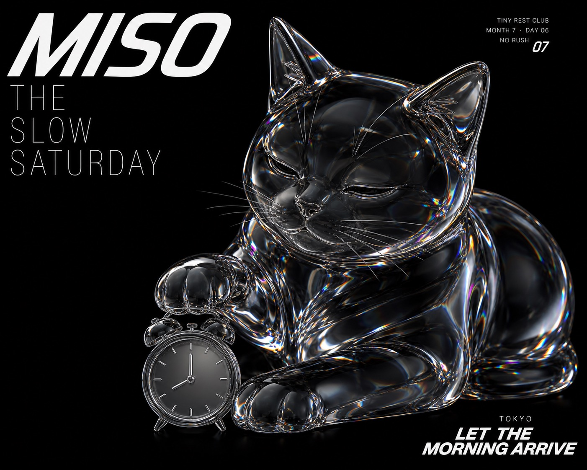

# Prismatic Glass Animal Weekend Editorial



A sparse black editorial-poster system built around one oversized translucent animal sculpture with smoky glass depth, liquid-chrome edges, and restrained rainbow refractions, framed by futuristic typographic micro-editorial content about small weekend rituals.

## Copy Prompt

Default case: `miso-slow-saturday`

```text
Use the "Prismatic Glass Animal Weekend Editorial" visual style as the locked style.

Create a 16:9 image.

Subject: a single cute short-haired cat rendered as a monumental transparent smoky-glass sculpture
Action: resting in a compact loaf pose with one paw gently touching a tiny alarm clock, eyes half closed in a patient slow-morning expression
Prop / product: one small clear-glass analog alarm clock with blank face markers and no branding
Location: TOKYO
Background: pure black field; large open area above the cat; slim left headline column; tiny upper-right issue data; lower-right caption zone
Main text: MISO / THE SLOW SATURDAY
Secondary text: TINY REST CLUB / MONTH 7 · DAY 06 / NO RUSH / LET THE MORNING ARRIVE
Accent symbol: 07
Styling: no clothing; thick smoky crystal anatomy, black liquid-chrome contours, silver bevels, and restrained cyan-magenta-orange refraction

Style direction:
A sparse black editorial-poster system built around one oversized translucent animal sculpture
with smoky glass depth, liquid-chrome edges, and restrained rainbow refractions, framed by
futuristic typographic micro-editorial content about small weekend rituals.

Keep visible:
- A pure matte-black field dominates the image, with no scenery, horizon, floor, frame, border, or decorative color block.
- One cute animal is rendered as an oversized high-end CGI sculpture occupying roughly 65 to 80 percent of the canvas and cropped boldly near one or more edges.
- The animal uses a dynamic three-quarter view and a clearly readable, slightly exaggerated but anatomically coherent pose.
- The sculpture combines transparent smoky glass volume, black liquid-chrome reflections, polished beveled edges, and crisp internal refraction.
- Rainbow color appears only as narrow spectral streaks and caustic bands in cyan, electric blue, violet, magenta, orange, and warm white against otherwise near-black material.

Avoid:
original black glass dog, seated howling dog pose, curled dog tail silhouette, LEBRON, THE MINI
WEEKEND, copied source copy, copied line breaks, pixel-for-pixel source layout, brand logo,
celebrity, mascot, copyright character, watermark, username, creator credit, hashtag, QR code,
barcode, app UI, illegible filler text, scenic room, floor plane, furniture set, landscape, busy
collage, ornamental frame, flat cartoon, vector mascot, plush toy, clay render, ordinary
wildlife photo, opaque plastic, full rainbow gradient fill, colored smoke, lens flare, excessive
bloom, fog, chromatic smearing, film grain, scratches, glitch, compression artifacts, low
resolution, malformed animal anatomy, extra limbs, unreadable typography

Do not copy source content, real logos, watermarks, platform UI, QR codes, or exact
reference layouts. Keep the visual system, but change the subject, text, and scene.
```

## Full Style

- [Open style.json](../../styles/prismatic-glass-animal-weekend-editorial/style.json)
- [Open style folder](../../styles/prismatic-glass-animal-weekend-editorial/)

<!-- Generated by scripts/generate-copy-prompts.py. Do not edit manually. -->
