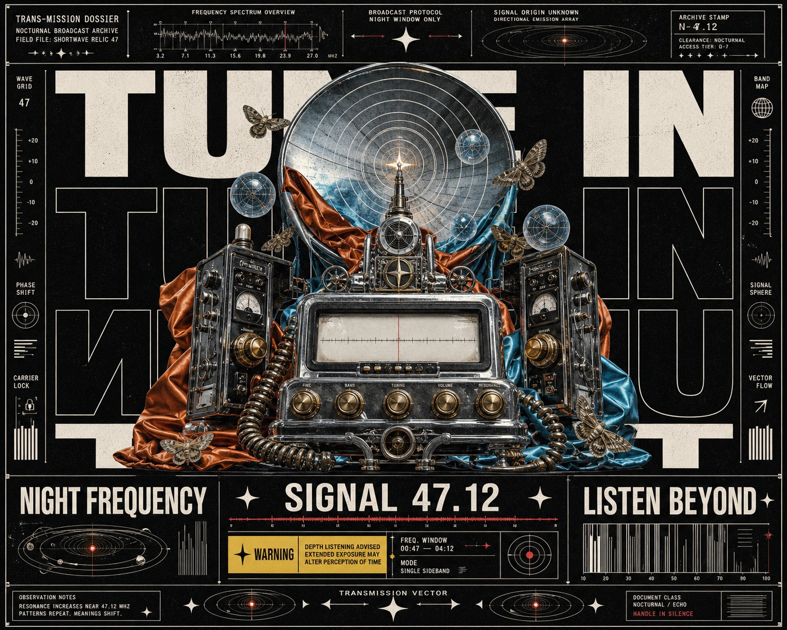

# Surreal Megatype Dossier Collage



A dense neo-editorial poster system that layers monumental white filled and outlined typography behind a centered surreal photographic cutout sculpture, then frames it with technical microcopy, serial numbers, ruled panels, small warning labels, celestial symbols, and coarse vintage print grain on a deep black field.

## Copy Prompt

Default case: `midnight-radio-relic`

```text
Use the "Surreal Megatype Dossier Collage" visual style as the locked style.

Create a 16:9 image.

Subject: a monumental surreal shortwave radio relic fused with an abstract satellite dish
Action: broadcasting concentric frequency rings while its tuning parts unfold like a mechanical shrine
Prop / product: a chrome radio chassis, blank tuning glass, brass knobs, coiled cables, burgundy satin folds, small moths, and translucent signal spheres
Location: a black archival poster void presented as an imaginary nocturnal transmission dossier
Background: invented frequency charts, thin rule frames, abstract barcode-like lines, serial labels, orbital rings, and small directional arrows
Main text: TUNE IN
Secondary text: NIGHT FREQUENCY / SIGNAL 47.12 / LISTEN BEYOND
Accent symbol: four-point signal star
Styling: no people; metallic components are wrapped in rust-orange and cyan satin fragments

Style direction:
A dense neo-editorial poster system that layers monumental white filled and outlined typography
behind a centered surreal photographic cutout sculpture, then frames it with technical
microcopy, serial numbers, ruled panels, small warning labels, celestial symbols, and coarse
vintage print grain on a deep black field.

Keep visible:
- Deep black poster field with dense edge-to-edge editorial information and very little empty space.
- Monumental white uppercase sans-serif headline repeated in stacked rows, alternating solid fill, thin outline, and reversed or mirrored treatments.
- One centered surreal photographic cutout sculpture occupying roughly two-thirds of the frame and overlapping the background type.
- Front-facing montage perspective with shallow layered depth, crisp cutout contours, and an iconic monument-like silhouette.
- Restricted palette led by black and off-white, with rust orange and cool cyan inside the hero collage plus tiny yellow and red warning accents.

Avoid:
source portrait, side-profile human head, white doves, pigeons, copied red-flower placement,
copied moon arrangement, DON’T CRY, SILENT KILLERS, copied slogan, copied signature, real logo,
brand name, watermark, username, platform mark, QR code, real barcode, identifiable person,
celebrity likeness, album-cover copy, campaign-art copy, clean vector poster, glossy 3D render,
cinematic scene, pastel minimalism, excessive glitch, destructive noise, unreadable primary
headline, low resolution, blur, muddy silhouette, random object clutter

Do not copy source content, real logos, watermarks, platform UI, QR codes, or exact
reference layouts. Keep the visual system, but change the subject, text, and scene.
```

## Full Style

- [Open style.json](../../styles/surreal-megatype-dossier-collage/style.json)
- [Open style folder](../../styles/surreal-megatype-dossier-collage/)

<!-- Generated by scripts/generate-copy-prompts.py. Do not edit manually. -->
