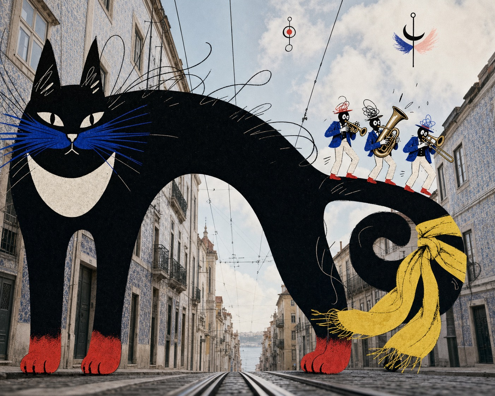

# Urban Photo Ink Beast Collage Style



A surreal editorial collage system that layers monumental flat-ink beasts and tiny theatrical figures over softly faded archival city photography, using black-and-white cut-paper masses, unruly hand-drawn contour work, and sparse cobalt, vermilion, lemon, and blush accents.

## Copy Prompt

Default case: `moon-cat-brass-band`

```text
Use the "Urban Photo Ink Beast Collage Style" visual style as the locked style.

Create a 16:9 image.

Subject: a monumental black alley cat with a paper-white crescent chest, cobalt whisker mask, vermilion paws, and long looping ink hairs
Action: arching across the street like a bridge while a tiny brass trio performs cheerfully along its curled tail
Prop / product: three small unbranded brass instruments and one sweeping lemon-yellow scarf tied loosely around the cat's tail
Location: a softly faded low-angle photograph of a steep Lisbon tram street with tiled facades and pale sky
Background: quiet windows, overhead tram wires, distant empty rails, soft cloud patches, and two tiny abstract loop-and-target sky glyphs
Main text: none
Secondary text: none
Accent symbol: a black rod-and-loop moon glyph with cobalt and blush wing strokes
Styling: the trio wears mismatched cobalt jackets, paper-white trousers, vermilion shoes, and scribbled hats

Style direction:
A surreal editorial collage system that layers monumental flat-ink beasts and tiny theatrical
figures over softly faded archival city photography, using black-and-white cut-paper masses,
unruly hand-drawn contour work, and sparse cobalt, vermilion, lemon, and blush accents.

Keep visible:
- A softly faded real architectural photograph forms the full-bleed background, while all narrative subjects are unmistakably flat hand-drawn collage layers.
- One monumental black-dominant beast occupies roughly half the frame and breaks across the photographic perspective as an impossible foreground cutout.
- A much smaller theatrical human or creature creates an asymmetrical two-character interaction with the giant subject.
- Creature bodies use broad near-solid black and paper-white masses, abrupt cut-paper silhouettes, and minimal gray modeling instead of realistic volume.
- Contours are thick, wobbly, uneven, and visibly hand-inked, with wiry scribbles, loops, ticks, and short dash textures inside hair, feathers, clothing, or skin.

Avoid:
giant gorilla, ape, King Kong, captive woman, damsel in distress, screaming woman, grabbing,
attack scene, biplane, propeller aircraft, fighter plane, Empire State Building, Manhattan
skyline, New York landmark, copied source pose, copied character anatomy, photorealistic
creature, cinematic VFX, 3D render, smooth vector mascot, manga, anime, comic panels,
children's-book illustration, dense typography, headline band, speech bubble, logo, brand mark,
watermark, username, platform icon, QR code, app UI, famous character, excessive clutter, heavy
glitch, muddy grain, blur, low resolution, malformed hands, illegible text

Do not copy source content, real logos, watermarks, platform UI, QR codes, or exact
reference layouts. Keep the visual system, but change the subject, text, and scene.
```

## Full Style

- [Open style.json](../../styles/urban-photo-ink-beast-collage-style/style.json)
- [Open style folder](../../styles/urban-photo-ink-beast-collage-style/)

<!-- Generated by scripts/generate-copy-prompts.py. Do not edit manually. -->
