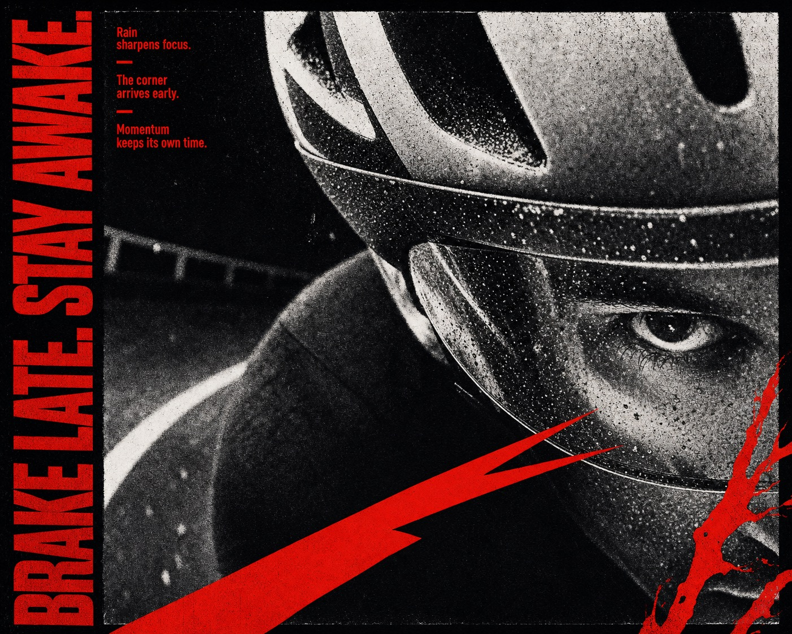

# Vermilion Photocopy Tension Editorial



A confrontational editorial poster system built from one monumentally cropped black-and-white photograph, near-binary photocopy contrast, dense analog grain, an oversized vertical condensed headline, compact annotation blocks, and a single vermilion ink layer that cuts across the image as urgent shards and edge-born organic forms.

## Copy Prompt

Default case: `rain-cyclist-focus`

```text
Use the "Vermilion Photocopy Tension Editorial" visual style as the locked style.

Create a 16:9 image.

Subject: an anonymous track cyclist seen in an extreme close crop of one focused eye, cheek, and helmet edge
Action: leaning decisively into a rain-darkened velodrome turn with lips closed
Prop / product: a rain-beaded unbranded helmet visor
Location: a covered concrete velodrome during a night practice
Background: one blurred lane stripe, a cropped safety rail, and a few rain flecks
Main text: BRAKE LATE. STAY AWAKE.
Secondary text: Rain sharpens focus. / The corner arrives early. / Momentum keeps its own time.
Accent symbol: a forked vermilion speed shard entering from the lower edge
Styling: a plain ventilated cycling helmet and unbranded dark track suit

Style direction:
A confrontational editorial poster system built from one monumentally cropped black-and-white
photograph, near-binary photocopy contrast, dense analog grain, an oversized vertical condensed
headline, compact annotation blocks, and a single vermilion ink layer that cuts across the image
as urgent shards and edge-born organic forms.

Keep visible:
- One monochrome photographic subject fills almost the entire inner poster field at monumental scale and is aggressively cropped by multiple edges.
- The photograph uses harsh near-binary black-and-white tonal separation with crushed blacks, chalky highlights, and very few smooth midtones.
- Coarse photocopy dust, halftone speckling, toner breakup, and uneven analog print grain cover the photograph without becoming digital glitch noise.
- A single vivid vermilion-red ink color is reserved for every typographic and graphic intervention; no other chromatic accent appears.
- An oversized heavy condensed uppercase headline forms a vertical rail along one outer edge and is cropped or compressed by the frame.

Avoid:
recognizable source person, screaming face, open mouth, exposed teeth close-up, copied source
crop, WHAT'S THE WORST THAT I CAN SAY, Mixed emotions, Tracing my problems, Tired of being
still, copied paragraph text, copied red burst, copied shard path, exact source layout
proportions, watermark, signature, username, creator ID, QR code, platform mark, brand logo,
branded clothing, branded tool, multiple people, full-color photograph, skin retouching, smooth
grayscale, cinematic depth, volumetric light, soft gradient, extra accent colors, neon glow, RGB
split, digital glitch, scanlines, glossy 3D, chrome, sticker collage, UI panel, illegible
subject, muddy typography, uncontrolled noise

Do not copy source content, real logos, watermarks, platform UI, QR codes, or exact
reference layouts. Keep the visual system, but change the subject, text, and scene.
```

## Full Style

- [Open style.json](../../styles/vermilion-photocopy-tension-editorial/style.json)
- [Open style folder](../../styles/vermilion-photocopy-tension-editorial/)

<!-- Generated by scripts/generate-copy-prompts.py. Do not edit manually. -->
