# 艺术家

[English](README.en.md)

本目录收录 44 个独立风格包。每个卡片使用统一的横版 16:9 代表图，点击名称或图片进入风格包 README。

<table>
<tr>
<td width="33%" valign="top" align="center"> <strong>乔治·修拉</strong> <a href="georges-seurat/README.md">打开 README</a></td>
<td width="33%" valign="top" align="center"> <strong>亨利·马蒂斯</strong> <a href="henri-matisse/README.md">打开 README</a></td>
<td width="33%" valign="top" align="center"> <strong>伦勃朗·范·莱因</strong> <a href="rembrandt/README.md">打开 README</a></td>
</tr>
<tr>
<td width="33%" valign="top" align="center"> <strong>保罗·塞尚</strong> <a href="paul-cezanne/README.md">打开 README</a></td>
<td width="33%" valign="top" align="center"> <strong>保罗·高更</strong> <a href="paul-gauguin/README.md">打开 README</a></td>
<td width="33%" valign="top" align="center"> <strong>克劳德·莫奈</strong> <a href="claude-monet/README.md">打开 README</a></td>
</tr>
<tr>
<td width="33%" valign="top" align="center"> <strong>卡拉瓦乔</strong> <a href="caravaggio/README.md">打开 README</a></td>
<td width="33%" valign="top" align="center"> <strong>古斯塔夫·库尔贝</strong> <a href="gustave-courbet/README.md">打开 README</a></td>
<td width="33%" valign="top" align="center"> <strong>埃尔·格列柯</strong> <a href="el-greco/README.md">打开 README</a></td>
</tr>
<tr>
<td width="33%" valign="top" align="center"> <strong>埃德加·德加</strong> <a href="edgar-degas/README.md">打开 README</a></td>
<td width="33%" valign="top" align="center"> <strong>安娜·安彻</strong> <a href="anna-ancher/README.md">打开 README</a></td>
<td width="33%" valign="top" align="center"> <strong>巴勃罗·毕加索</strong> <a href="pablo-picasso/README.md">打开 README</a></td>
</tr>
<tr>
<td width="33%" valign="top" align="center"> <strong>弗朗西斯科·戈雅</strong> <a href="francisco-goya/README.md">打开 README</a></td>
<td width="33%" valign="top" align="center"> <strong>拉斐尔</strong> <a href="raphael-sanzio/README.md">打开 README</a></td>
<td width="33%" valign="top" align="center"> <strong>文森特·梵高</strong> <a href="vincent-van-gogh/README.md">打开 README</a></td>
</tr>
<tr>
<td width="33%" valign="top" align="center"> <strong>格兰特·伍德</strong> <a href="grant-wood/README.md">打开 README</a></td>
<td width="33%" valign="top" align="center"> <strong>欧仁·德拉克罗瓦</strong> <a href="eugene-delacroix/README.md">打开 README</a></td>
<td width="33%" valign="top" align="center"> <strong>爱德华·蒙克</strong> <a href="edvard-munch/README.md">打开 README</a></td>
</tr>
<tr>
<td width="33%" valign="top" align="center"> <strong>瓦西里·康定斯基</strong> <a href="wassily-kandinsky/README.md">打开 README</a></td>
<td width="33%" valign="top" align="center"> <strong>皮埃尔-奥古斯特·雷诺阿</strong> <a href="pierre-auguste-renoir/README.md">打开 README</a></td>
<td width="33%" valign="top" align="center"> <strong>米开朗基罗</strong> <a href="michelangelo-buonarroti/README.md">打开 README</a></td>
</tr>
<tr>
<td width="33%" valign="top" align="center"> <strong>约瑟夫·马洛德·威廉·透纳</strong> <a href="jmw-turner/README.md">打开 README</a></td>
<td width="33%" valign="top" align="center"> <strong>约翰内斯·维米尔</strong> <a href="johannes-vermeer/README.md">打开 README</a></td>
<td width="33%" valign="top" align="center"> <strong>老彼得·勃鲁盖尔</strong> <a href="pieter-bruegel-the-elder/README.md">打开 README</a></td>
</tr>
<tr>
<td width="33%" valign="top" align="center"> <strong>胡安·米罗</strong> <a href="joan-miro/README.md">打开 README</a></td>
<td width="33%" valign="top" align="center"> <strong>莱昂纳多·达·芬奇</strong> <a href="leonardo-da-vinci/README.md">打开 README</a></td>
<td width="33%" valign="top" align="center"> <strong>迭戈·委拉斯开兹</strong> <a href="diego-velazquez/README.md">打开 README</a></td>
</tr>
<tr>
<td width="33%" valign="top" align="center"><a href="hilma-af-klint/README.md">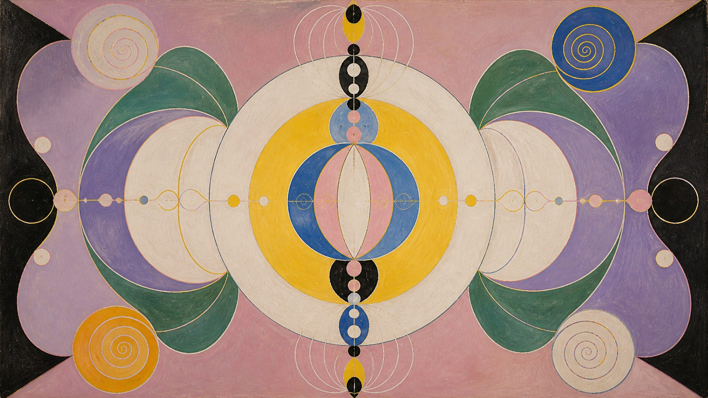</a> <strong>希尔玛·艾夫·克林特</strong> <a href="hilma-af-klint/README.md">打开 README</a></td>
<td width="33%" valign="top" align="center"><a href="leonora-carrington/README.md">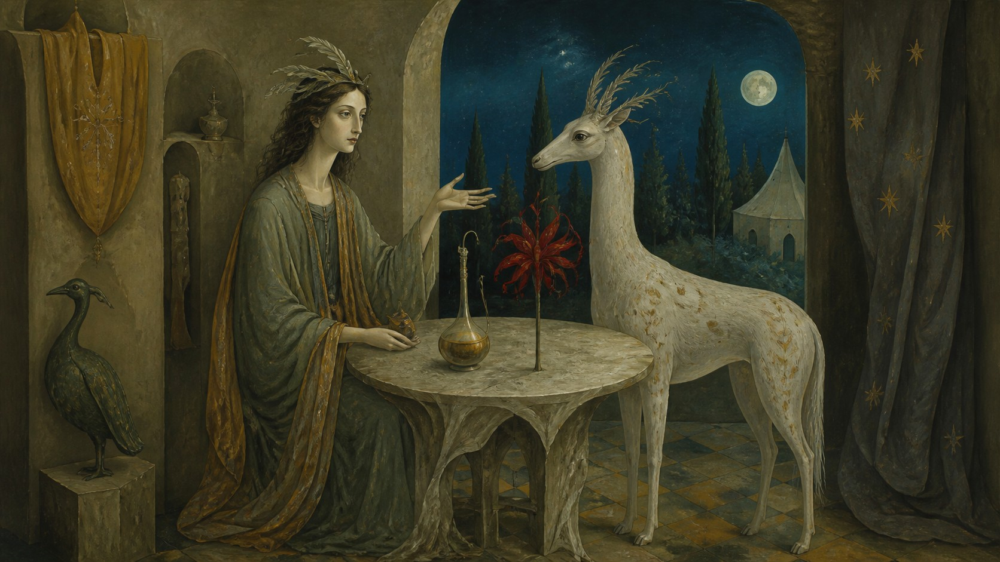</a> <strong>莱昂诺拉·卡林顿</strong> <a href="leonora-carrington/README.md">打开 README</a></td>
<td width="33%" valign="top" align="center"><a href="tamara-de-lempicka/README.md">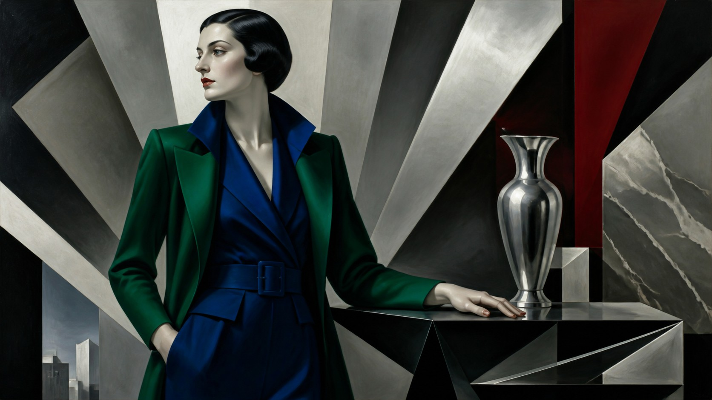</a> <strong>塔玛拉·德·兰佩卡</strong> <a href="tamara-de-lempicka/README.md">打开 README</a></td>
</tr>
<tr>
<td width="33%" valign="top" align="center"><a href="giorgio-de-chirico/README.md">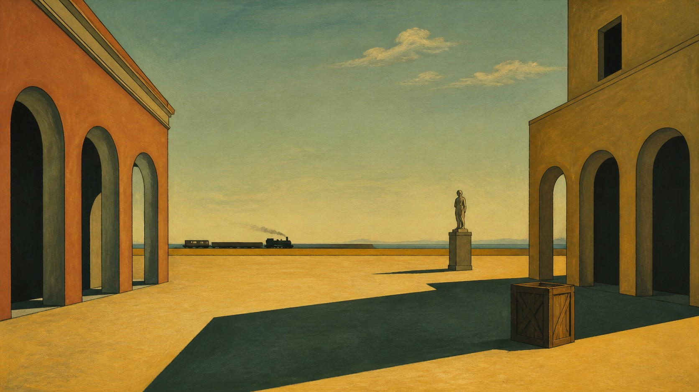</a> <strong>乔治·德·基里科</strong> <a href="giorgio-de-chirico/README.md">打开 README</a></td>
<td width="33%" valign="top" align="center"><a href="agnes-martin/README.md">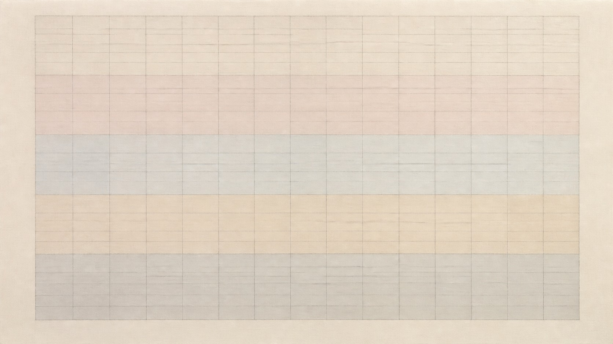</a> <strong>艾格尼丝·马丁</strong> <a href="agnes-martin/README.md">打开 README</a></td>
<td width="33%" valign="top" align="center"><a href="edward-hopper/README.md">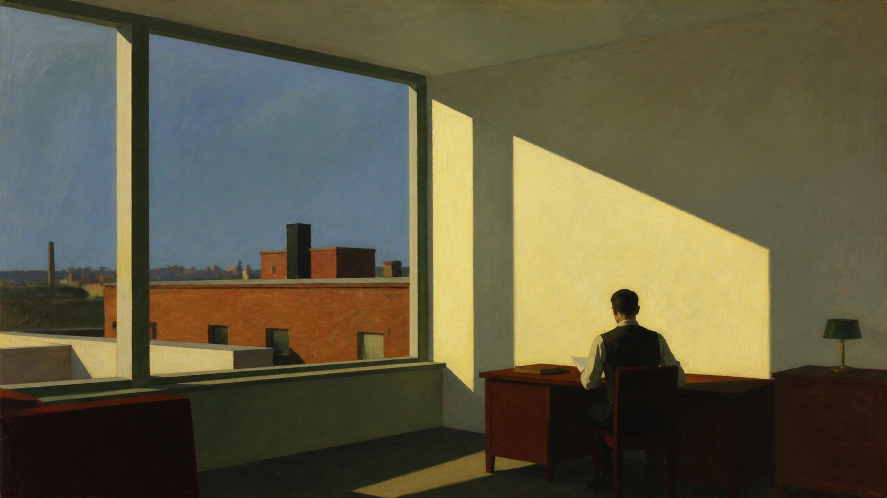</a> <strong>爱德华·霍普</strong> <a href="edward-hopper/README.md">打开 README</a></td>
</tr>
<tr>
<td width="33%" valign="top" align="center"> <strong>伊万·艾瓦佐夫斯基</strong> <a href="ivan-aivazovsky/README.md">打开 README</a></td>
<td width="33%" valign="top" align="center"><a href="sandro-botticelli/README.md">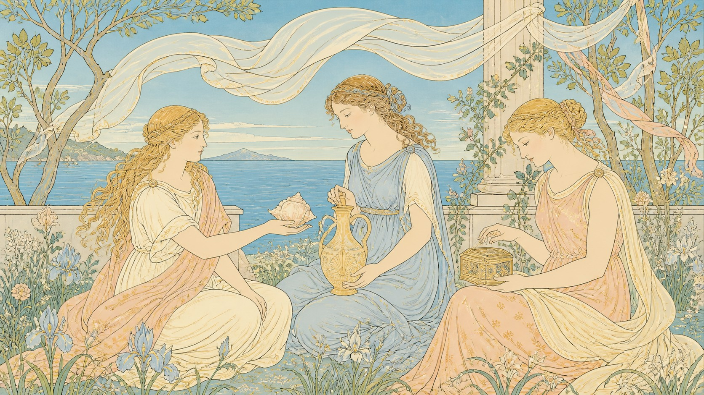</a> <strong>桑德罗·波提切利</strong> <a href="sandro-botticelli/README.md">打开 README</a></td>
<td width="33%" valign="top" align="center"><a href="jan-van-eyck/README.md">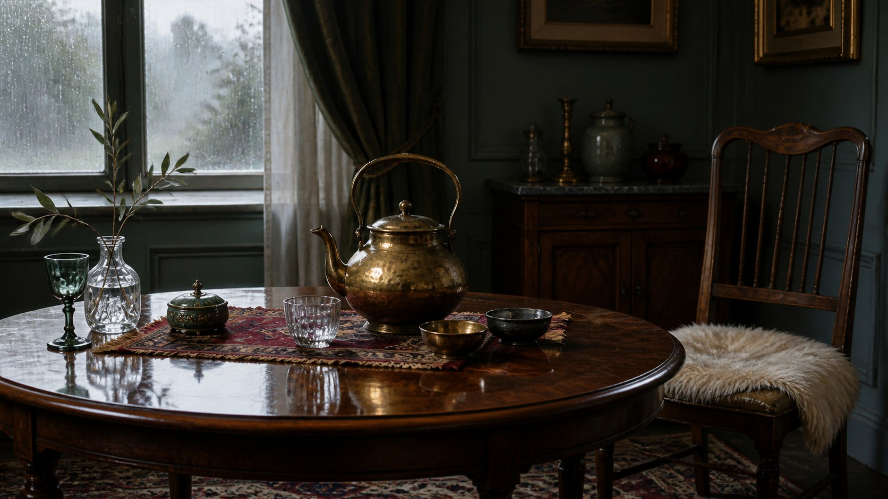</a> <strong>扬·凡·艾克</strong> <a href="jan-van-eyck/README.md">打开 README</a></td>
</tr>
<tr>
<td width="33%" valign="top" align="center"> <strong>阿尔泰米西娅·真蒂莱斯基</strong> <a href="artemisia-gentileschi/README.md">打开 README</a></td>
<td width="33%" valign="top" align="center"><a href="francisco-de-zurbaran/README.md">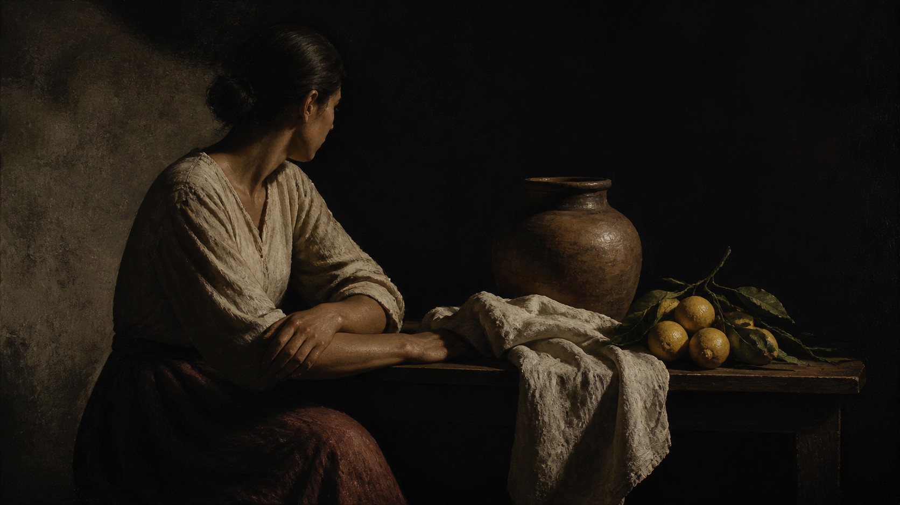</a> <strong>弗朗西斯科·德·苏巴朗</strong> <a href="francisco-de-zurbaran/README.md">打开 README</a></td>
<td width="33%" valign="top" align="center"><a href="mary-cassatt/README.md">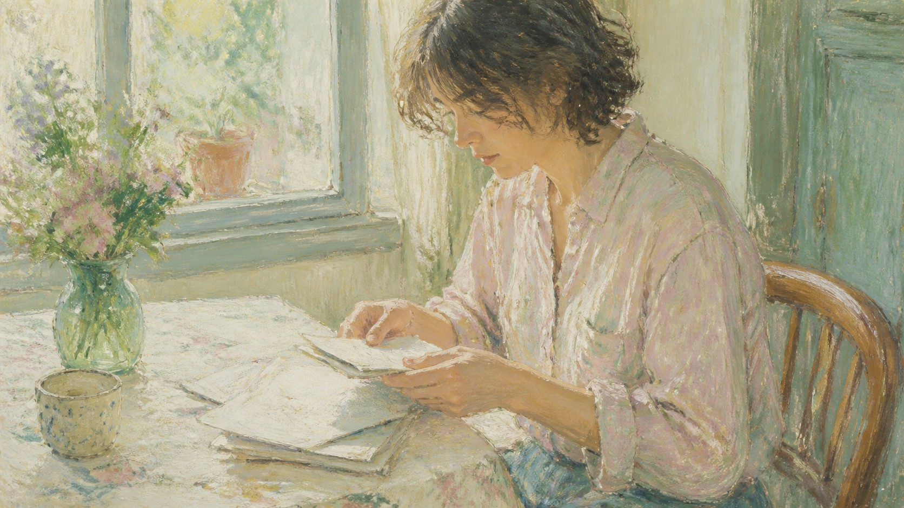</a> <strong>玛丽·卡萨特</strong> <a href="mary-cassatt/README.md">打开 README</a></td>
</tr>
<tr>
<td width="33%" valign="top" align="center"> <strong>古斯塔夫·克里姆特</strong> <a href="gustav-klimt/README.md">打开 README</a></td>
<td width="33%" valign="top" align="center"><a href="egon-schiele/README.md">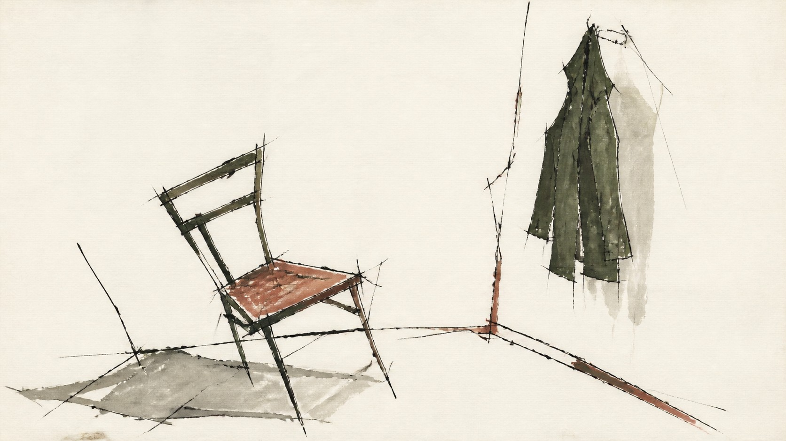</a> <strong>埃贡·席勒</strong> <a href="egon-schiele/README.md">打开 README</a></td>
<td width="33%" valign="top" align="center"><a href="georgia-okeeffe/README.md">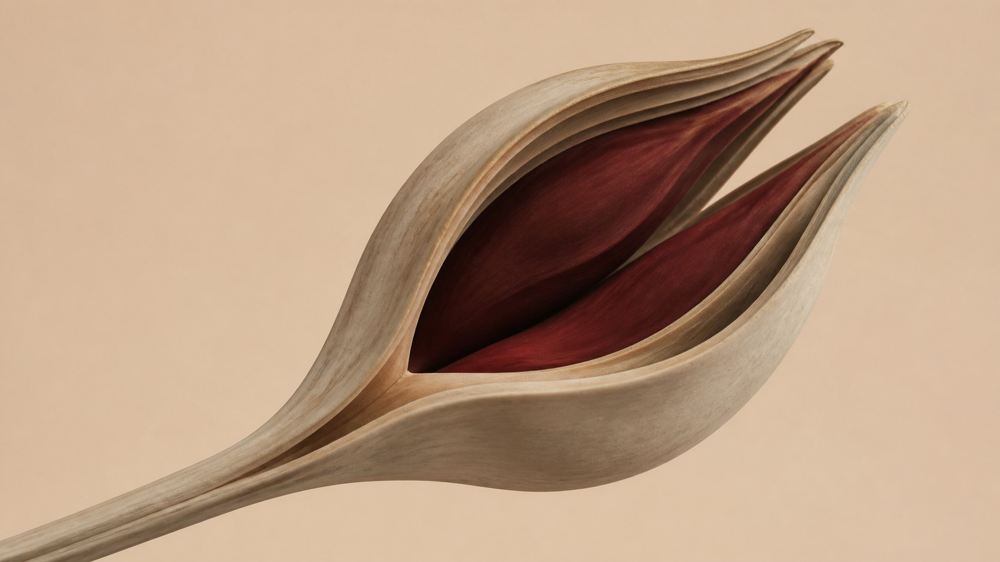</a> <strong>乔治亚·欧姬芙</strong> <a href="georgia-okeeffe/README.md">打开 README</a></td>
</tr>
<tr>
<td width="33%" valign="top" align="center"> <strong>诺曼·洛克威尔</strong> <a href="norman-rockwell/README.md">打开 README</a></td>
<td width="33%" valign="top" align="center"> <strong>罗梅尔·比尔登</strong> <a href="romare-bearden/README.md">打开 README</a></td>
</tr>
</table>
