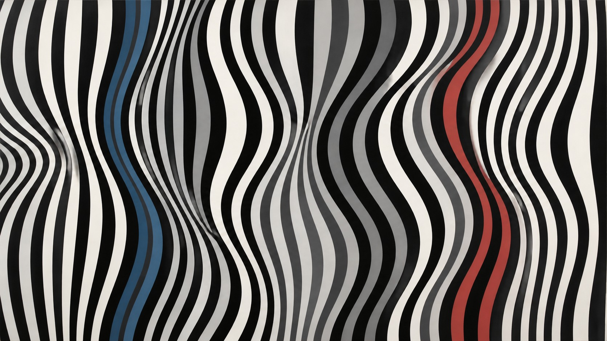

# 布里奇特·莱利

[English](README.en.md)

> **分类：** 艺术家  
> **媒介领域：** 绘画  
> **目录：** `style-packages/artists/bridget-riley`

## 简介

这个包提取重复条带、曲线、渐变间距和黑白或有限色彩关系带来的视觉振动。它关注的是平面与观看者感知之间的主动关系，而不是某个具体物体或三维幻觉。

## 策展短评

莱利的画面不靠叙事吸引注意力，而是让间距本身变成一种动作。条带稍微收紧，视线就会感到加速；曲线缓慢偏转，平面仿佛开始移动。代表图保留了这种严格又不完全机械的节奏。换成你的主体后，应该迁移的是重复、间距和对比，而不是自动加入条纹、棋盘或隧道。

## 主体独立性

本包只决定平面构图、重复逻辑、色彩关系和表面，不规定人物、物体、地点或故事。代表图中的抽象色带只是示例；使用者提供的主体和构图要求优先。

## 使用前先看

- `identity.yaml`：范围与排除项
- `visual-signature.yaml`：换主体后仍应保留的视觉特征
- `reproduction.yaml`：媒介、材料和构建顺序
- `prompts/base.txt`、`prompts/negative.txt`：基础约束
- `palette/palette.json`：色彩角色
- `evaluation.yaml`：生成后的检查标准
- `references/manifest.csv`、`provenance.yaml`：来源与权利边界

## 来源与版权

本包参考[现代艺术博物馆关于布里奇特·莱利《当下》的资料](https://www.moma.org/audio/playlist/297/4821)，只提取可观察的视觉特征。代表图是新的原创抽象图像，不复制具体作品，也不表示与艺术家或机构存在合作、授权或背书关系。详细边界见 [`provenance.yaml`](provenance.yaml)、[`references/manifest.csv`](references/manifest.csv) 和仓库根目录的 [`NOTICE`](../../../NOTICE)。

## 只使用此包

四种方式任选其一：

1. **交给有生图能力的 Agent**：把本目录交给 Agent，要求先读取身份、视觉签名、复现说明、Prompt、调色板和评估文件，再把你的主题编译成完整 Prompt；生成后按 `evaluation.yaml` 复核。
2. **直接复制 Prompt**：打开 `prompts/base.txt`，替换 `{SUBJECT}` 与 `{LOCATION}`；将 `prompts/negative.txt` 一并提交。
3. **配置 API Key 后提交生成**：在你自己的平台或编译工具中配置 API Key，提交基础 Prompt、负面约束、调色板和必要参考清单。本仓库不托管密钥或在线生图服务。
4. **本地模型 + ComfyUI**：把基础 Prompt 和负面约束接入工作流，按复现说明设置重复、间距、平面和对比；生成后用 `evaluation.yaml` 复核。

模型权重、密钥和生成图片由使用者自行管理。参考资料用于理解特征，不用于复制原作。
