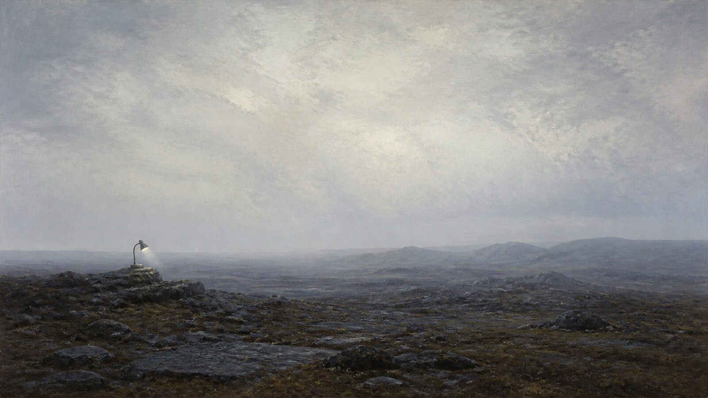

# Caspar David Friedrich

[中文](README.md)

> **Category:** artist  · **Domain:** painting
> **Directory:** style-packages/artists/caspar-david-friedrich

## Overview

以孤寂尺度、背向观看、清冷空气和远景层叠组织风景，让自然的精神重量超过具体叙事。

## Curatorial note

弗里德里希的画面并不急着讲清楚事件。人物常被放到辽阔自然里，像一个尺度参照，也像一个正在观看的人。这个包保留冷静的远景、雾气和沉默感，但不会自动加入山顶、废墟或背影人物。

## Visual signature

- 大面积安静空间与低密度地景; 远近层叠的水平地平线; 极小尺度的主体只作为比例参照
- 灰蓝、冷褐和雾白形成低饱和基础; 远景降低对比度，保留空气距离; 局部暖色只用于微弱的季节或光线提示
- 冷静、漫射、接近自然天气的光线，明暗过渡宽而不戏剧化
- 薄层透明色、柔化边缘、湿润空气感和克制的绘画肌理

## Subject independence

This package controls how an image is rendered, not what must be rendered. The user’s people, objects, places, buildings, plants, vehicles, and narrative remain authoritative. The representative image is a demonstration, not a default subject. The package does not silently add a landmark, character, group, religious scene, game level, or story event.

## Files to read

- [identity.yaml](identity.yaml): scope and exclusions
- [visual-signature.yaml](visual-signature.yaml): transferable visual decisions
- [reproduction.yaml](reproduction.yaml): medium and construction sequence
- [prompts/base.txt](prompts/base.txt) and [prompts/negative.txt](prompts/negative.txt): prompt constraints
- [palette/palette.json](palette/palette.json): color roles
- [evaluation.yaml](evaluation.yaml): review criteria
- [references/manifest.csv](references/manifest.csv) and [provenance.yaml](provenance.yaml): source and rights boundary

## Source and rights

External artworks, photographs, trademarks, and platform pages remain the property of their respective rights holders. The generated example is an original anonymous scene and does not claim affiliation, authorization, endorsement, or exact imitation.

- [National Gallery of Art: Caspar David Friedrich](https://www.nga.gov/artists/6885-caspar-david-friedrich)

See [provenance.yaml](provenance.yaml), [references/manifest.csv](references/manifest.csv), and the repository [NOTICE](../../../NOTICE) for the detailed boundary.

## Use this package only

Choose one of the following methods.

### 1. Give it to an image-capable Agent

Upload this directory or provide its local path, then ask the Agent to read the package files, compile the prompt, generate the image, and review it against [evaluation.yaml](evaluation.yaml).

### 2. Copy the prompt

Open [prompts/base.txt](prompts/base.txt), replace the subject and format, and submit it together with [prompts/negative.txt](prompts/negative.txt). Use the visual signature and palette when the model needs more guidance.

### 3. Submit through your own API key

Configure your provider or compiler with your own API key, then send the base prompt, negative constraints, palette, and relevant source manifest. The repository does not host a generation service or store credentials.

### 4. Local model and ComfyUI

Connect the prompts to your local model or ComfyUI workflow. Translate the palette, reproduction notes, and visual signature into nodes or conditioning, then review the result with [evaluation.yaml](evaluation.yaml).

Model weights, API keys, and generated images are managed by the user. References are for observable analysis; do not copy a source work’s exact composition, people, text, trademarks, or logos.
