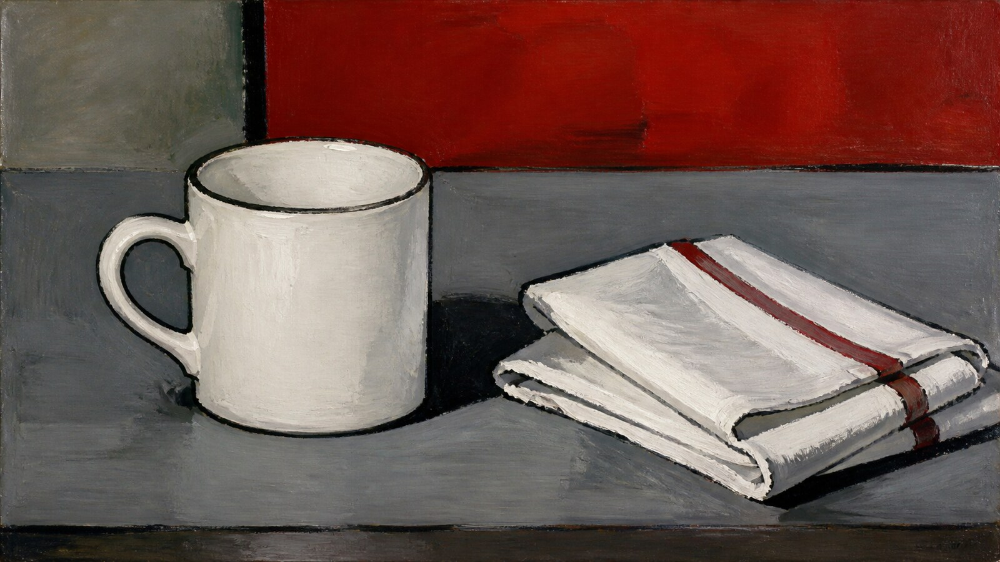

# 爱德华·马奈

[English](README.en.md)

> **分类：** 艺术家  · **媒介领域：** 绘画
> **目录：** style-packages/artists/edouard-manet

## 简介

以平直而有张力的色面、现代生活的截取感、清晰轮廓和不完全抛光的笔触打破传统画面秩序。

## 一点观察

马奈有一种把画面拉回眼前的力量：色块不总是被柔和地过渡，人物和物件像刚刚被看到，既具体又带着未完成感。这个包强调平面色面、现代截取和轮廓张力，不自动加入巴黎街景、咖啡馆或特定人物。

## 视觉签名

- 像被偶然截取的现代生活片段；主体与背景之间保持清楚的平面关系；避免过度解释空间，让视觉重心停留在形体和色面
- 黑、白、灰与一两个明确色块并置；肤色和材料色保持直接，不做过度综合色；暗部偏平而不全部压成黑色
- 自然或室内光线直接落在形体上，明暗关系清楚但不过度塑造
- 可见而克制的笔触，边缘在清楚和松动之间变化

## 主体独立性

本包只决定“怎么生成”，不决定“生成什么”。人物、物体、地点、建筑、植物、车辆和叙事由你的 Prompt 决定；代表图和测试题材只是演示，不会成为默认内容。这个包不会自动加入固定地标、角色、族群、宗教场景、游戏关卡或故事事件。

## 使用前先看

- [identity.yaml](identity.yaml)：范围、对象和排除项
- [visual-signature.yaml](visual-signature.yaml)：跨主题仍应保持的视觉特征
- [reproduction.yaml](reproduction.yaml)：媒介、材料和构建顺序
- [prompts/base.txt](prompts/base.txt)、[prompts/negative.txt](prompts/negative.txt)：基础 Prompt 与负面约束
- [palette/palette.json](palette/palette.json)：色彩角色与色值
- [evaluation.yaml](evaluation.yaml)：生成后的检查标准
- [references/manifest.csv](references/manifest.csv)、[provenance.yaml](provenance.yaml)：来源和权利边界

## 来源与版权

参考资料只用于研究和分析。外部作品、摄影作品、商标和平台页面仍归原权利人所有。生成示例是新的匿名场景，不是相关艺术家、摄影师、流派、技法或游戏的原作，也不代表合作、授权或背书关系。

- [大都会艺术博物馆：爱德华·马奈艺术家资料](https://www.metmuseum.org/fr/essays/edouard-manet-1832-1883)

详细来源和再分发边界见 [provenance.yaml](provenance.yaml)、[references/manifest.csv](references/manifest.csv) 以及仓库根目录的 [NOTICE](../../../NOTICE)。

## 只使用此包

四种方式可以按手边工具任选其一，不需要同时使用。

### 方式一：交给有生图能力的 Agent

把整个风格包目录上传给 Agent，或把本地目录路径交给它，并附上：

~~~
请使用这个风格包帮助我生成图片。

请先读取本目录中的 identity.yaml、visual-signature.yaml、reproduction.yaml、
prompts/base.txt、prompts/negative.txt、palette/palette.json 和 evaluation.yaml。
请把文件中的规则整合到生成流程中，不要只把风格名称当作 Prompt，也不要复制参考作品。

我的生成需求是：
<填写人物、物体、场景、画幅和用途>

请先编译完整 Prompt，再调用你的生图能力。生成后按照 evaluation.yaml 检查风格特征、
构图、颜色、材质、AI 痕迹和需求遵循度，并说明仍然存在的风险。
~~~

### 方式二：直接复制 Prompt

打开 [prompts/base.txt](prompts/base.txt)，替换主题、人物、物体、场景和画幅；将 [prompts/negative.txt](prompts/negative.txt) 作为负面 Prompt 一并提交到支持文本生图的平台。需要更稳定时，同时参考视觉签名和调色板。

### 方式三：配置 API Key 后提交生成

在你自己的生图平台或编译工具中配置 API Key，将基础 Prompt、负面约束、调色板和必要的参考清单一起提交。API Key 只保存在你的环境中；本仓库不代管密钥、不托管在线生图服务。

### 方式四：本地模型 + ComfyUI

将基础 Prompt 和负面约束接入本地模型或 ComfyUI 工作流；按调色板、复现说明和参考清单设置颜色、构图、材质与光线。生成后用 [evaluation.yaml](evaluation.yaml) 做人工或自动复核。

模型权重、API Key 和生成图片由使用者自行管理。参考图只用于理解可观察特征，不要复制原作的具体构图、人物、文字、商标或标志。
