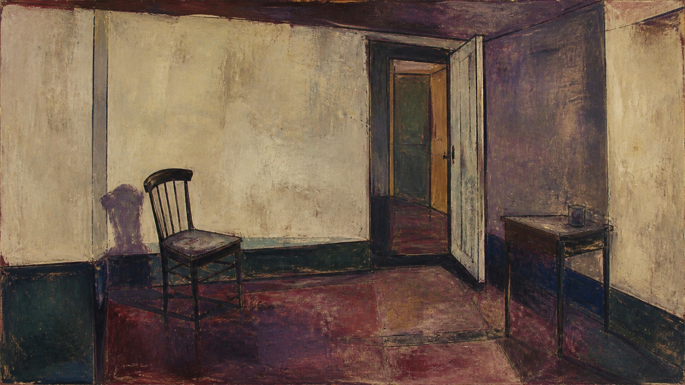

# 弗朗西斯·培根

[English](README.en.md)

> **分类：** 艺术家  
> **媒介领域：** 20世纪现代具象油画  
> **目录：** `style-packages/artists/francis-bacon`

## 简介

弗朗西斯·培根的画面常从一个仍然可辨认的形体出发，再通过压缩空间、偏移轮廓、覆盖和擦刮改变观看的稳定感。建筑框架可能很硬，人物或物体的边缘却像被时间拖过。这个包提取形体张力、色面冲突和绘画过程，不把肖像、尖叫面孔或肉身意象写成默认内容。

## 策展短评

我喜欢培根式画面里那种“结构还在，安全感已经不在”的感觉。它不靠堆满细节来制造不安，而是让一把椅子、一面墙或一个普通物体在比例和空间里发生轻微偏移。使用时先保证主体能被认出来，再决定哪里需要被擦掉或拉扯；如果一开始就追求随机变形，画面很快会失去重量。

## 主体独立性

本包只决定空间压缩、局部形变、色面冲突和油画过程，不规定人物、肖像、十字架、竞技场、肉身或故事。代表图中的椅子和室内只是测试主体，新的生成应以用户需求为准。

## 来源与版权

研究入口为[现代艺术博物馆的弗朗西斯·培根档案](https://www.moma.org/artists/272-francis-bacon)。仓库不打包外部作品；代表图是新的匿名场景，不是具体原作，也不表示合作、授权或背书关系。

## 只使用此包

### 方式一：交给有生图能力的 Agent

把本目录交给 Agent，让它先读取 `identity.yaml`、`visual-signature.yaml`、`reproduction.yaml`、`prompts/`、`palette/palette.json` 和 `evaluation.yaml`，再编译你的主体、画幅和用途。生成后检查主体可辨识度、形变是否有结构依据，以及是否出现固定意象。

### 方式二：直接复制 Prompt

打开 `prompts/base.txt`，替换 `{{SUBJECT}}`、`{{ASPECT_RATIO}}` 和 `{{USE_CASE}}`；把 `prompts/negative.txt` 一并提交给支持负面 Prompt 的平台。

### 方式三：配置 API Key 后提交生成

在你自己的生图平台或编译工具中配置 API Key，提交基础 Prompt、负面约束和调色板。本仓库不托管密钥或在线生图服务。

### 方式四：本地模型 + ComfyUI

将 Prompt、调色板和复现说明接入本地模型或 ComfyUI，生成后用 `evaluation.yaml` 复核，不要把代表图的椅子和室内当成默认主体。
