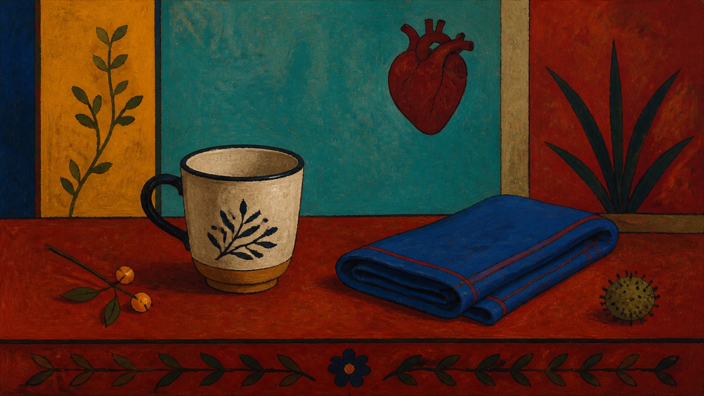

# 弗里达·卡罗

[English](README.en.md)

> **分类：** 艺术家
> **媒介领域：** 绘画
> **目录：** `style-packages/artists/frida-kahlo`

## 简介

弗里达·卡罗的画面常把人物、物件和植物组织成一个清楚而亲密的心理空间。它的力量不只来自鲜艳颜色，也来自正面凝视、坚实轮廓、浅层空间和带有个人意味的关系安排。本包提取这些可观察特征，不把自画像、传统服装、猴子或医学意象写成固定内容。

## 策展短评

我喜欢这类画面里“对象彼此有关系，却不急着解释”的状态。一个普通杯子、一块布或一株植物，只要被放在足够清楚的色面和轮廓中，就会获得近似人物的重量。使用时可以把它当作一种亲密的构图方法，而不是一组异国化装饰。

## 主体独立性

本包只决定“怎么生成”，不决定“生成什么”。人物、物体、地点、建筑、植物和叙事由你的 Prompt 决定；示例中的杯子与布只是测试主体，不会自动出现在新的生成结果中。

## 使用前先看

- `identity.yaml`：范围与排除项
- `visual-signature.yaml`：构图、色彩、轮廓和表面特征
- `reproduction.yaml`：绘制顺序与技术方向
- `prompts/base.txt`、`prompts/negative.txt`：基础 Prompt 与负面约束
- `palette/palette.json`：色彩角色
- `evaluation.yaml`：生成后检查项
- `provenance.yaml`、`references/manifest.csv`：来源与权利边界

## 来源与版权

本包使用弗里达·卡罗博物馆的生平与作品资料作为研究入口。外部作品、照片、商标和网页内容仍归原权利人所有；仓库只保存来源链接和原创生成示例，不打包外部作品。

## 只使用此包

四种方式可以任选其一。

### 方式一：交给有生图能力的 Agent

把本目录交给 Agent，并要求它先读取 `identity.yaml`、`visual-signature.yaml`、`reproduction.yaml`、`prompts/base.txt`、`prompts/negative.txt`、`palette/palette.json` 和 `evaluation.yaml`，再把你的主体、场景、画幅和用途编译成完整 Prompt。生成后按照 `evaluation.yaml` 检查风格、主体独立性、构图和 AI 痕迹。

### 方式二：直接复制 Prompt

打开 `prompts/base.txt`，替换主题、地点和画幅；把 `prompts/negative.txt` 一并交给支持负面 Prompt 的平台。

### 方式三：配置 API Key 后提交生成

在你自己的平台或编译工具中配置 API Key，提交基础 Prompt、负面约束和调色板。本仓库不托管密钥或在线生图服务。

### 方式四：本地模型 + ComfyUI

把 Prompt、调色板和复现说明接入本地模型或 ComfyUI，生成后用 `evaluation.yaml` 复核，不要把代表图当成必须复制的构图。
