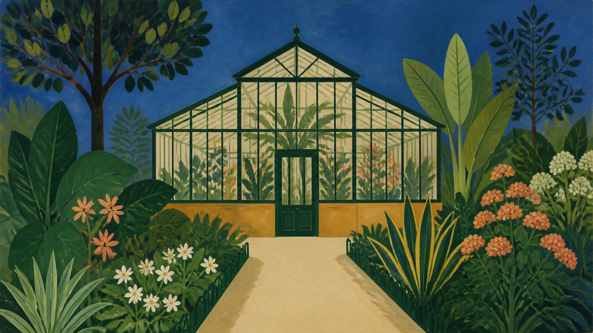

# 亨利·卢梭

[English](README.en.md)

> **分类：** 艺术家
> **媒介领域：** 绘画
> **目录：** `style-packages/artists/henri-rousseau`

## 简介

亨利·卢梭的画面把自然、建筑和人物处理成清楚的平面层次：轮廓干净，光线均匀，颜色鲜明，植物或结构形状常常像装饰图案一样重复。这个包提取的是“天真但不随意”的造型秩序，不是每次生成一片热带丛林。

## 策展短评

我很喜欢卢梭式画面里那种不急着向远处逃走的空间。叶片、墙面和天空都停留在画面上，彼此靠形状和颜色建立关系。它适合把普通地点重新整理成一张安静、清楚、略带陌生感的图，而不需要额外添加动物或冒险故事。

## 主体独立性

本包只决定“怎么生成”，不决定“生成什么”。示例中的温室只是用来观察层次、轮廓和植物节奏；新的 Prompt 可以指定任意人物、物体、建筑或地点。

## 使用前先看

- `identity.yaml`：范围与排除项
- `visual-signature.yaml`：平面、色彩、轮廓和纹理特征
- `reproduction.yaml`：构建顺序与技术方向
- `prompts/base.txt`、`prompts/negative.txt`：基础 Prompt 与负面约束
- `palette/palette.json`：色彩角色
- `evaluation.yaml`：生成后检查项

## 来源与版权

本包以现代艺术博物馆的艺术家资料作为研究入口。外部作品、照片、商标和网页内容仍归原权利人所有；仓库只保存来源链接和原创生成示例，不打包外部作品。

## 只使用此包

四种方式可以任选其一：

1. 把本目录交给有生图能力的 Agent，要求它先读取 YAML、Prompt、调色板和评价文件，再编译你的主体。
2. 复制 `prompts/base.txt`，替换主题、地点和画幅，并按需附上 `prompts/negative.txt`。
3. 在你自己的生图平台配置 API Key，提交基础 Prompt、负面约束和调色板；本仓库不托管服务。
4. 将文件接入本地模型或 ComfyUI，生成后用 `evaluation.yaml` 检查主体独立性与风格特征。
