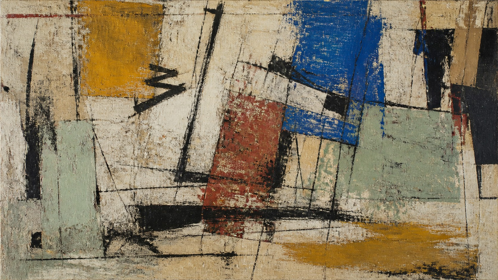

# Jean-Michel Basquiat

[中文](README.md)

> **Category:** Artist  
> **Medium:** Painting  
> **Directory:** `style-packages/artists/jean-michel-basquiat`

## Overview

This package extracts rough mixed-media surfaces, fractured forms, forceful hand-drawn lines, compressed space, and selective high-tension color blocks. It keeps the image visibly made by hand while allowing a user-supplied subject to remain legible.

## Curatorial note

The energy here does not come from one mandatory symbol. It comes from a surface that appears to be added to, scraped back, and reorganized in place. The representative image uses an abstract wall only to show that material tension: black marks gather the loose planes, while the worn ground keeps the structure open. Transfer the relationships between line, plane, and surface—not a fixed street, word, or icon.

## Subject independence

The package controls visual treatment, not the subject, location, objects, characters, or story. The abstract wall is only an example. Crowns, skulls, streets, and graffiti lettering are not default content. User instructions remain authoritative.

## Source and rights

The package refers to [the Museum of Modern Art artist record](https://www.moma.org/artists/370-jean-michel-basquiat) for research and extracts observable visual characteristics only. External works remain with their rights holders. The representative image is an original abstract scene, not a reproduction or endorsement. See [`provenance.yaml`](provenance.yaml), [`references/manifest.csv`](references/manifest.csv), and the root [`NOTICE`](../../../NOTICE).

## Use only this package

1. **Give it to an image-capable Agent:** provide this directory and ask the Agent to read the identity, visual signature, reproduction, prompts, palette, and evaluation files before compiling your subject-specific prompt.
2. **Copy the Prompt:** replace `{SUBJECT}` and `{LOCATION}` in `prompts/base.txt`, and submit `prompts/negative.txt` as the negative prompt.
3. **Use your own API key:** submit the base prompt, negative constraints, palette, and relevant references through your chosen service. This repository does not host keys or image generation.
4. **Use a local model + ComfyUI:** wire the prompts into your workflow, reproduce the line, color-plane, compressed-space, and surface rules, then review with `evaluation.yaml`.

Models, keys, and generated images remain under the user's control. References are for feature analysis, not copying.
