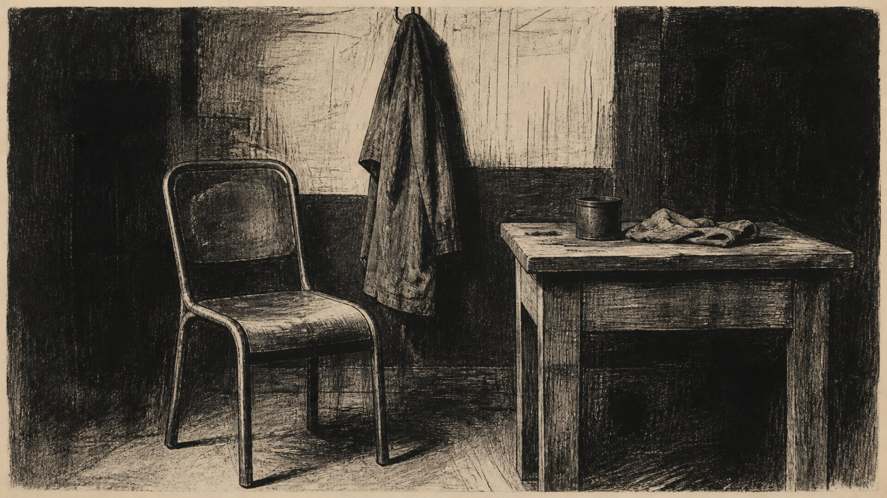

# Käthe Kollwitz

[中文](README.md)

> **Category:** Artist  
> **Medium:** Black-and-white printmaking and charcoal drawing  
> **Directory:** style-packages/artists/kathe-kollwitz

## Overview

Käthe Kollwitz treated printmaking as a direct, weight-bearing visual language. Dense networks of lines, solid black masses, and a limited gray scale turn ordinary forms into clear structures with emotional pressure. This package extracts the relationship between line, value, and paper rather than prescribing a subject of suffering.

## Curatorial note

What I value here is the sense that fewer colors can make a form feel heavier. Start with the subject’s silhouette and center of gravity, then let line carry material and feeling. A grayscale filter alone is not enough; the important decisions are where black settles, where gray stops, and how the paper keeps the hand of the process visible.

## Subject independence

The package controls printmaking medium, value structure, line behavior, and paper texture. It does not prescribe a person, object, location, or story. The studio objects in the representative image are only a benchmark subject.

## Source and rights

Research begins with the [Museum of Modern Art Käthe Kollwitz archive](https://www.moma.org/collection/artists/3201). The repository does not bundle external artworks. The representative image is a new anonymous scene and is not a reproduction, endorsement, or collaboration.

## Use this package alone

### Method 1: Give it to an image-capable Agent

Give the complete package directory to an Agent. Ask it to read identity.yaml, visual-signature.yaml, reproduction.yaml, prompts/, palette/palette.json, and evaluation.yaml before compiling your subject, aspect ratio, and use case.

### Method 2: Copy the Prompt

Copy prompts/base.txt, replace the subject, location, and aspect ratio, and submit prompts/negative.txt as the negative prompt when supported.

### Method 3: Configure an API key

Configure your own image platform or compiler with its API key, then submit the base prompt, negative constraints, and palette. OhMyStyle does not host keys or an online image service.

### Method 4: Local model + ComfyUI

Feed the prompt, palette, and reproduction notes into a local model or ComfyUI workflow. Use evaluation.yaml to review line structure, value range, subject legibility, and subject leakage.
