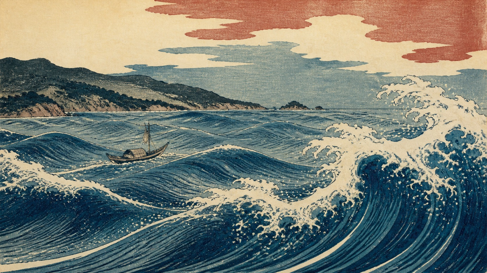

# 葛饰北斋

[English](README.en.md)



> **分类：** 艺术家
> **媒介领域：** 绘画
> **目录：** `style-packages/artists/katsushika-hokusai`

## 简介

以清晰刻线、平涂色块、受控套色和强烈的波形节奏组织画面；风格重点在图形化空间、装饰性负形与木版印刷的触感，不固定海浪、船只或任何特定地点。

葛饰北斋的画面常把复杂景象压缩成清楚的线、面和节奏：轮廓先于细节，色层先于渐变，纸面和套色痕迹让图形保持手工温度。这个包提取的是这种木版画的视觉组织方法，不把海浪、船、富士山或任何名作构图写进默认生成条件。

## 策展短评

这套语言最适合用来处理有明确轮廓和空间层次的主题。代表图选择了海上场景只是为了让波形线条、有限色层和留白关系容易被看见；换成建筑、器物或人物时，画面仍应保留同样的刻线节奏与平面秩序。

## 主体独立性

本包只决定“怎么生成”，不决定“生成什么”。人物、物体、地点、建筑、植物、车辆和叙事由你的 Prompt 决定；本包中的具体场景只属于示例或测试，不会作为默认主体加入生成结果。

## 使用前先看

- `identity.yaml`：范围、对象和排除项
- `visual-signature.yaml`：跨主题仍应保持的视觉特征
- `reproduction.yaml`：媒介、材料和构建顺序
- `prompts/base.txt`、`prompts/negative.txt`：基础 Prompt 与负面约束
- `palette/palette.json`：色彩角色与色值
- `evaluation.yaml`：生成后的检查标准
- `references/manifest.csv`、`provenance.yaml`：来源和权利边界

## 来源与版权

参考资料只用于研究和分析。外部作品、摄影作品、游戏画面、商标和平台页面仍归原权利人所有。生成示例是新的匿名场景，不是相关艺术家、摄影师、流派、学校或游戏的原作，也不代表合作、授权或背书关系。

详细来源和再分发边界见 [`provenance.yaml`](provenance.yaml)、[`references/manifest.csv`](references/manifest.csv) 以及仓库根目录的 [`NOTICE`](../../../NOTICE)。

## 只使用此包

四种方式可以按手边工具任选其一，不需要同时使用。

### 方式一：交给有生图能力的 Agent

把整个风格包目录上传给 Agent，或把本地目录路径交给它，并附上：

```text
请使用这个风格包帮助我生成图片。

请先读取本目录中的 identity.yaml、visual-signature.yaml、reproduction.yaml、
prompts/base.txt、prompts/negative.txt、palette/palette.json 和 evaluation.yaml。
请把文件中的规则整合到生成流程中，不要只把风格名称当作 Prompt，也不要复制参考作品。

我的生成需求是：
<填写人物、物体、场景、画幅和用途>

请先编译完整 Prompt，再调用你的生图能力。生成后按照 evaluation.yaml 检查风格特征、
构图、颜色、材质、AI 痕迹和需求遵循度，并说明仍然存在的风险。
```

### 方式二：直接复制 Prompt

打开 `prompts/base.txt`，替换主题、人物、物体、场景和画幅；将 `prompts/negative.txt` 作为负面 Prompt 一并提交到支持文本生图的平台。需要更稳定时，同时参考视觉签名和调色板。

### 方式三：配置 API Key 后提交生成

在你自己的生图平台或编译工具中配置 API Key，将基础 Prompt、负面约束、调色板和必要的参考清单一起提交。API Key 只保存在你的环境中；本仓库不代管密钥、不托管在线生图服务，也不承诺某个平台的免费额度或接口兼容性。

### 方式四：本地模型 + ComfyUI

将基础 Prompt 和负面约束接入本地模型或 ComfyUI 工作流；按调色板、复现说明和参考清单设置颜色、构图、材质与光线。生成后用 `evaluation.yaml` 做人工或自动复核。

模型权重、API Key 和生成图片由使用者自行管理。参考图只用于理解可观察特征，不要复制原作的具体构图、人物、文字、商标或标志。
