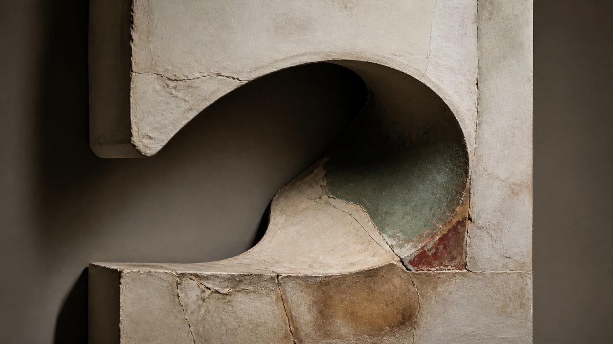

# 路易丝·布尔乔亚

[English](README.en.md)

> **分类：** 艺术家  
> **媒介领域：** 混合媒介  
> **目录：** `style-packages/artists/louise-bourgeois`

## 简介

这个包把有机曲线、建筑性框架、压缩空间和粗粝材料放在同一套视觉秩序里。它关注形体之间的拉扯、空隙里的压力，以及表面留下的修补、压痕和手工痕迹。

## 策展短评

画面不急着讲清楚一个故事，而是先让形体之间产生重量。硬朗的框架给主体以边界，弯曲的线和不均匀的表面再把边界推开一点。使用时可以从很普通的对象开始，让材料和留白承担情绪，不必额外加入象征物。

## 主体独立性

本包只决定视觉处理，不决定主体。人物、物体、地点、建筑、植物和叙事全部由你的需求提供；示例中的对象只是测试内容，不会成为默认生成结果。

## 来源与版权

本包参考 [现代艺术博物馆艺术家页面](https://www.moma.org/artists/710-louise-bourgeois) 与 [艺术家生平资料](https://lb.moma.org/about/biography) 提取可观察特征。外部作品仍归原权利人所有；仓库只保留链接，不打包原作，不主张合作、授权或背书。

## 使用前先看

- `identity.yaml`：范围与主体边界
- `visual-signature.yaml`：跨主题保持的视觉签名
- `reproduction.yaml`：材料与构建顺序
- `prompts/base.txt`、`prompts/negative.txt`：基础约束
- `palette/palette.json`：色彩角色
- `evaluation.yaml`：生成后的检查标准

## 只使用此包

四种方式任选一种：

1. **交给有生图能力的 Agent：** 上传本目录或提供路径，请 Agent 先读取上述文件，再根据你的主体编译 Prompt、生成并按 `evaluation.yaml` 检查。
2. **复制 Prompt：** 打开 `prompts/base.txt`，替换主体、地点、画幅和用途，把 `prompts/negative.txt` 一并提交。
3. **使用自己的 API：** 在你选择的平台配置 API Key，再提交基础 Prompt、负面约束、调色板和需要的参考链接；密钥由你自己保管。
4. **本地模型与 ComfyUI：** 将 Prompt 接入工作流，按调色板和复现说明设置材质、光线与细节，生成后用评价文件复核。

参考图只用于理解可观察特征，不复制原作的构图、人物、文字、商标或标志。
