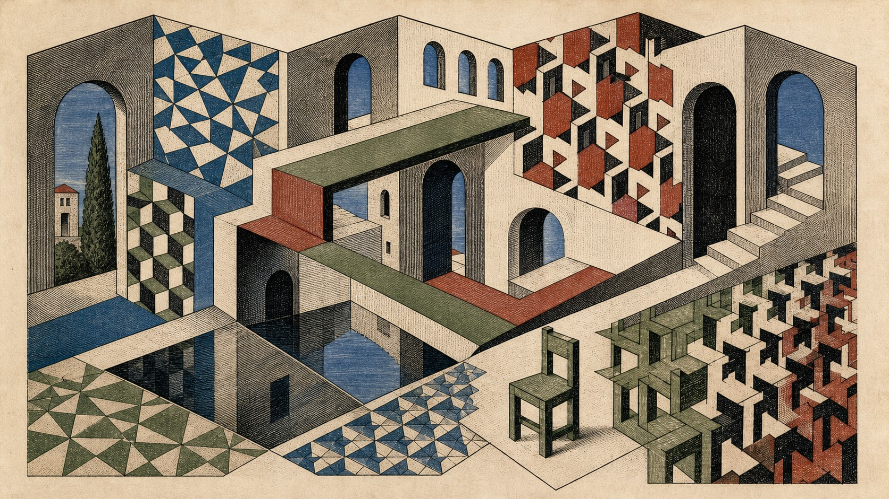

# M. C. Escher

[中文](README.md)

> **Category:** Artist  
> **Domain:** Printmaking  
> **Path:** `style-packages/artists/mc-escher`

## Overview

This package extracts precise engraved line, tessellation, impossible spatial logic, reflective symmetry, and metamorphosis. It helps place an ordinary user-supplied subject inside a clear system of planes and spatial rules, then let one relationship turn quietly impossible.

It changes visual treatment only. It does not prescribe people, objects, places, or stories. Stairs, towers, animals, and famous compositions are not defaults.

## Curatorial note

Escher’s appeal is not simply an odd building. It is the way every local passage can look reasonable while the connections quietly change the rules of space. When using this package, I would first keep the subject recognizable, then introduce one transformation, reflection, or tessellation so the image pauses between understanding and doubt.

## Subject independence

Your subject, people, objects, place, and narrative remain authoritative. This package controls printmaking medium, line, plane organization, limited color, surface, and spatial transition. The geometric courtyard and chairs in the representative image are examples only and are not added to new generations.

## Read before use

- `identity.yaml`: scope and exclusions
- `visual-signature.yaml`: traits that survive a subject change
- `reproduction.yaml`: medium, materials, and build order
- `prompts/base.txt`, `prompts/negative.txt`: prompt constraints
- `palette/palette.json`: color roles
- `evaluation.yaml`: post-generation checks
- `references/manifest.csv`, `provenance.yaml`: sources and rights boundaries

## Sources and rights

Artwork descriptions and collection pages are used to study observable traits. External works and their images remain the property of their rights holders; this package does not bundle external works or copy a specific composition, figure, text, or mark. The representative image is a new anonymous scene and does not imply collaboration, authorization, or endorsement.

Source: [Kunstmuseum Den Haag Escher collection](https://www.kunstmuseum.nl/en/collections/escher). See [`provenance.yaml`](provenance.yaml), [`references/manifest.csv`](references/manifest.csv), and the repository [`NOTICE`](../../../NOTICE).

## Use only this package

### Method 1: Give the package to an image-capable Agent

Upload this directory or provide its local path. Ask the Agent to read the identity, visual signature, reproduction, prompt, palette, and evaluation files first, then compile your subject into a complete prompt. Tell it to use only the package’s visual rules, avoid fixed stairs, towers, or animals, and review the result against `evaluation.yaml`.

### Method 2: Copy the prompts

Open `prompts/base.txt`, replace the subject, location, and aspect ratio, and send `prompts/negative.txt` as the negative prompt. Use the signature and palette for tighter control.

### Method 3: Submit through your own API tool

Configure an API key in your own image platform or compiler, then submit the base prompt, negative constraints, palette, and required reference list. This repository does not host a generation service or manage keys.

### Method 4: Local model + ComfyUI

Connect the prompts to a local model or ComfyUI workflow. Use the reproduction notes to set line, planes, material, and limited color, then review the output with `evaluation.yaml`.

Users manage model weights, keys, and generated images. References are for understanding traits, not for copying source works.
