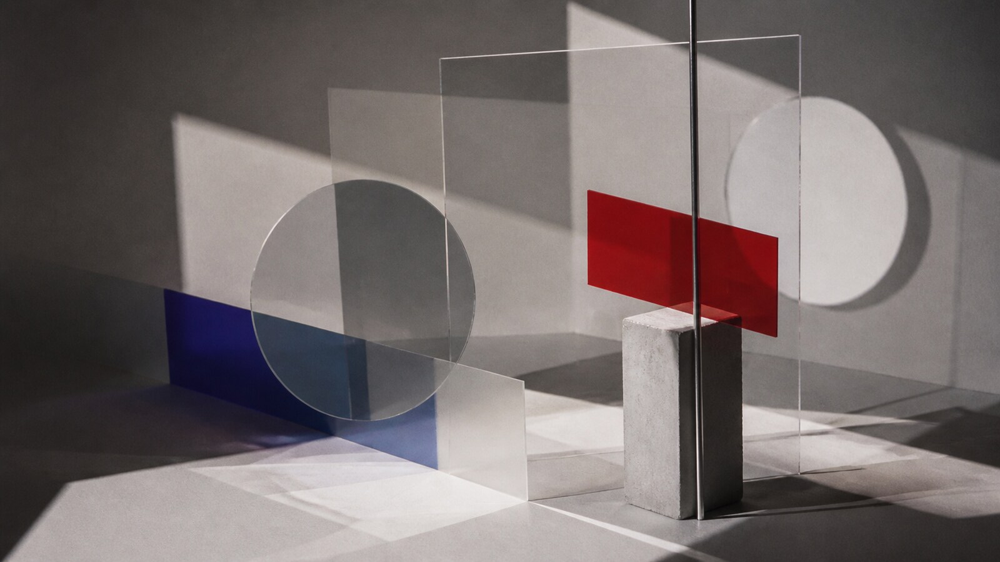

# László Moholy-Nagy

[中文版](README.md)

> **Category:** Artist　**Medium:** Cross-media painting, photography, and design experiments　**Directory:** `style-packages/artists/moholy-nagy`

## Overview

László Moholy-Nagy placed light, transparent materials, photography, and geometric construction on the same workbench. This package focuses on how light cuts through space, how transparent layers create relationships, and how a few pure accents can give direction to a black-and-white structure.

The package can transfer to a person, object, building, or abstract subject. Geometric fragments and transparent projections are visual methods, not objects that must appear in every generation.

## Curatorial note

What I like here is that “experimental” does not mean random glitch. It means giving materials a precise order. Leave one clean area first, then let transparent planes, lines, and projections interlock; the image begins to feel like an optical device in motion.

## Subject independence

This package controls visual treatment, not the person, object, place, or story. The subject in your prompt remains authoritative; Bauhaus furniture, machinery, laboratories, and poster layouts are not defaults.

## File guide

- `identity.yaml`: source, scope, and subject boundaries
- `visual-signature.yaml`: composition, light, palette, surface, and texture
- `reproduction.yaml`: construction order from subject contour to projection
- `prompts/`: base prompt and negative constraints
- `palette/palette.json`: color roles
- `evaluation.yaml`: subject-independence and signature checks
- `references/manifest.csv`, `provenance.yaml`: source and rights boundaries

## Sources and rights

This package studies observable methods described in [MoMA’s collection record for A Lightplay: Black White Gray](https://www.moma.org/collection/works/50114). Reference works remain the property of their respective rights holders. The representative image is a new anonymous scene, not a reproduction, endorsement, or collaboration.

## Use only this package

### Method 1: Give it to an image-capable Agent

Give the Agent this directory and ask it to read `identity.yaml`, `visual-signature.yaml`, `reproduction.yaml`, `prompts/`, `palette/palette.json`, and `evaluation.yaml` before compiling your subject, location, aspect ratio, and intended use. Ask it to evaluate the result afterward; geometric panels and machinery from the example are not mandatory subjects.

### Method 2: Copy the Prompt

Copy `prompts/base.txt`, replace `{SUBJECT}` and `{LOCATION}`, and submit `prompts/negative.txt` as the negative prompt. Use the palette and visual signature when tighter structure is needed.

### Method 3: Configure an API key and submit

Configure your API key in your own image platform or compiler, then submit the base prompt, negative constraints, palette, and any required reference list. This repository does not host keys or an online image service.

### Method 4: Local model + ComfyUI

Connect the base and negative prompts to a local model or ComfyUI workflow. Follow the reproduction notes for transparent layers, directional light, projections, and the black-white structure, then review with `evaluation.yaml`.

Model weights, API keys, and generated images remain under the user’s control. Use references to understand visual characteristics; do not copy a source work’s composition, person, text, trademark, or logo.
