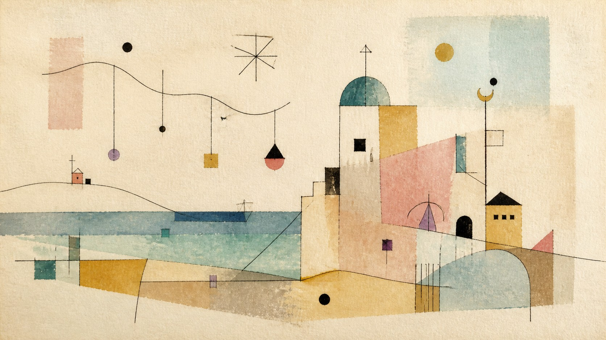

# Paul Klee

[中文](README.md)

> **Category:** Artist  
> **Domain:** Painting  
> **Path:** `style-packages/artists/paul-klee`

## Overview

This package extracts wandering line, translucent color planes, symbolic forms, shallow space, and a light planar rhythm. It lets a subject keep part of its real contour while entering a visual order closer to music or a working drawing.

It does not prescribe fish, angels, alphabets, landscapes, or any fixed symbol. The package controls line, color, surface, and spatial relationships; the user chooses the new subject.

## Curatorial note

Klee’s images often feel like worlds still being formed: a line travels first, color catches it, and a shape can behave like a sign without settling into one answer. The representative image uses an observational setting, but the part worth carrying forward is the flexible negotiation between line and color, not the coast or the building.

## Subject independence

Your subject, people, objects, place, and narrative remain authoritative. This package controls painting medium, line, color planes, shallow space, paper, and symbolic treatment. The observatory and coast in the representative image are examples only and are not added to new generations.

## Read before use

- `identity.yaml`: scope and exclusions
- `visual-signature.yaml`: traits that survive a subject change
- `reproduction.yaml`: medium, materials, and build order
- `prompts/base.txt`, `prompts/negative.txt`: prompt constraints
- `palette/palette.json`: color roles
- `evaluation.yaml`: post-generation checks
- `references/manifest.csv`, `provenance.yaml`: sources and rights boundaries

## Sources and rights

Collection and exhibition materials are used to study observable traits. External works and their images remain the property of their rights holders; this package does not bundle external works or copy a specific composition, symbol, or text. The representative image is a new anonymous scene and does not imply collaboration, authorization, or endorsement.

Source: [Zentrum Paul Klee collection](https://www.zpk.org/en/collection). See [`provenance.yaml`](provenance.yaml), [`references/manifest.csv`](references/manifest.csv), and the repository [`NOTICE`](../../../NOTICE).

## Use only this package

### Method 1: Give the package to an image-capable Agent

Upload this directory or provide its local path. Ask the Agent to read the identity, visual signature, reproduction, prompt, palette, and evaluation files first, then compile your subject into a complete prompt. Tell it to use only the package’s line, color, and shallow-space rules, avoid forced fish, alphabets, or landscapes, and review the result against `evaluation.yaml`.

### Method 2: Copy the prompts

Open `prompts/base.txt`, replace the subject, location, and aspect ratio, and send `prompts/negative.txt` as the negative prompt. Use the signature and palette for tighter control.

### Method 3: Submit through your own API tool

Configure an API key in your own image platform or compiler, then submit the base prompt, negative constraints, palette, and required reference list. This repository does not host a generation service or manage keys.

### Method 4: Local model + ComfyUI

Connect the prompts to a local model or ComfyUI workflow. Use the reproduction notes to set line, translucent planes, paper, and shallow space, then review the output with `evaluation.yaml`.

Users manage model weights, keys, and generated images. References are for understanding traits, not for copying source works.
