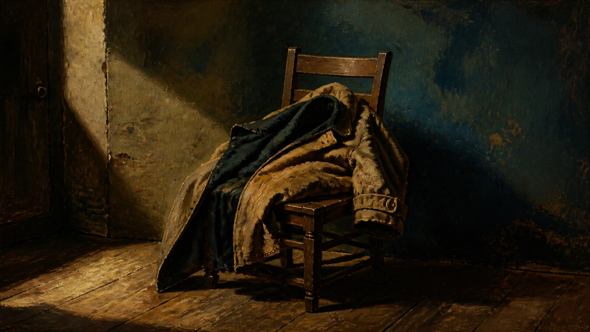

# Peter Paul Rubens

[中文版](README.md)

> **Category:** artist  · **Domain:** painting
> **Path:** style-packages/artists/peter-paul-rubens

## Overview

以充满动势的斜向构图、肉身与布料的丰润体积、温暖高光和厚薄交错的油彩组织画面，保持主体开放。

## Curatorial note

鲁本斯的力量来自运动。人物、布料和光线经常沿着斜线彼此推动，厚重的身体并不僵硬，反而有一种向外扩张的弹性。这个包把动势、暖色体积和油彩层次迁移到普通主体上，不自动加入神话、战争或宫廷叙事。

## Subject independence

This package controls how an image is generated, not what it depicts. People, objects, places, architecture, plants, vehicles, and narrative come from the user's prompt. The representative image is only a demonstration and must not become a default subject.

## Visual signature

- 斜向动势与交错的形体关系
- 暖赭红、肉粉和金褐承担体积
- warm directional light with strong but graduated highlights and deep colored shadows
- thick and thin oil layers, active brushwork, supple edges, and tactile fabric or skin-like modeling

## Sources and rights

References are used for research and visual analysis. External artworks, photographs, game imagery, trademarks, and platform pages remain the property of their respective rights holders. The generated example is a new anonymous scene and is not an original work by, or endorsement from, the referenced source.

- [彼得·保罗·鲁本斯绘画与素描展览资料](https://www.metmuseum.org/exhibitions/listings/2005/rubens-drawings)

See [provenance.yaml](provenance.yaml), [references/manifest.csv](references/manifest.csv), and the repository [NOTICE](../../../NOTICE) for redistribution boundaries.

## Use only this package

1. Give this directory to an image-capable Agent and ask it to read the YAML files, prompts, palette, and evaluation before compiling a prompt.
2. Copy prompts/base.txt, replace the subject and location, and send prompts/negative.txt as the negative prompt.
3. Submit the compiled prompt through your own API tool after configuring your own API key; this repository does not host generation.
4. Connect the prompt, palette, reproduction notes, and reference manifest to a local model or ComfyUI workflow.

Do not copy a source work's exact composition, figures, text, trademark, logo, game asset, or fixed subject. Users manage model weights, API keys, generated images, and storage themselves.
