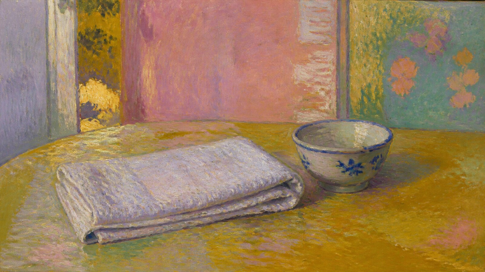

# Pierre Bonnard

[中文版](README.md)

> **Category:** Artist  · **Domain:** painting
> **Path:** style-packages/artists/pierre-bonnard

## Overview

以亲密日常中的色彩震动、装饰性平面和不断变化的室内光线组织画面，让普通主体保留记忆般的温度。

## Notes

This package transfers observable visual decisions to a user-supplied subject. It does not add a fixed object, place, character, landmark, or narrative event.

## Visual signature

- 装饰性平面与轻微压缩的空间
- 粉红、赭黄、暖绿和蓝紫的邻近色震动
- 光线像记忆一样在物体表面缓慢变化
- 可见但不僵硬的笔触与织物质感

## Subject independence

The package controls how an image is rendered, not what the user must render. The representative image is an anonymous demonstration. Keep the requested subject, count, location, and story unchanged.

## Sources and rights

Research sources are linked for attribution and study. External works, photographs, game images, trademarks, and platform pages remain with their respective rights holders. The generated demonstration is original and anonymous; it is not an original work by, nor an endorsement from, the cited source.

- [皮埃尔·博纳尔艺术家资料](https://www.moma.org/artists/665-pierre-bonnard)

See [provenance.yaml](provenance.yaml), [references/manifest.csv](references/manifest.csv), and the repository [NOTICE](../../../NOTICE) for the rights boundary.

## Use only this package

四种方式可以按手边工具任选其一，不需要同时使用。

### Method 1: Give the package to an image-capable Agent

把整个风格包目录上传给 Agent，或把本地目录路径交给它，并附上：

~~~
请使用这个风格包帮助我生成图片。

请先读取本目录中的 identity.yaml、visual-signature.yaml、reproduction.yaml、
prompts/base.txt、prompts/negative.txt、palette/palette.json 和 evaluation.yaml。
请把文件中的规则整合到生成流程中，不要只把风格名称当作 Prompt，也不要复制参考作品。

我的生成需求是：
<填写人物、物体、场景、画幅和用途>

请先编译完整 Prompt，再调用你的生图能力。生成后按照 evaluation.yaml 检查风格特征、
构图、颜色、材质、AI 痕迹和需求遵循度，并说明仍然存在的风险。
~~~

### Method 2: Copy the Prompt

打开 [prompts/base.txt](prompts/base.txt)，替换主题、人物、物体、场景和画幅；将 [prompts/negative.txt](prompts/negative.txt) 作为负面 Prompt 一并提交到支持文本生图的平台。需要更稳定时，同时参考视觉签名和调色板。

### Method 3: Generate through your own API

在你自己的生图平台或编译工具中配置 API Key，将基础 Prompt、负面约束、调色板和必要的参考清单一起提交。API Key 只保存在你的环境中；本仓库不代管密钥、不托管在线生图服务。

### Method 4: Local model + ComfyUI

将基础 Prompt 和负面约束接入本地模型或 ComfyUI 工作流；按调色板、复现说明和参考清单设置颜色、构图、材质与光线。生成后用 [evaluation.yaml](evaluation.yaml) 做人工或自动复核。

模型权重、API Key 和生成图片由使用者自行管理。参考图只用于理解可观察特征，不要复制原作的具体构图、人物、文字、商标或标志。
