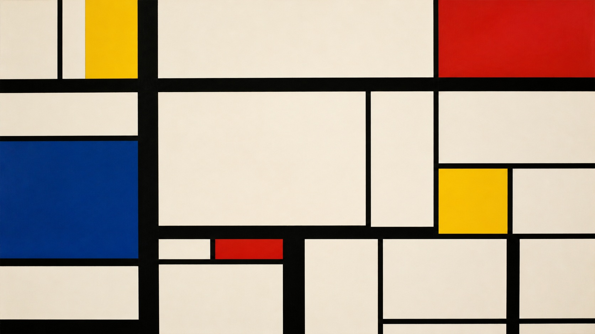

# 皮特·蒙德里安

[English](README.en.md)

> **分类：** 艺术家  
> **媒介领域：** 绘画  
> **目录：** `style-packages/artists/piet-mondrian`

## 简介

皮特·蒙德里安的画面把线、面、留白和少量高辨识度色彩放在同一个秩序里。它的重点不是“画几个彩色方块”，而是让不对称的间距、黑线的重量和色面的比例共同建立平衡。本包提取这种结构关系，适用于用户指定的各种主体。

## 策展短评

我喜欢它近乎克制的紧张感：画面看起来很安静，但每一条线和每一块颜色都在重新分配重量。生成时最值得保留的不是某个熟悉的矩形布局，而是让主体经过抽象后仍有清楚的秩序和呼吸。

## 主体独立性

本包只决定视觉处理，不规定人物、物体、地点、建筑或故事。代表图是抽象构成，只用于展示网格、色面和留白；使用时请以自己的主题为准。

## 文件说明

- `identity.yaml`：范围、排除项和主体政策
- `visual-signature.yaml`：跨主题保持的视觉特征
- `reproduction.yaml`：构建顺序和技术约束
- `prompts/`：基础 Prompt 与负面约束
- `palette/palette.json`：色彩角色和建议色值
- `evaluation.yaml`：生成后的检查项
- `provenance.yaml`、`references/manifest.csv`：来源与权利边界

## 来源与版权

研究入口为[现代艺术博物馆的艺术家档案](https://www.moma.org/artists/4057-piet-mondrian)。仓库不打包外部作品；代表图是新的匿名构成，不是具体原作，也不表示合作、授权或背书关系。详细边界见 [`provenance.yaml`](provenance.yaml) 与仓库根目录 [`NOTICE`](../../../NOTICE)。

## 只使用此包

### 方式一：交给有生图能力的 Agent

把本目录交给 Agent，并要求它先读取 `identity.yaml`、`visual-signature.yaml`、`reproduction.yaml`、`prompts/`、`palette/palette.json` 和 `evaluation.yaml`，再将你的主体、画幅和用途编译成完整 Prompt。生成后按评价文件检查风格和主体独立性。

### 方式二：直接复制 Prompt

打开 `prompts/base.txt`，替换 `{{SUBJECT}}`、`{{ASPECT_RATIO}}` 和 `{{USE_CASE}}`；把 `prompts/negative.txt` 一并提交给支持负面 Prompt 的平台。

### 方式三：配置 API Key 后提交生成

在你自己的生图平台或编译工具中配置 API Key，提交基础 Prompt、负面约束和调色板。本仓库不托管密钥或在线生图服务。

### 方式四：本地模型 + ComfyUI

将 Prompt、调色板和复现说明接入本地模型或 ComfyUI，生成后用 `evaluation.yaml` 复核。不要把代表图的具体矩形位置当成必须复制的构图。
