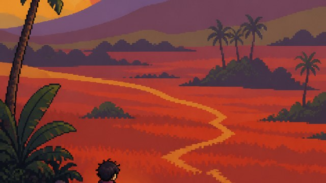

# Cross-style feature

[中文](README.md)

Cross-style recipes are not independent styles in the main gallery. They are an optional composition feature: two or more independent packages can be assigned to explicit roles, zones, or dimensions while keeping the result explainable.

## Features

- `stack`: separate packages own separate dimensions such as medium, lighting, or depth.
- `blend`: weighted rules share a dimension such as color, light, or surface.
- `contrast`: packages are assigned to separate zones so their rules do not contaminate one another.

## How to use

Choose the base packages first, then open the cross-style package's `composite.yaml` and compile the Prompt with its roles, zones, weights, and exclusions. When no mode is selected, the runtime infers `stack`, `blend`, or `contrast` from the declared responsibilities.

## Examples

<table>
<tr>
<td width="33%" valign="top" align="center"> <strong>RPG Maker Foreground + Gauguin Background</strong> <a href="rpg-maker-x-gauguin/README.en.md">Open README</a></td>
<td width="33%" valign="top" align="center"> <strong>RPG Maker Pixel Art + Turner Atmosphere</strong> <a href="rpg-maker-x-turner/README.en.md">Open README</a></td>
<td width="33%" valign="top" align="center"> <strong>Vermeer Light + Monet Color</strong> <a href="vermeer-x-monet/README.en.md">Open README</a></td>
</tr>
</table>
