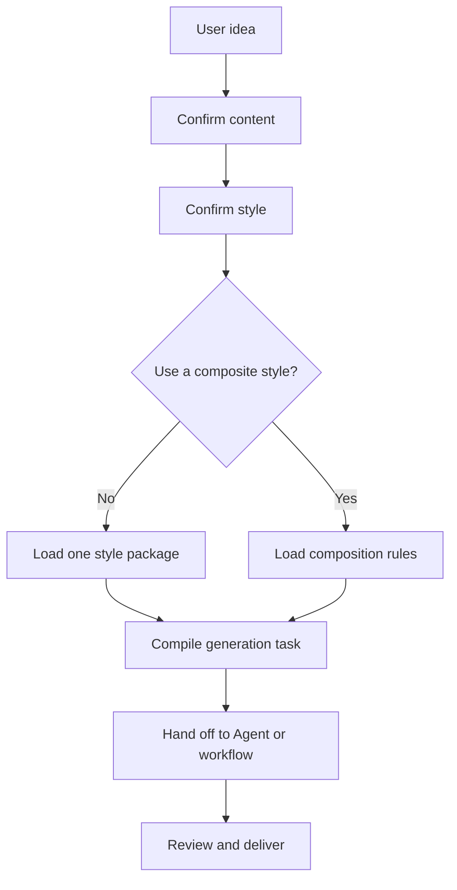
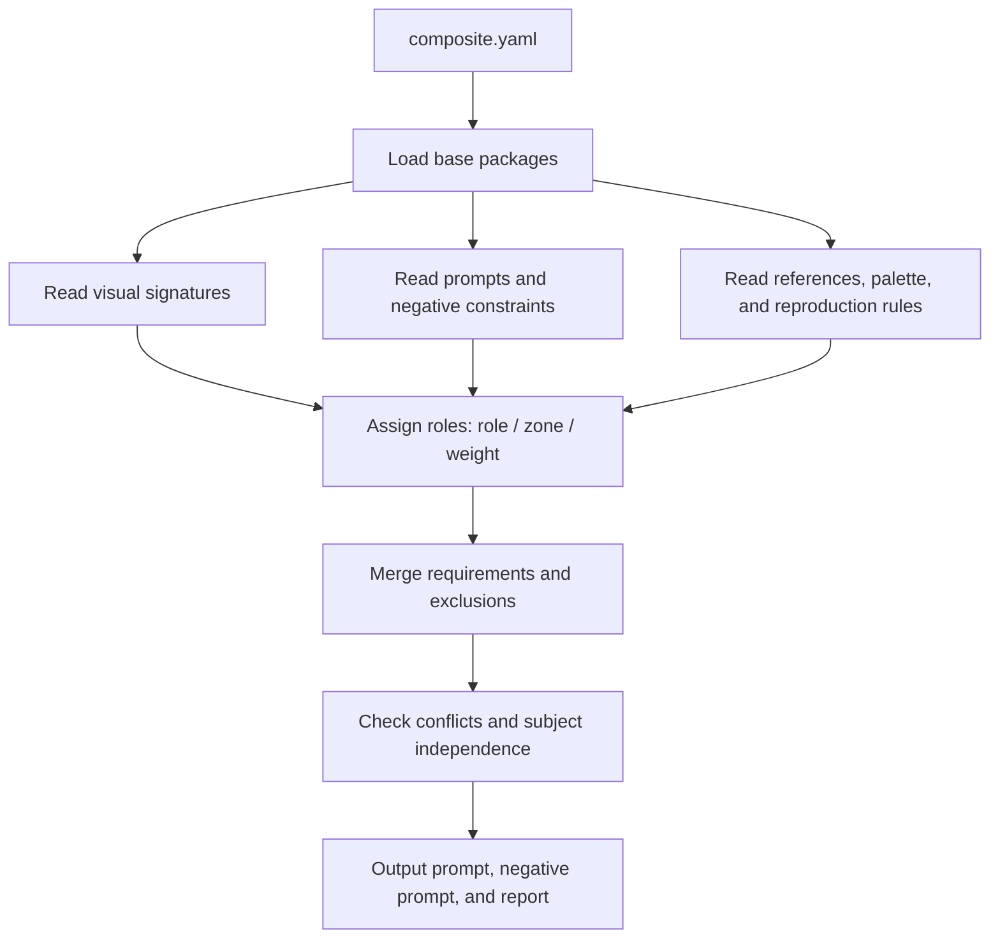
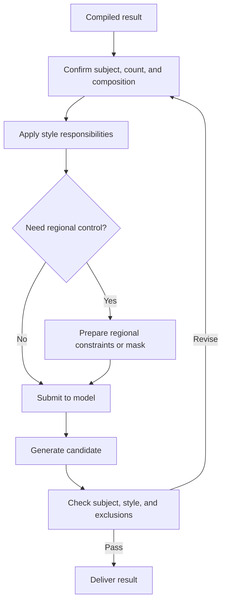

# Cross-style feature

[中文](README.md)

Cross-style recipes are not independent styles in the main gallery. They are an optional composition layer that assigns two or more independent style packages to explicit roles, zones, or visual dimensions while keeping the result explainable and reusable.

## 1. What problem does it solve?

Writing several names into a prompt is ambiguous:

```text
pixel art + Gauguin + Turner
```

The model may merge every rule into one unstable look: painterly texture can soften pixel edges, a palette package can recolor foreground objects, and atmospheric blur can erase the intended medium.

A cross-style recipe makes the responsibilities explicit:

```text
pixel package → medium, edges, and object structure
Gauguin package → background color fields and compressed space
Turner package → sky, atmosphere, and lighting
```

It is therefore a visual responsibility map, not a new artist, photographer, or movement.

## 2. The three composition modes

| Mode | Use it when | Core behavior |
| --- | --- | --- |
| `stack` | Packages own different dimensions | Separate responsibilities |
| `blend` | Packages share one dimension | Weighted rule fusion |
| `contrast` | Packages own different regions | Explicit zone boundaries |

### Three readable workflow views

The workflow is split into three small diagrams. Each diagram answers one question, so it stays readable on a normal screen. GitHub can render the Mermaid blocks directly, and the source files are kept in the repository for reuse and maintenance.

#### 1. From a request to a style task



[View the Mermaid source](../../docs/diagrams/cross-style-overview.en.mmd)

#### 2. How the style package is compiled



[View the Mermaid source](../../docs/diagrams/cross-style-compile.en.mmd)

#### 3. How an Agent completes generation



[View the Mermaid source](../../docs/diagrams/cross-style-agent-generation.en.mmd)

Regional control is an optional execution-time enhancement. `contrast` currently supplies regional responsibilities at the prompt level; when a model cannot separate regions reliably, the Agent or a ComfyUI workflow can add masks.

### `stack`: separate responsibilities

Use `stack` when packages affect different dimensions. For example, an RPG pixel package can own the medium while Turner owns atmospheric lighting. The compiler keeps pixel geometry authoritative and prevents the lighting package from turning the image into an oil painting.

See [RPG Maker Pixel Art + Turner Atmosphere](rpg-maker-x-turner/README.en.md).

### `blend`: weighted shared dimensions

Use `blend` when multiple packages contribute to the same dimension. Vermeer can provide calm directional light while Monet contributes chromatic temperature variation. The weights are prompt-rule weights, not direct pixel arithmetic; the final result still depends on the image model.

See [Vermeer Light + Monet Color](vermeer-x-monet/README.en.md).

### `contrast`: zone separation

Use `contrast` when packages must remain spatially distinct. An RPG package can own the foreground while Gauguin owns the background. The recipe can forbid oil-paint texture on sprites and prevent background palette rules from recoloring foreground objects.

See [RPG Maker Foreground + Gauguin Background](rpg-maker-x-gauguin/README.en.md).

At present, `contrast` is a prompt-level regional constraint. It is not an automatic mask or hard image-segmentation system; weaker models may still blur the boundary.

## 3. Package structure

```text
rpg-maker-x-turner/
├── composite.yaml
├── README.md
├── README.en.md
├── gallery-16x9.jpg
└── examples/
    └── generated/
        └── anonymous-v1.png
```

`composite.yaml` references existing base packages rather than copying their contents. The compiler can therefore reuse their prompts, references, palettes, visual signatures, and reproduction rules.

## 4. How users run it

### Method 1: give the package to an image-capable Agent

Provide the composite directory together with every base package listed under `bases`. Ask the Agent to read `composite.yaml`, the base packages' visual signatures and reproduction constraints, and then compile the requested subject while preserving roles, zones, weights, and must/avoid constraints.

### Method 2: compile and copy the Prompt

From the repository root:

```bash
python tools/compile-composite.py \
  style-packages/composites/rpg-maker-x-turner \
  --subject "a seaside town station at dusk" \
  --mode auto \
  --profile generic
```

Copy the resulting `prompt` and `negative_prompt` fields into your image platform. `--mode auto` uses the recipe's declared mode; you may also force `stack`, `blend`, or `contrast`.

### Method 3: submit through your own API key

Use your own image platform or API client to submit the compiled prompt, negative constraints, subject variables, and reference resources. OhMyStyle does not host an image API or store API keys.

### Method 4: local model and ComfyUI

Import the compiled prompt and negative prompt into a local model or ComfyUI workflow, together with the base packages' references, palettes, and structural constraints. For `contrast`, add manual regional masks when stronger separation is required.

## 5. Automatic mode selection

Mode inference is rule-driven:

```text
explicit mode
    ↓
use that mode

no explicit mode
    ↓
distinct zones? → contrast
shared roles?   → blend
otherwise       → stack
```

The runtime uses declared roles, zones, weights, hints, and subject keywords. This is deterministic rule-based inference, not an extra vision model making an artistic judgment.

## 6. Why this is different from style-name concatenation

```text
ordinary prompt:  A + B + C
cross-style recipe:
A → medium
B → lighting
C → palette
plus zones, weights, exclusions, and conflict policy
```

This makes the result more explainable, reproducible, replaceable, and suitable for Agent execution.

## 7. Scope and limitations

Cross-style recipes are provider-neutral prompt compilers. They organize responsibilities, compile prompts, merge negative constraints, and report conflicts; the final image quality still depends on the Agent, model, and workflow.

They do not currently perform automatic local repainting, color sampling, or mask generation. Add those controls in a model or ComfyUI workflow when region-level precision is required.

## Examples

<table>
<tr>
<td width="33%" valign="top" align="center"><a href="rpg-maker-x-gauguin/README.en.md"></a><br><strong>RPG Maker Foreground + Gauguin Background</strong><br><a href="rpg-maker-x-gauguin/README.en.md">Open README</a></td>
<td width="33%" valign="top" align="center"><a href="rpg-maker-x-turner/README.en.md"></a><br><strong>RPG Maker Pixel Art + Turner Atmosphere</strong><br><a href="rpg-maker-x-turner/README.en.md">Open README</a></td>
<td width="33%" valign="top" align="center"><a href="vermeer-x-monet/README.en.md"></a><br><strong>Vermeer Light + Monet Color</strong><br><a href="vermeer-x-monet/README.en.md">Open README</a></td>
</tr>
</table>
