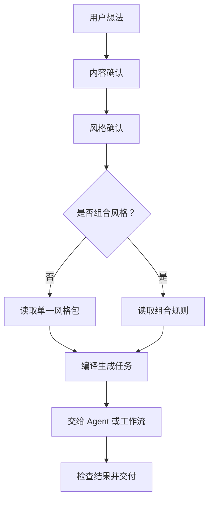
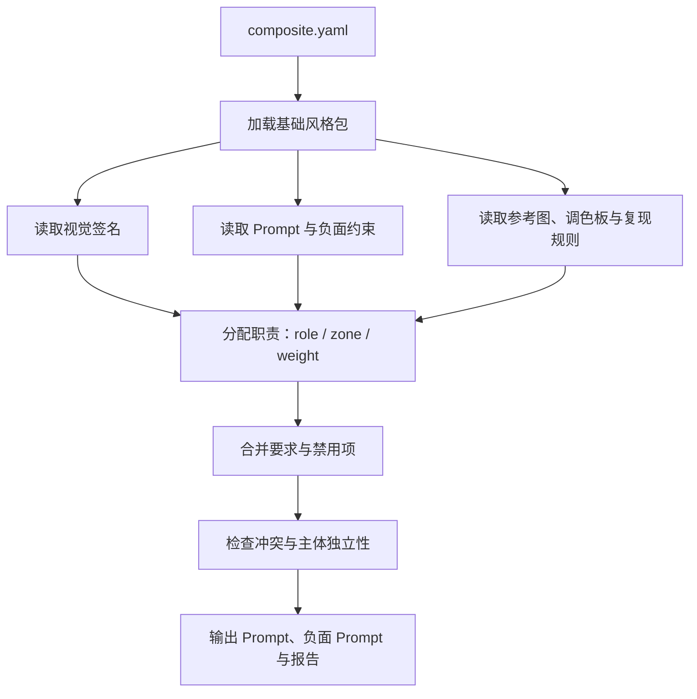
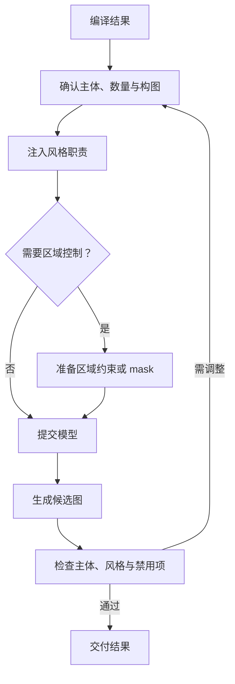

# 交叉风格功能

[English](README.en.md)

交叉风格不作为独立风格出现在主画廊中。它是一种可选组合功能：用户可以把两个或多个独立风格包分配到不同角色、区域或视觉维度，生成更复杂但仍然可解释、可复用的结果。

## 一、它解决什么问题

直接把多个名字写进 Prompt：

```text
像素风 + 高更风格 + 透纳风格
```

容易让模型把所有特征混在一起：

- 像素边缘被油画笔触污染；
- 高更式色彩覆盖人物和道具；
- 透纳式雾化效果破坏像素结构；
- 最终结果变成无法解释的“混合风格”。

交叉风格会先明确视觉职责：

```text
像素风 → 负责媒介、边缘和物体结构
高更 → 负责背景色块和空间压缩
透纳 → 负责天空、空气和光线
```

因此，交叉包更像一份“视觉职责分配表”，而不是一个新的艺术家、摄影师或流派。

## 二、三种组合模式

| 模式 | 适用情况 | 核心机制 |
| --- | --- | --- |
| `stack` | 不同风格负责不同维度 | 分工叠加 |
| `blend` | 多个风格影响同一个维度 | 按权重融合 |
| `contrast` | 不同风格负责不同区域 | 区域隔离 |

### 三组可读流程图

复杂流程拆成三张小图，每张只回答一个问题。图表可以直接在 GitHub 中展开查看，原始 Mermaid 文件也保存在仓库中，方便复制到其他文档或继续维护。

#### 1. 从需求到风格任务



[查看 Mermaid 源文件](../../docs/diagrams/cross-style-overview.zh.mmd)

#### 2. 风格包如何被编译



[查看 Mermaid 源文件](../../docs/diagrams/cross-style-compile.zh.mmd)

#### 3. Agent 如何完成生图



[查看 Mermaid 源文件](../../docs/diagrams/cross-style-agent-generation.zh.mmd)

这里的区域控制是执行阶段的可选增强。`contrast` 目前主要提供 Prompt 层面的区域职责；如果模型不能稳定区分区域，可以由 Agent 或 ComfyUI 工作流补充 mask。

### 1. `stack`：职责叠加

`stack` 适合两个风格影响不同维度。例如，角色扮演游戏像素美术负责媒介和边缘，透纳包负责天空和大气光线。

```yaml
game-art/rpg-maker-pixel-art:
  role: medium
  weight: 0.6

artists/jmw-turner:
  role: lighting
  weight: 0.4
```

实际含义：

- RPG 像素包决定像素网格、边缘和形体；
- 透纳包决定天空、空气感和光线；
- 透纳不能把像素图变成油画；
- 像素包也不能阻止天空出现大气光线。

它不是把两张图片直接叠加，而是把两个风格包的规则分别编译，再告诉模型“谁负责什么”。

示例：[角色扮演游戏像素美术 + 透纳氛围](rpg-maker-x-turner/README.md)。

### 2. `blend`：同维度加权融合

`blend` 适合多个风格共同影响同一个维度。例如，维米尔和莫奈都影响色彩与光线，但各自的权重不同。

```yaml
artists/johannes-vermeer:
  role: palette
  weight: 0.55

artists/claude-monet:
  role: palette
  weight: 0.45
```

实际含义：

- 维米尔提供稳定、安静、方向明确的光线；
- 莫奈提供色彩温度变化和环境色；
- 维米尔权重略高，所以画面结构和光线更稳定；
- 莫奈不能把所有物体都变成模糊笔触。

这里的权重是 Prompt 规则权重，不是直接对图片像素做数学混合。最终效果仍然取决于生图模型。

示例：[维米尔光线 + 莫奈色彩](vermeer-x-monet/README.md)。

### 3. `contrast`：区域隔离

`contrast` 适合两个风格负责不同空间区域。例如，RPG 像素包负责前景，高更包负责背景。

```yaml
game-art/rpg-maker-pixel-art:
  role: medium
  zone: foreground
  weight: 0.6

artists/paul-gauguin:
  role: palette
  zone: background
  weight: 0.4
```

实际含义：

```text
前景：像素边缘、角色、道具、可碰撞结构
背景：高更式色块、装饰性轮廓、压缩空间
```

交叉包还可以声明禁止项，例如：

- 不要把油画纹理应用到前景像素角色；
- 不要让背景色彩规则重新给前景物体上色。

当前 `contrast` 是 Prompt 层面的区域约束，不是自动生成 mask，也不是硬性的图像分割系统。模型较弱时，区域边界仍可能执行不稳定。

示例：[RPG Maker 前景 + 高更背景](rpg-maker-x-gauguin/README.md)。

## 三、交叉包的文件结构

```text
rpg-maker-x-turner/
├── composite.yaml
├── README.md
├── README.en.md
├── gallery-16x9.jpg
└── examples/
    └── generated/
        └── anonymous-v1.png
```

其中核心文件是 `composite.yaml`：

```yaml
id: rpg-maker-x-turner
name: RPG Maker Pixel Art + Turner Atmosphere
version: 0.1.0
mode: stack

bases:
  - package: game-art/rpg-maker-pixel-art
    role: medium
    weight: 0.6

  - package: artists/jmw-turner
    role: lighting
    weight: 0.4

constraints:
  must:
    - keep pixel-grid geometry
    - use atmospheric light as a depth signal

  avoid:
    - smooth painterly brush texture
    - photorealistic rendering
```

`bases` 中引用的是已有风格包路径，不会复制一份风格内容。因此，交叉包可以直接复用基础包的 Prompt、参考图、调色板、视觉签名和复现规则。

## 四、用户实际怎么使用

### 方式一：交给具备生图能力的 Agent

把交叉包目录和 `composite.yaml` 中 `bases` 列出的基础风格包一起提供给 Agent。让 Agent 先读取组合规则、基础包的视觉签名和复现约束，再把你的主题编译成最终 Prompt。

Agent 必须保留：

- 基础包承担的角色；
- `zone` 区域分配；
- 权重；
- `constraints.must` 和 `constraints.avoid`；
- 不同风格之间的边界。

### 方式二：编译后复制 Prompt

在仓库根目录运行：

```bash
python tools/compile-composite.py \
  style-packages/composites/rpg-maker-x-turner \
  --subject "海边小镇的黄昏车站" \
  --mode auto \
  --profile generic
```

把输出 JSON 中的 `prompt` 和 `negative_prompt` 复制到你使用的生图平台。`--mode auto` 会使用组合包声明的模式；也可以显式指定 `stack`、`blend` 或 `contrast`。

### 方式三：配置 API Key 后提交生成任务

使用自己的生图平台或 API 客户端，将编译结果中的 Prompt、负面约束、主题变量和参考资源提交给模型。OhMyStyle 只负责风格包和任务编译，不托管 API Key，也不提供在线生图服务。

### 方式四：本地模型 + ComfyUI

将编译后的 Prompt 和负面 Prompt 导入本地模型或 ComfyUI，并同时提供 `bases` 中基础风格包的参考图、调色板和结构约束。对于 `contrast`，如果模型执行不稳定，可以在 ComfyUI 中手动增加区域 mask；交叉包本身不会自动生成 mask。

## 五、不指定模式时如何自动选择

自动判断是规则驱动的：

```text
明确指定 mode
    ↓
使用指定模式

没有指定 mode
    ↓
存在不同 zone？
    → contrast

多个基础包承担同一 role？
    → blend

其他情况
    → stack
```

例如：

- 一个包负责前景，一个包负责背景：优先使用 `contrast`；
- 两个包都负责色彩：优先使用 `blend`；
- 一个包负责媒介，一个包负责光线：优先使用 `stack`。

这里的“智能处理”是基于角色、区域、权重、提示词关键词和组合声明的规则推断，不是额外调用视觉大模型判断。

## 六、与普通风格拼接的区别

普通拼接：

```text
A 风格 + B 风格 + C 风格
```

交叉风格：

```text
A → medium
B → lighting
C → palette
区域、权重、禁止项和冲突策略全部写清楚
```

这使结果具有：

- 可解释性；
- 可复现性；
- 可替换性；
- 更低的风格污染；
- 更适合交给 Agent 自动执行。

## 七、边界说明

交叉包是 provider-neutral 的风格组合编译器，不绑定某个生图模型。它负责读取基础风格包、组织职责、编译 Prompt、合并负面约束并报告冲突；具体图片质量仍由所使用的 Agent、模型和工作流决定。

当前 `contrast` 主要提供文字层面的区域边界。它不会自动完成局部重绘、颜色采样或 mask 分割；如果需要更强的区域控制，应在支持局部控制的模型或 ComfyUI 工作流中补充 mask。

## 示例画廊

<table>
<tr>
<td width="33%" valign="top" align="center"><a href="rpg-maker-x-gauguin/README.md"></a><br><strong>RPG Maker Foreground + Gauguin Background</strong><br><a href="rpg-maker-x-gauguin/README.md">打开 README</a></td>
<td width="33%" valign="top" align="center"><a href="rpg-maker-x-turner/README.md"></a><br><strong>角色扮演游戏像素美术 + Turner Atmosphere</strong><br><a href="rpg-maker-x-turner/README.md">打开 README</a></td>
<td width="33%" valign="top" align="center"><a href="vermeer-x-monet/README.md"></a><br><strong>Vermeer Light + Monet Color</strong><br><a href="vermeer-x-monet/README.md">打开 README</a></td>
</tr>
</table>
