# Game art

[中文](README.md)

This directory contains 22 independent style packages. Each card uses a horizontal 16:9 representative image; click an image or name to open the package README.

<table>
<tr>
<td width="33%" valign="top" align="center"> <strong>Low-poly Adventure Game Art</strong> <a href="low-poly-adventure-game-art/README.en.md">Open README</a></td>
<td width="33%" valign="top" align="center"> <strong>Top-down 16-bit Adventure Game Art</strong> <a href="top-down-16-bit-adventure/README.en.md">Open README</a></td>
<td width="33%" valign="top" align="center"> <strong>ZX Spectrum Attribute Pixel Art</strong> <a href="zx-spectrum-attribute-pixel/README.en.md">Open README</a></td>
</tr>
<tr>
<td width="33%" valign="top" align="center"> <strong>Side-scrolling Platformer Pixel Art</strong> <a href="side-scrolling-platformer-pixel/README.en.md">Open README</a></td>
<td width="33%" valign="top" align="center"> <strong>Cinematic Pixel Adventure Art</strong> <a href="cinematic-pixel-adventure/README.en.md">Open README</a></td>
<td width="33%" valign="top" align="center"> <strong>Isometric Pixel Tactics Art</strong> <a href="isometric-pixel-tactics/README.en.md">Open README</a></td>
</tr>
<tr>
<td width="33%" valign="top" align="center"> <strong>RPG Maker Pixel Art</strong> <a href="rpg-maker-pixel-art/README.en.md">Open README</a></td>
<td width="33%"></td>
<td width="33%"></td>
</tr>
</table>

## Added in this batch

These packages use rights-safe abstract palette cards temporarily; replace them after an authorized or independently generated representative image is reviewed.

<table>
<tr><td width="33%" valign="top" align="center"><a href="cel-shaded-nature-game-art/README.en.md">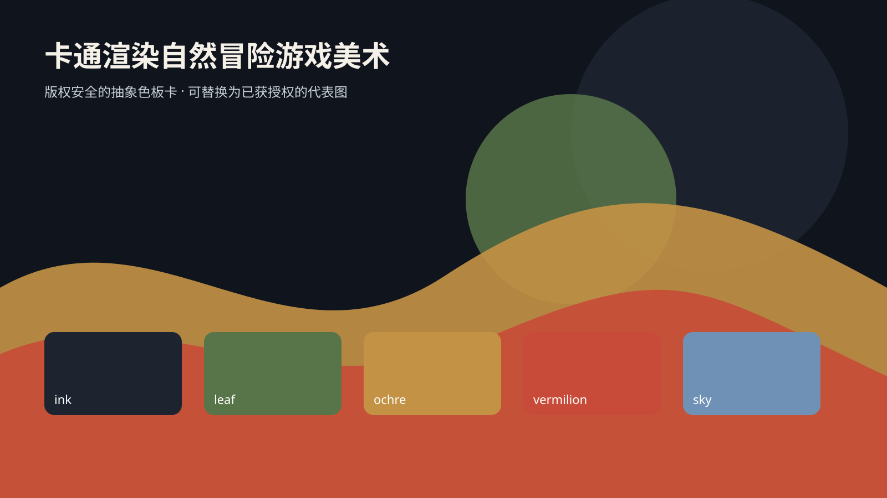</a> <strong>Cel-Shaded Nature Adventure Game Art</strong> <a href="cel-shaded-nature-game-art/README.en.md">Open README</a></td><td width="33%" valign="top" align="center"><a href="hand-inked-animation-game-art/README.en.md">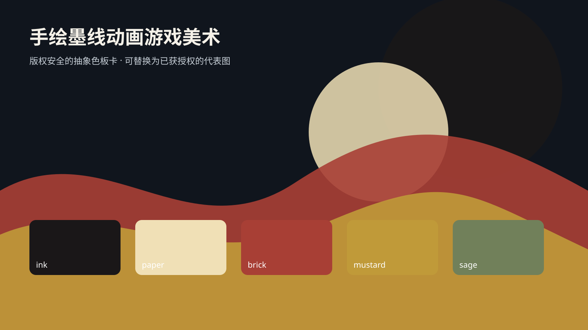</a> <strong>Hand-Inked Animation Game Art</strong> <a href="hand-inked-animation-game-art/README.en.md">Open README</a></td><td width="33%" valign="top" align="center"><a href="watercolor-storybook-game-art/README.en.md">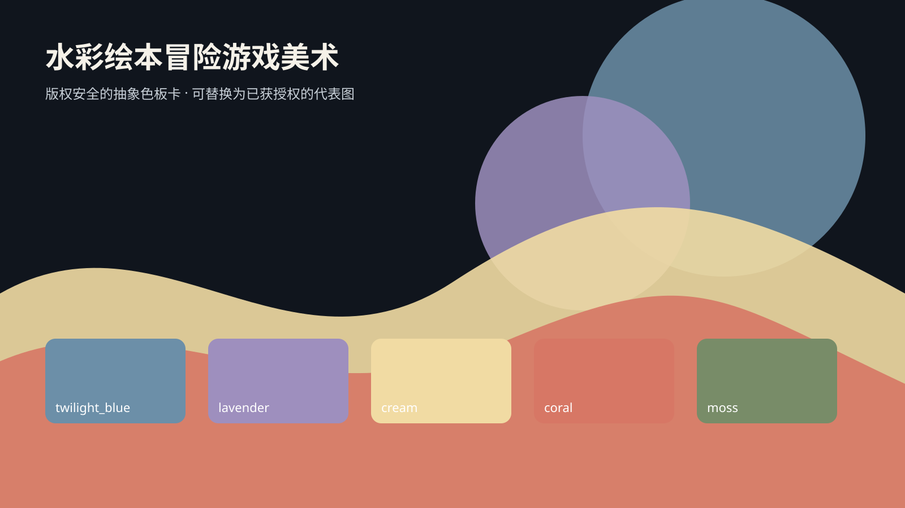</a> <strong>Watercolor Storybook Adventure Game Art</strong> <a href="watercolor-storybook-game-art/README.en.md">Open README</a></td></tr>
<tr><td width="33%" valign="top" align="center"><a href="papercraft-diorama-game-art/README.en.md">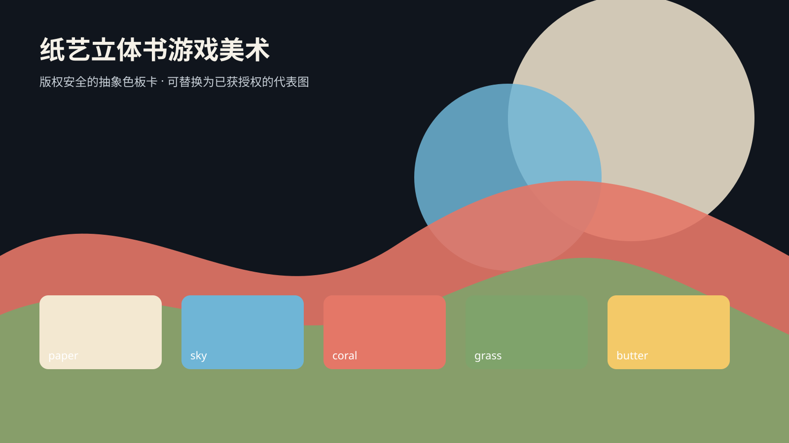</a> <strong>Papercraft Diorama Game Art</strong> <a href="papercraft-diorama-game-art/README.en.md">Open README</a></td><td width="33%" valign="top" align="center"><a href="voxel-world-game-art/README.en.md">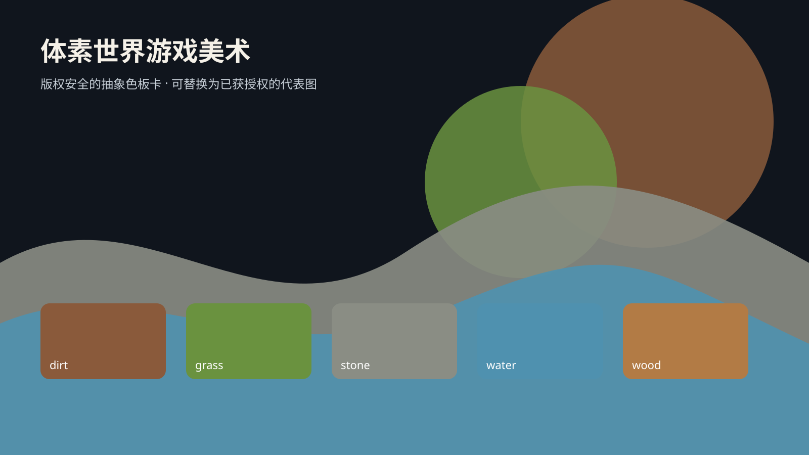</a> <strong>Voxel World Game Art</strong> <a href="voxel-world-game-art/README.en.md">Open README</a></td><td width="33%" valign="top" align="center"><a href="stylized-low-poly-world/README.en.md">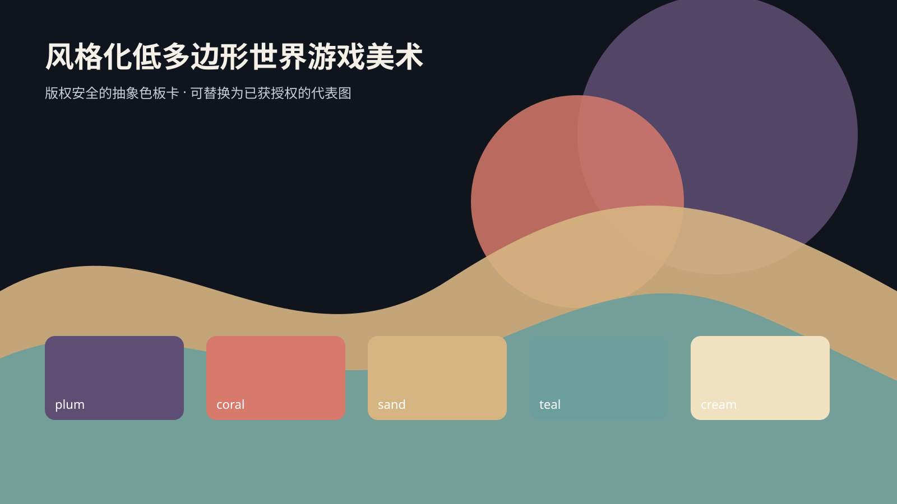</a> <strong>Stylized Low-Poly World Game Art</strong> <a href="stylized-low-poly-world/README.en.md">Open README</a></td></tr>
<tr><td width="33%" valign="top" align="center"><a href="impossible-architecture-game-art/README.en.md">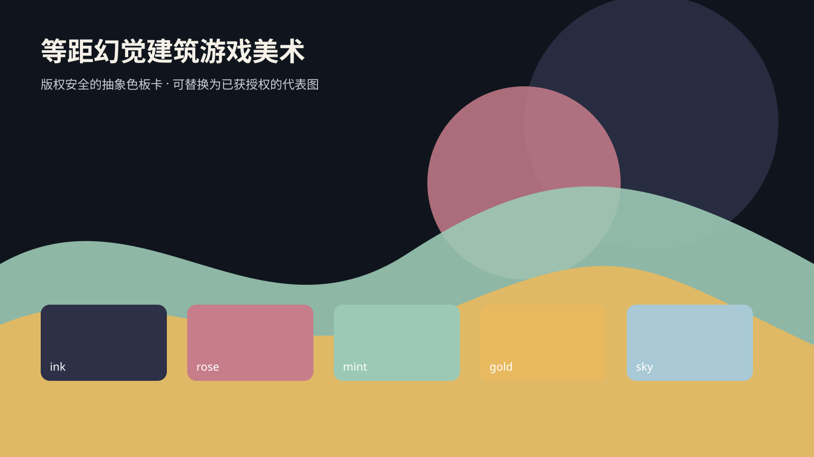</a> <strong>Isometric Impossible-Architecture Game Art</strong> <a href="impossible-architecture-game-art/README.en.md">Open README</a></td><td width="33%" valign="top" align="center"><a href="comic-halftone-game-art/README.en.md">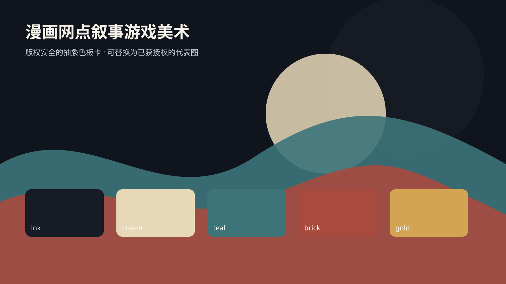</a> <strong>Comic Halftone Narrative Game Art</strong> <a href="comic-halftone-game-art/README.en.md">Open README</a></td><td width="33%" valign="top" align="center"><a href="painterly-3d-fantasy-game-art/README.en.md">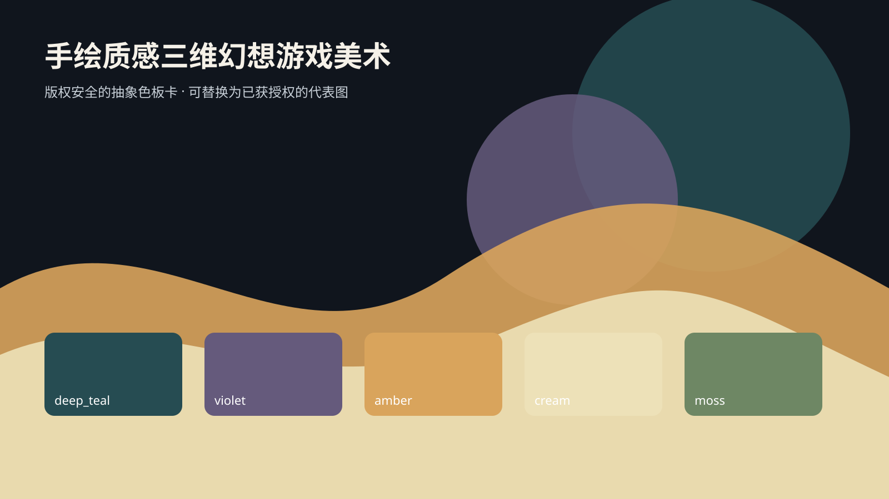</a> <strong>Painterly 3D Fantasy Game Art</strong> <a href="painterly-3d-fantasy-game-art/README.en.md">Open README</a></td></tr>
<tr><td width="33%" valign="top" align="center"><a href="stylized-pbr-sci-fi-game-art/README.en.md">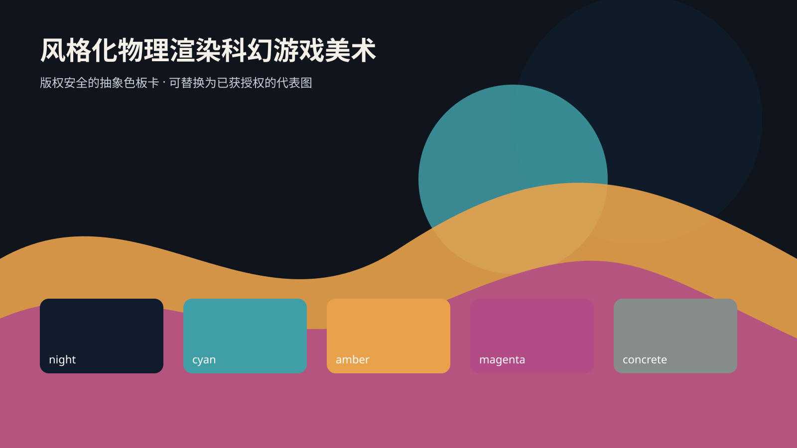</a> <strong>Stylized PBR Science-Fiction Game Art</strong> <a href="stylized-pbr-sci-fi-game-art/README.en.md">Open README</a></td><td width="33%" valign="top" align="center"><a href="flat-design-puzzle-game-art/README.en.md">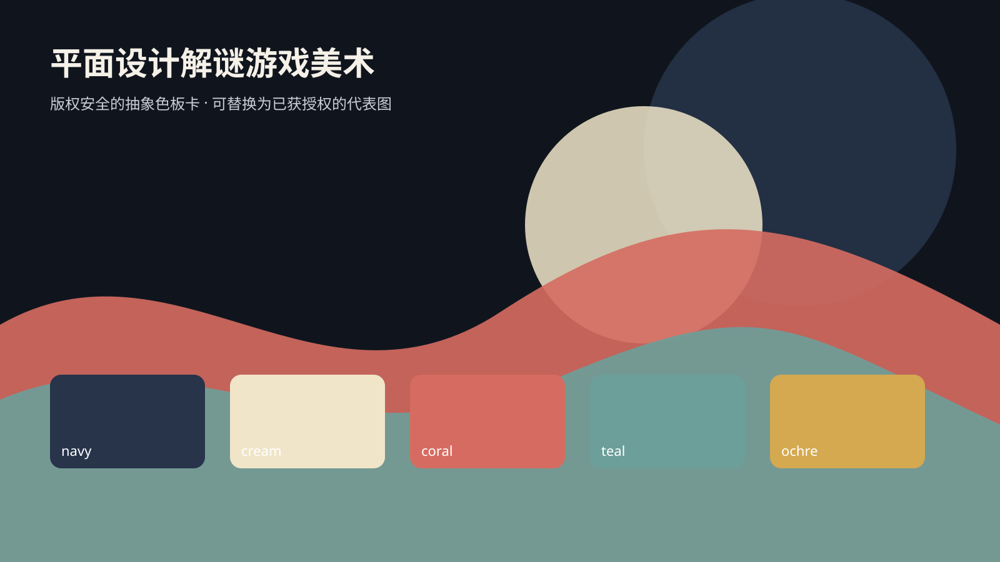</a> <strong>Flat Design Puzzle Game Art</strong> <a href="flat-design-puzzle-game-art/README.en.md">Open README</a></td><td width="33%" valign="top" align="center"><a href="miniature-diorama-game-art/README.en.md">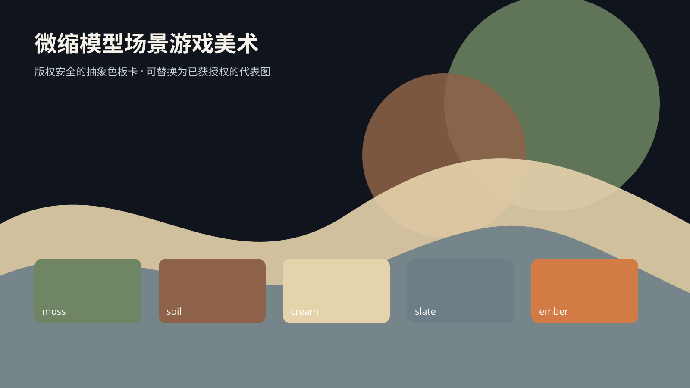</a> <strong>Miniature Diorama Game Art</strong> <a href="miniature-diorama-game-art/README.en.md">Open README</a></td></tr>
<tr><td width="33%" valign="top" align="center"><a href="silhouette-platformer-game-art/README.en.md">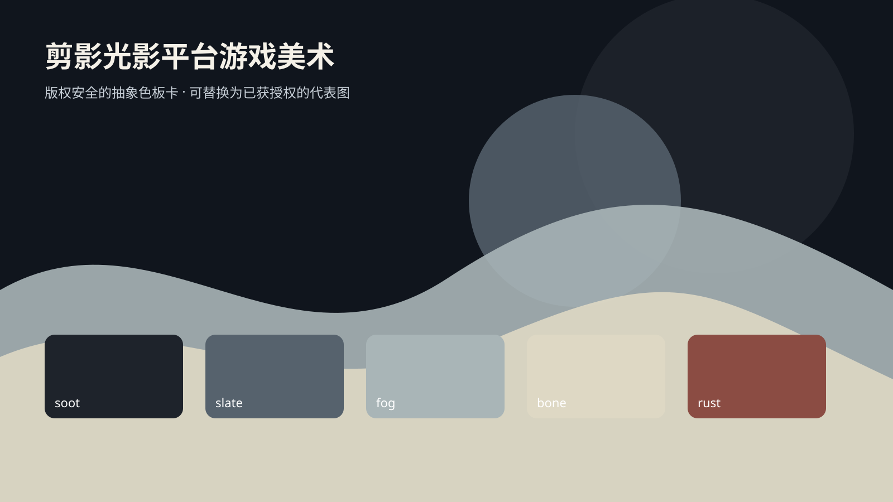</a> <strong>Silhouette Light-and-Shadow Platformer Game Art</strong> <a href="silhouette-platformer-game-art/README.en.md">Open README</a></td><td width="33%" valign="top" align="center"><a href="neon-noir-3d-game-art/README.en.md">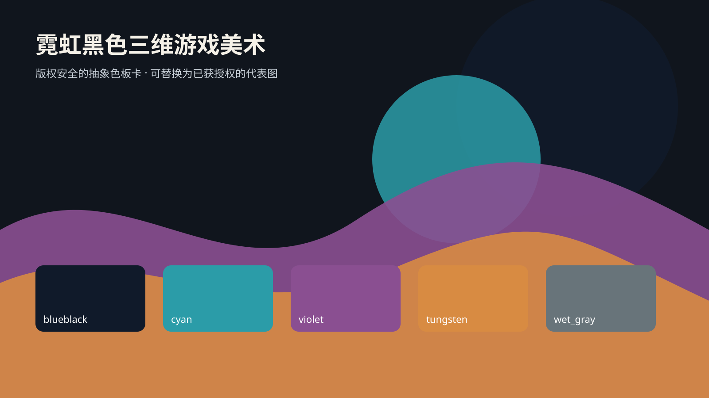</a> <strong>Neon Noir 3D Game Art</strong> <a href="neon-noir-3d-game-art/README.en.md">Open README</a></td><td width="33%" valign="top" align="center"><a href="stop-motion-clay-game-art/README.en.md">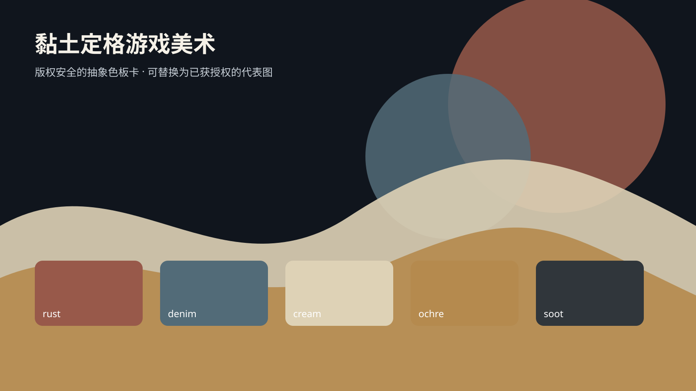</a> <strong>Stop-Motion Clay Game Art</strong> <a href="stop-motion-clay-game-art/README.en.md">Open README</a></td></tr>
</table>
