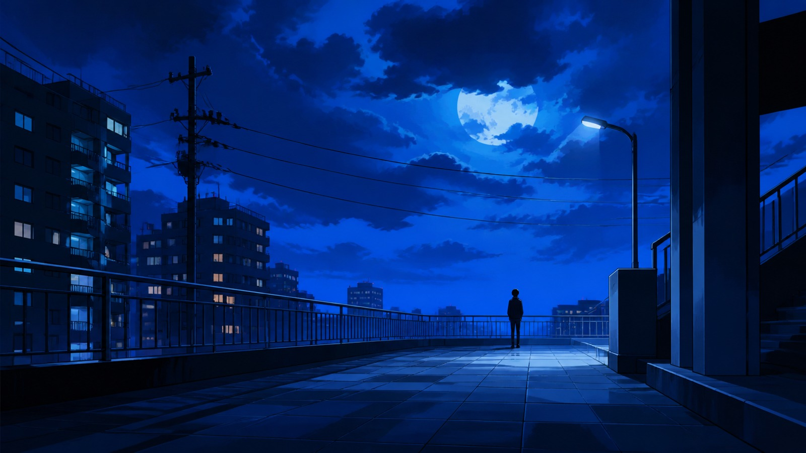
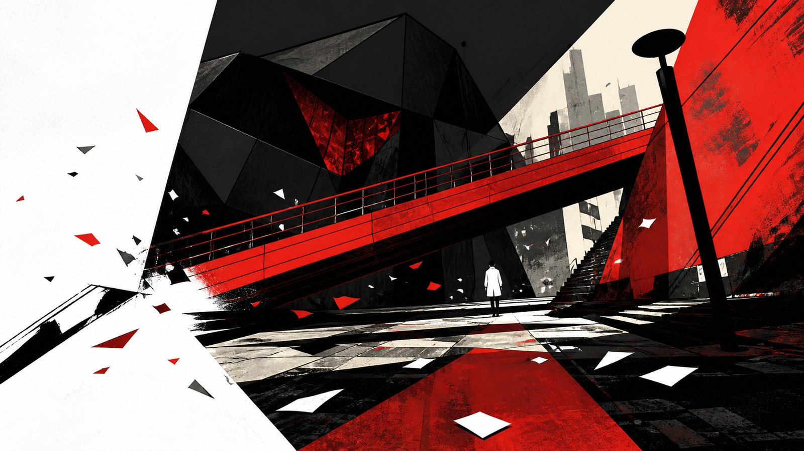

# 游戏美术

[English](README.en.md)

本目录收录 38 个独立风格包。每个卡片使用统一的横版 16:9 代表图，点击名称或图片进入风格包 README。

<table>
<tr>
<td width="33%" valign="top" align="center"> <strong>低多边形冒险游戏美术</strong> <a href="low-poly-adventure-game-art/README.md">打开 README</a></td>
<td width="33%" valign="top" align="center"> <strong>俯视角16位冒险美术</strong> <a href="top-down-16-bit-adventure/README.md">打开 README</a></td>
<td width="33%" valign="top" align="center"> <strong>属性受限像素美术</strong> <a href="zx-spectrum-attribute-pixel/README.md">打开 README</a></td>
</tr>
<tr>
<td width="33%" valign="top" align="center"> <strong>横版平台跳跃像素美术</strong> <a href="side-scrolling-platformer-pixel/README.md">打开 README</a></td>
<td width="33%" valign="top" align="center"> <strong>电影化像素冒险美术</strong> <a href="cinematic-pixel-adventure/README.md">打开 README</a></td>
<td width="33%" valign="top" align="center"> <strong>等距像素策略美术</strong> <a href="isometric-pixel-tactics/README.md">打开 README</a></td>
</tr>
<tr>
<td width="33%" valign="top" align="center"> <strong>卡通渲染自然冒险游戏美术</strong> <a href="cel-shaded-nature-game-art/README.md">打开 README</a></td>
<td width="33%" valign="top" align="center"> <strong>手绘墨线动画游戏美术</strong> <a href="hand-inked-animation-game-art/README.md">打开 README</a></td>
<td width="33%" valign="top" align="center"> <strong>水彩绘本冒险游戏美术</strong> <a href="watercolor-storybook-game-art/README.md">打开 README</a></td>
</tr>
<tr>
<td width="33%" valign="top" align="center"> <strong>纸艺立体书游戏美术</strong> <a href="papercraft-diorama-game-art/README.md">打开 README</a></td>
<td width="33%" valign="top" align="center"> <strong>体素世界游戏美术</strong> <a href="voxel-world-game-art/README.md">打开 README</a></td>
<td width="33%" valign="top" align="center"> <strong>风格化低多边形世界游戏美术</strong> <a href="stylized-low-poly-world/README.md">打开 README</a></td>
</tr>
<tr>
<td width="33%" valign="top" align="center"> <strong>等距幻觉建筑游戏美术</strong> <a href="impossible-architecture-game-art/README.md">打开 README</a></td>
<td width="33%" valign="top" align="center"> <strong>漫画网点叙事游戏美术</strong> <a href="comic-halftone-game-art/README.md">打开 README</a></td>
<td width="33%" valign="top" align="center"> <strong>手绘质感三维幻想游戏美术</strong> <a href="painterly-3d-fantasy-game-art/README.md">打开 README</a></td>
</tr>
<tr>
<td width="33%" valign="top" align="center"> <strong>风格化物理渲染科幻游戏美术</strong> <a href="stylized-pbr-sci-fi-game-art/README.md">打开 README</a></td>
<td width="33%" valign="top" align="center"> <strong>平面设计解谜游戏美术</strong> <a href="flat-design-puzzle-game-art/README.md">打开 README</a></td>
<td width="33%" valign="top" align="center"> <strong>微缩模型场景游戏美术</strong> <a href="miniature-diorama-game-art/README.md">打开 README</a></td>
</tr>
<tr>
<td width="33%" valign="top" align="center"> <strong>剪影光影平台游戏美术</strong> <a href="silhouette-platformer-game-art/README.md">打开 README</a></td>
<td width="33%" valign="top" align="center"> <strong>霓虹黑色三维游戏美术</strong> <a href="neon-noir-3d-game-art/README.md">打开 README</a></td>
<td width="33%" valign="top" align="center"> <strong>黏土定格游戏美术</strong> <a href="stop-motion-clay-game-art/README.md">打开 README</a></td>
</tr>
<tr>
<td width="33%" valign="top" align="center"> <strong>旷野自然开放世界游戏美术</strong> <a href="breath-of-the-wild-open-world/README.md">打开 README</a></td>
<td width="33%" valign="top" align="center"> <strong>霓虹未来都市游戏美术</strong> <a href="cyberpunk-night-city/README.md">打开 README</a></td>
<td width="33%" valign="top" align="center"> <strong>电影化荒原连接游戏美术</strong> <a href="death-stranding-cinematic-wilderness/README.md">打开 README</a></td>
</tr>
<tr>
<td width="33%" valign="top" align="center"> <strong>超现实机关建筑游戏美术</strong> <a href="control-paranormal-architecture/README.md">打开 README</a></td>
<td width="33%" valign="top" align="center"> <strong>神话高对比插画游戏美术</strong> <a href="hades-mythic-illustration/README.md">打开 README</a></td>
<td width="33%" valign="top" align="center"> <strong>节奏漫画卡通渲染游戏美术</strong> <a href="hi-fi-rush-rhythm-comic/README.md">打开 README</a></td>
</tr>
<tr>
<td width="33%" valign="top" align="center"> <strong>厚涂侦探绘本游戏美术</strong> <a href="disco-elysium-painterly-noir/README.md">打开 README</a></td>
<td width="33%" valign="top" align="center"> <strong>暗黑神话幻想游戏美术</strong> <a href="elden-ring-dark-fantasy/README.md">打开 README</a></td>
<td width="33%" valign="top" align="center"> <strong>霓虹废墟城市游戏美术</strong> <a href="stray-neon-cybercity/README.md">打开 README</a></td>
</tr>
<tr>
<td width="33%" valign="top" align="center"> <strong>荧光森林手绘游戏美术</strong> <a href="ori-luminous-forest/README.md">打开 README</a></td>
<td width="33%" valign="top" align="center"> <strong>角色扮演游戏像素美术</strong> <a href="rpg-maker-pixel-art/README.md">打开 README</a></td>
<td width="33%" valign="top" align="center"> <strong>空洞骑士墨线哥特游戏美术</strong> <a href="hollow-knight-inked-gothic/README.md">打开 README</a></td>
</tr>
<tr>
<td width="33%" valign="top" align="center"> <strong>风之旅人极简沙漠游戏美术</strong> <a href="journey-minimalist-desert/README.md">打开 README</a></td>
<td width="33%" valign="top" align="center"> <strong>最终幻想九绘本幻想游戏美术</strong> <a href="final-fantasy-ix-painted-fantasy/README.md">打开 README</a></td>
</tr>
<tr>
<td width="33%" valign="top" align="center"> <strong>女神异闻录3重制版游戏美术</strong> <a href="persona-3-reload/README.md">打开 README</a></td>
<td width="33%" valign="top" align="center"> <strong>女神异闻录4黄金版游戏美术</strong> <a href="persona-4-golden/README.md">打开 README</a></td>
<td width="33%" valign="top" align="center"> <strong>女神异闻录5皇家版游戏美术</strong> <a href="persona-5-royal/README.md">打开 README</a></td>
</tr>
</table>
