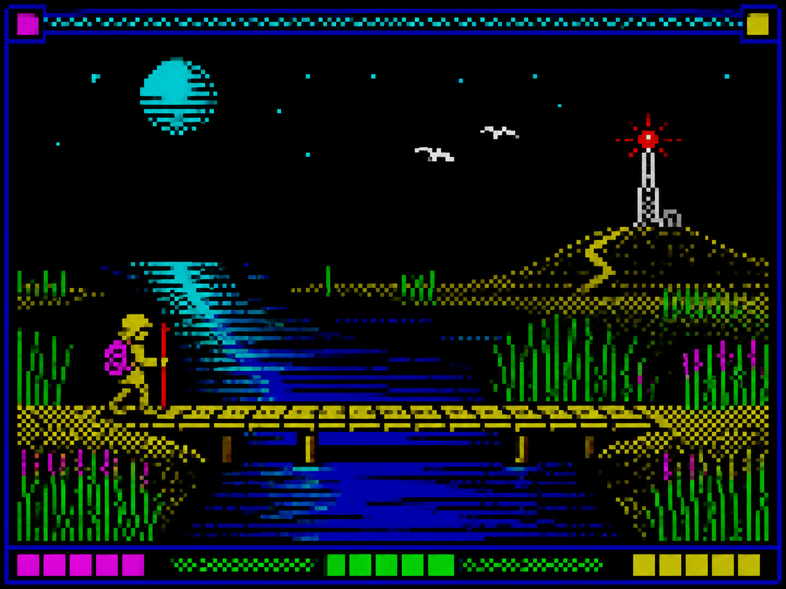

# 游戏美术 / Game art

本目录收录 2 个独立风格包。每个小单元都有代表图、名称和双语 README；点击 README 可查看来源、版权边界和三种使用方式。

This directory contains 2 independent style packages. Each package has a representative image, a bilingual README, provenance notes, and three usage modes.

<table>
<tr>
<td width="33%" valign="top" align="center">
 
<strong>RPG Maker Pixel Art</strong> 
<a href="rpg-maker-pixel-art/README.md">打开 README / Open README</a>
</td>
<td width="33%" valign="top" align="center">
 
<strong>ZX Spectrum Attribute Pixel Art</strong> 
<a href="zx-spectrum-attribute-pixel/README.md">打开 README / Open README</a>
</td>
<td width="33%"></td>
</tr>
</table>
