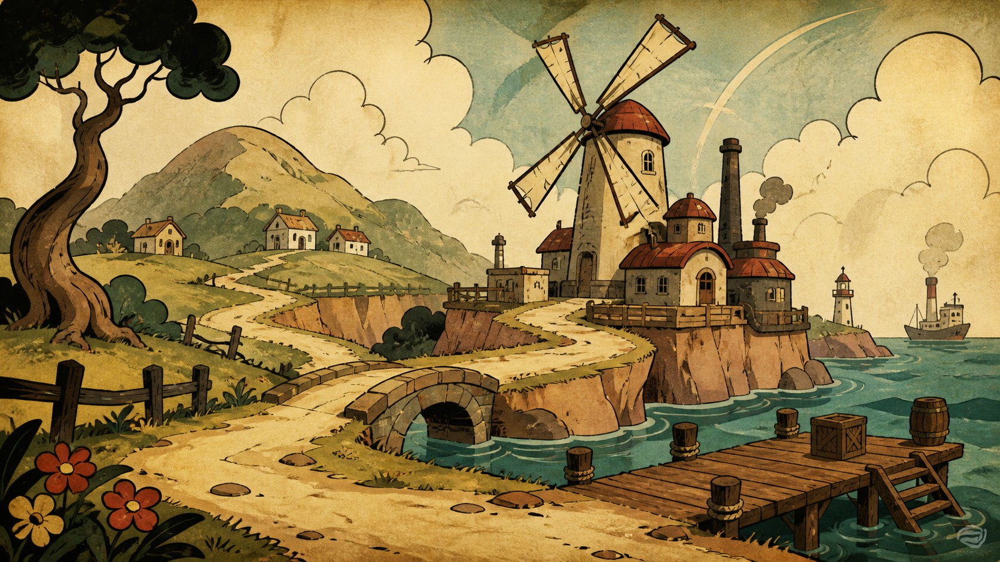

# 1930s Rubber-Hose Animation Game Art

[中文](README.md)

> **Category:** Game art  
> **Medium:** Game art  
> **Directory:** `style-packages/game-art/cuphead-rubber-hose-animation`

## Overview

This package translates 1930s hand-drawn animation grammar into game environment art: rubber-hose motion, lively ink contours, cel-like color planes, painted backgrounds, and restrained paper or print irregularity. It is neither a pixel-art package nor a polished 3D-cartoon renderer.

## Curatorial note

The most useful quality here is that the line seems to move. Contours do not behave like engineering diagrams; curves, stretch, and exaggeration give a still frame a sense of action. The representative image uses a coastal industrial setting to make layered depth and a playable path immediately legible. When the subject changes, keep the ink, painted layers, and limited palette—not the windmill, dock, or a particular character.

## Subject independence

The package controls hand-drawn animation medium, contour, layers, palette, and surface. It does not require characters, enemies, windmills, coastal villages, docks, or a story. The environment is an example only; the user's subject, gameplay, and composition remain authoritative.

## Source and rights

The package refers to [the Dark Horse page for The Art of Cuphead](https://digital.darkhorse.com/books/ef9898a203a8440dbc5d9dc84e30e19a/art-of-cuphead) for the 1930s-animation context and extracts observable medium and technique only. The representative image is an original environment, not a reproduction of a game frame, character, or mark, and does not imply endorsement. See [`provenance.yaml`](provenance.yaml), [`references/manifest.csv`](references/manifest.csv), and the root [`NOTICE`](../../../NOTICE).

## Use only this package

1. **Give it to an image-capable Agent:** provide this directory and ask the Agent to read the identity, visual signature, reproduction, prompts, palette, and evaluation files before compiling your game subject.
2. **Copy the Prompt:** replace `{SUBJECT}` and `{LOCATION}` in `prompts/base.txt`, and submit `prompts/negative.txt` as the negative prompt.
3. **Use your own API key:** submit the base prompt, negative constraints, palette, and relevant references through your chosen service. This repository does not host keys or image generation.
4. **Use a local model + ComfyUI:** wire the prompts into your workflow, reproduce the ink, layers, limited palette, and paper-surface rules, then review with `evaluation.yaml`.

Models, keys, and generated images remain under the user's control. References are for feature analysis, not copying.
