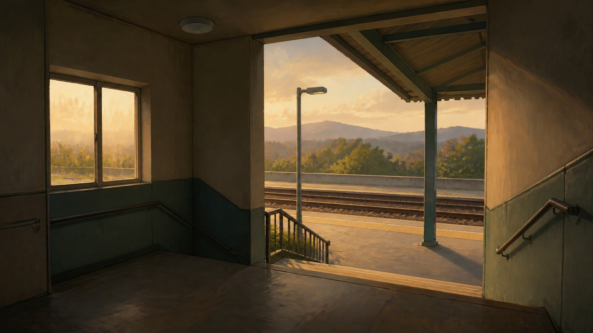

# Hand-Painted Point-and-Click Adventure Game Art

[中文说明](README.md)

> **Category:** Game art  
> **Medium:** 2D hand-painted environments  
> **Directory:** `style-packages/game-art/hand-painted-point-and-click`

## Overview

This game-art language uses hand-painted environments to support exploration, observation, and interaction. It values foreground, middle ground, background, entrances, occlusion, and walkable space, while brushwork explains walls, ground, foliage, and air. The package describes a scene-construction method, not a reproduction of one game.

## Curatorial note

The appeal is its position between illustration and spatial design: the brushwork can remain visible while the scene still feels enterable and readable. The key is not to add characters or puzzles by default, but to make the environment clear enough for the user’s own subject to inhabit.

## Subject independence

This package controls the medium, scene layers, and painterly treatment, not characters, locations, puzzles, fantasy elements, or story. The representative image uses an ordinary public space as a neutral benchmark only.

## Source and rights

Research entry: [Noema Games developer website](https://noemagames.com/). No external game art, characters, or interfaces are bundled. The representative image is a new anonymous scene and is not a game screenshot, endorsement, or licensed collaboration.

## Use only this package

### Method 1: Give it to an image-capable Agent

Provide this directory and ask the Agent to read `identity.yaml`, `visual-signature.yaml`, `reproduction.yaml`, `prompts/`, `palette/palette.json`, and `evaluation.yaml`, then compile your subject, setting, aspect ratio, and use case. Ask it to review scene layers and subject independence.

### Method 2: Copy the prompt

Open `prompts/base.txt`, replace `{{SUBJECT}}`, `{{ASPECT_RATIO}}`, and `{{USE_CASE}}`, and submit `prompts/negative.txt` alongside it when supported.

### Method 3: Submit through your own API key

Configure the API key in your own image service or compiler and submit the base prompt, negative constraints, and palette. This repository does not host keys or an online image service.

### Method 4: Local model + ComfyUI

Connect the prompt, palette, and reproduction notes to a local model or ComfyUI workflow, then review layers, materials, brushwork, and artifacts with `evaluation.yaml`. Do not treat the representative stairwell or platform as a required setting.
