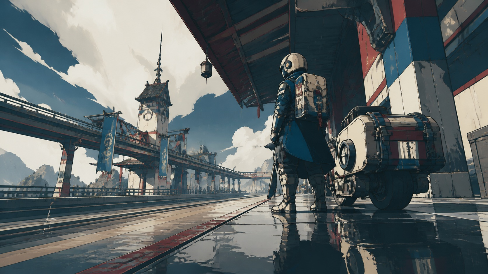

# 日式赛璐珞动作游戏美术

[English](README.en.md)

> **分类：** 游戏美术  
> **媒介领域：** 二维绘画语言与三维实时渲染  
> **目录：** style-packages/game-art/japanese-cel-shaded-action-game-art

## 简介

这个包提取的是一类现代动作游戏常见的混合媒介方法：三维空间负责体积、透视和遮挡，二维绘画语言负责轮廓、明暗带和动作节奏。它既不是普通的动漫滤镜，也不是把模型简单涂成几块平色。

## 策展短评

我喜欢它对“动势”的处理。即使画面里没有正在战斗的角色，透视、衣物方向、轮廓线和明暗分段也会让空间保持向前的力量。使用时，最好先确定主体和镜头，再决定哪些边缘需要手绘感。

## 主体独立性

本包只决定赛璐珞渲染、三维空间、轮廓、明暗带和动作感，不规定角色、武器、机甲、地点或故事。代表图中的快递员与运输车只是测试主体。

## 来源与版权

研究入口参考[Arc System Works 官方作品介绍](https://www.arcsystemworks.com/game/guilty-gear-strive/)。仓库不打包外部游戏素材；代表图是新的匿名场景，不是具体游戏画面，也不表示合作、授权或背书关系。

## 只使用此包

### 方式一：交给有生图能力的 Agent

把整个风格包目录交给 Agent，先读取 identity.yaml、visual-signature.yaml、reproduction.yaml、prompts、palette/palette.json 和 evaluation.yaml，再把你的主体、地点、画幅和用途编译进生成任务。

### 方式二：直接复制 Prompt

复制 prompts/base.txt，替换主体、地点和画幅；把 prompts/negative.txt 一并提交。

### 方式三：配置 API Key 后提交生成

在你自己的生图平台或编译工具中配置 API Key，提交基础 Prompt、负面约束和调色板。本仓库不托管密钥或在线生图服务。

### 方式四：本地模型 + ComfyUI

将 Prompt、调色板和复现说明接入本地模型或 ComfyUI，生成后用 evaluation.yaml 检查明暗带、三维体积、透视关系和固定题材泄漏。
