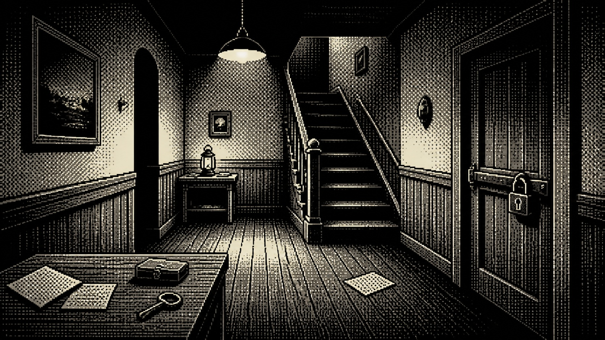

# Monochrome 1-bit Deduction Game Art

[中文说明](README.md)

> **Category:** Game art  
> **Medium:** Retro-computer-inspired 2D deduction game art  
> **Directory:** `style-packages/game-art/monochrome-1bit-deduction-game-art`

## Overview

This direction compresses the image into strict black-and-white one-bit logic. Midtones come from ordered dithering, pixel clusters, and silhouettes rather than continuous gray. The space must remain readable so a player can understand doors, stairs, materials, and a few clues. Unlike ordinary pixel art, the core is not the size of the palette but the display constraint, dither order, and information reading.

## Curatorial note

I like the restraint of this language. Once color is removed, light, material, and space have to be explained again through a small set of black-and-white relationships, and the image often becomes more memorable. Make the scene walkable, inspectable, and clue-readable first; decide dither density second. Filling every area with noise turns one-bit art into unreadable monochrome texture.

## Subject independence

This package controls one-bit display logic, dither density, silhouettes, perspective, and clue readability. It does not prescribe a ship, ocean, sailor, corpse, murder case, or specific character. The architectural passage in the representative image is only a benchmark subject.

## Sources and rights

Research entries are the [official Return of the Obra Dinn website](https://obradinn.com/) and a [developer interview about its one-bit art](https://blog.playstation.com/archive/2019/10/17/lucas-pope-on-the-challenge-of-creating-return-of-the-obra-dinns-art-style/). The repository does not bundle external game assets. The representative image is newly generated and anonymous, not a game screenshot and not an endorsement or collaboration.

## Use this package only

### Method 1: Give it to an image-capable Agent

Give this directory to an Agent. Ask it to read `identity.yaml`, `visual-signature.yaml`, `reproduction.yaml`, `prompts/`, `palette/palette.json`, and `evaluation.yaml`, then compile your subject, aspect ratio, and purpose. Review one-bit logic, perspective, dither density, and clue readability after generation.

### Method 2: Copy the Prompt directly

Open `prompts/base.txt`, replace `{{SUBJECT}}`, `{{ASPECT_RATIO}}`, and `{{USE_CASE}}`, and submit `prompts/negative.txt` as well on platforms that support negative prompts.

### Method 3: Configure an API key and submit

Configure an API key in your own image service or compiler, then submit the base prompt, negative constraints, and palette. This repository does not host keys or an online image service.

### Method 4: Local model + ComfyUI

Connect the prompts, palette, and reproduction notes to a local model or ComfyUI workflow. Use `evaluation.yaml` for review; do not treat the architectural passage in the representative image as a default subject.
