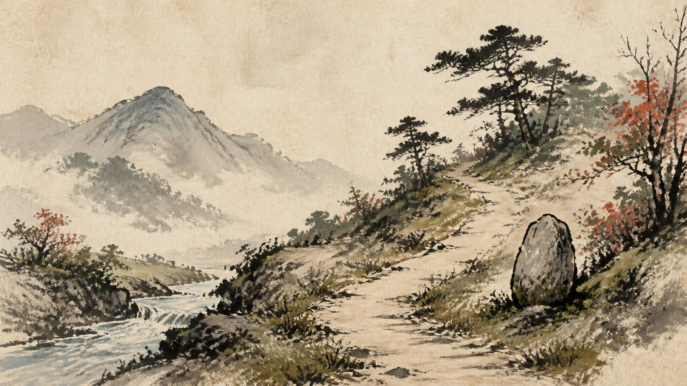

# Ōkami Sumi-e Game Art

[中文版](README.md)

> **Category:** game_art  · **Domain:** game_art
> **Path:** style-packages/game-art/okami-sumi-e-game-art

## Overview

以书写性墨线、水墨晕染、纸张肌理和有限平涂色面建立游戏场景风格。它强调可读的环境层次和笔触方向，不绑定具体角色、关卡、神话人物或游戏界面。

## Curatorial note

这个包借鉴的是水墨如何成为空间结构，而不只是给画面加一层纸纹。粗细不同的墨线负责轮廓和动势，淡墨负责远近，少量颜色像印章一样把重要区域提出来。把它交给普通主体时，主体仍然由用户决定，包不会自动生成狼、神社或某个游戏地点。

## Subject independence

This package controls how an image is generated, not what it depicts. People, objects, places, architecture, plants, vehicles, and narrative come from the user's prompt. The representative image is only a demonstration and must not become a default subject.

## Visual signature

- 清楚的前中后景层次
- 墨黑、灰青和纸白构成骨架
- graphic ink value separation with soft wash transitions and selective flat color accents
- fibrous paper grain, dry-brush edges, pooled ink, and visible brush direction

## Sources and rights

References are used for research and visual analysis. External artworks, photographs, game imagery, trademarks, and platform pages remain the property of their respective rights holders. The generated example is a new anonymous scene and is not an original work by, or endorsement from, the referenced source.

- [关于水墨游戏美术目标的官方访谈](https://news.capcomusa.com/lets/browse/matsushita-san-answers-your-okamiden-questions)

See [provenance.yaml](provenance.yaml), [references/manifest.csv](references/manifest.csv), and the repository [NOTICE](../../../NOTICE) for redistribution boundaries.

## Use only this package

1. Give this directory to an image-capable Agent and ask it to read the YAML files, prompts, palette, and evaluation before compiling a prompt.
2. Copy prompts/base.txt, replace the subject and location, and send prompts/negative.txt as the negative prompt.
3. Submit the compiled prompt through your own API tool after configuring your own API key; this repository does not host generation.
4. Connect the prompt, palette, reproduction notes, and reference manifest to a local model or ComfyUI workflow.

Do not copy a source work's exact composition, figures, text, trademark, logo, game asset, or fixed subject. Users manage model weights, API keys, generated images, and storage themselves.
