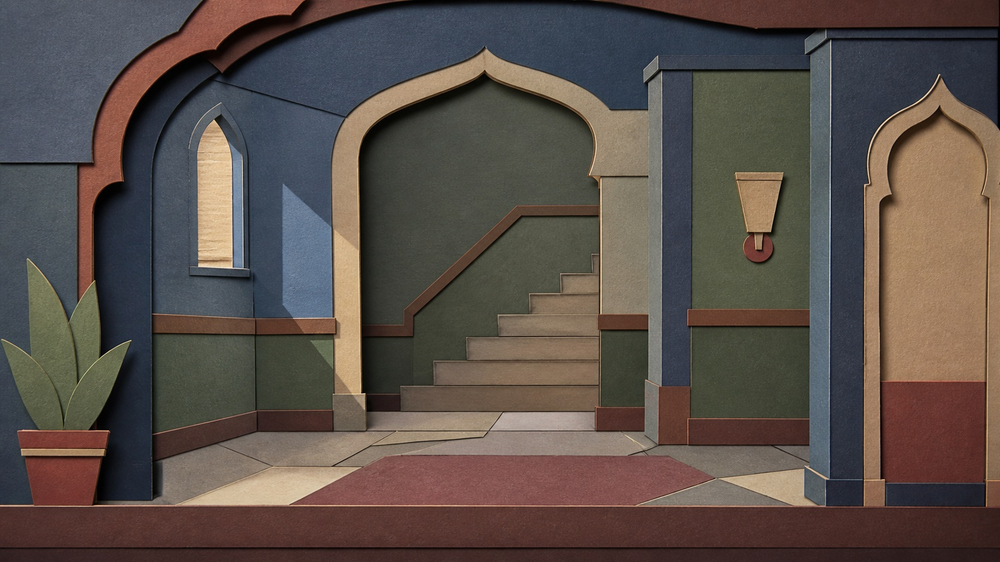

# 纸片木偶式二维游戏美术

[English](README.en.md)

> **分类：** 游戏美术  
> **媒介领域：** 纸片剪纸与二维木偶动画  
> **目录：** `style-packages/game-art/paper-cut-puppet-game-art`

## 简介

这个方向把游戏画面当成一组可以拆开、移动和重新组合的纸片层。可见的剪切边、关节、胶贴、墨线和层间阴影共同建立浅舞台空间。它与纸艺立体书不同：重点不是做一个小型三维模型，而是保持二维画面的剪影、节奏和可动画性。

## 策展短评

纸片媒介有一种很诚实的限制：每一层都要决定自己放在哪里，关节也必须能看懂。正是这种限制让画面不容易滑向无意义的细节堆叠。使用时可以先想清楚主体需要哪些层，再让阴影只负责说明前后关系；如果每个物体都被做成厚重模型，纸片的轻和二维游戏的读图速度就会消失。

## 主体独立性

本包只决定纸片拆层、剪切边、关节化形体、浅舞台空间和二维阅读方式，不规定木偶、剧院、儿童房、战争故事或具体角色。代表图中的角色与户外平台只是测试主体，新的生成应以用户需求为准。

## 来源与版权

研究入口为[《Cosmic Top Secret》官方网站](https://www.cosmictopsecretgame.com/)。仓库不打包外部游戏资产；代表图是新的匿名图像，不是具体游戏画面，也不表示合作、授权或背书关系。

## 只使用此包

### 方式一：交给有生图能力的 Agent

把本目录交给 Agent，让它先读取 `identity.yaml`、`visual-signature.yaml`、`reproduction.yaml`、`prompts/`、`palette/palette.json` 和 `evaluation.yaml`，再编译你的主体、画幅和用途。生成后检查纸片层、剪切边、关节结构和二维游戏可读性。

### 方式二：直接复制 Prompt

打开 `prompts/base.txt`，替换 `{{SUBJECT}}`、`{{ASPECT_RATIO}}` 和 `{{USE_CASE}}`；把 `prompts/negative.txt` 一并提交给支持负面 Prompt 的平台。

### 方式三：配置 API Key 后提交生成

在你自己的生图平台或编译工具中配置 API Key，提交基础 Prompt、负面约束和调色板。本仓库不托管密钥或在线生图服务。

### 方式四：本地模型 + ComfyUI

将 Prompt、调色板和复现说明接入本地模型或 ComfyUI，生成后用 `evaluation.yaml` 复核，不要把代表图里的角色或户外平台当成默认主体。
