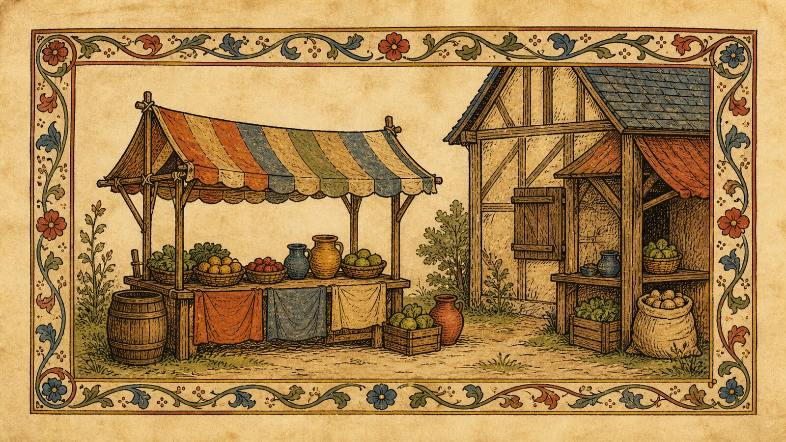

# 潘提曼中世纪手稿游戏美术

[English](README.en.md)

> **Category:** 游戏美术
> **Domain:** game_art

## 简介

这个风格包把与潘提曼中世纪手稿游戏美术相关的可观察视觉决定整理成可复用的生成规则。它服务于新的主体，不用于复制某一件具体作品。

## 策展短评

这个方向迷人的地方在于它让“页面”成为空间：人物、建筑和道具像被画在纸上，又通过有限动作获得生命。真正需要提取的是纸张、墨线、边缘装饰和图像层级，不是每次都生成修道院、谋杀或中世纪村庄。

## 主体独立性

本包只决定“怎么生成”，不决定“生成什么”。人物、物体、地点、建筑、植物、车辆和叙事由用户 Prompt 决定；来源讨论中的题材只是研究线索，不会成为默认主体。

## 使用前先看

- `identity.yaml`：范围、对象和排除项
- `visual-signature.yaml`：换主体后仍应保持的视觉特征
- `reproduction.yaml`：媒介、材料和构建顺序
- `prompts/base.txt`、`prompts/negative.txt`：基础 Prompt 与负面约束
- `palette/palette.json`：色彩角色
- `evaluation.yaml`：生成后的检查标准
- `references/manifest.csv`、`provenance.yaml`：来源和权利边界

## 来源与版权

来源链接只用于研究和分析。外部作品、摄影作品、游戏画面、商标和平台页面仍归原权利人所有。代表图是新的匿名场景，不是相关艺术家、流派、工艺或游戏的原作，也不代表合作、授权或背书关系。

详细来源和再分发边界见 `provenance.yaml`、`references/manifest.csv` 以及仓库根目录的 `NOTICE`。

## 只使用此包

下面四种方式任选其一，不需要同时使用；它们读取的是同一套风格包规则。

### 方式一：交给有生图能力的 Agent

把整个风格包目录上传给 Agent，或把本地目录路径交给它，并要求它先读取结构化文件再生成。

~~~text
请使用这个风格包生成图片。先读取 identity.yaml、visual-signature.yaml、reproduction.yaml、prompts/base.txt、prompts/negative.txt、palette/palette.json 和 evaluation.yaml。保留我的主体，不复制任何参考作品。我的生成需求是：<填写主体、场景、画幅和用途>。请编译 Prompt、生成图片，再按照 evaluation.yaml 复核。
~~~

### 方式二：直接复制 Prompt

打开 `prompts/base.txt`，替换主体、场景和画幅，并将 `prompts/negative.txt` 一并提交到支持文本生图的平台。

### 方式三：配置 API Key 后提交生成

在你自己的生图平台或编译工具中配置 API Key，再提交基础 Prompt、负面约束、调色板和必要参考。本仓库不代管密钥，也不托管生图服务。

### 方式四：本地模型 + ComfyUI

将 Prompt 和调色板接入本地模型或 ComfyUI 工作流，用 `evaluation.yaml` 检查主体保留、风格特征和多余元素。

模型权重、API Key 和生成图片由使用者自行管理。
