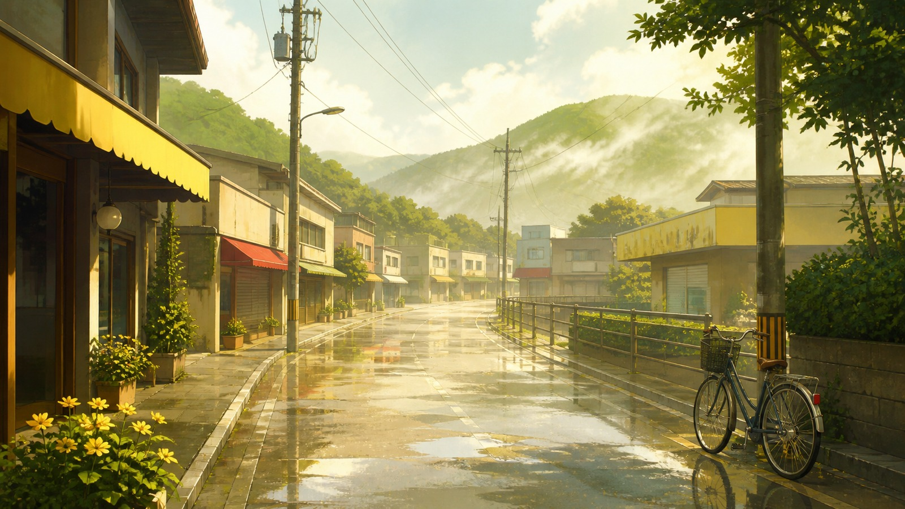

# 女神异闻录4黄金版游戏美术

[English](README.en.md)

> **分类：** 游戏美术  · **媒介领域：** 游戏美术 
> **目录：** `style-packages/game-art/persona-4-golden`

## 简介

以晴黄、暖白和叶绿组织明亮的日常空间，配合雨后反光、远景轻雾和亲切的生活尺度，让平凡环境带上一点无法立即解释的悬疑感。它不会自动加入电视、商店街、乡镇或特定角色。

## 一点观察

这个包不只是把画面调黄。它先把场景放回日常生活：道路、低层建筑、树木和电线保持清楚的尺度关系，再用湿润表面和远景雾气改变空气感。明亮颜色让画面保持亲近，微妙的不确定感则来自空间和天气，而不是夸张的恐怖效果。

## 视觉签名

- 晴黄、暖白、浅赭和叶绿构成明亮主色阶
- 生活化街道或环境保持清楚的透视与尺度
- 雨后湿润反光增加空间层次
- 远景轻雾带来含蓄的不确定感
- 红色、深棕或青灰只作小面积对比

## 主体独立性

本包只决定视觉处理方式，不决定用户要生成的人物、物体、地点、数量或故事。代表图中的小镇街道、自行车、山丘和雨后天气只是演示内容，不会进入默认 Prompt。

## 来源与版权

本包参考官方资料页提取可观察的视觉特征，不复制游戏截图、角色、界面、徽标或具体构图。生成示例是新的匿名场景，不代表 ATLUS 或 SEGA 的授权、合作或背书。

- [官方资料页](https://persona.atlus.com/p4g/)

详细来源和再分发边界见 [provenance.yaml](provenance.yaml)、[references/manifest.csv](references/manifest.csv) 以及仓库根目录的 [NOTICE](../../../NOTICE)。

## 只使用此包

四种方式可以任选其一，不需要同时使用：

### 方式一：交给有生图能力的 Agent

把整个风格包目录交给 Agent，并要求它先读取 `identity.yaml`、`visual-signature.yaml`、`reproduction.yaml`、`prompts/base.txt`、`prompts/negative.txt`、`palette/palette.json` 和 `evaluation.yaml`，再把规则编译进你的主题。生成后检查主体、色彩、构图、材质和禁用项。

### 方式二：直接复制 Prompt

打开 [prompts/base.txt](prompts/base.txt)，替换 `{subject}`、`{composition}` 和 `{aspect_ratio}`；将 [prompts/negative.txt](prompts/negative.txt) 一并提交到支持文本生图的平台。

### 方式三：配置 API Key 后提交生成

在你自己的生图平台或编译工具中配置 API Key，将基础 Prompt、负面约束、调色板和必要的参考清单一起提交。本仓库不代管密钥，也不托管在线生图服务。

### 方式四：本地模型 + ComfyUI

将基础 Prompt 和负面约束接入本地模型或 ComfyUI；按调色板、复现说明和参考清单设置晴黄主色、湿润反光、远景雾气和空间尺度。需要更强的局部控制时，再由工作流补充 mask。

模型权重、API Key 和生成图片由使用者自行管理。参考资料只用于理解可观察特征，不要复制原作的具体构图、人物、文字、商标或界面。
