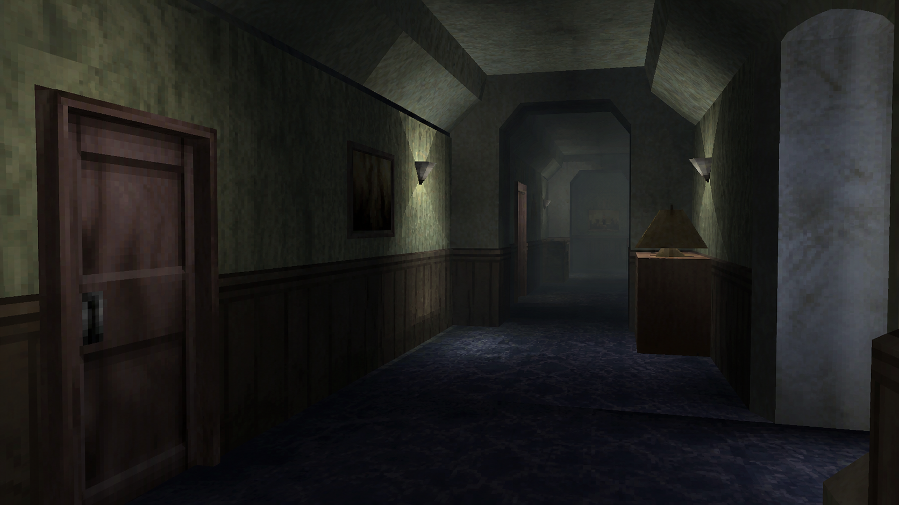

# Early 3D Survival-Horror Game Art

[中文版](README.md)

> **Category:** game_art
> **Domain:** game_art
> **Path:** `style-packages/game-art/ps1-survival-horror-low-poly`

## Overview

This package extracts an early real-time 3D vocabulary: low-poly geometry,
low-resolution texture logic, deliberate camera staging, localized haze, and
simplified lighting. It turns observable decisions into executable guidance for
new subjects. It does not reproduce one game, franchise, location, or story.

## Curatorial note

The interest here is not higher realism. It is the way limited geometry, texture,
and light share the job of explaining space. Faceted edges, a deliberate camera,
and localized haze can make an ordinary subject feel distant while remaining
legible. The representative corridor is only a benchmark for camera, material,
and atmosphere; it is not a default setting or horror narrative.

## Subject independence

This package controls *how* an image is generated, not *what* it depicts. People,
objects, places, architecture, plants, vehicles, and narrative come from your
prompt. The corridor in the representative image is an example only. Unless the
user asks for them, do not add a corridor, hotel, mansion, monster, blood, weapon,
or horror plot.

## Read before use

- `identity.yaml`: scope, subjects, and exclusions
- `visual-signature.yaml`: features that should survive a subject change
- `reproduction.yaml`: medium, materials, and construction order
- `prompts/base.txt`, `prompts/negative.txt`: prompt constraints
- `palette/palette.json`: color roles and values
- `evaluation.yaml`: post-generation checks
- `references/manifest.csv`, `provenance.yaml`: sources and rights boundaries

## Sources and rights

References are used for research and visual analysis. External game imagery,
trademarks, and platform pages remain the property of their respective rights
holders. Generated examples are new anonymous scenes and are not original works
by, or endorsements from, a referenced game, platform, or rights holder.

See [`provenance.yaml`](provenance.yaml),
[`references/manifest.csv`](references/manifest.csv), and the repository
[`NOTICE`](../../../NOTICE) for source and redistribution boundaries.

## Use only this package

Choose one of the following methods.

### Method 1: Give the package to an image-capable Agent

Upload this package directory to an Agent, or provide its local path, and ask it
to read `identity.yaml`, `visual-signature.yaml`, `reproduction.yaml`,
`prompts/base.txt`, `prompts/negative.txt`, `palette/palette.json`, and
`evaluation.yaml` before compiling a full prompt. State your own subject,
objects, scene, aspect ratio, and purpose. Ask the Agent to generate first and
then review the result against `evaluation.yaml` without copying a reference.

### Method 2: Copy the prompts

Replace the subject, objects, scene, and aspect ratio in `prompts/base.txt` and
send `prompts/negative.txt` as the negative prompt. Use the visual signature and
palette for tighter control.

### Method 3: Submit through your own API tool

Configure your API key in your own image platform or prompt compiler, then submit
the base prompt, negative constraints, palette, and any required reference list.
The repository does not host a generation service or manage API keys.

### Method 4: Local model + ComfyUI

Connect the prompts to a local model or ComfyUI workflow. Use the palette,
reproduction notes, and reference manifest to set color, composition, material,
and lighting, then review the output against `evaluation.yaml`.

Users manage model weights, API keys, and generated images themselves. References
are for observable traits only; do not copy a source work's exact composition,
figures, text, trademark, or logo.
