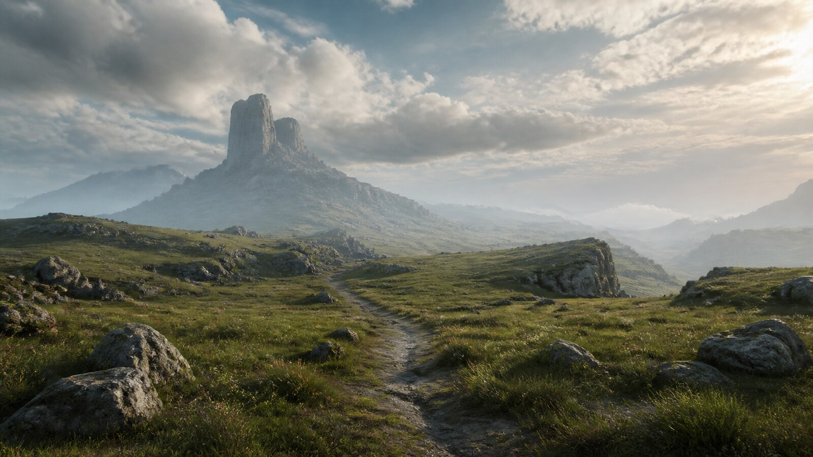

# Shadow of the Colossus Atmospheric 3D Game Art

[中文版](README.md)

> **Category:** game_art  · **Domain:** game_art
> **Path:** style-packages/game-art/shadow-of-the-colossus-atmospheric-3d

## Overview

以巨大的空旷尺度、低密度三维地貌、远距离主体、克制的土灰色调和强烈空气透视组织游戏环境，不绑定巨像、遗迹或具体关卡。

## Curatorial note

这种游戏美术的重点不是“放入一个巨大的怪物”，而是让空间先于事件发生。远处的山脊、风吹草地、孤立建筑和小小的可控角色共同建立尺度感。这个包负责三维环境的距离、材质和安静张力，不会自动加入巨像、祭坛、遗迹或具体地图。

## Subject independence

This package controls how an image is generated, not what it depicts. People, objects, places, architecture, plants, vehicles, and narrative come from the user's prompt. The representative image is only a demonstration and must not become a default subject.

## Visual signature

- 大面积空旷空间与远距离焦点
- 沙灰、苔绿、冷蓝灰和旧金色构成克制环境色
- wide natural light, haze, long shadows, and strong atmospheric perspective
- weathered rock, dry grass, dust, water, and restrained 3D material detail

## Sources and rights

References are used for research and visual analysis. External artworks, photographs, game imagery, trademarks, and platform pages remain the property of their respective rights holders. The generated example is a new anonymous scene and is not an original work by, or endorsement from, the referenced source.

- [游戏官方介绍](https://www.playstation.com/en-us/games/shadow-of-the-colossus/)

See [provenance.yaml](provenance.yaml), [references/manifest.csv](references/manifest.csv), and the repository [NOTICE](../../../NOTICE) for redistribution boundaries.

## Use only this package

1. Give this directory to an image-capable Agent and ask it to read the YAML files, prompts, palette, and evaluation before compiling a prompt.
2. Copy prompts/base.txt, replace the subject and location, and send prompts/negative.txt as the negative prompt.
3. Submit the compiled prompt through your own API tool after configuring your own API key; this repository does not host generation.
4. Connect the prompt, palette, reproduction notes, and reference manifest to a local model or ComfyUI workflow.

Do not copy a source work's exact composition, figures, text, trademark, logo, game asset, or fixed subject. Users manage model weights, API keys, generated images, and storage themselves.
