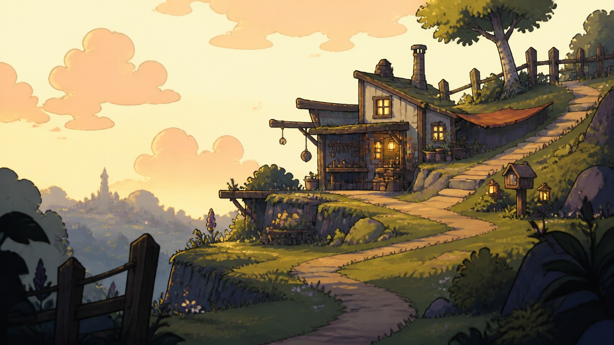

# Spiritfarer Hand-Drawn Game Art

[中文版](README.md)

> **Category:** Game art　**Medium:** Hand-drawn 2D game illustration and animation backgrounds　**Directory:** `style-packages/game-art/spiritfarer-hand-drawn-game-art`

## Overview

This package studies hand-drawn lines, soft shapes, warm color, and readable 2D spaces designed for interaction. It borrows a useful independent-game principle: make the image readable first, then let detail arrive gradually. Foreground, midground, and background stay clear; contours feel warm; environmental detail supports the subject and play space.

## Curatorial note

Its friendliness does not come from making everything cute. It comes from giving shapes and light room to breathe. Establish the movable space first, then use hand-painted texture and one or two highlights to establish mood; that is usually more stable than stacking words such as “cozy” and “dreamy.”

## Subject independence

This package controls hand-drawn 2D medium, shape language, game-space readability, color, and texture. Boats, oceans, cats, spirits, characters, and specific maps are not defaults.

## File guide

- `identity.yaml`: source, scope, and subject boundaries
- `visual-signature.yaml`: shape, space, color, and light
- `reproduction.yaml`: game-image construction order
- `prompts/`: base prompt and negative constraints
- `palette/palette.json`: color roles
- `evaluation.yaml`: subject-independence and signature checks
- `references/manifest.csv`, `provenance.yaml`: source and rights boundaries

## Sources and rights

The package references [Thunder Lotus’s official Spiritfarer Steam page](https://store.steampowered.com/app/972660/Spiritfarer/) for observable hand-drawn 2D, environmental layering, and animation qualities. Game images, characters, and trademarks remain with their rights holders. The representative image is a new anonymous game scene, not a screenshot or endorsement.

## Use only this package

### Method 1: Give it to an image-capable Agent

Give the Agent this directory and ask it to read the identity, visual signature, reproduction notes, prompts, palette, and evaluation file before compiling your subject, location, aspect ratio, and intended use. The sample hut and path demonstrate the medium; they are not fixed settings.

### Method 2: Copy the Prompt

Copy `prompts/base.txt`, replace `{SUBJECT}` and `{LOCATION}`, and submit `prompts/negative.txt` as the negative prompt. Use the visual signature and palette for tighter spatial and color control.

### Method 3: Configure an API key and submit

Configure your API key in your own image platform or compiler, then submit the base prompt, negative constraints, and palette. This repository does not host keys or an online image service.

### Method 4: Local model + ComfyUI

Connect the base and negative prompts to a local model or ComfyUI workflow. Follow the reproduction notes for 2D layers, contours, game space, and local texture, then review with `evaluation.yaml`.

Model weights, API keys, and generated images remain under the user’s control. Use references to understand visual characteristics; do not copy a game screenshot, character, interface, text, trademark, or logo.
