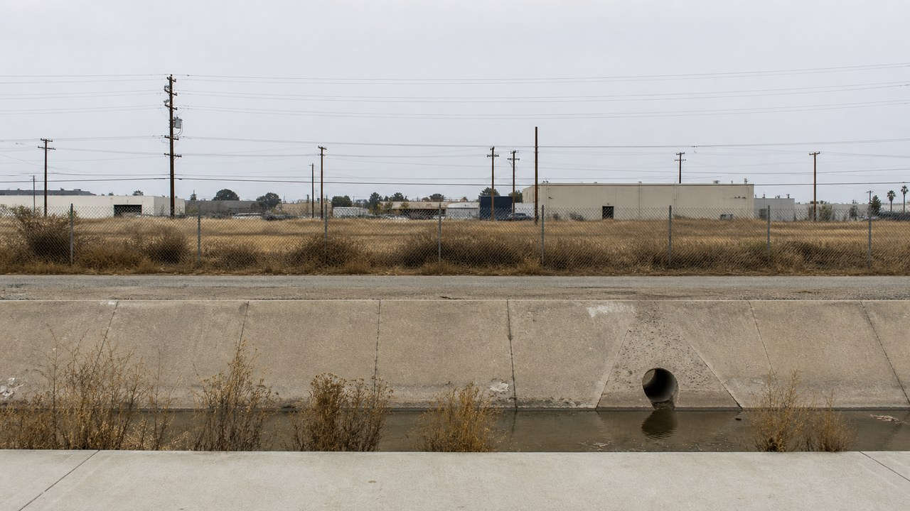

# Movements and periods

[中文](README.md)

This directory contains 42 independent style packages. Each card uses a horizontal 16:9 representative image; click an image or name to open the package README.

<table>
<tr>
<td width="33%" valign="top" align="center"> <strong>Abstract Expressionism</strong> <a href="abstract-expressionism/README.en.md">Open README</a></td>
<td width="33%" valign="top" align="center"> <strong>Art Deco</strong> <a href="art-deco/README.en.md">Open README</a></td>
<td width="33%" valign="top" align="center"> <strong>Art Nouveau</strong> <a href="art-nouveau/README.en.md">Open README</a></td>
</tr>
<tr>
<td width="33%" valign="top" align="center"> <strong>Arts and Crafts Movement</strong> <a href="arts-and-crafts/README.en.md">Open README</a></td>
<td width="33%" valign="top" align="center"> <strong>Baroque</strong> <a href="baroque/README.en.md">Open README</a></td>
<td width="33%" valign="top" align="center"> <strong>Conceptual Art</strong> <a href="conceptual-art/README.en.md">Open README</a></td>
</tr>
<tr>
<td width="33%" valign="top" align="center"> <strong>Constructivism</strong> <a href="constructivism/README.en.md">Open README</a></td>
<td width="33%" valign="top" align="center"> <strong>Cubism</strong> <a href="cubism/README.en.md">Open README</a></td>
<td width="33%" valign="top" align="center"> <strong>Dada</strong> <a href="dada/README.en.md">Open README</a></td>
</tr>
<tr>
<td width="33%" valign="top" align="center"> <strong>De Stijl</strong> <a href="de-stijl/README.en.md">Open README</a></td>
<td width="33%" valign="top" align="center"> <strong>Expressionism</strong> <a href="expressionism/README.en.md">Open README</a></td>
<td width="33%" valign="top" align="center"> <strong>Futurism</strong> <a href="futurism/README.en.md">Open README</a></td>
</tr>
<tr>
<td width="33%" valign="top" align="center"> <strong>Greek Archaic Period</strong> <a href="greek-archaic-period/README.en.md">Open README</a></td>
<td width="33%" valign="top" align="center"> <strong>Greek Classical Period</strong> <a href="greek-classical-period/README.en.md">Open README</a></td>
<td width="33%" valign="top" align="center"> <strong>Greek Geometric Period</strong> <a href="greek-geometric-period/README.en.md">Open README</a></td>
</tr>
<tr>
<td width="33%" valign="top" align="center"> <strong>Greek Hellenistic Period</strong> <a href="greek-hellenistic-period/README.en.md">Open README</a></td>
<td width="33%" valign="top" align="center"> <strong>Harlem Renaissance</strong> <a href="harlem-renaissance/README.en.md">Open README</a></td>
<td width="33%" valign="top" align="center"> <strong>Impressionism</strong> <a href="impressionism/README.en.md">Open README</a></td>
</tr>
<tr>
<td width="33%" valign="top" align="center"> <strong>International Typographic Style</strong> <a href="international-typographic-style/README.en.md">Open README</a></td>
<td width="33%" valign="top" align="center"> <strong>Italian High Renaissance</strong> <a href="italian-high-renaissance-raphaelesque/README.en.md">Open README</a></td>
<td width="33%" valign="top" align="center"> <strong>Land Art</strong> <a href="land-art/README.en.md">Open README</a></td>
</tr>
<tr>
<td width="33%" valign="top" align="center"> <strong>Magic Realism</strong> <a href="magic-realism/README.en.md">Open README</a></td>
<td width="33%" valign="top" align="center"> <strong>Mannerism</strong> <a href="mannerism/README.en.md">Open README</a></td>
<td width="33%" valign="top" align="center"> <strong>Minimalism</strong> <a href="minimalism/README.en.md">Open README</a></td>
</tr>
<tr>
<td width="33%" valign="top" align="center"> <strong>Neoclassicism</strong> <a href="neoclassicism/README.en.md">Open README</a></td>
<td width="33%" valign="top" align="center"> <strong>Neue Sachlichkeit / New Objectivity</strong> <a href="neue-sachlichkeit/README.en.md">Open README</a></td>
<td width="33%" valign="top" align="center"> <strong>New Topographics</strong> <a href="new-topographics/README.en.md">Open README</a></td>
</tr>
<tr>
<td width="33%" valign="top" align="center"> <strong>Northern Renaissance</strong> <a href="northern-renaissance/README.en.md">Open README</a></td>
<td width="33%" valign="top" align="center"> <strong>Op Art</strong> <a href="op-art/README.en.md">Open README</a></td>
<td width="33%" valign="top" align="center"> <strong>Photorealism</strong> <a href="photorealism/README.en.md">Open README</a></td>
</tr>
<tr>
<td width="33%" valign="top" align="center"> <strong>Pop Art</strong> <a href="pop-art/README.en.md">Open README</a></td>
<td width="33%" valign="top" align="center"> <strong>Post-Impressionism</strong> <a href="post-impressionism/README.en.md">Open README</a></td>
<td width="33%" valign="top" align="center"> <strong>Pre-Raphaelite Brotherhood</strong> <a href="pre-raphaelites/README.en.md">Open README</a></td>
</tr>
<tr>
<td width="33%" valign="top" align="center"> <strong>Precisionism</strong> <a href="precisionism/README.en.md">Open README</a></td>
<td width="33%" valign="top" align="center"> <strong>Realism</strong> <a href="realism/README.en.md">Open README</a></td>
<td width="33%" valign="top" align="center"> <strong>Renaissance</strong> <a href="renaissance/README.en.md">Open README</a></td>
</tr>
<tr>
<td width="33%" valign="top" align="center"> <strong>Rococo</strong> <a href="rococo/README.en.md">Open README</a></td>
<td width="33%" valign="top" align="center"> <strong>Romanticism</strong> <a href="romanticism/README.en.md">Open README</a></td>
<td width="33%" valign="top" align="center"> <strong>Socialist Realism</strong> <a href="socialist-realism/README.en.md">Open README</a></td>
</tr>
<tr>
<td width="33%" valign="top" align="center"> <strong>Suprematism</strong> <a href="suprematism/README.en.md">Open README</a></td>
<td width="33%" valign="top" align="center"> <strong>Surrealism</strong> <a href="surrealism/README.en.md">Open README</a></td>
<td width="33%" valign="top" align="center"> <strong>Symbolism</strong> <a href="symbolism/README.en.md">Open README</a></td>
</tr>
</table>
