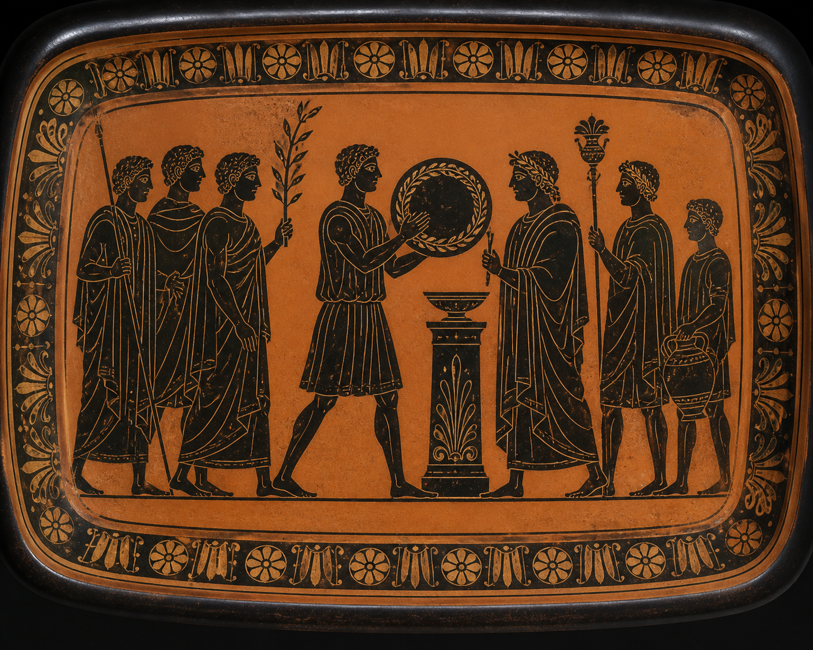
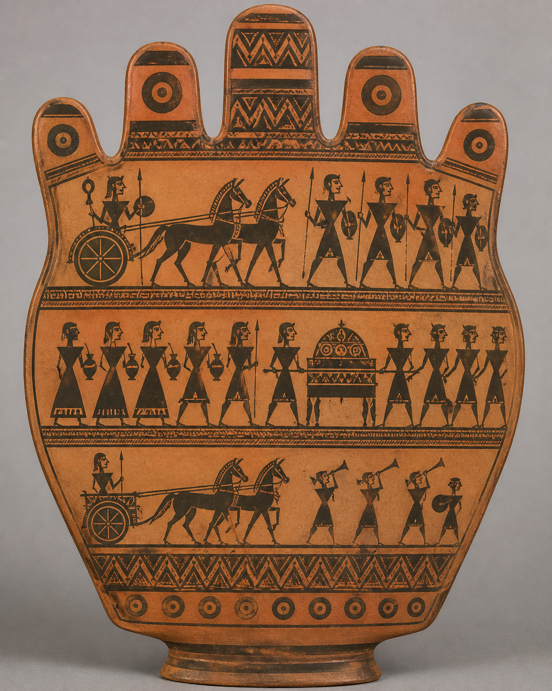

# 艺术流派与历史时期 / Movements and periods

本目录收录 6 个独立风格包。每个小单元都有代表图、名称和双语 README；点击 README 可查看来源、版权边界和三种使用方式。

This directory contains 6 independent style packages. Each package has a representative image, a bilingual README, provenance notes, and three usage modes.

<table>
<tr>
<td width="33%" valign="top" align="center">
 
<strong>Greek Archaic Period</strong> 
<a href="greek-archaic-period/README.md">打开 README / Open README</a>
</td>
<td width="33%" valign="top" align="center">
 
<strong>Greek Classical Period</strong> 
<a href="greek-classical-period/README.md">打开 README / Open README</a>
</td>
<td width="33%" valign="top" align="center">
 
<strong>Greek Geometric Period</strong> 
<a href="greek-geometric-period/README.md">打开 README / Open README</a>
</td>
</tr>
<tr>
<td width="33%" valign="top" align="center">
 
<strong>Greek Hellenistic Period</strong> 
<a href="greek-hellenistic-period/README.md">打开 README / Open README</a>
</td>
<td width="33%" valign="top" align="center">
 
<strong>Italian High Renaissance</strong> 
<a href="italian-high-renaissance-raphaelesque/README.md">打开 README / Open README</a>
</td>
<td width="33%" valign="top" align="center">
 
<strong>Neue Sachlichkeit / New Objectivity</strong> 
<a href="neue-sachlichkeit/README.md">打开 README / Open README</a>
</td>
</tr>
</table>
